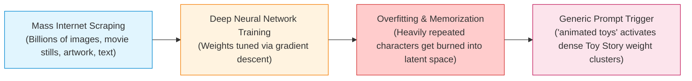
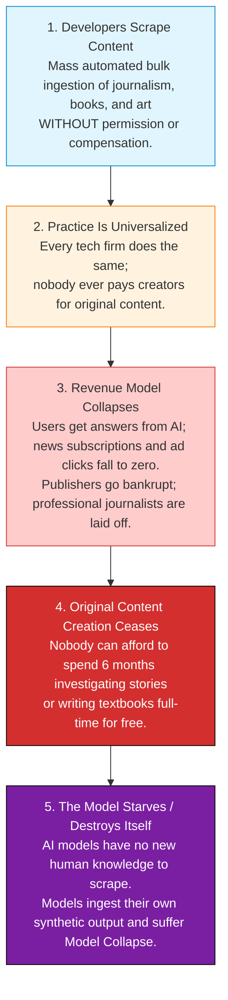

# 12.2 - Generative AI & The Web Scraping Crisis (Hooker's Test)

> [!abstract] Learning Objectives & Topic Roadmap
> In this note, we examine the most contentious intersection of modern computer science and ethics:
> 1. **Visual Plagiarism & Model Memorization (Slides 2–3)**: How generic prompts cause models to regenerate copyrighted characters (Darth Vader, Toy Story).
> 2. **The Legal vs. Ethical Dilemma (Slide 4)**: Why copyright lawsuits (e.g., *The New York Times v. OpenAI*) are legally complex, and why we must look to ethical philosophy.
> 3. **Hooker's Generalization Test & The "Garbage Loop" (Slide 8)**: Why uncompensated scraping destroys the very ecosystem it relies on to exist.
> 4. **The Counter-Intuitive Insight (Slide 8)**: Why focusing on visual resemblance misses the real ethical issue.
> 5. **Solving the Slide 9 Scenarios**: Distinguishing scraping *The New York Times* vs. public GitHub repos vs. personal blogs vs. student course notes.
> 
> *Part of the [[05 - Lecture 12 - Patents, Copyright & Intellectual Property in Computing|Lecture 12 Master Hub]]*.

---

## 1. The Phenomenon: Visual Plagiarism from Generic Prompts

In late 2023 and early 2024, cognitive scientist Gary Marcus and digital artist Reid Southern published an eye-opening investigation in *IEEE Spectrum*: *"Generative AI has a visual plagiarism problem"* (January 6, 2024).

They tested state-of-the-art generative AI systems (including Midjourney v6 and OpenAI's DALL-E 3 via GPT-4) with completely **generic prompts** that contained **no trademarked names, no movie titles, and no studio references**:

### Case 1: "Black armor with light sword" (Slide 2)

![[attachments/darth-vader-genai.png|320]]
*Figure: Slide 2 — GPT-4 response to the generic prompt "black armor with light sword." (Source: Marcus & Southern, IEEE Spectrum, 2024).*

- **Prompt**: `"black armor with light sword"`
- **Result**: An unmistakable, near-pixel-identical rendition of **Darth Vader** from *Star Wars*, a multi-billion-dollar franchise owned exclusively by The Walt Disney Company / Lucasfilm.
- Notice: The prompt did not say "Star Wars," "Vader," or "Lucasfilm." Yet the model generated the exact corporate IP.

### Case 2: "Animated toys" (Slide 3)

![[attachments/toy-story-genai.png|360]]
*Figure: Slide 3 — GPT-4 response to the generic prompt "animated toys." (Source: Marcus & Southern, IEEE Spectrum, 2024).*

- **Prompt**: `"animated toys"`
- **Result**: An exact ensemble scene featuring **Sheriff Woody, Buzz Lightyear, Rex the dinosaur, Slinky Dog, and Bullseye** from Pixar's *Toy Story*.
- Once again, no character names or movie titles were provided in the user's prompt!

---

## 2. Why Does This Happen? The Technical Reality

To understand why this happens, we have to look under the hood of modern generative models:

1. **Mass Scraping Without Filtering**: AI companies train models on trillions of tokens of text and billions of image-text pairs scraped automatically from public websites (Common Crawl, LAION, etc.).
2. **Duplicate Density**: Popular culture characters like Darth Vader, Mickey Mouse, and Woody appear millions of times across the web with descriptions like "black armor," "light sword," or "animated toys."
3. **Weight Memorization**: Instead of learning purely abstract general concepts ("armor," "sword," "toys"), the model's weights **memorize specific training instances**.
4. **Resurfacing**: When prompted with generic descriptors, the dense cluster of weights associated with those tokens activates, causing the copyrighted work to **resurface** in the output.

---

## 3. The Lawsuits and the Legal Impasse (Slide 4)

Artists, writers, and publishers argue that this is blatant **plagiarism** that directly threatens their livelihoods:
- Tech companies take the creative output of human artists without permission.
- Tech companies use that data to train commercial products that generate competing works.
- End-users can now get "Toy Story" illustrations or "New York Times" reporting without paying Disney or the *Times*.

### Major Legal Actions
- In December 2023, ***The New York Times* sued OpenAI and Microsoft** for copyright infringement, documenting instances where ChatGPT reproduced entire investigative articles word-for-word.
- In response to mounting legal pressure, OpenAI began signing licensing deals to pay major publishers (such as the Associated Press, Axel Springer, and News Corp) tens of millions of dollars for access to training data.

> [!important] The Legal Answer Is Unsettled (Slide 4)
> - Under US law, tech companies argue this is protected by the **Fair Use Doctrine** (claiming training is "transformative").
> - Under European law, the EU AI Act imposes strict transparency and opt-out regimes.
> - In Asian jurisdictions (like Japan), text and data mining (TDM) exceptions are much broader.
> 
> Because legal statutes vary wildly across borders and cases take years to litigate, we must evaluate the core **ethical question**:
> **Does generative AI unethically exploit others' intellectual property?**

---

## 4. Hooker's Generalization Argument: The "Garbage Loop" (Slide 8)

Carnegie Mellon University ethicist and computer scientist **Prof. John Hooker** provides a rigorous philosophical analysis using the **Generalization Test**.

In [[12.1 - The Nature of IP, Rivalry & The Patent Bargain|Topic 12.1]], we saw that the simple anti-theft test fails for digital copying because copying is non-rivalrous (nobody is deprived of physical possession). 

However, Hooker shows that mass scraping fails a **different formulation of the generalization test**: what he terms the **"Garbage Loop" pattern**—a practice that **destroys what it feeds on**!

### Deconstructing the Test Step-by-Step

1. **The Maxim**:
   *"An AI company may freely scrape and ingest all publicly accessible journalism, literature, and art without compensation or consent, in order to train commercial models that answer user queries."*
2. **Universalization**:
   Suppose *every* developer, AI firm, and technology enterprise universalizes this behavior. Nobody ever pays content creators or publishers.
3. **The Resulting World**:
   - High-quality investigative journalism (like an expose on government corruption or corporate fraud) is extremely expensive: it requires hiring seasoned reporters, legal counsel, and data analysts for months or years.
   - If AI summaries allow millions of readers to get the information without visiting the publisher's website, **advertising revenues and digital subscriptions drop to zero**.
   - The publisher shuts down. Professional investigative reporting ceases.
4. **The Contradiction in Will**:
   - The AI industry *needs* a continuous stream of newly verified, fact-checked, high-quality human knowledge to remain useful and avoid hallucination/model collapse.
   - But universalizing uncompensated scraping **destroys the very economic foundation that allows original human knowledge to be produced in the first place**!
   - The practice is parasitic: it consumes and destroys its host ecosystem. Therefore, the maxim is self-contradictory and **morally impermissible**.

---

## 5. The Counter-Intuitive Insight: Why Resemblance Is the Wrong Target (Slide 8)

> [!warning] Slide 8's Central Ethical Insight
> *"On this argument, it does not matter whether the output resembles the input, so the images we opened with are the wrong thing to be angry about.*
> 
> *What scraping takes is the money that pays for the reporting, which makes this a question about how journalism gets funded rather than about plagiarism."*

### Why Is Output Resemblance a Red Herring?
- People get furious when DALL-E generates Darth Vader because it "looks like" Disney's drawing. That feels like conventional plagiarism.
- But Hooker's argument shows that **even if the AI never generates a single frame that looks like a Marvel character or quotes a single sentence from the *New York Times***, the ethical problem remains 100% active!
- If the AI synthesizes a completely "novel" summary of a complex 6-month investigative report by the *Times*, readers still don't visit the *Times*. The revenue still collapses. The journalists still get laid off.
- The fundamental wrong of mass uncompensated scraping is not visual mimicry—it is **economic free riding that threatens the public good of knowledge production**.

---

## 6. Slide 9 Discussion Questions Solved

Let's dissect and answer the two profound questions posed on Slide 9:

### Question 1: Does the wrong depend on whether any generated text resembles a *Times* article?
> [!note] Analysis & Model Answer
> **No, it does not.**
> - Under conventional copyright law, infringement often hinges on "substantial similarity" (resemblance).
> - But under Hooker's ethical generalization test, the ethical violation occurs at the **systemic economic level**. 
> - The harm is the diversion of value: the AI system extracts the informational value of the expensive reporting without contributing to the cost of producing it. Whether the output is a verbatim quote or a synthesized, paraphrased digest, the economic result is identical: the creator's funding dries up.

### Question 2: Would the same argument condemn scraping a public GitHub repo, a personal blog, or a student's course notes? What distinguishes the cases?

Let's compare these cases systematically in a comparative matrix:

| Scraping Target | Economic Model / Motivation | Primary Funding Mechanism | Does Universal Scraping Destroy Creation? | Hooker's Test Verdict |
| :--- | :--- | :--- | :--- | :--- |
| **The New York Times** | Professional, full-time commercial enterprise. | Subscriptions, paywalls, and advertising revenue. | **YES.** If revenue drops to zero, full-time investigative newsrooms are shut down immediately. | **Condemned.** (Fails generalization; destroys what it feeds on). |
| **Public GitHub Repos (Open Source)** | Hobbyists, volunteer collaboration, or company-sponsored OSS. | Altruism, reputation, open licenses (MIT, Apache, GPL). | **PARTIALLY / VARIES.** Many open-source developers write code for public sharing; however, ignoring license terms (like copyleft GPL attribution) violates the developer's explicit terms of sharing. | **Distinguishable.** Developers explicitly intended public use, but violating attribution/licensing is still ethically problematic. |
| **Personal Blog** | Hobby, personal expression, reputation, thought-sharing. | Non-commercial self-expression (written in spare time). | **NO.** People blog to share thoughts, not as a capital-intensive full-time commercial enterprise. | **Permissible.** (Universal scraping does not stop people from wanting to share personal thoughts). |
| **Student's Course Notes** | Personal academic study and learning. | Zero economic reliance; created solely for personal exam prep. | **NO.** A student creates notes to learn the material, not to sell subscriptions. | **Permissible.** (Scraping student notes does not prevent students from taking notes to pass their exams). |

> [!important] The Distinguishing Principle
> What distinguishes *The New York Times* from a student's notes is **the economic dependency of the creation process**:
> - When creation requires **dedicated, capital-intensive professional labor** funded by revenue from that work, uncompensated scraping kills the production of the work.
> - When creation is driven by personal learning, hobby, or explicit public gift (open source), scraping does not destroy the motivation or capacity to produce the work.

---

## 7. Key Takeaways & Self-Test Checklist

> [!tip] Quick Review Summary
> - **Visual Plagiarism**: Overfitting in models causes generic prompts ("black armor with light sword") to output recognizable copyrighted IP (Darth Vader).
> - **Legal Impasse**: Lawsuits (*NYT v. OpenAI*) hinge on Fair Use, which varies by country; ethics provides a universal baseline.
> - **Hooker's Generalization Argument**: Uncompensated scraping fails because universalizing it bankrupts content creators, eliminating the new data AI needs ("The Garbage Loop").
> - **Resemblance vs. Funding**: The ethical wrong is not whether the output looks like the original work, but whether it destroys the funding mechanism for human knowledge creation.
> - **Distinguishing Cases**: Scraping professional journalism fails the test because reporting requires revenue; scraping personal blogs or student notes does not destroy their creation.

### Self-Test Practice Questions

> [!question]- Quick Test 1: What is the "Garbage Loop" in AI scraping ethics?
> **Answer**: It is a self-defeating cycle where AI developers scrape human content without payment. When universalized, creators go out of business and stop producing content, leaving AI systems with no new training data to scrape, forcing them to train on low-quality synthetic data and collapse.

> [!question]- Quick Test 2: Why is OpenAI paying millions to publishers if they believe training is legal fair use?
> **Answer**: Even if tech companies argue "fair use" in court, the legal outcome is highly uncertain, statutory damages for millions of infringed articles could reach billions of dollars, and securing licensed high-quality data feeds avoids both legal catastrophe and the ethical "garbage loop" of starving their content sources.

---
*Next Topic: [[12.3 - The International Legal Framework & The Four Pillars|Topic 12.3: The International Legal Framework & The Four Pillars]]*
