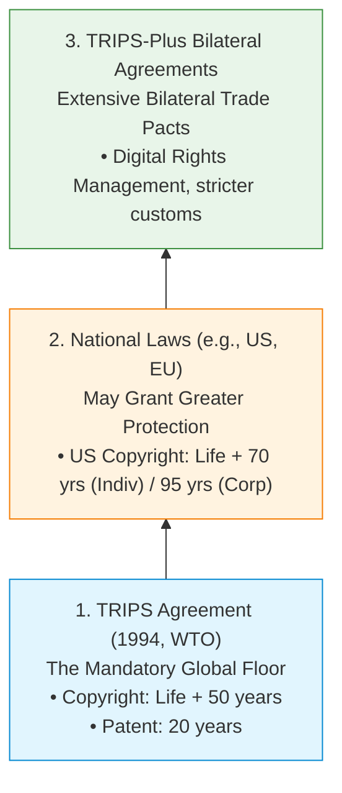
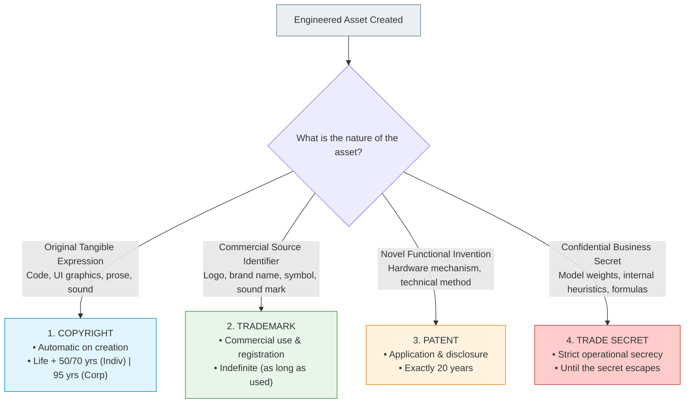

# 12.3 - The International Legal Framework & The Four Pillars

> [!abstract] Learning Objectives & Topic Roadmap
> In this note, we establish the legal architecture governing intellectual property worldwide:
> 1. **The Principle of Territoriality**: Why intellectual property laws are national, not universal.
> 2. **The TRIPS Agreement (Slide 11)**: The foundational 1994 treaty administered by the WTO.
> 3. **The "Floor, Not a Ceiling" Doctrine**: Understanding TRIPS minimums vs. national laws vs. TRIPS-plus agreements.
> 4. **The Four Pillars of Intellectual Property (Slide 12)**: A comprehensive comparative synthesis of Copyright, Trademark, Patent, and Trade Secret.
> 5. **Clock Expiration vs. Event Expiration**: The fundamental mechanism separating statutory monopolies from commercial secrecy.
> 
> *Part of the [[05 - Lecture 12 - Patents, Copyright & Intellectual Property in Computing|Lecture 12 Master Hub]]*.

---

## 1. Why Do We Need International IP Treaties?

One of the first things every computer scientist and engineer must grasp is that **intellectual property rights are strictly territorial**:
- A patent granted in the United States by the USPTO gives you zero protection in Bangladesh, Japan, or Germany.
- A copyright created in France is governed by French law unless recognized by international treaties.

Before global agreements existed, a software company in one nation could freely clone proprietary software developed in another nation with zero legal repercussions in domestic courts.

To enable global commerce, nations negotiated international treaties to standardize intellectual property protection across borders.

---

## 2. The TRIPS Agreement: The Global Baseline (Slide 11)

In 1994, under the auspices of the **World Trade Organization (WTO)**, member states signed the landmark **TRIPS Agreement** (*Trade-Related Aspects of Intellectual Property Rights*).



> [!important] The "Floor, Not a Ceiling" Doctrine (Slide 11)
> **TRIPS is a floor, not a ceiling.**
> 
> - **Mandatory Minimums**: Every nation that joins the WTO *must* enact domestic laws providing at least the baseline protections specified in TRIPS:
>   - **Copyright Minimum**: The lifetime of the author plus **50 years**.
>   - **Patent Minimum**: Exactly **20 years** from the date of filing.
> - **National Freedom to Go Further**: Any country is free to provide *stronger* or *longer* protection than TRIPS mandates, but **cannot provide less**:
>   - *Example*: The United States enacted the *Sonny Bono Copyright Term Extension Act* (1998), extending copyright protection to **Life + 70 years** for individuals and **95 years** for corporate works. This exceeds TRIPS, which is completely legal.
> - **TRIPS-Plus Agreements**: Powerful developed economies frequently negotiate bilateral free-trade agreements with developing nations that impose intellectual property rules that go far beyond TRIPS (known as "TRIPS-plus").

### Treaties vs. National Patent Offices (Slide 11)
A common student mistake on exams is writing: *"I filed my patent with the TRIPS office."*
- **There is no TRIPS patent office!**
- Treaties only set **standards and rules** that member governments agree to enforce in their courts.
- Actual rights are examined, granted, registered, and enforced by **national offices** (e.g., the United States Patent and Trademark Office / USPTO, the European Patent Office / EPO, or the Department of Patents, Designs and Trademarks / DPDT in Bangladesh).

---

## 3. The Four Kinds of Intellectual Property (Slide 12)

Every software product, engineering hardware device, and commercial computing service relies on **Four Distinct Pillars of Intellectual Property**:



---

## 4. The Master Comparison Matrix

The table below synthesizes the core attributes of each pillar as presented on Slide 12:

| IP Pillar | What It Protects | How You Obtain It | How Long It Lasts | Computing Example | How It Terminates |
| :--- | :--- | :--- | :--- | :--- | :--- |
| **Copyright** | A particular **expression**: source code, documentation, images, UI art, audio chimes. | **Automatically, upon creation** (no registration required, though registration helps lawsuits). | **Life + 50 years** (TRIPS minimum); **Life + 70 years** (US individual); **95 years** (US corporate work). | Linux kernel source code, video game textures, app layout graphics. | **On a clock**: Enters the public domain once the statutory years expire. |
| **Trademark** | A mark (word, logo, phrase, symbol) identifying the **commercial source** of goods or services. | By **commercial use** in the market, strengthened by **formal registration**. | **Indefinitely / Forever**, as long as it is actively used in commerce. | The "Google" name, Apple logo, "Ubuntu" circle of friends, Microsoft Windows flag. | **Dies of disuse**: Abandonment, failure to renew, or *genericization* (becoming a common noun). |
| **Patent** | A new, useful, and non-obvious **method, device, machine, or material**. | By formal **application, rigorous examination**, and full technical disclosure. | **Exactly 20 years** from filing date. | PageRank algorithm (US Pat. 6,285,999), multi-touch capacitive screen gestures. | **On a clock**: Expiration of the 20-year term; becomes free public domain technology. |
| **Trade Secret** | Confidential, secret information giving a **commercial business advantage**. | By **keeping it secret** through reasonable operational security measures. | **Indefinitely / Forever**, until the secret gets out or is reverse engineered. | Google's live search ranking neural weights, Coca-Cola syrup formula. | **Dies of disclosure**: Leaks, employee betrayal, independent discovery, or lawful reverse engineering. |

---

## 5. Clock-Based vs. Event-Based Expiration (Slide 12)

Look closely at the final sentence on Slide 12:

> [!important] The Expiration Rule
> *"Only copyright and patent expire on a clock. A trademark dies of disuse, a trade secret of disclosure."*

This is one of the most heavily tested theoretical distinctions in Engineering Ethics exams:

```
                           How Intellectual Property Ends
  [ CLOCK-BASED EXPIRATION ]                 [ EVENT-BASED EXPIRATION ]
  • Copyright & Patent                       • Trademark & Trade Secret
  • Governed by strict statutory timelines.  • No statutory expiration date.
  • You cannot renew or extend them.         • Can theoretically last a thousand years.
  • When the timer hits 0:                   • They die ONLY upon a triggering event:
    - Patent = exactly 20 years.               - Trademark dies when abandoned/unused.
    - Copyright = author's death + 70 yrs.     - Trade secret dies the moment it leaks.
```

### Why Did Lawmakers Design It This Way?
1. **Patents & Copyrights (Clock-Based)**: 
   - These grant an **exclusive monopoly** over useful technology and creative culture. 
   - A perpetual monopoly over technology would strangle human progress. 
   - Therefore, the law forces them to expire on an unyielding statutory clock so the public gets free access eventually.
2. **Trademarks (Event-Based)**: 
   - Trademarks do not protect ideas or functional machines; they protect **consumer clarity** (so you know that a phone with an Apple logo is genuinely made by Apple, not a dangerous counterfeit). 
   - As long as Apple continues making phones under that mark, the mark must remain protected to prevent public deception.
3. **Trade Secrets (Event-Based)**: 
   - A trade secret does not grant a legal monopoly over competitors. If a competitor invents the exact same thing independently, they are completely free to use it. 
   - Because the public granted no state monopoly, the trade secret can last as long as the owner can physically guard the information.

---

## 6. Key Takeaways & Self-Test Checklist

> [!tip] Quick Review Summary
> - **Territoriality**: IP rights exist only within the borders of the nation granting them.
> - **TRIPS (1994, WTO)**: The global agreement establishing minimum IP baselines.
> - **Floor, Not a Ceiling**: Nations must provide TRIPS minimums (Life+50 copyright, 20 yrs patent), but are free to legislate higher protections (e.g., US Life+70 / 95 yrs).
> - **Treaty vs. Office**: Treaties set standards; national offices (USPTO, etc.) grant and enforce specific patents/trademarks.
> - **Clock vs. Event**: Copyright and Patent expire on a statutory clock; Trademark dies of disuse, Trade Secret dies of disclosure.

### Self-Test Practice Questions

> [!question]- Quick Test 1: Can Bangladesh reduce its patent duration to 15 years to help local tech startups?
> **Answer**: No. As a member of the WTO, Bangladesh is bound by the TRIPS Agreement, which establishes a strict mandatory floor of 20 years for patents. A member nation may exceed the floor, but cannot drop below it.

> [!question]- Quick Test 2: If a company invents a secret cryptographic protocol and never tells anyone, when does their trade secret protection expire?
> **Answer**: Never, unless the secret escapes, an employee leaks it, a competitor reverse-engineers it, or someone independently invents it. Trade secrets have no clock expiration.

---
*Next Topic: [[12.4 - Copyright Law, Fair Use & Software Source Code|Topic 12.4: Copyright Law, Fair Use & Software Source Code]]*
