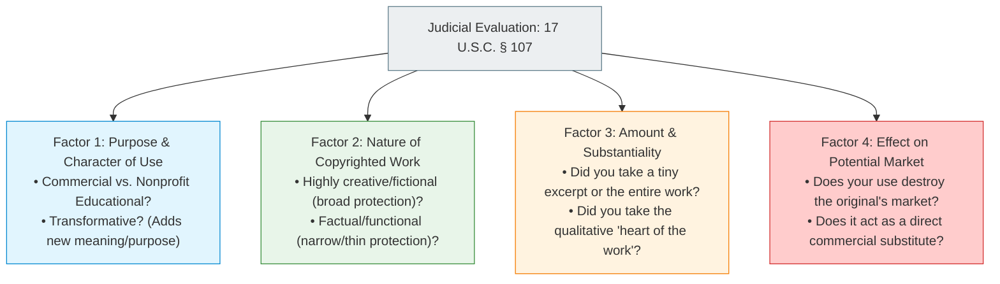

# 12.4 - Copyright Law, Fair Use & Software Source Code

> [!abstract] Learning Objectives & Topic Roadmap
> In this note, we examine the legal foundation governing creative and software expression:
> 1. **Copyright Fundamentals (Slide 13)**: Inception, tangible fixation, and durations (Life + 70 yrs vs. 95 yrs).
> 2. **The 2024 Steamboat Willie Milestone (Slide 14)**: What entering the public domain actually means, and the crucial boundary between Copyright and Trademark.
> 3. **The Expression vs. Idea Dichotomy (Slide 15)**: Why competing software products can perform identical functions without copyright infringement.
> 4. **The Fair Use Doctrine (Slide 16)**: Section 107, the 4-factor balancing test, and why classroom slides differ from commercial products.
> 5. **Software as a "Literary Work" (Slide 17)**: How TRIPS protects source code while leaving underlying algorithms completely uncopyrightable.
> 
> *Part of the [[05 - Lecture 12 - Patents, Copyright & Intellectual Property in Computing|Lecture 12 Master Hub]]*.

---

## 1. Copyright Fundamentals: Automatic Protection (Slide 13)

A **copyright** grants the creator of an original creative work the legal right to limit how many copies others can make, distribute, perform, display, or adapt without permission.

![[attachments/copyright-symbol.png|200]]
*Figure: Slide 13 — The universal copyright notice symbol (©).*

### Key Legal Characteristics
1. **Automatic Inception**: 
   - You do **not** have to file paperwork with a government office to obtain a copyright.
   - The moment an author types words into a document, a photographer snaps a photo, or a programmer writes code into an IDE, the copyright **arises automatically** upon fixation in a tangible medium.
   - *Why register?* Formal registration with a national copyright office (such as the US Copyright Office) is not required for ownership, but it is necessary if you want to sue for statutory financial damages in court.
2. **Durations (Slide 13)**:
   - **Individual Creator**: The **life of the author plus 70 years** (in the US; TRIPS minimum is Life + 50 years).
   - **Corporate-Owned Work (Work-for-Hire)**: Exactly **95 years from the date of publication** (or 120 years from creation, whichever is shorter).

---

## 2. Case Study: Steamboat Willie and the Public Domain (Slide 14)

On **January 1, 2024**, one of the most famous cultural milestones in intellectual property history occurred: the original depiction of **Mickey Mouse** entered the **public domain**.

![[attachments/steamboat-willie-1928.png|300]] ![[attachments/steamboat-willie-plush.png|300]]
*Figure: Slide 14 — Left: Mickey Mouse in Steamboat Willie (1928), in the public domain since Jan 1, 2024. Right: Michael Stevens (Vsauce) holding an independent Steamboat Willie plush manufactured without a Disney license.*

### What Happened?
- In 1928, Walt Disney and Ub Iwerks published the animated short film *Steamboat Willie*, introducing the world to Mickey Mouse.
- Because it was a corporate-owned work, its US copyright lasted for 95 years from publication.
- On January 1, 2024, the 95-year timer ran out. The film entered the **public domain**.
- **What is now lawful**: Anyone in the world can legally host, broadcast, sell, remix, or manufacture merchandise based on the 1928 *Steamboat Willie* film without paying a single dollar in royalties to Disney.

### The Two Critical Traps That Confuse Students
Slide 14 highlights two legal nuances that make ideal exam questions:

> [!warning] Trap 1: Later Copyrighted Iterations Remain Protected
> **Only the 1928 version entered the public domain.**
> - The 1928 Mickey has no pupils, wears simple shorts, and doesn't speak with a modern voice.
> - Modern Mickey Mouse (wearing white gloves with three lines, red shorts with colored buttons, large pupils, Sorcerer Mickey from *Fantasia* 1940) was created later and **remains fully protected under unexpired copyrights**!
> - If you draw Mickey Mouse with his modern design, Disney can still sue you for copyright infringement.

> [!danger] Trap 2: The Trademark Overlap (The Vsauce Case)
> **Trademarks do not expire on a clock.**
> - Disney still owns active **Trademarks** on Mickey Mouse as their corporate symbol.
> - If an independent creator sells 1928 *Steamboat Willie* plush toys (as shown in the Vsauce video *"I Just Committed NOT A Crime"*), they are legally exercising public domain copyright rights.
> - **HOWEVER**: If the creator packages or advertises the plush in a way that tricks consumers into believing it is an official Disney product, **Disney can sue and destroy them under Trademark Law**!
> - *Rule*: You can copy the public domain expression, but you cannot create consumer confusion about the commercial source.

---

## 3. What Copyright Does NOT Cover: The Idea/Expression Dichotomy (Slide 15)

In intellectual property law, the **Idea/Expression Dichotomy** is the absolute bedrock of software development:

> [!important] The Foundational Rule (Slide 15)
> **Ideas cannot be copyrighted. Copyright covers ONLY a particular expression of an idea.**

```
+--------------------------------------------+  +--------------------------------------------+
|             PROTECTED BY COPYRIGHT         |  |         NOT PROTECTED BY COPYRIGHT         |
+--------------------------------------------+  +--------------------------------------------+
| • The specific words chosen by an author.  |  | • The plot or theme of a story.            |
| • The specific source code written in C/JS.|  | • The mathematical method or algorithm.    |
| • The exact musical melody and notes.      |  | • The concept or system architecture.      |
| • The specific pixel art or UI vector.     |  | • The functional technique.                |
+--------------------------------------------+  +--------------------------------------------+
```

### Why This Matters for Software Engineers
Because copyright protects only the *literal expressive syntax* and not the underlying functional idea:
- **Two competing software engineers can write two different programs that do the exact same thing without either infringing the other.**
- *Example*: Alice writes an image compression tool in Rust. Bob sees her tool, reads about the underlying compression theory, and writes his own tool from scratch in C++. Bob does not copy Alice's source code; he writes his own syntax. 
- Bob has **not infringed** Alice's copyright! If ideas could be copyrighted, the first person to write a spreadsheet or a word processor would own a monopoly over all digital office software.

---

## 4. The Fair Use Doctrine (Slide 16)

Is it always illegal to use someone else's copyrighted work without their permission? **No.**

Under **Section 107 of the U.S. Copyright Act**, the law recognizes an affirmative defense known as **Fair Use**:

> [!note] Section 107 Statutory Text
> *"The fair use of a copyrighted work ... for purposes such as criticism, comment, news reporting, teaching (including multiple copies for classroom use), scholarship, or research, is not an infringement of copyright."*

![[attachments/cartoon-fair-use.png|380]]
*Figure: Slide 16 — Randy Glasbergen cartoon: "I know it's illegal to download music from the internet... but you said the stuff I listen to isn't music!" Reproduced legally under classroom fair use.*

### The Four-Factor Balancing Test
When a judge evaluates whether an unauthorized use is legal Fair Use, they must weigh **Four Statutory Factors**:



### The Classroom vs. Product Distinction (Slide 16)
Slide 16 highlights a classic exam principle:
> *"The same copy can be fair use in a classroom and infringement in a product."*

1. **In the Classroom**: 
   - Your university lecturer includes the Randy Glasbergen cartoon in Slide 16. 
   - Factor 1 is non-profit educational; Factor 4 does not harm the cartoonist's commercial syndicated licensing market. It is **lawful Fair Use**.
2. **In a Commercial Software Product**: 
   - A SaaS startup takes the exact same cartoon and puts it on their paid software homepage to attract enterprise customers without paying the cartoonist a licensing fee.
   - Factor 1 is commercial; Factor 4 deprives the artist of licensing revenue. It is **blatant copyright infringement**.

---

## 5. Can Software Be Copyrighted? (Slide 17)

**Generally, yes.**

Article 10 of the **TRIPS Agreement** explicitly mandates that computer programs (both in source code and object/binary code) must be protected as **literary works** under copyright law.

However, the Idea/Expression dichotomy applies strictly to code:

```c
/*
 * Copyright (c) 2026 Example Ltd.
 * All rights reserved.
 *
 * Permission is hereby granted, free of charge,
 * to any person obtaining a copy of this software ...
 */

int sort(int *a, int n) {
    /* the algorithm: NOT protected by copyright */
    int i, j, temp;
    for (i = 0; i < n - 1; i++) {
        for (j = 0; j < n - i - 1; j++) {
            if (a[j] > a[j + 1]) {
                temp = a[j];
                a[j] = a[j + 1];
                a[j + 1] = temp;
            }
        }
    }
}
```

> [!important] What the C Code Snippet Teaches Us (Slide 17)
> 1. **The Header Comments & Exact Syntax**: Protected as a literary work. If a competitor copy-pastes this exact text block into their repo, they infringe copyright.
> 2. **The Sorting Method (Bubble Sort)**: Completely **unprotected** by copyright! Anyone may write their own sorting function from scratch implementing Bubble Sort, QuickSort, or Dijkstra's algorithm.

---

## 6. Key Takeaways & Self-Test Checklist

> [!tip] Quick Review Summary
> - **Inception**: Copyright is automatic upon tangible creation; registration is only needed to sue for statutory damages.
> - **Duration**: Life + 70 years (US individual) or 95 years (US corporate work).
> - **Steamboat Willie**: 1928 Mickey is in the public domain (since 2024); modern versions remain copyrighted; trademark still prevents consumer deception.
> - **Idea/Expression**: Code syntax is protected expression; underlying algorithms, plots, and concepts are free for anyone to implement.
> - **Fair Use**: 4-factor test (Purpose, Nature, Amount, Market Effect); educational classroom use is protected, commercial SaaS use is not.

### Self-Test Practice Questions

> [!question]- Quick Test 1: If an open-source author does not put a "©" symbol on their GitHub repository, is their code copyrighted?
> **Answer**: Yes. Under modern international copyright law (the Berne Convention and TRIPS), copyright protection is automatic upon creation and fixation. The absence of a formal "©" notice or registration does not invalidate the author's copyright.

> [!question]- Quick Test 2: Can a company copyright the algorithm behind Binary Search?
> **Answer**: No. Copyright strictly protects expressive form (the literal code written), never the abstract mathematical idea, logic, or algorithmic technique.

---
*Next Topic: [[12.5 - Trademark Law & Tech Branding (The Two Apples)|Topic 12.5: Trademark Law & Tech Branding (The Two Apples)]]*
