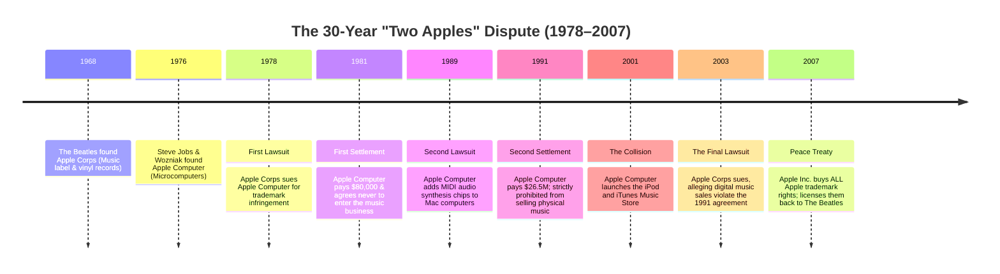

# 12.5 - Trademark Law & Tech Branding (The Two Apples)

> [!abstract] Learning Objectives & Topic Roadmap
> In this note, we examine the legal instrument protecting brand identity and consumer trust:
> 1. **Trademark Fundamentals (Slide 18)**: Defining trademarks vs. service marks and their underlying public purpose.
> 2. **How Trademarks Are Acquired & Maintained**: Commercial use, registration, and why rights can last indefinitely.
> 3. **The Doctrine of Product Classes**: Why identical company names can lawfully coexist in different market sectors.
> 4. **Case Study: The "Two Apples" 30-Year Dispute (1978–2007)**: How Apple Computer clashed with The Beatles' record label over digital music.
> 5. **Genericization**: How a trademark can accidentally "die of success."
> 
> *Part of the [[05 - Lecture 12 - Patents, Copyright & Intellectual Property in Computing|Lecture 12 Master Hub]]*.

---

## 1. What Is a Trademark? (Slide 18)

A **trademark** is any distinctive word, phrase, symbol, logo, color combination, sound, or design that **identifies and distinguishes the commercial source or manufacturer of goods**. 

A **service mark** performs the exact same function for intangible services (e.g., Google Cloud, AWS, FedEx delivery services).

![[attachments/trademark-logos.png|450]]
*Figure: Slide 18 — Globally recognized commercial trademarks. Marks identify the source of a product so a buyer knows who is answerable for it.*

### Why Does Trademark Law Exist?
Unlike copyright and patent law (which exist to incentivize creators and inventors), trademark law exists primarily for **consumer protection and market transparency**:
- When you buy a smartphone bearing the Apple logo, you are assured it was engineered by Apple with Apple's quality control, warranty, and security standards—not a counterfeit device loaded with spyware.
- If a product explodes or fails, the mark ensures the consumer knows **who is legally answerable for it**.

---

## 2. Inception, Duration & Expiration (Slide 18)

### How You Acquire a Trademark
- **Commercial Use (Common Law)**: In common-law jurisdictions, trademark rights begin the moment you actively use a mark in commercial trade to sell goods to the public.
- **Formal Registration**: Registering your mark with a government agency (e.g., the USPTO using the ® symbol instead of ™) provides strong nationwide evidentiary presumption of ownership and exclusive rights.

### How Long Does It Last?
- **Potentially Forever!**
- Trademarks do **not** expire on a statutory clock. 
- As long as the business actively maintains commercial use of the mark and files periodic renewals, the trademark can last for hundreds of years (e.g., Stella Artois beer has used its horn mark since 1366).

### How Trademarks Die
1. **Disuse and Abandonment**: If a company stops using a logo in commerce for consecutive years, it abandons the right.
2. **Genericization (Genericide)**: 
   - When a trademark becomes *so popular* that the public begins using the brand name as the generic word for the entire product category, the mark loses its source-identifying ability and is cancelled by courts!
   - *Famous examples of dead trademarks*: Aspirin, Escalator, Thermos, Zipper, and Yo-Yo were once exclusive commercial trademarks.
   - Tech companies vigorously fight to prevent this (e.g., Google's legal team insists you say *"search using the Google search engine,"* not *"google it"*).

---

## 3. Product Classes: Coexistence in the Marketplace (Slide 18)

> [!important] The Core Principle of Product Classes (Slide 18)
> **One cannot claim a mark already registered or in use by another company IN THE SAME PRODUCT CLASS.**

Trademarks are not absolute monopolies over words in the English dictionary. Trademark law organizes all commercial goods and services into **45 international Nice Classes** (e.g., Class 9 for computer hardware/software, Class 25 for clothing, Class 41 for musical entertainment).

Because of this:
- Two completely separate businesses can use the **exact same name**, provided their goods are in unrelated product classes and consumers will not be confused.
- *Example*: You can buy **Dove Chocolate** (confectionery) and **Dove Soap** (personal hygiene). Neither company can sue the other because no reasonable shopper confuses a chocolate bar with bath soap.

---

## 4. Case Study: The "Two Apples" 30-Year War (Slide 18)

The most famous clash in tech trademark history is the epic three-decade legal struggle between **Apple Corps** and **Apple Computer**:

### The Conflict Unfolded
1. **The Origin**:
   - In 1968, legendary rock band **The Beatles** founded **Apple Corps Ltd.**, their multimedia record label (featuring a green Granny Smith apple logo).
   - In 1976, Steve Jobs and Steve Wozniak founded **Apple Computer Company** (featuring the rainbow bitten apple logo).
2. **The First Coexistence Pact (1981)**:
   - When Apple Corps sued in 1978, the companies settled: both could use "Apple" because **records and personal computers were in completely different product classes**.
   - Apple Computer legally agreed that it would **never enter the music business**.
3. **The Technological Convergence (1989–2001)**:
   - As computing evolved, computers ceased being mere spreadsheets and word processors; they became **digital multimedia and audio workstations**.
   - Apple Computer introduced MIDI sound cards, audio recording software, and in 2001 launched the **iPod portable music player** followed by the **iTunes Music Store** (selling digital songs for \$0.99).
4. **The Ultimate Clash (2003–2007)**:
   - Apple Corps sued, arguing: *"You are now literally the largest music retailer on planet Earth! You have broken our contract and violated our trademark class."*
   - In 2007, Steve Jobs finally ended the war: Apple Computer (renaming itself **Apple Inc.**) paid Apple Corps an estimated **\$500 million**, purchasing **complete worldwide ownership of all Apple trademarks**, and generously licensed the name back to The Beatles for their record releases.

---

## 5. Key Takeaways & Self-Test Checklist

> [!tip] Quick Review Summary
> - **Purpose**: Trademarks identify the commercial source of goods/services to protect consumers against fraud and confusion.
> - **Duration**: Indefinite; rights last as long as the mark is actively used in commercial trade.
> - **Product Classes**: Identical names can coexist legally in non-overlapping product categories (e.g., Dove Soap vs. Dove Chocolate).
> - **The Two Apples**: Coexisted peacefully while computers and music were separate; collided violently once personal computers became digital music distributors via iTunes.
> - **Genericization**: Trademarks die when the public adopts the brand as the generic word for the product.

### Self-Test Practice Questions

> [!question]- Quick Test 1: If a software startup names their new code editor "Microsoft", can Microsoft sue them even if Microsoft doesn't make an editor with that exact name?
> **Answer**: Yes, absolutely. Microsoft owns the trademark for software development tools and computer software (Class 9). Using the name "Microsoft" creates immediate consumer confusion, falsely implying that Microsoft developed or certified the software.

> [!question]- Quick Test 2: Why didn't Disney lose its trademark on Mickey Mouse when the 1928 Steamboat Willie cartoon entered the public domain?
> **Answer**: Because copyright and trademark are entirely separate legal pillars. While the copyright on the 1928 expression expired on a 95-year clock, Disney continues to actively use Mickey Mouse as its corporate brand symbol in commerce, maintaining perpetual trademark rights.

---
*Next Topic: [[12.6 - Patent Law, The Alice Doctrine & Algorithm Eligibility|Topic 12.6: Patent Law, The Alice Doctrine & Algorithm Eligibility]]*
