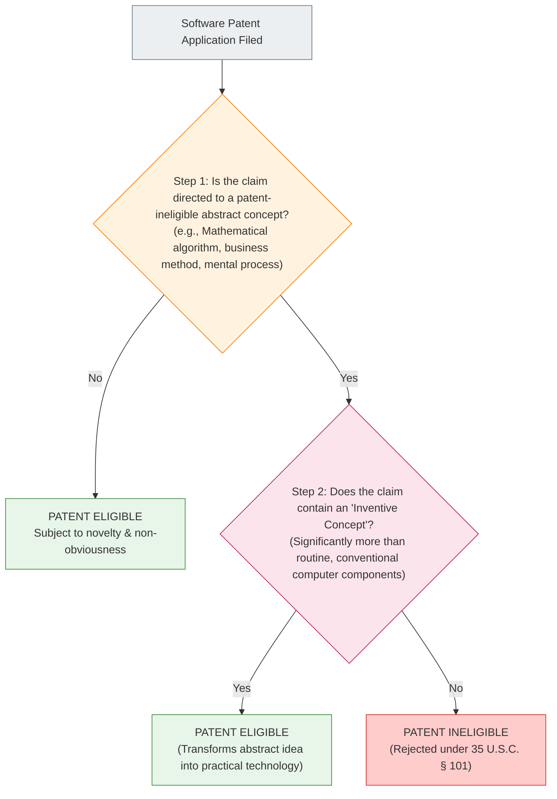

# 12.6 - Patent Law, The Alice Doctrine & Algorithm Eligibility

> [!abstract] Learning Objectives & Topic Roadmap
> In this note, we explore the most powerful, expensive, and legally complex form of intellectual property:
> 1. **The Nature of Patents (Slide 19)**: The 20-year disclosure monopoly and the strict novelty/non-obviousness test.
> 2. **What CANNOT Be Patented (Slide 20)**: Mathematical theorems, natural DNA sequences, business methods, and UI "look and feel."
> 3. **Software & Algorithm Patentability (Slide 21)**: The US legal framework post-*Alice Corp. v. CLS Bank*.
> 4. **The Engineer's Golden Rule**: *"A faster way for a computer to do X"* vs. *"Doing X, but on a computer."*
> 5. **Why Bubble Sort Was Denied a Patent**: The boundary between abstract mathematical truths and practical technology.
> 6. **Who Owns a Patent? (Slide 22)**: Inventorship (Field [72]) vs. Assignee Ownership (Field [73]) in tech employment contracts.
> 
> *Part of the [[05 - Lecture 12 - Patents, Copyright & Intellectual Property in Computing|Lecture 12 Master Hub]]*.

---

## 1. What Is a Patent? (Slide 19)

A **patent** is an exclusive legal monopoly granted by a sovereign government to an inventor for a limited time, giving them the power to prevent anyone else from making, using, selling, or importing the claimed invention without permission.

![[attachments/patent-office-cartoon.png|350]]
*Figure: Slide 19 — The Patent Office: An invention already known to the public fails the novelty requirement and cannot be patented.*

### Key Statutory Attributes
1. **Duration**: 
   - **Utility Patents**: Exactly **20 years** from the date of filing (under the TRIPS Agreement and US law).
   - **Design Patents**: 15 years in the US (protecting ornamental design of functional items).
2. **The Social Contract**: 
   - A patent is not a gift; it is a **trade** (The Patent Bargain). The inventor must publish an exhaustive, step-by-step description enabling any person skilled in the art to replicate the invention. Once the 20 years expire, the monopoly ends permanently, and the technology enters the public domain.
3. **The Three Mandatory Criteria for Any Patent**:
   - **Novelty**: The invention must be completely new. If the idea has ever been described in a public blog post, paper, or prior patent anywhere on Earth, it fails for lack of novelty due to **"Prior Art."**
   - **Non-Obviousness (Inventive Step)**: An ordinary engineer working in the field would not have found the solution obvious.
   - **Utility**: The invention must have a practical, real-world function.

---

## 2. What CANNOT Be Patented? (Slide 20)

Society explicitly places certain categories **off-limits** to patent monopolies:

![[attachments/dna-unpatentable.png|200]] ![[attachments/spreadsheet-ui-unpatentable.png|320]]
*Figure: Slide 20 — Left: Naturally occurring DNA sequences fall outside patent protection. Right: The "look and feel" of a graphical spreadsheet cannot be patented.*

The law strictly excludes:
1. **Pure Ideas & Mathematical Theorems**:
   - You cannot patent Pythagoras' theorem, the Fast Fourier Transform, or Einstein's equations.
2. **Things Occurring in Nature**:
   - You cannot patent a mineral, a biological species, or a naturally occurring human DNA gene sequence (established in the landmark US Supreme Court case *Association for Molecular Pathology v. Myriad Genetics*).
3. **"Ways of Doing Business"**:
   - Abstract financial schemes, hedging risk, insurance underwriting methods, or sales techniques cannot be patented, even if you execute them using an automated computer.
4. **"Look and Feel" of User Interfaces**:
   - The grid layout of a spreadsheet, window scrollbars, or pull-down menu designs cannot be patented.

> [!important] Why Do These Exclusions Exist? (Slide 20)
> *"Each exclusion keeps something available to everyone: mathematics, nature, ways of doing business, and interface conventions."*
> 
> If a single corporation could own a 20-year monopoly on a fundamental mathematical formula or the basic layout of a spreadsheet grid, all other engineers would be paralyzed from writing software.

---

## 3. Can Software or an Algorithm Be Patented? (Slide 21)

This is one of the most contentious questions in computing law. 

Article 27 of the TRIPS agreement is notoriously vague on software. In the United States, thousands of dubious software patents were issued in the 1990s and 2000s. To clean up this crisis, the US Supreme Court issued the landmark ruling in ***Alice Corp. v. CLS Bank* (2014)**, establishing the **Alice Two-Step Eligibility Test**:

---

## 4. The Engineer's Golden Rule: Patentable vs. Not Patentable (Slide 21)

The lecture distills decades of software patent litigation into one indispensable rule of thumb:

> [!tip] The Rule of Thumb for Software Patentability
> 
> ### ✅ PATENTABLE: *"A faster way for a computer to do X"*
> - Software that improves the internal operation, memory bandwidth, cache coherence, or speed of the computer itself.
> - Software that solves a specific technical problem arising purely within computing architecture (e.g., a novel garbage collection algorithm that prevents thread pauses, a distributed consensus protocol for high-throughput fault tolerance, or a hardware-accelerated video codec).
> 
> ---
> 
> ### ❌ NOT PATENTABLE: *"Doing X, but on a computer"*
> - Taking an existing human, business, or mathematical activity and simply writing code to automate it.
> - Examples: *"A method for calculating restaurant bills on a smartphone,"* *"A method for managing real estate escrow accounts using an internet server,"* or *"A method for matching dating profiles using database queries."* These are all abstract human concepts implemented on generic, conventional computers.

### Why Was Bubble Sort Denied a Patent? (Slide 21)
- **An algorithm in principle cannot be patented** because an algorithm is fundamentally an abstract mathematical recipe.
- Sorting a list of integers from smallest to largest is an abstract mathematical concept. If a court granted a patent on **Bubble Sort**, no programmer in that country could compare and swap two adjacent numbers in memory without paying royalties for 20 years!
- The patent office correctly rejected Bubble Sort because it does not improve the internal mechanics of physical computer hardware; it is simply a mathematical procedure.

---

## 5. Who Owns a Patent? Inventorship vs. Ownership (Slide 22)

One of the most critical employment lessons for graduating engineers is the difference between **Inventorship** and **Ownership**:

> [!important] The Rule of Ownership (Slide 22)
> **Being named as the inventor and owning the invention are two completely different things.**

![[attachments/barcode-scanner-patent.png|320]]
*Figure: Slide 22 — US Patent 3,663,800 for the optical supermarket barcode scanner.*

### Examining US Patent 3,663,800:
- **Field [72] (Inventors)**: Names the physical human beings whose intellect conceived the invention: *Jan M. Myer, Robert L. Hastings, Francis F. Webster*.
- **Field [73] (Assignee / Owner)**: Names **Hughes Aircraft Company**.
- **The Legal Reality**: Even though Myer, Hastings, and Webster invented the barcode scanner and have their names forever engraved on the patent document, **Hughes Aircraft owns 100% of the commercial patent rights**!

### The "Work-for-Hire" Doctrine in Engineering
- When you join a technology company (e.g., Google, Intel, Microsoft) as a salaried software engineer, you sign an employment agreement (an **Invention Assignment Agreement**).
- Under the law of **Work-for-Hire**:
  - The company pays you a salary, provides high-performance computing clusters, pays health insurance, and assumes financial risk.
  - In return, **any patentable invention, patent application, or software code you conceive during your employment related to the company's business automatically belongs to the employer**.
  - Your name will appear on the patent as the inventor (which is great for your CV), but your employer owns the monopoly, collects all licensing royalties, and decides whether to sue competitors.

---

## 6. Key Takeaways & Self-Test Checklist

> [!tip] Quick Review Summary
> - **Patent Term**: 20 years from filing; non-renewable; requires full public disclosure.
> - **Unpatentable**: Pure mathematical theorems, naturally occurring DNA, abstract business methods, UI look-and-feel.
> - **Software Eligibility**: Improving computer machine functionality is patentable (*"faster way for computer to do X"*); automating human concepts is not (*"doing X on a computer"*).
> - **Bubble Sort**: Denied because pure algorithms are abstract mathematical procedures.
> - **Inventorship vs. Ownership**: Inventors are named in Field [72]; employers own the patent via assignment in Field [73] under work-for-hire.

### Self-Test Practice Questions

> [!question]- Quick Test 1: A developer invents a new neural network quantization algorithm that cuts LLM GPU memory consumption by 60% without losing accuracy. Is this patentable?
> **Answer**: Yes. Under the *Alice* framework, this is not merely "doing math on a computer"; it is a specific technical solution to a machine performance problem that improves the operational efficiency and memory bandwidth of computing hardware (*"a faster/more efficient way for a computer to execute X"*).

> [!question]- Quick Test 2: If you invent an incredible database engine at work on your company laptop during office hours, can you quit the next day and patent it yourself?
> **Answer**: No. Under standard engineering employment contracts and the work-for-hire doctrine, inventions conceived within the scope of your employment or using company equipment belong exclusively to your employer via assignment.

---
*Next Topic: [[12.7 - Trade Secrets, NDAs & Employee Mobility|Topic 12.7: Trade Secrets, NDAs & Employee Mobility]]*
