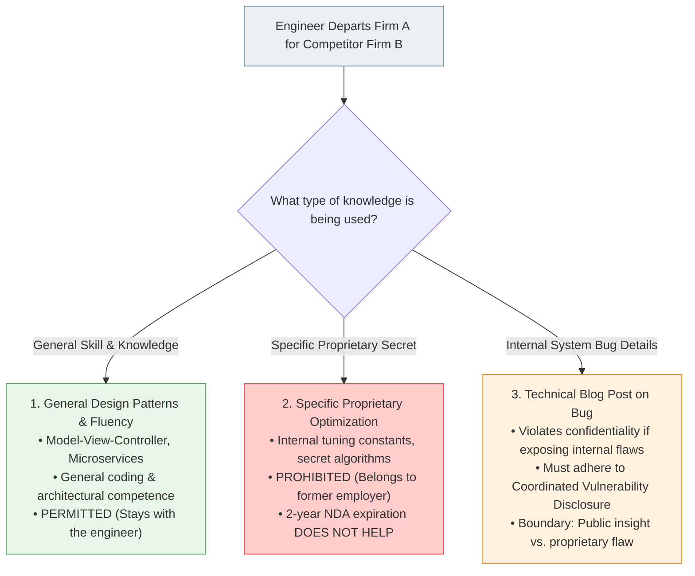

# 12.7 - Trade Secrets, NDAs & Employee Mobility

> [!abstract] Learning Objectives & Topic Roadmap
> In this note, we examine intellectual property maintained through secrecy and the ethical minefield of engineer career mobility:
> 1. **Trade Secret Fundamentals (Slide 23)**: Definition, commercial advantage, and the strategic trade-off against patents.
> 2. **Operational vs. Legal Protection (Slide 24)**: The legendary Coca-Cola vault and why the law cannot resurrect an escaped secret.
> 3. **What the Law Actually Prohibits (Slide 25)**: Misappropriation vs. Independent Discovery vs. Reverse Engineering.
> 4. **Non-Disclosure Agreements (NDAs) (Slide 26)**: Why statutory trade secret law protects secrets even after an NDA expires.
> 5. **The Internship Scenario Solved (Slide 27)**: General professional skill vs. proprietary secrets.
> 
> *Part of the [[05 - Lecture 12 - Patents, Copyright & Intellectual Property in Computing|Lecture 12 Master Hub]]*.

---

## 1. What Is a Trade Secret? (Slide 23)

A **trade secret** is any confidential formula, pattern, compilation, program, device, method, technique, or process that:
1. Derives independent economic value from **not being generally known** to the public or competitors.
2. Is the subject of **reasonable efforts** by the owner to maintain its secrecy.

![[attachments/coca-cola-bottles.png|220]]
*Figure: Slide 23 — The Coca-Cola formula was never patented, since a patent would have published it.*

### The Strategic Dilemma: Patent vs. Trade Secret
Every engineering company faces a major strategic choice when developing proprietary technology:

```
               The Strategic Crossroads: Patent vs. Trade Secret
+------------------------------------+  +------------------------------------+
|               PATENT               |  |            TRADE SECRET            |
+------------------------------------+  +------------------------------------+
| • Gives up secrecy immediately.    |  | • Retains absolute operational     |
| • Publishes complete technical     |    secrecy indefinitely.              |
|   blueprints for the public.       |  | • Zero public disclosure.          |
| • Protected for EXACTLY 20 YEARS.  |  | • Protected FOREVER (no term).     |
| • Legally blocks independent       |  | • Provides ZERO protection against |
|   invention and reverse engineering|    reverse engineering or competitors |
|   by competitors.                  |    inventing it independently.        |
+------------------------------------+  +------------------------------------+
```

### Why Coca-Cola Never Patented Their Recipe (Slide 23)
- If Coca-Cola had filed a patent for their syrup formula in 1890, the patent office would have granted them 20 years of exclusivity.
- But in **1910**, the 20-year patent clock would have expired! 
- By law, the secret recipe would have entered the public domain, and Pepsi or any beverage maker could have manufactured identical Coca-Cola legally for the last 115 years!
- By choosing **trade secrecy**, Coca-Cola has retained an unbroken commercial monopoly over its formula for over 130 years.

---

## 2. Operational Protection: Keeping a Secret Secret (Slide 24)

Unlike patents or trademarks, which are enforced by judges in courtrooms, **trade secrets depend entirely on operational security**:

![[attachments/coca-cola-vault.png|340]]
*Figure: Slide 24 — The Coca-Cola vault in Atlanta, Georgia. The protection here is operational rather than legal.*

### Slide 24: Coca-Cola's Multi-Layered Operational Security
- **Physical Vault**: Only one official written copy of the formula exists, locked inside an impenetrable bank vault in Atlanta, USA.
- **Two-Person Rule**: Only two high-ranking executives have access to the vault simultaneously.
- **Anonymity**: Their identities are kept secret from the public and general staff.
- **Travel Separation**: The two custodians are forbidden from ever flying on the same airplane or traveling together, preventing a single accident from erasing institutional access.
- **Succession Protocol**: When one custodian is close to retirement or death, they privately designate and train a successor.
- **Supply Chain Compartmentalization**: The concentrated syrup is manufactured and shipped in **9 separate chemical components**, which are only blended at the final factory stage so no single line worker knows the complete proportions.

> [!danger] The Irreversible Nature of Leaks (Slide 24)
> *"The protection here is operational rather than legal, since the law cannot restore a secret once it escapes."*
> 
> If a trade secret is posted on Reddit or published in a blog post, a judge can send the leaker to prison, but the judge **cannot un-read the secret from the minds of competitors**. Once the secret escapes into the wild, the intellectual property is dead forever.

---

## 3. What Trade Secret Law Actually Prohibits (Slide 25)

There is a massive legal misconception among junior engineers: they assume that owning a trade secret makes it illegal for anyone else to use the same technology. **That is completely false!**

> [!important] The Scope of Trade Secret Law (Slide 25)
> **The law does NOT prohibit the USE of a trade secret. It only prohibits STEALING one.**

![[attachments/reverse-engineering-gears.png|300]]
*Figure: Slide 25 — Reverse Engineering: Taking a product apart to learn how it works is lawful. Taking the documents that describe it is not.*

### The Three Lawful Paths to a Competitor's Secret
1. **Independent Discovery**: 
   - If Company A invents a secret algorithm, and Company B's engineers sit in a closed room and independently conceive the exact same algorithm without copying, Company B is **100% legally entitled to use it**.
2. **Reverse Engineering (Slide 25)**: 
   - Reverse engineering is the process of buying a legally available commercial product on the open market, disassembling its hardware, analyzing its binary assembly instructions, or running spectroscopy on its chemical makeup to deduce how it was built.
   - **Reverse engineering is completely lawful!** The law reasons that if an engineer can figure out the secret simply by inspecting the public product, the idea was never genuinely secret.
3. **What IS Illegal (Misappropriation)**:
   - What the law strictly criminalizes is **theft, industrial espionage, hacking servers, bribery, or breach of a confidential relationship / NDA**.
   - *Analogy*: Buying an iPhone, tearing down the motherboard with a microscope, and analyzing the microchips is legal reverse engineering. Bribing an Apple engineer to email you the confidential CAD files is criminal trade secret theft (*misappropriation*).

---

## 4. Non-Disclosure Agreements (NDAs) (Slide 26)

A **Non-Disclosure Agreement (NDA)** is a legally binding contract where one or both parties promise not to disclose confidential and proprietary information shared during business discussions or employment.

![[attachments/nda-agreement-signing.png|300]]
*Figure: Slide 26 — Signing a Non-Disclosure Agreement. The NDA fixes the contractual scope and duration; trade secret law applies regardless.*

### Key Attributes of NDAs
- **Stated Duration**: NDAs typically specify a duration (usually 1 to 5 years). If silent, it may be interpreted as lasting as long as the information remains confidential.
- **Contractual Scope**: The agreement explicitly defines what types of data are considered "proprietary" (e.g., source code, financial projections, customer rosters).

> [!warning] The Crucial Legal Trap (Slide 26)
> *"Disclosure of trade secrets at any time is illegal, WITH OR WITHOUT an NDA. The NDA fixes the scope and the duration. Trade secret law applies regardless."*
> 
> Many software developers believe: *"My NDA with my former company had a 2-year duration. Now that 2 years have passed, I can freely disclose their proprietary backend trading algorithms!"*
> 
> **WRONG!** 
> - The NDA is merely a contract between you and the company.
> - But statutory trade secret law (such as the US *Defend Trade Secrets Act* or UK common law) exists **independently of any contract**!
> - True trade secrets remain protected **forever** until publicly disclosed. Even 10 years after leaving a firm, leaking their secret source code is illegal misappropriation.

---

## 5. Slide 27 Scenario Solved: What Can You Take With You?

Slide 27 presents an ethical and legal dilemma that almost every software engineer encounters in their career:

> [!question] Slide 27 Dilemma
> *"You finish a six-month internship where you signed a two-year NDA. At your next job you are asked to build something similar.*
> 1. *You reuse a general design pattern you learned there. Permitted?*
> 2. *You reuse a specific optimization the company identified as a trade secret. Permitted, and does the two-year limit help you here?*
> 3. *You publish a blog post about a bug you found in their system, after the NDA expires. Where is the line between what you learned and what you took?"*



### Question 1: Reusing a General Design Pattern
- **Verdict**: **PERMITTED.**
- **Reasoning**: Design patterns (such as Model-View-Controller, Factory Pattern, event-driven microservices, or standard database indexing techniques) are part of the general body of computer science knowledge. 
- Society protects **employee mobility**: an engineer cannot be lobotomized of the general skills, intellectual competence, and experience they gained while working.

### Question 2: Reusing a Specific Optimization Marked as a Trade Secret
- **Verdict**: **STRICTLY PROHIBITED.**
- **Does the 2-year NDA limit help you?**: **NO.**
- **Reasoning**: As established on Slide 26, trade secret law protects proprietary technical optimizations *independently of contract duration*. Even after the 2-year contractual NDA expires, the underlying trade secret remains protected by statute. Using the specific secret at Company B constitutes unlawful trade secret misappropriation.

### Question 3: Publishing a Blog Post About a Bug Found in Their System
- **The Ethical & Legal Boundary**:
  - If the blog post explains a **general computer science concept** (e.g., *"How race conditions occur in Go channels and how to avoid them"* using generic, sanitized code snippets), that is lawful educational sharing.
  - BUT if the blog post reveals specific internal architecture details, unpatched vulnerabilities, or proprietary source code of the former employer, it violates ongoing duties of confidentiality and exposes the employer to cyberattack. Under the **ACM Code of Ethics (Section 1.7 - Respect Privacy & Confidentiality)**, engineers must follow **Coordinated Vulnerability Disclosure** rather than unilateral public broadcasting.

> [!important] The Golden Takeaway (Slide 27)
> **General skill and knowledge stay with you. Specific proprietary information does not.**

---

## 6. Key Takeaways & Self-Test Checklist

> [!tip] Quick Review Summary
> - **Definition**: Non-public information providing a commercial advantage, protected via reasonable secrecy efforts.
> - **Duration**: Indefinite; lasts as long as operational secrecy is maintained.
> - **Lawful Exploitation**: Competitors may independently discover or reverse-engineer a trade secret.
> - **Unlawful Exploitation**: Misappropriation (theft, bribery, hacking, breach of duty).
> - **NDAs vs. Statute**: An NDA sets contractual scope; statutory trade secret law protects secrets permanently even after the NDA expires.
> - **Employee Mobility**: You keep your general intellect and design fluency; you must leave behind specific proprietary code, secrets, and internal bugs.

### Self-Test Practice Questions

> [!question]- Quick Test 1: A software engineer leaves Uber and secretly downloads 14,000 files of LiDAR autonomous vehicle designs onto a flash drive before starting a rival startup. Is this reverse engineering or trade secret theft?
> **Answer**: This is criminal trade secret theft (misappropriation). Downloading internal confidential schematics violates both employment agreements and trade secret law (the exact scenario of *Waymo v. Uber*, which resulted in criminal prison sentencing for Anthony Levandowski).

> [!question]- Quick Test 2: If a competitor buys a smart watch, disassembles the firmware, and writes their own compatible operating system, did they violate trade secret law?
> **Answer**: No. Disassembling a lawfully purchased commercial device to inspect its functioning is legal reverse engineering.

---
*Next Topic: [[12.8 - Multi-Layered Protection (Google Search & Smartphones)|Topic 12.8: Multi-Layered Protection (Google Search & Smartphones)]]*
