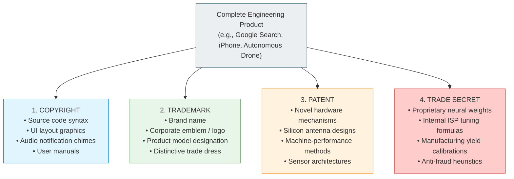
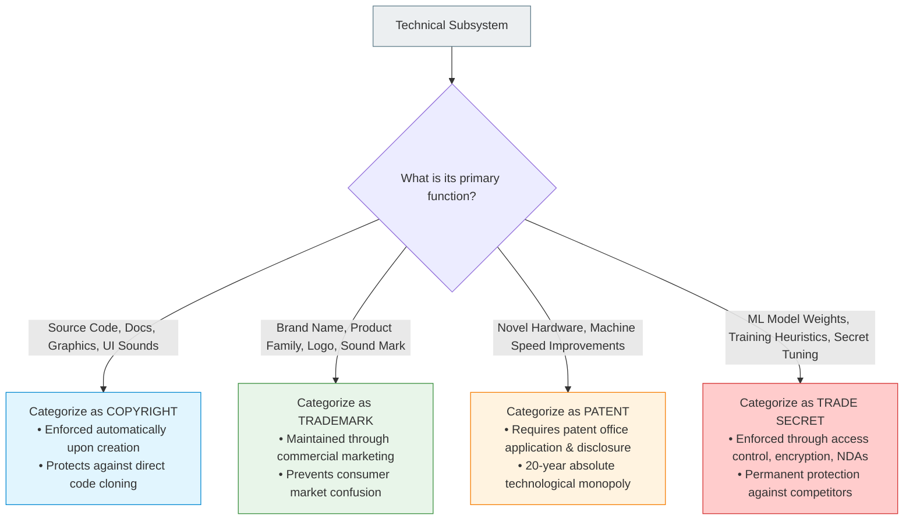

# 12.8 - Multi-Layered Protection (Google Search & Smartphones)

> [!abstract] Learning Objectives & Topic Roadmap
> In this note, we synthesize all four intellectual property pillars into real-world systems engineering:
> 1. **The Principle of Layered IP Protection**: Why modern engineering systems never rely on a single IP pillar.
> 2. **Case Study 1: Google Search (Slide 28)**: Dissecting the world's most dominant search engine across all 4 pillars.
> 3. **The Strategic Crossroads: PageRank vs. Modern Ranking**: Why Google patented its 1998 algorithm but keeps its 2026 algorithm a strict trade secret.
> 4. **Case Study 2: The Modern Smartphone (Slide 29)**: How hardware patents, operating system copyright, brand trademarks, and camera ISP tuning trade secrets coexist on a single handheld device.
> 5. **The Systems Architect's IP Audit Framework**: How to classify any technology product for an exam question.
> 
> *Part of the [[05 - Lecture 12 - Patents, Copyright & Intellectual Property in Computing|Lecture 12 Master Hub]]*.

---

## 1. The Systems Engineering Reality: Layered Protection

In classroom textbooks, intellectual property topics are taught in isolated chapters: copyright here, patents there.

In real-world computing, **a single commercial product carries all four protections at once, on different components of its hardware, software, and brand architecture**:



---

## 2. Case Study 1: Google Search (Slide 28)

Google Search is not just a website; it is the most sophisticated distributed computing pipeline on Earth. Slide 28 dissects how Google protects every layer of Search:

| IP Pillar | Specific Search Component | Legal Status & Characteristics |
| :--- | :--- | :--- |
| **Copyright** | **Source Code & Doodles** | • The literal C++, Go, and Python source code powering Google's distributed web crawlers, indexing pipelines, and query parsers.<br>• The artistic graphics and custom interactive animations created for every homepage **Google Doodle**.<br>• *Protected automatically from the moment it is committed to git, with no filing and no fee.* |
| **Trademark** | **Brand Name & Logo** | • The distinctive **"Google"** wordmark and its recognizable four-colour lettering (blue, red, yellow, green).<br>• Slogans like *"Don't Be Evil"* and product marks like *"PageRank"*.<br>• *Lasts indefinitely as long as Google actively uses it commercially to identify its search services.* |
| **Patent** | **PageRank Algorithm** | • **US Patent 6,285,999**: *"Method for node ranking in a linked database."*<br>• Filed in 1998 by Larry Page at Stanford University; granted in 2001.<br>• Stanford was the legal owner; Google held an exclusive commercial license.<br>• *Expired in 2019 after exactly 20 years.* |
| **Trade Secret** | **Live Search Ranking Heuristics** | • The real-time ranking algorithm Google runs today (thousands of machine-learning signals, clickstream user feedback, RankBrain neural networks, and anti-spam heuristics).<br>• *Never published, completely confidential, with zero expiration date.* |

### The Profound Strategic Lesson of Slide 28:
> [!important] The Patent vs. Trade Secret Trade-off in Search
> *"Google published its 1998 ranking method in order to get the patent, and keeps the method it runs today secret, because it cannot do both."*
> 
> - **In 1998**: Google was a tiny startup with zero revenue. They *needed* a patent to legally prevent Microsoft, Yahoo, or AltaVista from copying PageRank. To get that 20-year legal shield, they accepted the Patent Bargain and published their entire algorithmic formula for the world to see.
> - **In 2026**: PageRank expired in 2019 (anyone can now legally use 1998 PageRank). But Google does not rely on 1998 PageRank anymore! They rely on complex AI-driven ranking weights. If Google patented today's ranking algorithms, SEO spammers would study the patent application to game the search results, and competitors would get the formula for free in 20 years. 
> - Therefore, Google keeps today's ranking engine a **permanent trade secret** guarded behind massive access-control silos.

---

## 3. Case Study 2: The Modern Smartphone (Slide 29)

Look down at the smartphone sitting on your desk or in your hand. That single pocket device encapsulates the entire subject of Lecture 12:

```
                  Four IP Pillars Operating in a Single Smartphone
+------------------------------------------------------------------------------------+
| 1. COPYRIGHT (Literary & Artistic Expressions)                                      |
|    • The source code of the mobile OS (iOS Swift/Objective-C or Android Java/C++).|
|    • Every home screen UI application icon, animation curve, and widget graphic.   |
|    • The proprietary system startup chime and default ringtones.                   |
+------------------------------------------------------------------------------------+
| 2. TRADEMARK (Commercial Source Identifiers)                                       |
|    • The manufacturer's logo emblem on the back (e.g., Apple bite, Samsung oval).  |
|    • The commercial model branding: "iPhone", "Galaxy", "Pixel".                   |
|    • The signature packaging box layout and design typography.                     |
+------------------------------------------------------------------------------------+
| 3. PATENT (Functional Machine Improvements & Hardware Inventions)                  |
|    • The physical camera sensor (CMOS backside illumination architecture).         |
|    • The 5G millimeter-wave phased array antenna layout etched on the chassis.     |
|    • Capacitive multi-touch gesture processing and ultrasonic fingerprint sensors. |
+------------------------------------------------------------------------------------+
| 4. TRADE SECRET (Confidential Operational Algorithms & Formulas)                   |
|    • Computational photography tuning: how Image Signal Processor (ISP) software   |
|      transforms raw, noisy sensor pixels into vibrant, crisp HDR photos.           |
|    • Proprietary battery health calibration algorithms and thermal throttling.     |
|    • Internal factory fabrication and silicon lithography calibration yields.       |
+------------------------------------------------------------------------------------+
```

### The Inspection Rule (Slide 29)
Slide 29 concludes with a fascinating practical observation:
> *"You can check the first three yourself, on the product or in a patent register. The fourth you cannot, which is what keeping it secret buys."*

- **Copyright**: You can read the open-source licenses inside your phone's *Settings $\rightarrow$ About $\rightarrow$ Legal* menu.
- **Trademark**: You can look at the back of the phone and see the logo and model name.
- **Patent**: You can search Google Patents or the USPTO database and read the exact blueprints for the camera sensor and antenna layout.
- **Trade Secret**: You cannot see the raw camera color tuning code or factory calibration coefficients anywhere. That operational opacity is precisely what keeping it secret buys the company!

---

## 4. The Engineering IP Audit Framework

When preparing for exams, you may be presented with a novel computing technology (e.g., an autonomous delivery drone, a cloud gaming platform, or a medical diagnosis AI) and asked: *"How would an engineering company protect this product under the 4 pillars of IP?"*

Use this four-step audit formula:



---

## 5. Key Takeaways & Self-Test Checklist

> [!tip] Quick Review Summary
> - **Unified Strategy**: Real-world products deploy all four pillars simultaneously to build an impenetrable IP fortress.
> - **Google Search**: 
>   - Copyright = Crawling code & Doodles.
>   - Trademark = "Google" name & 4 colors.
>   - Patent = PageRank (expired 2019).
>   - Trade Secret = Live ranking algorithm & spam filters.
> - **Smartphone**:
>   - Copyright = OS code, icons, ringtones.
>   - Trademark = Brand logo and model name.
>   - Patent = Camera CMOS sensor and 5G antenna.
>   - Trade Secret = Computational photography tuning software.
> - **Public vs. Hidden**: The first three can be inspected on the device or in public registers; trade secrets remain invisible.

### Self-Test Practice Questions

> [!question]- Quick Test 1: Why doesn't Google patent its current search ranking neural networks today?
> **Answer**: Because filing a patent forces full public disclosure of the algorithm, which would allow web spammers to manipulate search results and would grant competitors free legal use of the technology once the 20-year patent expires. Keeping it as a trade secret provides indefinite protection with zero disclosure.

> [!question]- Quick Test 2: If a competitor designs a camera sensor with the exact physical layout described in an active smartphone patent, did they infringe copyright or patent?
> **Answer**: They infringed the patent. Physical hardware structures and technical methods are protected by patent law, not copyright law.

---
*Next Topic: [[12.9 - Exam Scenario Playbook & Model Answers|Topic 12.9: Exam Scenario Playbook & Model Answers]]*
