# 12.9 - Exam Scenario Playbook & Model Answers

> [!abstract] Purpose & Study Strategy
> This note is your final preparation engine for the **HUM 4441 Semester Final Examination**.
> In IUT Engineering Ethics exams, questions are rarely trivial memorization definitions. They are **high-stakes situational scenarios** requiring you to:
> 1. Identify which IP pillars and ethical frameworks apply.
> 2. Apply rigorous philosophical tests (e.g., Hooker's Generalization Test, the *Alice* two-step test, Fair Use four factors).
> 3. Provide structured, authoritative solutions that earn maximum marks.
> 
> *Part of the [[05 - Lecture 12 - Patents, Copyright & Intellectual Property in Computing|Lecture 12 Master Hub]]*.

---

## 1. Lecture 12 Summary Synthesis (Slide 30)

Before diving into scenarios, commit the **Six Core Truths of Lecture 12** to memory:

```mermaid
flowchart TD
    S1["1. GenAI Scraping Reproduces IP<br>Generic prompts output copyrighted assets because models memorized scraped training data."]
    S2["2. Non-Rivalry Defeats Simple Theft Tests<br>Digital copying leaves the original owner in full possession; simple anti-theft Kantian tests fail."]
    S3["3. The Scraping Garbage Loop<br>Scraping without payment fails generalization because it destroys the revenue needed to fund new human creation."]
    S4["4. Copyright = Expression; Fair Use = Exceptions<br>Copyright protects syntax/code, not ideas/algorithms. Fair Use protects teaching, critique, research."]
    S5["5. Expiration: Clock vs. Events<br>Patents (20 yrs) and Copyrights (Life+70) expire on a clock. Trademarks die of disuse; Trade Secrets die of disclosure."]
    S6["6. Work-for-Hire Ownership<br>The inventor is named on the patent, but the employer owns 100% of the commercial rights."]

    style S1 fill:#e1f5fe,stroke:#0288d1
    style S2 fill:#fff3e0,stroke:#f57c00
    style S3 fill:#ffcccc,stroke:#d32f2f
    style S4 fill:#e8f5e9,stroke:#388e3c
    style S5 fill:#f3e5f5,stroke:#7b1fa2
    style S6 fill:#eceff1,stroke:#607d8b
```

---

## 2. High-Yield Exam Scenarios & Solved Model Answers

### Scenario 1: GenAI Web Scraping & Hooker's Generalization Test [10 Marks]

> [!example]- 📝 Scenario 1: The Scraping Foundation Model Startup
> **Exam Prompt**:  
> *DeepMindAI, a commercial generative AI enterprise, scrapes 40 million copyrighted news articles, investigative reports, and textbooks from open web sources without asking permission or paying royalties to the publishers. When sued by a coalition of news publishers, the startup's CEO argues:*  
> > *"Our scraping did not take anything away from the publishers; their articles are still online for anyone to read. Furthermore, our model synthesizes new sentences and rarely quotes full articles verbatim. Therefore, our practice is completely ethical and harms no one."*
> 
> **Tasks**:  
> (a) Formulate the company's maxim and apply **Prof. John Hooker's Generalization Test** to evaluate whether this scraping practice is ethically permissible. [6 marks]  
> (b) Explain why the CEO's claim regarding "lack of verbatim quotation" fails to address the true ethical wrong of mass scraping. [4 marks]
> 
> ---
> 
> #### 🏆 Model Answer
> 
> **(a) Applying Prof. John Hooker's Generalization Test**:
> 1. **Formulating the Maxim**:  
>    *"A commercial AI enterprise may scrape and ingest all publicly available journalism, textbooks, and copyrighted literature without consent or royalty payments, to train generative models that answer user queries."*
> 2. **Universalization**:  
>    Imagine that *every* technology enterprise, search engine, and software developer universalizes this practice. Nobody pays content creators, news organizations, or authors for their digital content.
> 3. **The Resulting World**:  
>    - End-users receive immediate, synthesized answers to their questions directly through AI interfaces and stop visiting original publisher websites.
>    - Digital advertising revenues, paywall subscriptions, and book purchases collapse to zero.
>    - Because investigative journalism and technical textbooks require substantial capital investment and full-time professional labor, publishers go bankrupt. Full-time original human knowledge creation ceases.
> 4. **The Contradiction in Will / The "Garbage Loop"**:  
>    - AI developers rely on a continuous, reliable stream of newly published, fact-checked, high-quality human knowledge to train accurate models and avoid Model Collapse.
>    - However, universalizing the practice of uncompensated scraping **destroys the very economic foundation that allows original human knowledge to be produced**.
>    - The practice is parasitic, destroying what it feeds on. Because the goal of building capable, up-to-date AI models is undermined by universalizing the practice, the maxim is self-contradictory and **morally impermissible**.
> 
> **(b) Why Output Resemblance Is Irrelevant to the True Ethical Wrong**:
> - Under traditional copyright infringement, courts look for "substantial similarity" (verbatim quotation).
> - However, as highlighted on Slide 8, **output resemblance is the wrong thing to focus on ethically**.
> - The harm does not come from copying the *words*; the harm comes from **diverting the economic revenue** that funds the reporting.
> - Even if the AI generates completely original phrasing, users still bypass the newspaper's website. The journalist's salary is funded by clicks and subscriptions, not by abstract philosophical credit. Uncompensated scraping starves the financial pipeline of knowledge creation regardless of output style.

---

### Scenario 2: Employee Mobility, Trade Secrets & The 2-Year NDA Trap [10 Marks]

> [!example]- 📝 Scenario 2: The Departing Perception Engineer
> **Exam Prompt**:  
> *Sarah works as a lead computer vision engineer at RoboDrive, an autonomous vehicle startup. During her 1-year employment, she signed a Non-Disclosure Agreement (NDA) with a 2-year duration. While at RoboDrive, she helped design a proprietary low-light neural network architecture that RoboDrive guards as a strict trade secret.*  
> 
> *Two and a half years after resigning from RoboDrive, Sarah is hired by WayFarer, a competing self-driving car company. WayFarer asks her to design their new vision pipeline. Sarah considers:*  
> 1. *Applying her general expertise in PyTorch, convolutional neural networks, and Kalman filtering.*  
> 2. *Re-implementing RoboDrive's exact proprietary low-light neural architecture, reasoning that her 2-year NDA expired six months ago.*  
> 
> **Tasks**:  
> Evaluate the legal and ethical permissibility of Sarah's two proposed actions, referencing the boundary between general professional skill and statutory trade secret law. [10 marks]
> 
> ---
> 
> #### 🏆 Model Answer
> 
> **1. Evaluating Action 1 (Applying General Expertise in PyTorch, CNNs, and Kalman Filtering)**:
> - **Verdict**: **COMPLETELY PERMISSIBLE.**
> - **Ethical & Legal Basis**:
>   - Under employment law and the engineering codes of ethics, society vigorously protects **employee career mobility**.
>   - An engineer cannot be forced to forget the general intellect, programming fluency, architectural design patterns, and scientific principles (like Kalman filtering or PyTorch proficiency) acquired throughout their career.
>   - As summarized on Slide 27: *"General skill and knowledge stay with you."* Sarah is legally and ethically free to apply her accumulated expertise at WayFarer.
> 
> **2. Evaluating Action 2 (Re-implementing RoboDrive's Proprietary Architecture Post-NDA Expiry)**:
> - **Verdict**: **STRICTLY ILLEGAL AND UNETHICAL (Misappropriation).**
> - **Ethical & Legal Basis**:
>   - Sarah has fallen into the classic **NDA Duration Trap** (Slide 26).
>   - An NDA is merely a private contract that defines confidentiality boundaries. However, **statutory trade secret law (such as the Defend Trade Secrets Act / DTSA) operates completely independently of contracts**.
>   - Trade secret protection does **not** expire on a clock! A trade secret remains protected forever until it is publicly disclosed or lawfully reverse-engineered.
>   - The expiration of the 2-year NDA merely means RoboDrive cannot sue her for breach of that specific contract; however, **RoboDrive can still sue Sarah and WayFarer for civil and criminal trade secret theft (misappropriation)**.
>   - Re-implementing RoboDrive's internal secret architecture breaches the duty of confidentiality and constitutes unlawful commercial theft.

---

### Scenario 3: Software Patentability under the *Alice* Doctrine [8 Marks]

> [!example]- 📝 Scenario 3: Evaluating Patent Eligibility
> **Exam Prompt**:  
> *A software development firm files two patent applications with the USPTO:*  
> - *Application A: "A method for managing corporate employee vacation schedules via a web browser connected to an SQL database."*  
> - *Application B: "A hardware-integrated cache management method that reduces thread latency by 45% in multicore CPUs using a novel dynamic victim cache replacement pipeline."*  
> 
> **Tasks**:  
> Apply the **Alice Two-Step Test** and the lecture's practical rule of thumb to determine the patent eligibility of Application A and Application B. [8 marks]
> 
> ---
> 
> #### 🏆 Model Answer
> 
> **The Practical Rule of Thumb (Slide 21)**:
> - **Patentable**: *"A faster/better way for a computer to execute X"* (improving machine functionality).
> - **Not Patentable**: *"Doing X (an abstract concept), but on a computer."*
> 
> **1. Application A (Managing Vacation Schedules via Web Browser & SQL)**:
> - **Step 1 of *Alice***: The claim is directed to an abstract idea—specifically, managing employee schedules, which is a conventional method of organizing human activity and business administration.
> - **Step 2 of *Alice***: Does it add an "inventive concept"? No. Implementing schedule management using a generic web browser and a standard SQL database is routine, conventional computer implementation. It is simply *"doing vacation scheduling, but on a computer."*
> - **Verdict**: **PATENT INELIGIBLE** under 35 U.S.C. § 101.
> 
> **2. Application B (Hardware-Integrated Cache Management Method)**:
> - **Step 1 of *Alice***: While cache management involves logic, the claim is directed to an improvement in the functioning of the computing hardware itself (reducing multicore thread latency by 45%).
> - **Step 2 of *Alice***: The novel dynamic victim cache replacement pipeline provides an inventive technical concept that solves a problem arising specifically within computer architecture. It represents *"a faster, more efficient way for a computer to execute operations."*
> - **Verdict**: **PATENT ELIGIBLE.** (Subject to novelty and non-obviousness review).

---

### Scenario 4: Steamboat Willie & Commercial Video Games [8 Marks]

> [!example]- 📝 Scenario 4: The 1928 Cartoon Horror Game
> **Exam Prompt**:  
> *In 2025, an independent indie game studio releases a commercial survival horror video game titled "Steamboat Carnage" on Steam. The antagonist of the game is modeled directly on the 1928 black-and-white depiction of Mickey Mouse from Steamboat Willie.*  
> 
> *Disney files a lawsuit against the studio, demanding the game be removed from sale.*  
> 
> **Tasks**:  
> (a) Can Disney win a lawsuit under **Copyright Law**? Explain. [4 marks]  
> (b) Under what legal theory can Disney still potentially shut down or force changes to the game? [4 marks]
> 
> ---
> 
> #### 🏆 Model Answer
> 
> **(a) Copyright Law Analysis**:
> - **Verdict**: **NO, Disney cannot win under Copyright Law.**
> - **Reasoning**:
>   - The animated short film *Steamboat Willie* was published in 1928 as a corporate work-for-hire.
>   - Under US copyright law, its 95-year copyright term expired on **January 1, 2024**, placing the film and its 1928 character designs into the **public domain**.
>   - As established on Slide 14, anyone may now freely copy, adapt, remix, or sell works based on the 1928 black-and-white version of Mickey Mouse without Disney's permission.
>   - Provided the studio did not incorporate later protected elements (such as modern colored Mickey, white gloves, or Sorcerer Mickey), no copyright infringement has occurred.
> 
> **(b) Potential Disney Legal Victory: Trademark Law**:
> - **Legal Theory**: **Trademark Infringement & False Designation of Origin.**
> - **Reasoning**:
>   - As demonstrated on Slide 14, **trademarks do not expire on a clock**. Disney maintains perpetual, active trademarks on Mickey Mouse as a corporate emblem.
>   - If the indie studio packages, markets, or titles the game in a way that causes **consumer confusion**—leading players to believe the game was produced, sponsored, or endorsed by Disney—Disney will prevail under **Trademark Law**.
>   - To survive, the studio must prominently include unambiguous disclaimers stating that the game is not affiliated with, sponsored by, or endorsed by The Walt Disney Company.

---

### Scenario 5: Reverse Engineering vs. Trade Secret Theft [8 Marks]

> [!example]- 📝 Scenario 5: The Database Protocol Decompiler
> **Exam Prompt**:  
> *ApexDB sells a proprietary distributed database that communicates over a high-performance binary wire protocol that ApexDB guards as a trade secret. A rival startup, CloudScale, purchases a single commercial client license for ApexDB, captures the binary network packets with Wireshark, disassembles the client binary in Ghidra, and writes their own compatible open-source server from scratch.*  
> 
> *ApexDB sues CloudScale for trade secret theft.*  
> 
> **Tasks**:  
> Analyze whether CloudScale's actions constitute lawful reverse engineering or illegal misappropriation under trade secret law. [8 marks]
> 
> ---
> 
> #### 🏆 Model Answer
> 
> - **Verdict**: **LAWFUL REVERSE ENGINEERING (No Trade Secret Theft).**
> - **Legal & Ethical Analysis**:
>   1. **Definition of Lawful Reverse Engineering (Slide 25)**:  
>      - Trade secret law strictly prohibits *misappropriation* (theft, industrial espionage, bribing employees, or hacking confidential internal servers).
>      - However, trade secret law **explicitly permits reverse engineering**: purchasing a legally available commercial product on the market and analyzing its operation to discover how it works.
>   2. **Application to CloudScale**:  
>      - CloudScale lawfully purchased a commercial license.
>      - Analyzing packet traffic via network sniffing and inspecting binary code to deduce wire protocol specifications does not involve stealing internal ApexDB design documents.
>      - As Slide 25 states: *"Taking a product apart to learn how it works is lawful. Taking the documents that describe it is not."*
>   3. **Conclusion**:  
>      - Because CloudScale worked out the protocol through external inspection rather than improper acquisition of internal proprietary secrets, they did not commit trade secret theft. (Note: They must ensure their commercial license agreement did not contain an enforceable anti-reverse-engineering clause).

---

## 3. Quick-Fire Exam Revision Flashcards

> [!tip] Final Minute Memory Drills
> - **Why is digital copying non-rivalrous?** Consumption by Alice leaves Bob's copy 100% intact with zero marginal replication cost.
> - **Why does Kant's theft test fail for copying?** Because universal copying does not destroy possession of the file.
> - **Why does mass scraping fail Hooker's test?** It creates a "garbage loop": bankrupts publishers $\rightarrow$ original content stops $\rightarrow$ models starve.
> - **What does TRIPS stand for?** Trade-Related Aspects of Intellectual Property Rights (1994, WTO).
> - **What are TRIPS minimums?** Life + 50 years (copyright); 20 years (patents).
> - **What entered public domain in 2024?** Only the 1928 *Steamboat Willie* Mickey Mouse.
> - **What does copyright protect?** Original *expression* only; never ideas, algorithms, or concepts.
> - **What are the 4 Fair Use factors?** Purpose/character, Nature of work, Amount taken, Effect on market.
> - **What is the *Alice* rule of thumb?** Patentable = faster way for computer to do X; Unpatentable = doing X on a computer.
> - **Why was Bubble Sort denied a patent?** Because algorithms are abstract mathematical procedures.
> - **Who owns a patent in a tech job?** The employer (assignee) via work-for-hire, not the named inventor.
> - **How long does a trade secret last?** Forever, until the secret escapes.
> - **Does an NDA expiration legalize leaking trade secrets?** NO! Statutory trade secret law applies permanently.

---
*Back to: [[05 - Lecture 12 - Patents, Copyright & Intellectual Property in Computing|Lecture 12 Master Hub]]*
