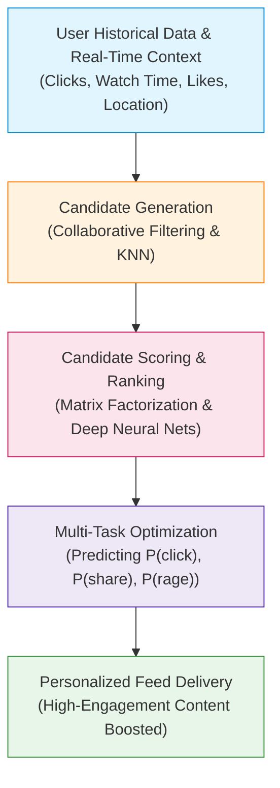
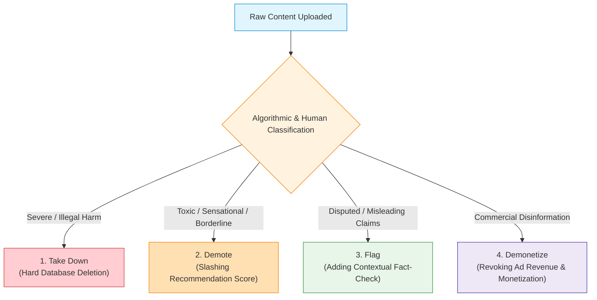

# Topic 1: AI Recommender Systems & The Engagement Maximization Trap

> [!abstract] What You Will Learn in This Topic
> If you missed class, this note teaches you the foundational premise of modern tech ethics:
> 1. **Why Recommender Systems are NOT neutral pipes**, but the primary engine of content moderation.
> 2. **How Recommenders work technically** (Matrix Factorization, Collaborative Filtering, Transformers).
> 3. **The Engagement Maximization Trap**: Why optimizing for user attention mathematically rewards sensationalism, outrage, and lies.
> 4. **The Landmark MIT/Science Study (Vosoughi et al., 2018)**: Why falsehood travels **6.5x faster** than truth.
> 5. **The Four Forms of Moderation** (Take Down, Demote, Flag, Demonetize) and their engineering trade-offs.
> 6. **The Current Ad-Hoc Landscape**: Why reactive policies fail and why a principled ethical approach is required.

---

## 1. The Core Paradigm Shift: From "Pipes" to "Editorial Curators"

![[lec10-000.png|600]]
*Slide 2: Recommender systems power every major platform today.*

### The Old Myth: The "Telephone Conduit"
Historically, Internet platforms (Google, YouTube, Facebook, Twitter, TikTok) claimed legal immunity under frameworks like **Section 230 of the US Communications Decency Act (1996)**. They argued:
> *"We are just passive digital conduits, like the telephone company. If two criminals plot a bank robbery over a phone call, you don't sue AT&T. Similarly, if someone posts hate speech or lies on our platform, we merely deliver the packets. We are neutral."*

### The Modern Reality: Recommenders *Decide What You See*
This "neutral pipe" defense collapsed with the rise of **AI Recommender Systems**:
- Platforms do not simply host content in a passive chronological list.
- **Every second**, algorithms ingest millions of user signals, calculate real-time probability distributions, and **choose** what reaches the feeds of billions of human beings.
- **Amplification is Speech**: When an algorithm decides to show an inflammatory video to 5 million users who never searched for it, the platform is no longer a neutral conduit. It is making an **active editorial curation choice**.

> [!important] Foundational Axiom (Slide 2)
> **Recommender systems decide what you see.** They are the **primary mechanism** by which platforms moderate content today — not an optional add-on feature. 
> Whether content goes viral or disappears into digital oblivion is decided entirely by the recommendation algorithm.

---

## 2. Under the Hood: How AI Recommender Systems Work

![[lec10-002.png|450]]
*Slide 3: Modern recommender systems rely on multiple mature AI/ML techniques.*

In computing exams, you must understand the machine learning techniques mentioned in the slides:

| Technique | How It Works Technically | Where It Is Used |
| :--- | :--- | :--- |
| **Collaborative Filtering** | Finds patterns between users: *"Users who enjoyed video X also watched video Y."* Uses user-item interaction matrices without needing to understand the content itself. | Spotify playlists, early Amazon book recommendations. |
| **$k$-Nearest Neighbors ($k$-NN)** | Clusters users in an $n$-dimensional behavioral feature space. Recommends items popular among your nearest behavioral neighbors. | YouTube "Up Next" suggestions, Netflix genre carousels. |
| **Matrix Factorization (SVD)** | Decomposes a massive, sparse User-Item interaction matrix $R \approx U \times V^T$ into low-dimensional latent feature vectors (representing hidden user tastes and item attributes). | Netflix Prize algorithms, e-commerce cross-selling. |
| **Bayesian Classifiers & Decision Trees** | Evaluates probabilistic feature combinations: $P(\text{Click} \mid \text{User Age, Device, Topic})$. Splits users into demographic/behavioral branches. | Ad targeting, click-bait headline filtering. |
| **Recurrent Neural Networks (RNNs) & Transformers** | Treats a user's session as a sequential sequence of tokens/events. Uses self-attention to predict what video or post you will click next based on your immediate browsing trajectory. | TikTok For You Page (FYP), modern YouTube homepage ranker, Twitter/X timeline. |

---

## 3. The Engagement Maximization Trap

![[lec10-004.png|550]]
*Slide 4: The self-reinforcing vicious cycle of engagement-driven algorithms.*

### The Economic Driver: The Attention Economy
Commercial social media platforms do not charge subscription fees; they monetize via **targeted digital advertising**. 
- **Platform Revenue** $= (\text{Daily Active Users}) \times (\text{Time Spent on App}) \times (\text{Ad Impressions per Hour})$.
- To maximize revenue, engineers configure the loss function of recommender models to maximize **Engagement**:
  $$\text{Objective} = \arg\max_\theta \sum_{i} \left[ w_1 P(\text{Click}_i) + w_2 \mathbb{E}[\text{WatchTime}_i] + w_3 P(\text{Share}_i) + w_4 P(\text{Comment}_i) \right]$$

### The Biological Vulnerability: Amygdala Hijack
Why does optimizing for raw engagement ruin public discourse?
1. The human brain evolved to prioritize **threats, conflict, and social tribal signaling** (evolutionary survival).
2. Content that provokes **high-arousal negative emotions** (moral indignation, fear, disgust, outrage) triggers far more impulsive reactions than calm, nuanced, factual reporting.
3. When users see something that enrages them:
   - They stop scrolling (**watch time increases**).
   - They leave heated replies (**comment count spikes**).
   - They retweet or share to rally their peer group (**virality explodes**).
4. The algorithm observes these engagement metrics, concludes that the content is "high-value," and aggressively injects it into millions of other feeds.

### The Landmark Empirical Proof: Vosoughi et al. (*Science*, 2018)
In 2018, MIT researchers Soroush Vosoughi, Deb Roy, and Sinan Aral published the largest longitudinal investigation of online information diffusion in history (*Science*, Vol. 359, Issue 6380):
- **Data Analyzed**: Every contested rumor cascade verified by 6 independent fact-checking organizations on Twitter from 2006 to 2017 (~126,000 cascades spread by 3 million users over 4.5 million tweets).
- **The Staggering Metric**: **Falsehood diffused significantly farther, faster, deeper, and more broadly than the truth in all categories.**
- **The Political Ratio**: False political news diffused **6.5 times faster** than truthful news!
- **Root Causes**:
  - *Novelty*: Falsehoods were perceived as significantly newer and more surprising than the truth.
  - *Emotion*: True tweets elicited sadness and trust; false tweets elicited intense **fear, disgust, and outrage**.
  - *Humans, Not Bots*: The researchers proved mathematically that automated bots accelerated true and false news equally. **Human users were solely responsible for the 6.5x viral spread of falsehood**, precisely because algorithms prioritized novel, outrage-inducing posts in their feeds.

> [!warning] Exam Concept: Why Engagement Maximization Drives Content Moderation
> When platforms optimize solely for profit and ad revenue, the inevitable mathematical byproduct is the worldwide spread of **lies, slander, hate speech, harmful misinformation, and sensationalism**. 
> This societal damage is what forces societies and tech engineers to implement **content moderation**.

---

## 4. The Forms of Content Moderation

Platforms deploy four distinct technical mechanisms to moderate content. Each comes with significant engineering and ethical trade-offs:

| # | Form | Technical Mechanism | Strategic Advantage | Ethical Limitation / Risk |
| :--- | :--- | :--- | :--- | :--- |
| **1** | **Take Down** | Complete deletion of the object from databases and CDN edge caches; returns HTTP 404/410. | Immediately eliminates direct access; stops further on-platform viewing. | Triggers high political friction; sparks accusations of authoritarian censorship; can cause the **Streisand Effect** (content migrates to unmoderated alternative sites). |
| **2** | **Demote** | Slashing recommendation score ($S_{\text{final}} = S_{\text{model}} \times \alpha$, where $\alpha \approx 0$). Stripping content from "Trending," "Up Next," and search auto-complete. | Destroys viral reach without triggering overt censorship controversies; content remains reachable only via direct URL. | **Completely opaque (Shadowbanning)**. Lacks procedural transparency and due process; the creator and viewers are never formally notified of corporate suppression. |
| **3** | **Flag** | Appending contextual banners, fact-check warnings, or knowledge panel links (e.g., Wikipedia or WHO citations). | Preserves free expression while assisting user critical thinking; satisfies epistemic openness. | **Warning Fatigue**: Users learn to ignore banners. In deeply polarized environments, fact-check flags can backfire, reinforcing conspiracy narratives. |
| **4** | **Demonetize** | Disabling creator ad payouts, tipping, or sponsored placements on specific videos/keywords. | Destroys the commercial financial incentive behind organized fake-news and rage-bait click mills. | Does not deter ideologically or politically motivated actors who do not rely on platform ad payouts. |

> [!tip] Crucial Slide Takeaway (Slide 5)
> **Recommender systems can implement all of these forms of moderation.**
> Demoting a video to the bottom of 10,000 search results is, in practical reality, functionally identical to taking it down, because 99% of user traffic never leaves the top recommendations!

---

## 5. The Current Landscape: Ad-Hoc vs. Principled Governance

![[lec10-000.png|500]]
*Slide 6 focuses on voluntary platform policy, not government regulation.*

### Why Current Policies are "Ad-Hoc"
1. **Reactionary**: Platforms typically act only after a PR disaster, violent protest, or advertiser boycott forces their hand.
2. **Politically Volatile**: Moderation enforcement fluctuates whenever executive ownership changes (e.g., Twitter becoming X) or depending on which political party is in power.
3. **Inconsistent**: Rules are applied unevenly—celebrities and politicians often receive exceptions that ordinary users do not.

### The Objective of Engineering Ethics
Engineers and platform architects cannot rely on chaotic ad-hoc reactions. We need a **principled normative framework** grounded in rigorous moral philosophy to govern content delivery.

In this course, we evaluate content moderation using **two landmark real-world case studies**:
1. [[Topic 2 - Case Study 1 - YouTube, Inciting Violence & Ethical Defenses|Case Study 1: Inciting Violence on YouTube (Innocence of Muslims, 2012)]]
2. [[Topic 3 - Case Study 2 - Social Media & Adolescent Mental Health Crisis|Case Study 2: Social Media's Impact on Young People & Mental Health]]

---

## 6. Self-Study Knowledge Check

> [!question]- Question 1: Why is an AI Recommender System considered an editorial publisher rather than a passive pipe?
> **Answer**: A passive pipe (like a telephone wire or broadband ISP) delivers data from point A to point B chronologically and without content evaluation. In contrast, an AI Recommender System actively computes multi-dimensional user preferences, evaluates content engagement probabilities, and ranks items. By choosing which posts to amplify to millions of users and which to bury at the bottom, the algorithm performs active editorial curation and distribution. Amplification is a form of speech.

> [!question]- Question 2: What is the significance of the 6.5x metric discovered by Vosoughi et al. (Science 2018)?
> **Answer**: Vosoughi and his MIT colleagues discovered that false political news spread **6.5 times faster** than verified factual news across Twitter. This occurred not because of bots, but because human users were drawn to the novelty and high-arousal negative emotions (outrage, disgust, fear) evoked by falsehoods. Because commercial algorithms optimize for engagement (clicks, retweets, comments), they mathematically favor and amplify falsehoods over sober, factual reporting.

> [!question]- Question 3: Contrast "Taking Down" vs. "Demoting" content from an engineering and ethical standpoint.
> **Answer**: 
> - *Taking Down (Hard Removal)* physically deletes the content from databases and CDNs. It is decisive and stops harm immediately, but causes intense censorship backlash and can trigger the Streisand Effect.
> - *Demoting (Downranking)* artificially slashes the algorithmic recommendation score so the content is never recommended on feeds or search auto-complete. It kills virality without loud public outcry, but suffers from severe ethical flaws: it is covert, lacks procedural due process, and leaves unsuspecting users with direct links exposed to harm.

---

*Continue to:* [[Topic 2 - Case Study 1 - YouTube, Inciting Violence & Ethical Defenses]]
