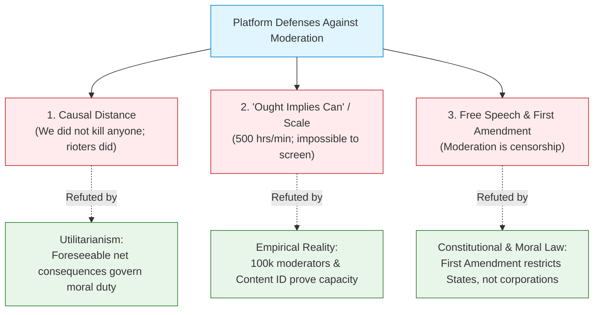
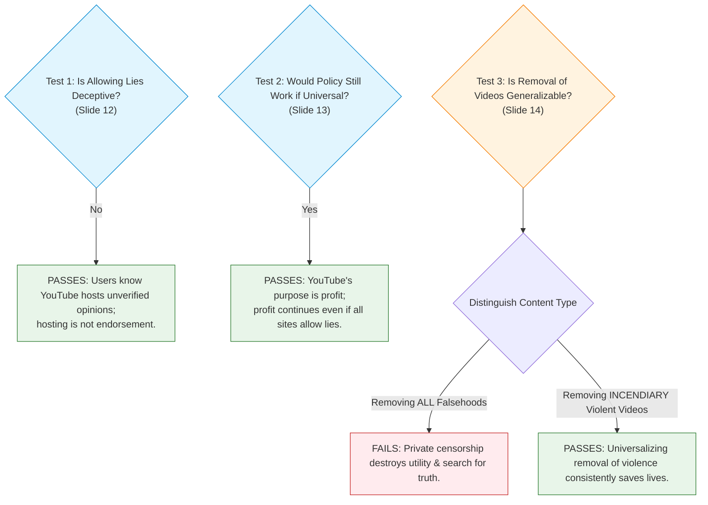

# Topic 2: Case Study 1 — YouTube, Inciting Violence & Ethical Defenses

> [!abstract] What You Will Learn in This Topic
> This note breaks down the foundational geopolitical crisis of online content moderation: the 2012 *Innocence of Muslims* YouTube controversy.
> 
> You will learn how modern computing ethics systematically evaluates platform responsibility through:
> 1. **The Geopolitical Crisis**: What happened, the 50+ deaths, Obama's request, and Google's controversial refusal.
> 2. **Refuting Platform Defense 1 (Causal Distance)**: Why "the rioters killed people, not YouTube" fails under Utilitarianism.
> 3. **Refuting Platform Defense 2 (Scale / "Ought Implies Can")**: Why 500 hours/minute is a factual evasion, exposed by YouTube's multi-million-dollar copyright filter (*Content ID*).
> 4. **Refuting Platform Defense 3 (Free Speech & First Amendment)**: Why constitutional free speech does not apply to private corporations, and the vital difference between *speech* and an *algorithmic megaphone*.
> 5. **Prof. John Hooker's Generalization Test**: Why hosting lies does not deceive, why censoring falsehoods is ungeneralizable, but why removing violence-inciting videos **is** generalizable.
> 6. **The Autonomy Principle & The Bystander Problem**: The most demanding moral standard. Why rioters had implied consent, but the slaughter of **innocent bystanders** creates an undeniable autonomy violation.
> 7. **The Bar for Staying in Business**: The ethical threshold tech executives must satisfy to justify their existence.

---

## 1. The Benchmark Crisis: *Innocence of Muslims* (2012)

![[lec10-006.png|400]]
*Slide 8: The amateur video uploaded to YouTube on July 1, 2012.*

### The Incident
- On **July 1, 2012**, an amateurish, crudely dubbed 14-minute trailer titled *Innocence of Muslims* was uploaded to YouTube by an individual using the alias "Sam Bacile" (later identified as Nakoula Basseley Nakoula).
- **Content**: The video depicted the Prophet Muhammad as a buffoon, violent murderer, religious fraud, and sexual deviant. The dialogue was visibly dubbed over unrelated film clips.
- **The Lethal Fallout**: In September 2012, clips translated into Arabic were broadcast on Egyptian television. Within 48 hours, violent protests erupted across dozens of Muslim-majority nations (Egypt, Libya, Yemen, Tunisia, Sudan, and Pakistan).

![[lec10-012.png|550]]
*Slide 9: Violent anti-American protests and riots erupted across the globe, resulting in approximately 50 deaths.*

### The Catastrophic Consequences
- **Over 50 people were killed** in protests and rioting (more than 20 deaths in Pakistan alone). Hundreds of people—including police officers, local shopkeepers, and bystanders—were grievously injured.
- Protests targeted US diplomatic missions because the filmmaker lived in the United States, sparking a major international geopolitical crisis.
- **The US Government did NOT ban the video**. Under the First Amendment of the US Constitution, the government cannot ban offensive or blasphemous speech.

---

## 2. Google's Response & Stated Policy

![[lec10-010.png|400]]
*Slide 10: President Barack Obama formally asked Google to take down the video, but possessed zero legal authority.*

### The White House Escalation
Recognizing the imminent danger to American diplomats and civilians overseas, **President Barack Obama** and senior US officials contacted Google (which owns YouTube) directly, requesting that they voluntarily remove the video to halt the violence.
- **The Legal Reality**: Obama had **no legal authority** to compel Google to remove the video. Private tech platforms in the United States are protected by the First Amendment from government coercion.

### Google's Decision: The Geoblocking Compromise
Google **refused** to execute a worldwide takedown of the video. Instead, it implemented selective **geoblocking**:
- The video was blocked via IP address in specific countries experiencing deadly unrest (Egypt, Libya, Pakistan, Afghanistan, India, Indonesia).
- The video remained completely accessible in the US, Europe, and the rest of the world.
- *(Aftermath: Dissatisfied with geoblocking, Pakistan banned YouTube nationwide for more than 3 years).*

![[lec10-014.png|500]]
*Slide 11: Rioting escalated outside embassies while Google defended its corporate policy.*

### Google's Stated Rationale (NY Times, Sept 14, 2012)
Google leadership claimed the video complied with their internal "Community Guidelines":
> *"It is against the Islam religion [sic] but not Muslim people."*

In Google's taxonomy:
- **Protected Category**: Hate speech directed against *people* based on their protected characteristics (race, religion, nationality) was prohibited.
- **Unprotected Target**: Criticism, mockery, or slander of a *religion, political ideology, or historical figure* was permitted as free expression.

> [!warning] The Open Question (Slide 11)
> YouTube has a laundry list of "community guidelines," but **what is the underlying ethical principle?**
> Does arbitrary corporate rule-making justify decisions that foreseeably lead to human deaths?

---

## 3. Deconstructing Platform Defenses: The Three Standard Excuses

When tech corporations defend their refusal to moderate dangerous content, they rely on three standard arguments:



---

### Defense 1: The "Causal Distance" Fallacy (Slide 15)

> **Platform Claim**: *"YouTube didn't kill anyone in a riot — the violent rioters pulled the triggers and threw the firebombs. Causal moral responsibility rests entirely on the third-party criminals."*

#### The Utilitarian Refutation:
- In Utilitarianism, moral accountability is determined strictly by the **net foreseeable consequences** of an agent's action or policy.
- **Intervening Human Agents Do Not Break the Causal Chain**: If an actor introduces or amplifies an incendiary catalyst into an already combustible environment, and the resulting catastrophe is **entirely foreseeable**, the actor shares full moral culpability.
- By September 12, Google executives knew with statistical certainty that every hour the video remained accessible, violent mobs were mobilizing.
- In utilitarian cost-benefit terms:
  - Benefit of keeping the video up: A few million ad impressions and entertainment for internet trolls.
  - Harm of keeping the video up: **50 human beings dead**, hundreds maimed, embassies burned, international destabilization.
  - Net utility: **Catastrophically negative**. Causal distance is an evasion.

---

### Defense 2: The Scale Defense — "Ought Implies Can" (Slides 15–17)

> **Platform Claim**: *"Content moderation is too massive. YouTube receives over 500 hours of video every single minute; Facebook has 3 billion daily logins. It is mathematically and operationally impossible to screen everything. In philosophy, 'Ought implies can' (you cannot have a moral duty to do what is impossible)."*

#### The Refutation (Slides 16–17):
1. **This is a Factual Claim, Not an Ethical Principle**: Claiming an engineering task is hard does not absolve an engineer of responsibility for foreseeable harm.
2. **AI-Driven Infrastructure Already Exists**: Platforms already use AI classifiers and recommender filters to direct specific content to users. Recommender technology can easily be tuned to suppress incendiary material.
3. **The Scale of Existing Human Moderation**:
   - YouTube employs over **10,000 human content moderators**.
   - Facebook/Meta employs over **15,000 content moderators** (out of 180,000+ staff).
   - Globally, tech companies employ over **100,000 content moderators**.
4. **The Hypocrisy of Copyright Protection (*Content ID*)**:
   - When Hollywood movie studios and music record labels threatened to sue YouTube for copyright infringement, YouTube did not say "ought implies can."
   - YouTube spent **tens of millions of dollars** developing **Content ID**—an automated acoustic and visual fingerprinting system that scans every single second of uploaded video against a database of commercial intellectual property!
   - **The Moral Contradiction**: If a tech company can build an automated system to protect Hollywood's commercial royalties, claiming it lacks the ability to protect human lives is ethically unconscionable.
5. **The Concession Argument (Slide 17)**:
   - When platforms defend themselves by saying: *"We already do all we can — for example, we removed all COVID-19 vaccine misinformation,"* they destroy their own defense.
   - By demonstrating they can successfully purge COVID misinformation, they concede both that **they have the technical capacity** and that **they have a moral duty to do so**.

---

### Defense 3: The Free Speech Defense (Slide 18)

> **Platform Claim**: *"Content moderation violates the First Amendment rights of users."*

#### The Refutation:
1. **The First Amendment Applies ONLY to Government Action**:
   - The US Constitution prohibits the US *government* (Congress, police, courts) from restricting speech.
   - YouTube is a **private commercial corporation**. A private company has zero legal or constitutional obligation to host anyone's speech. If YouTube decides tomorrow to ban all videos featuring cats, it does not violate the First Amendment.
2. **Speech vs. Megaphone (Freedom of Speech $
eq$ Freedom of Reach)**:
   - Does moderation restrict speech, or is it simply a **refusal to hand someone an algorithmic megaphone**?
   - Denying someone the use of private multi-billion-dollar global distribution servers does not silence them; they remain free to speak in the public square, print flyers, or host their own website.

---

## 4. Prof. John Hooker's Deontological Generalization Analysis

In engineering ethics, **Prof. John Hooker** (Carnegie Mellon University) formalizes Kant's Categorical Imperative into the **Generalization Principle**:

> [!important] The Generalization Principle Formalized
> An action or policy is ethical if and only if **its underlying rationale would still achieve its purpose if everyone in similar circumstances adopted the same policy**.
> If universalizing the policy undermines or contradicts its own purpose, the policy is irrational and unethical.

Let us apply Hooker's Generalization Test to the YouTube dilemma across three key questions:



### 1. Is Allowing Lies Deceptive? (Slide 12)
- Under deontology, deceiving people treats them as a mere means. Does merely hosting false claims deceive people?
- **Hooker's Conclusion**: No. An act is deceptive only if the audience reasonably regards the publication as an endorsement or verification by the platform. Internet users are fully aware that YouTube hosts billions of contradictory, crackpot, and unverified opinions. Because there is no implied warranty of truth, YouTube is not deceiving users simply by hosting unverified material.

### 2. Would the Policy Still Work if Universalized? (Slide 13)

![[lec10-008.png|320]]
*Slide 13: The policy of allowing lies achieves its purpose (profit) even if universalized.*

- If *all* video platforms allowed users to post unverified claims, would YouTube still achieve its underlying purpose?
- **Hooker's Conclusion**: Yes. YouTube's commercial purpose is to **generate advertising profit**, not to function as an authoritative encyclopedia of truth. Since virtually all platforms already permit user falsehoods and continue to earn billions in profits, the policy does not contradict itself when universalized.

### 3. Is Video Removal Generalizable? (Slide 14)
Here, Hooker makes a crucial distinction between two different moderation policies:

| Policy | Generalization Test | Ethical Verdict |
| :--- | :--- | :--- |
| **A. Removing ALL False Videos** | If private platforms universally censored everything deemed "untrue," private corporate committees would become arbiters of human reality. Generalized private censorship destroys public debate and eliminates the error-correction mechanism necessary for scientific and societal progress. | **Ungeneralizable** (Destroys more utility than it creates; collapses epistemic freedom). |
| **B. Removing INCENDIARY Videos (Inciting Violence)** | If platforms universally removed material that directly catalyzes imminent physical riots and bloodshed, the policy consistently achieves its purpose: **it reliably reduces the probability of violent deaths without shutting down legitimate political discourse**. | **GENERALIZABLE** (Ethically required under duty ethics). |

---

## 5. The Autonomy Principle: The Decisive Standard

![[lec10-016.png|600]]
*Slide 22: Summary logic integrating Autonomy, Utilitarianism, and Generalizability.*

According to Prof. John Hooker, the **Autonomy Principle** is the most demanding and non-negotiable rule in engineering ethics:

> [!important] The Autonomy Principle (Slides 19–20)
> Human beings are rational moral agents with their own legitimate action plans. 
> An action is ethical if and only if **it does not interfere with another person's ethical action plans without their informed consent**.
> 
> *Core Rule*: A post **must be removed** when platform managers are **rationally constrained to believe debilitating harm will result** — regardless of who immediately causes the harm.

### The Decisive Dilemma: Implied Consent vs. The Bystander Problem (Slide 19)

When riots broke out over *Innocence of Muslims*, tech executives claimed that individuals who chose to riot were responsible for their own actions. Hooker tests this through **Consent**:

```
                       ┌─────────────────────────────────────────┐
                       │   Who Was Harmed in the Violent Riots?  │
                       └────────────────────┬────────────────────┘
                                            │
                    ┌───────────────────────┴───────────────────────┐
                    ▼                                               ▼
     ┌─────────────────────────────┐                 ┌─────────────────────────────┐
     │      Violent Rioters        │                 │     Innocent Bystanders     │
     ├─────────────────────────────┤                 ├─────────────────────────────┤
     │ • Voluntarily joined mob    │                 │ • Shopkeepers, commuters    │
     │ • Threw petrol bombs        │                 │ • Police officers on duty   │
     │ • Assumed physical risk     │                 │ • Neighborhood children     │
     ├─────────────────────────────┤                 ├─────────────────────────────┤
     │ ✅ IMPLIED CONSENT EXISTS   │                 │ ❌ ZERO CONSENT GIVEN        │
     │ No autonomy violation here  │                 │ SEVERE AUTONOMY VIOLATION!  │
     └─────────────────────────────┘                 └─────────────────────────────┘
```

1. **The Rioters**: By actively choosing to participate in an illegal, violent mob, rioters voluntarily assumed the physical risks of clashes. Their autonomy was not violated by YouTube.
2. **The Innocent Bystanders**: What about the municipal workers, the street vendors, the commuters, and the local families whose homes and shops were burned down?
   - They never watched the YouTube video.
   - They gave **zero consent** to being placed in lethal jeopardy.
3. **The Unavoidable Conclusion**: By continuing to host and recommend the incendiary video after deadly riots had already broken out, YouTube leadership **violated the autonomy of innocent bystanders**. They sacrificed human lives as collateral damage to maintain corporate policy convenience.

### The Bar for Staying in Business (Slide 20)
Hooker establishes a strict ethical threshold for any technological platform:

> [!danger] The Bar for Staying in Business (Slide 20)
> To operate ethically, a platform's moderation must be thorough enough that **it is not irrational for managers to believe an autonomy violation will never happen**.
> If an enterprise cannot operate without inevitably violating the autonomy of innocent persons without their consent, **it has no moral right to remain in business**.

---

## 6. The Synthesis: The Middle-Ground Option (Slides 21–22)

How do engineers balance these competing principles?

```
                        ┌──────────────────────────────────────────────────────────┐
                        │ YouTube must shut down unless it adopts a policy where   │
                        │ managers rationally believe autonomy violations are not  │
                        │ inevitable. (Autonomy Principle)                         │
                        └────────────────────────────┬─────────────────────────────┘
                                                     │
                                                     ▼
                        ┌──────────────────────────────────────────────────────────┐
                        │ Strong utilitarian imperative exists to find such a      │
                        │ policy, given YouTube's immense educational & social     │
                        │ benefits. (Utilitarian Principle)                        │
                        └────────────────────────────┬─────────────────────────────┘
                                                     │
                                                     ▼
                        ┌──────────────────────────────────────────────────────────┐
                        │ Policy of removing claims must be carefully crafted to   │
                        │ avoid violating generalizability (censorship trap).      │
                        │ (Generalization Principle)                               │
                        └────────────────────────────┬─────────────────────────────┘
                                                     │
                                                     ▼
                        ┌──────────────────────────────────────────────────────────┐
                        │ THE COMPROMISE:                                          │
                        │ 1. Takedown immediate incitement to physical violence.   │
                        │ 2. Flag false/misleading claims while citing reliable     │
                        │    credible sources.                                     │
                        └──────────────────────────────────────────────────────────┘
```

- **For Incitement to Physical Violence**: **Take Down immediately** (preserves bystander autonomy).
- **For General Misinformation**: **Flag and Contextualize** with reliable sources (preserves free inquiry, avoids private censorship, satisfies generalizability, and enhances net utility).

---

## 7. Self-Study Exam Scenarios

> [!example]- Exam Scenario 1: The Causal Distance & Bystander Defense [10 Marks]
> **Prompt**: An algorithmic video platform hosts a video falsely alleging that a local hospital is murdering patients to harvest organs. Furious mobs storm the hospital, burning ambulances and killing two intensive-care nurses. The platform argues: *"We only host user uploads; the violent mob committed the murder. We are causally distant."*
> 
> **Model Answer**:
> 1. **Utilitarian Refutation of Causal Distance (5 Marks)**: Utilitarianism evaluates an action based on its net foreseeable consequences. Intervening third-party actors do not relieve the platform of culpability if the platform provided the necessary catalytic medium and the lethal outcome was entirely foreseeable. By algorithmically amplifying unverified, inflammatory allegations of murder, the platform foreseeably caused violent unrest. The catastrophic loss of human life and destruction of medical infrastructure vastly outweighs the negligible ad revenue earned. The platform is morally culpable.
> 2. **Autonomy Principle & Bystander Analysis (5 Marks)**: Under Hooker's Autonomy Principle, an agent may never interfere with another's ethical action plans without informed consent. While rioters voluntarily assumed risk, the murdered nurses were innocent bystanders performing life-saving duties. They gave zero consent to being placed in mortal peril. By failing to remove incendiary content that was rationally constrained to cause debilitating harm, platform executives directly violated the autonomy of the innocent nurses.

> [!example]- Exam Scenario 2: The "Scale Defense" and *Content ID* [8 Marks]
> **Prompt**: A social platform claims it is technologically impossible to police hate speech because users upload 500 hours of content every minute. Deconstruct this defense using empirical industry facts.
> 
> **Model Answer**:
> 1. **Factual Evasion vs. Ethical Duty (2 Marks)**: The "scale defense" confuses operational difficulty with moral absence of duty. Claiming scale is hard is an empirical observation, not an ethical exemption.
> 2. **Existing Human Infrastructure (2 Marks)**: Major platforms already employ massive moderation workforces (~100,000 workers worldwide, with 10,000+ at YouTube and 15,000+ at Meta), demonstrating that targeted human review pipelines exist.
> 3. **The Content ID Contradiction (4 Marks)**: YouTube engineered Content ID, spending tens of millions to automatically scan every second of uploaded video for copyright violations to protect Hollywood film and music royalties. If a platform can successfully build an automated real-time fingerprinting filter to protect corporate profits, claiming it lacks the engineering capacity to detect and suppress imminent threats to human life is a profound moral and technological contradiction.

---

*Continue to:* [[Topic 3 - Case Study 2 - Social Media & Adolescent Mental Health Crisis]]
