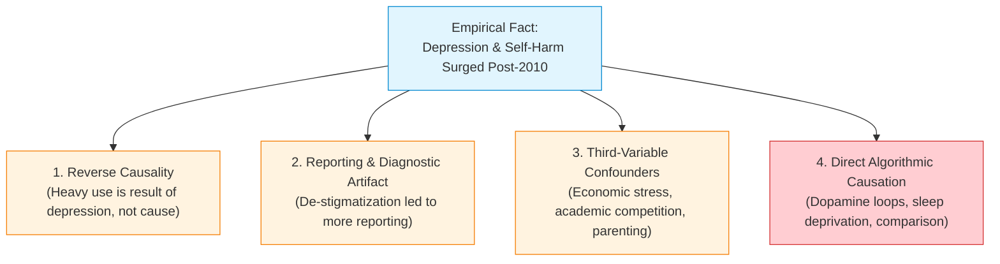

# Topic 3: Case Study 2 — Social Media & Adolescent Mental Health Crisis

> [!abstract] What You Will Learn in This Topic
> If you missed the lectures, this note breaks down the second major case study of Lecture 10:
> 1. **The Empirical Shock**: The post-2010 explosion in adolescent depression, anxiety, and self-harm across the US and UK.
> 2. **The 2012 Inflection Point**: Why the timeline coincides perfectly with smartphone adoption, front-facing cameras, and algorithmic feeds.
> 3. **The Four Critical Empirical Charts**: Detailed reading of UK screen time, US teen depression, US college diagnoses, and 10–14 female self-harm hospitalizations (+188%).
> 4. **Methodological Rigor**: Correlation vs. Causation (reverse causality, reporting bias, confounders).
> 5. **Autonomy & Children as Moral Agents**:
>    - Why denying access to a platform is **never** an autonomy violation.
>    - Why children are **not fully autonomous** (justifying parental paternalism).
>    - Why children **are nonetheless moral agents** who cannot be injured.
>    - **The Informed Consent Asymmetry**: Why utilitarian benefits can **never** justify algorithmic harm to minors.

---

## 1. The Empirical Shock: The Great Mental Health Inflection (2010–2012)

Prior to 2010, adolescent mental health indicators across Western democracies were relatively stable or gradually improving. Commencing abruptly between **2010 and 2012**, epidemiological public health datasets documented a catastrophic, synchronized surge in severe psychological distress.

### Why 2010–2012? The Technological Shift
The 2010–2012 window marked three concurrent disruptions in computational design:
1. **Smartphone Ubiquity**: Teenagers moved from family desktop computers in living rooms to high-speed, portable internet devices in their pockets 24/7.
2. **Algorithmic Transformation**: Platforms phased out chronological timelines in favor of **engagement-maximizing AI recommendation algorithms**.
3. **Hyper-Social Validation Mechanics**: The introduction of the "Like" button, follower counts, push notifications, and AI beauty/retouch filters transformed digital communication into a continuous, quantifiable popularity contest.

---

## 2. Deconstructing the Four Landmark Datasets

The lecture presents four empirical datasets from government and academic epidemiological surveys (such as the US *National Survey on Drug Use and Health* by SAMHSA and the UK *Millennium Cohort Study*).

---

### Chart 1: UK Teens — Depression vs. Weekday Hours on Social Media (Slide 24)

![[teen-depression-uk.png|600]]
*Slide 24: Percentage of UK teenagers depressed as a function of daily weekday social media hours.*

#### Deep Empirical Analysis:
- **The Dose-Response Curve**: For both boys and girls, depression rates increase as daily social media hours rise.
- **The Extreme Gender Disparity**:
  - **Boys**: Starts at $pprox 7\%$ among non-users and climbs moderately to $pprox 15\%$ among heavy users ($5+$ hours/day).
  - **Girls**: Starts at $pprox 11\%$ among non-users. It rises steadily up to 3 hours ($pprox 21\%$), reaches $25\%$ at 4 hours, and then **explodes non-linearly to nearly $38\%$ at 5+ hours**!
- **Key Insight**: Girls spend more time on visual, social-comparison platforms (Instagram, TikTok) that evoke intense relational aggression and body dysmorphia, leading to an exponential surge at high exposure levels.

---

### Chart 2: US Trends — % US Teens with Major Depression (Slide 25)

![[teen-depression-us.png|600]]
*Slide 25: Long-term trends in major depression among US adolescents (2004–2020).*

#### Deep Empirical Analysis:
- **The 2012 Vertical Marker**: Notice the bold black vertical line drawn at **2012**.
- **Before 2012**: Rates of major depression were completely flat for nearly a decade ($pprox 12-13\%$ for girls, $pprox 4-5\%$ for boys).
- **After 2012**: Depression hockey-sticks upward.
  - Girls soar from $12\%$ to nearly **$30\%$ by 2020** (more than doubling).
  - Boys increase from $5\%$ to **$12\%$** (more than doubling).
- The synchronization of this inflection point with the widespread adoption of algorithmic mobile feeds provides strong circumstantial evidence of a technological trigger.

---

### Chart 3: US College Undergraduates Diagnosed with Mental Illness (Slide 26)

![[college-mental-health-us.png|600]]
*Slide 26: Percentage of US undergraduates diagnosed with mental illnesses (2008–2018).*

#### Deep Empirical Analysis:
Across university campuses in the United States, psychological diagnoses escalated dramatically between 2010 and 2018:
- **Anxiety**: **$134\%$ increase** since 2010 (surging from $10\%$ to over $25\%$).
- **Depression**: **$106\%$ increase** since 2010 (jumping from $pprox 9\%$ to $20\%$).
- **Anorexia**: **$100\%$ increase** since 2010.
- **ADHD**: **$72\%$ increase** since 2010.
- **Bipolar Disorder**: **$57\%$ increase** since 2010.
- **Schizophrenia**: **$67\%$ increase** since 2010.
- **Substance Abuse**: **$33\%$ increase** since 2010.

---

### Chart 4: US Nonfatal Self-Harm Hospital Admissions (Ages 10–14) (Slide 27)

![[teen-self-harm-hospitalization.png|600]]
*Slide 27: US adolescents admitted to hospitals for nonfatal self-harm per 100,000 population.*

#### Deep Empirical Analysis:
This chart represents the most objective, undeniable metric in public health: **emergency room hospitalizations for intentional nonfatal self-harm** (cutting, poisonings, intentional overdoses):
- **Why This Matters**: Self-report surveys can be influenced by changes in vocabulary or mood. Emergency room admissions cannot be faked—they represent acute, life-threatening bodily injury.
- **The Staggering Reality**:
  - Among young boys (ages 10–14), hospitalizations rose by $48\%$ (from $pprox 40$ to $pprox 80$ per 100k).
  - Among young girls (ages 10–14), hospitalizations hovered between 110 and 150 per 100k from 2004 to 2009. Commencing sharply at the 2012 vertical line, admissions erupted upward, surpassing 450 per 100,000 by 2020.
  - **A staggering 188% increase in pre-teen girls hospitalizing themselves for self-harm since 2010.**

---

## 3. Methodological Scrutiny: Correlation vs. Causation (Slide 28)

In engineering ethics and scientific inquiry, correlation does not automatically prove causation. Tech platforms and defense researchers offer three alternative hypotheses:



| Alternative Hypothesis | Argument | Counter-Argument / Reality |
| :--- | :--- | :--- |
| **1. Reverse Causality** | Depressed, lonely teenagers retreat into their bedrooms and use social media as a coping mechanism. Social media does not create the depression; depression drives social media use. | Longitudinal experiments (e.g., Hunt et al., 2018) where random groups limited social media to 30 mins/day demonstrated significant, immediate reductions in loneliness and depression, proving a causal role. |
| **2. Reporting Bias / De-Stigmatization** | Society became more open to discussing mental health. Adolescents are simply more willing to seek help and receive clinical labels today. | While surveys can suffer from reporting bias, **hospital emergency room admissions (Chart 4)** and **completed suicide statistics** cannot be explained by "cultural de-stigmatization." |
| **3. Confounding External Pressures** | The rise coincides with lingering fallout from the 2008 Great Recession, increasing university tuition costs, climate anxiety, and hyper-competitive academic pressure. | These economic pressures affect older populations similarly, yet the sharpest, most catastrophic mental health collapse occurred specifically among **10- to 14-year-old middle school girls**, who are largely insulated from macroeconomics. |

### The Ethical Question That Remains (Slide 28)
Slide 28 concludes with a decisive normative challenge:
> *"We can't resolve all the factual issues. But we can ask: **assuming social media overuse causes depression, what should companies do about it?**"*

---

## 4. Philosophical Analysis: Autonomy & Children as Moral Agents

To solve this dilemma, Prof. John Hooker applies the **Autonomy Principle** to minors, establishing four foundational ethical propositions:

```
                  ┌──────────────────────────────────────────────┐
                  │    The Autonomy Framework for Children       │
                  └──────────────────────┬───────────────────────┘
                                         │
        ┌────────────────────────────────┼────────────────────────────────┐
        ▼                                ▼                                ▼
┌───────────────────────┐ ┌─────────────────────────────┐ ┌─────────────────────────────┐
│ 1. Denying Access     │ │ 2. Incomplete Autonomy      │ │ 3. Moral Agency & Patients  │
├───────────────────────┤ ├─────────────────────────────┤ ├─────────────────────────────┤
│ Refusing service is   │ │ Children cannot form        │ │ Children have developing    │
│ NOT an autonomy       │ │ coherent rational life      │ │ agency. Injuring them is a  │
│ violation. Users have │ │ plans. Parental paternalism │ │ direct moral and autonomy   │
│ no right to a server. │ │ is fully ethical.           │ │ violation.                  │
└───────────────────────┘ └─────────────────────────────┘ └─────────────────────────────┘
                                         │
                                         ▼
                  ┌──────────────────────────────────────────────┐
                  │ 4. THE INFORMED CONSENT ASYMMETRY            │
                  ├──────────────────────────────────────────────┤
                  │ Minors CANNOT give valid informed consent to │
                  │ addictive algorithmic feedback loops.        │
                  │ ➔ Utilitarian benefits can NEVER outweigh    │
                  │   autonomy violations against children!      │
                  └──────────────────────────────────────────────┘
```

---

### Proposition 1: Denying Access is NO Violation of Autonomy (Slide 29)
- Tech platforms often fear that restricting youth access will be viewed as paternalistic coercion.
- **Hooker's Principle**: Denying access to YouTube, TikTok, or Instagram (whether to a child or an adult) is **no violation of autonomy**.
- **The Rationale**: To violate someone's autonomy, you must interfere with an action plan that they have a legitimate right to execute. A user cannot have an autonomous action plan of *being granted access to someone else's private computing servers*. Only the platform owner has the moral authority to decide who connects.

---

### Proposition 2: Children Are Not Fully Autonomous (Slide 29)
- In Kantian and Hooker ethics, **rational autonomy requires the cognitive capacity to understand long-term consequences and formulate a coherent rationale for action**.
- Adolescents possess an immature prefrontal cortex. Their executive functioning, risk assessment, and impulse control are biologically developing.
- **The Ethical Result**: Because children cannot form fully coherent rational life plans, **parents and guardians can legitimately forbid or restrict digital platform use without violating their autonomy** (justified paternalism).

---

### Proposition 3: Children Are Nonetheless Moral Agents (Slide 30)
- While children lack mature rational calculation, **they are nonetheless agents and moral persons**.
- They possess developing autonomy and absolute moral patienthood: they can feel intense emotional suffering, pain, and despair.
- **The Ethical Rule**: Injuring a child—whether physically through violence or psychologically through addictive, toxic algorithmic feeds—is a direct violation of the Autonomy Principle as well as the Utilitarian Principle.

---

### Proposition 4: The Decisive Informed Consent Asymmetry (Slide 30)

> [!danger] The Paramount Rule of Child Protection (Slide 30)
> **Utilitarian benefits of allowing children online can NEVER outweigh autonomy violations.**
> Children are far less capable than adults of giving **informed consent** to the risk of injury. Therefore, the probability of an autonomy violation is drastically greater.

#### Why Adults vs. Children Differ Radically in Digital Ethics:
1. **Adults & Implied Consent**:
   - An adult downloading an app can theoretically read terms of service, recognize the addictive potential, and choose to accept the risk of doomscrolling in exchange for entertainment. 
   - While imperfect, an adult can grant a degree of **implied consent**.
2. **Children & The Trap of Variable-Ratio Rewards**:
   - Algorithmic feeds exploit **intermittent, variable-ratio reinforcement schedules** (the identical psychological mechanism behind Las Vegas slot machines).
   - An 11-year-old child's developing brain is biochemically incapable of evaluating the neurological impact of algorithmic dopamine hijacking, social isolation, and algorithmic body shaming.
   - **Children cannot give valid informed consent.**
3. **The Lexical Priority**:
   - Under John Hooker's framework, **Autonomy possesses lexical priority over Utilitarianism**. 
   - A platform cannot say: *"Our algorithm provides billions of hours of joy and networking to teens (utility), which justifies a few thousand teens being hospitalized for self-harm (disutility)."*
   - Because children cannot consent to that risk, inflicting psychological injury upon them violates their inviolable autonomy. No amount of aggregate utility can ever compensate for this violation.

---

## 5. Self-Study Exam Scenarios

> [!example]- Exam Scenario 1: The Child Consent Asymmetry & Addictive UX [10 Marks]
> **Prompt**: An AI engineering startup designs an infinite-scroll mobile game aimed at 10-to-14-year-olds. The algorithm analyzes pupil dilation to maximize session duration, causing documented sleep deprivation, severe anxiety, and failing school performance in thousands of young users. The startup's legal defense argues:
> 1. *"The children downloaded the app voluntarily."*
> 2. *"The total happiness generated across 5 million users heavily outweighs the isolated mental distress of a few vulnerable teens."*
> 
> **Model Answer**:
> 1. **Deconstructing Voluntary Download via Informed Consent (5 Marks)**: Under Hooker's Autonomy Principle, action without informed consent violates moral agency. Children are not fully autonomous agents; their cognitive and neurological capacities to comprehend predatory psychological techniques (such as pupil-tracking variable reinforcement) are undeveloped. A child cannot grant valid informed consent to neurological manipulation that impairs their health. The startup's claim of "voluntary download" is invalid.
> 2. **Refuting the Utilitarian Trade-Off via Lexical Priority (5 Marks)**: In engineering ethics, utilitarian benefits can never override autonomy violations when dealing with minors. While adults may assume known risks via implied consent, non-consenting minors cannot be sacrificed for collective utility. Inflicting debilitating psychological harm on children treats them merely as disposable instruments for corporate engagement metrics. The platform violates the Autonomy Principle and is ethically prohibited from operating this algorithmic architecture.

> [!example]- Exam Scenario 2: Paternalism and Denying Access [8 Marks]
> **Prompt**: A social media platform plans to enforce strict age verification and completely block access to users under the age of 16. Activist groups claim: *"Denying teens access to our platform violates their fundamental human autonomy to communicate and socialize."* Evaluate this claim using Prof. John Hooker's ethical definitions.
> 
> **Model Answer**:
> 1. **No Inherent Right to Platform Access (4 Marks)**: According to Prof. John Hooker, an individual's autonomy is violated only if someone forcibly interferes with an action plan that the person has a legitimate right to execute. Users possess no inherent moral or constitutional right to be granted access to a private corporation's proprietary servers and software. Denying access is a refusal to contract, not an infringement of autonomous freedom.
> 2. **Legitimate Paternalism Regarding Minors (4 Marks)**: Children and young teens are not fully autonomous because they cannot consistently formulate coherent, rational long-term rationales for their behavior. Forbidding access to predatory algorithmic environments is an act of legitimate protective paternalism, analogous to age limits on driving or gambling. It protects their developing agency rather than violating it.

---

*Continue to:* [[Topic 4 - Principled Framework & Grand Ethical Synthesis]]
