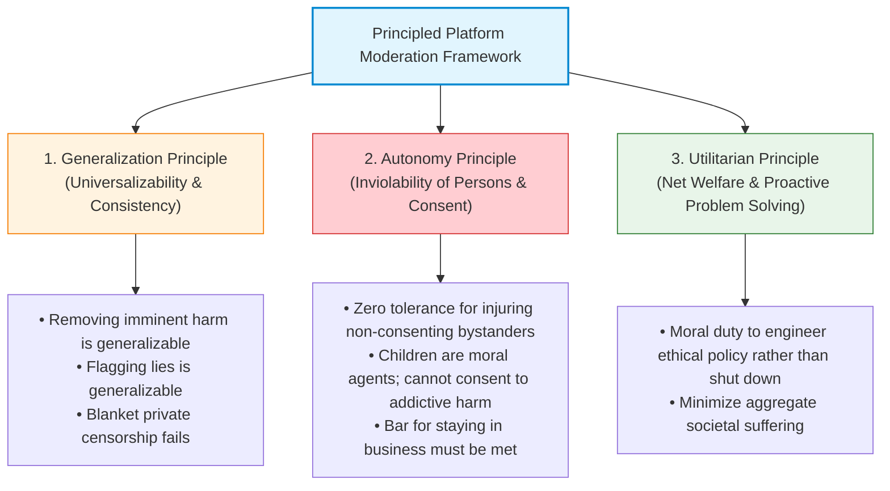
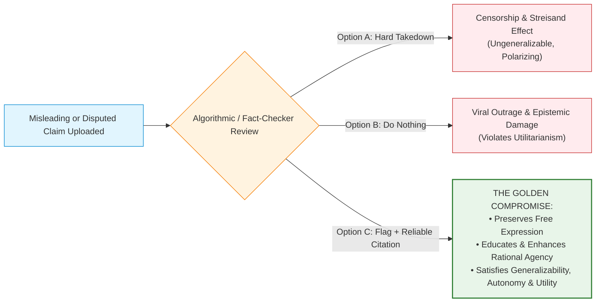

# Topic 4: Principled Framework & Grand Ethical Synthesis

> [!abstract] What You Will Learn in This Topic
> This concluding module unifies the entire philosophical architecture of Lecture 10 into an **actionable, principled engineering framework**:
> 1. **The Grand Tripartite Synthesis**: How the Generalization Principle, Autonomy Principle, and Utilitarian Principle intersect in digital platform design.
> 2. **The "Flagging Compromise"**: Why appending reliable sources to disputed claims satisfies all three philosophical tests simultaneously.
> 3. **The Utilitarian Duty to Innovate**: Why platforms have an ethical obligation to engineer solutions rather than simply shutting down.
> 4. **Concrete Architectural Rules for Engineers**: Concrete, practical design patterns for building ethical recommender systems.

---

## 1. The Tripartite Synthesis of Ethical Principles (Slides 31–32)

In the final summary slides, the lecture distills the ethical duties of tech platforms across the three foundational lenses of moral philosophy:

---

### 1. The Generalization Principle (Slide 31)
Under Kantian and Hooker deontology, an action or policy is ethical only if its underlying rationale can be universalized without self-contradiction:
1. **Removing Clearly Harmful Content is Generalizable**:
   - Universalizing the removal of content that incites immediate, lethal violence (e.g., lynching incitement, riot catalysts) consistently reduces bloodshed and preserves the physical stability required for civil society to exist.
2. **Failure to Remove Harmful Content is Also Generalizable (Technically)**:
   - A society *can* exist where platforms never moderate content (such as anonymous imageboards). While ugly and chaotic, it does not destroy the physical ability to run a website; therefore, pure inaction does not fail the generalization test on its own (though it catastrophically fails Utilitarianism and Autonomy).
3. **Blanket Private Censorship of Falsehoods May NOT Be Generalizable**:
   - If private corporations universally delete everything they deem "untrue," a tiny corporate cartel becomes the ultimate gatekeeper of human knowledge. Because human institutions are fallible and political climates change, universal private censorship eliminates the critical debate necessary for scientific discovery, democratic self-governance, and truth seeking.
4. **Flagging Lies is Generalizable**:
   - Appending factual context and citations while leaving content visible does not silence speakers or establish an authoritarian thought police. It universalizes transparent counter-speech, preserving the search for truth while neutralizing deception.

---

### 2. The Autonomy Principle (Slide 31)
The Autonomy Principle serves as the **hard ethical constraint** (lexically prior to utility):

> [!important] The Operational Axiom of Platform Autonomy
> Online platforms can **ethically operate only if managers can rationally believe that their moderated systems will NEVER violate autonomy without informed consent**.
> 
> *Key Applications*:
> 1. **Bystanders Must Be Protected**: Content that foreseeably mobilizes mobs or provokes lethal violence against non-consenting civilians must be taken down immediately.
> 2. **Minors Must Be Protected**: Because children are moral agents who lack the cognitive maturity to give valid informed consent to neuro-chemical addiction loops and relational humiliation, platforms have an affirmative duty to design environments that shield them from developmental and psychological harm.

---

### 3. The Utilitarian Principle (Slide 32)

![[lec10-018.png|600]]
*Slide 32: The utilitarian imperative to engineer ethical moderation rather than shutting down.*

#### The Fatalism Fallacy: "We Should Just Shut Down"
Some critics argue: *"If platforms inevitably risk spreading lies or harming youth, the only ethical choice is to shut YouTube and Instagram down completely."*
- **The Utilitarian Rebuttal**: YouTube, social media, and search engines provide **immense global benefits**:
  - Open educational resources (billions of free tutorials, academic lectures, and skill-building videos).
  - Global communication and connection across borders.
  - Small business marketing and economic empowerment.
- **The Affirmative Engineering Duty**: Because the gross positive utility of digital platforms is colossal, **a site should make a concerted effort to find an ethical content moderation policy, rather than shut down**.
- Engineers are ethically obligated to use their talent and computational tools to **mitigate harms while preserving the broad societal utility** of the platform.

---

## 2. The Golden Engineering Compromise: Flagging & Credible Context

Slide 32 formalizes the optimal middle-ground policy for managing online misinformation:
> *"It should at least **flag false and misleading content**, while citing **reliable sources**."*

### Why the Flagging Compromise is Mathematically and Philosophically Superior:

1. **Satisfies Generalizability**: Universalizing this policy across every platform in the world empowers users with verified data without establishing a centralized corporate ministry of truth.
2. **Respects Autonomy**: Instead of patronizing users by hiding information, it treats them as rational agents by presenting evidence, allowing them to formulate their own coherent, truth-based action plans.
3. **Maximizes Net Utility**: It stops the viral spread of dangerous delusions (e.g., bleach cures for COVID-19) while preventing the severe political and social backlash that follows heavy-handed corporate censorship.

---

## 3. Concrete Engineering Architecture: Building an Ethical Platform

For computer science engineers entering industry, the ethical lessons of Lecture 10 translate into specific, actionable system architecture requirements:

| Architecture Layer | Unethical / Trap Design (Engagement Maximization) | Ethical Principled Design (Human-Centric) |
| :--- | :--- | :--- |
| **Objective Function** | Optimize purely for time spent, clicks, shares, and comment controversy. | Multi-objective optimization: penalize engagement velocity spikes on unverified claims; reward user satisfaction surveys and deliberate viewing. |
| **Youth Architecture** | Infinite scroll, auto-play next, variable-ratio push notifications at 2:00 AM. | **Default-Safe for Minors**: hard daily screen-time limits, disabled algorithmic ranking (chronological feed only), no beauty-distortion filters, overnight notification shut-off. |
| **Physical Violence Response** | Rely on slow user reporting; leave videos up while reviewing; claim causal distance. | **Automated Anti-Virality Circuit Breakers**: instant algorithmic demotion for videos flagged for violent incitement in conflict regions; priority human review pipeline. |
| **Transparency & Auditability** | Secret algorithmic ranking (black-box shadowbanning). | Transparent ranking parameters; clear notifications to creators with appeal mechanisms and third-party independent algorithmic audits. |

---

## 4. The Grand Decision Matrix for Platform Governance

When faced with any content dilemma on an engineering ethics exam, use this master decision matrix:

| Content Category | Example Scenario | Generalization Test | Autonomy Test | Utilitarian Calculation | Mandated Engineering Action |
| :--- | :--- | :--- | :--- | :--- | :--- |
| **Imminent Physical Violence** | Video inciting an armed mob to burn an embassy or lynch minority civilians. | **Generalizable to remove**: universal suppression saves human life without stopping democratic critique. | **Violates autonomy of innocent bystanders** who gave zero consent to mortal danger. | Catastrophic loss of life completely dwarfs any minor corporate ad revenue. | **TAKE DOWN IMMEDIATELY** (Hard database deletion & IP geoblock). |
| **Direct Harm to Children** | Algorithmic feed pushing severe self-harm tips or eating disorder thinspiration to young teens. | **Generalizable to suppress**: universalizing child exploitation destroys societal reproduction. | **Violates child agency**: minors cannot give valid informed consent to addictive predatory feeds. | Irreversible psychological trauma and hospitalizations outweigh ad profits. | **TAKE DOWN + RE-ENGINEER SYSTEM** (Age gating, disable algorithmic loops). |
| **Public Health Misinformation** | Claiming vaccines contain microchips or bleach cures cancer. | Blanket deletion risks censorship traps; flagging is generalizable. | Impairs rational action plans; requires truth to make informed medical choices. | Massive disutility if believers abandon medical care. | **FLAG + DEMOTE**: Append authoritative health citations (WHO/CDC); slash algorithmic virality. |
| **Offensive Opinion / Political Blasphemy** | Satirical or offensive critiques of a religion, ideology, or political leader. | **Ungeneralizable to ban**: universal bans stifle open society and scientific progress. | Does not violate autonomy (hearing offensive ideas does not prevent one's action plans). | Net utility of preserving free expression outweighs transient offense. | **LEAVE UP (Demote if toxic)**: Protect freedom of speech; do not grant algorithmic virality. |

---

## 5. Self-Study Exam Scenarios

> [!example]- Exam Scenario 1: The "Shut Down vs. Fix" Dilemma [8 Marks]
> **Prompt**: Following revelations that an algorithmic news app amplified political propaganda and exacerbated social hostility, the CEO proposes permanently shutting the company down: *"If our technology causes polarization, ethics dictates that we cease existing."* Critique this position using the Utilitarian principle articulated in Lecture 10.
> 
> **Model Answer**:
> 1. **The Affirmative Duty to Moderate (4 Marks)**: In Slide 32, the Utilitarian Principle establishes that an enterprise should make a concerted, good-faith effort to discover and implement an ethical moderation policy rather than prematurely shutting down. Digital information platforms provide immense social utility: access to diverse viewpoints, rapid news dissemination, and economic connectivity.
> 2. **Engineering Reform over Fatalism (4 Marks)**: Permanent shutdown destroys all the positive utility created by the platform. The ethical obligation of engineering management is to redirect existing machine learning recommender architectures toward pro-social objectives: incorporating factual verification, demoting rage-bait algorithms, and flagging misleading claims with credible citations. Only if every possible moderation architecture fails to prevent severe autonomy violations is total shutdown justified.

> [!example]- Exam Scenario 2: The Philosophical Defense of Flagging [8 Marks]
> **Prompt**: Why does appending fact-checking banners to disputed claims represent an ethically superior engineering solution compared to either doing nothing or executing hard database deletions?
> 
> **Model Answer**:
> 1. **Superior to Doing Nothing (3 Marks)**: Inaction permits the 6.5x faster algorithmic diffusion of falsehoods (Vosoughi et al.), hijacking human emotional vulnerabilities, degrading public discourse, and violating user autonomy by inducing beliefs that distort rational action plans.
> 2. **Superior to Hard Deletion (3 Marks)**: Total private censorship fails the Generalization Test. If platforms universally delete all controversial assertions, private corporate algorithms become authoritarian arbiters of truth, suppressing scientific dissent and provoking intense political backlash (the Streisand Effect).
> 3. **The Ethical Balance (2 Marks)**: Flagging with authoritative citations preserves user agency by presenting verifiable evidence, maintains free inquiry, satisfies the Generalization Principle, and maximizes epistemic net utility.

---

*Return to Master Hub:* [[03 - Lecture 10 - AI Recommender Systems & Content Moderation Ethics]]
