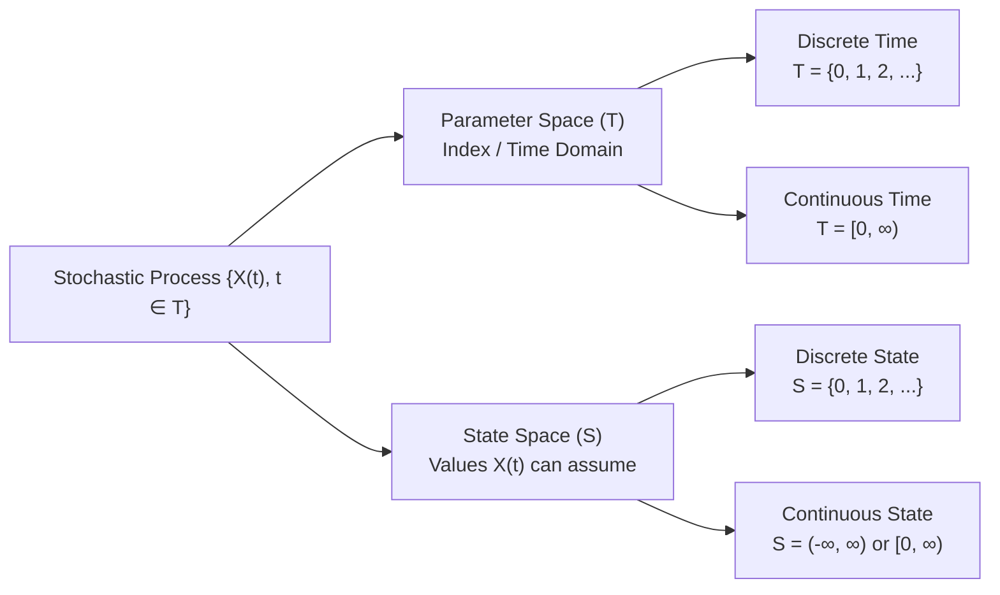

# 8. Stochastic Processes & Classifications

> [!abstract] Overview & Key Concepts
> This note covers the foundational theory of **Stochastic Processes** from your lecture materials (`Stochastic processes.pdf`):
> - Precise mathematical definition of a stochastic process $\{X(t), t \in T\}$
> - The two dimensions: **Parameter Space / Index Set ($T$)** and **State Space ($S$)**
> - The **4 Fundamental Classifications** with practical, real-world engineering and business examples
> - Connection between discrete stochastic processes, Bernoulli trials, and transition steps.
> *(Note: Moment Generating Functions are excluded).*

---

## 8.1 Definition of a Stochastic Process

### Mathematical Definition
A **Stochastic Process** (or random process) is a mathematical model for a system that evolves probabilistically over time or space.

Formally, a stochastic process is a **collection or family of random variables**:

$$\{X(t), \, t \in T\}$$

defined on a common probability space $(\Omega, \mathcal{F}, P)$, where:
- $t$ is an index parameter, typically representing **time** (though it can represent space, position, or frequency).
- $T$ is called the **Parameter Space** or **Index Set** of the process.
- For each fixed $t \in T$, $X(t)$ is a specific random variable representing the **state of the process at time $t$**.

> [!info] Intuitive Physical Meaning
> In deterministic systems, future states are uniquely fixed by exact physical laws (e.g., $v = u + at$). In contrast, a **stochastic process** describes real-world phenomena influenced by random fluctuations where future states can only be described by probability distributions (e.g., stock market prices, traffic packet arrivals, queue lengths).

---

## 8.2 The Two Defining Spaces

Every stochastic process is completely characterized by two distinct spaces:

### 1. Parameter Space (Index Set $T$)
The set of all possible values that the index parameter $t$ can assume:
- **Discrete-Parameter (Discrete-Time) Process:** If $T$ is a countable set, such as the non-negative integers $T = \{0, 1, 2, \dots\}$. 
  - *Notation:* We write $X_n$ or $\{X_n, n = 0, 1, 2, \dots\}$.
- **Continuous-Parameter (Continuous-Time) Process:** If $T$ is an interval of real numbers, such as $T = [0, \infty)$ or $T = (-\infty, \infty)$.
  - *Notation:* We write $X(t)$ or $\{X(t), t \ge 0\}$.

### 2. State Space (Space of Values $S$)
The **State Space** $S$ of a stochastic process is defined as the **set of all possible values that the random variables $X(t)$ can assume**:
- **Discrete State Space:** The states can be counted ($S \subseteq \{0, 1, 2, \dots\}$). The values are often referred to as "states", and changes between states are called "transitions".
- **Continuous State Space:** The states form a continuum ($S \subseteq \mathbb{R}$, such as an interval $[a, b]$ or $(-\infty, \infty)$).

---

## 8.3 The 4 Fundamental Classifications

Depending on whether the **Parameter Space ($T$)** and the **State Space ($S$)** are discrete or continuous, all stochastic processes fall into one of **4 distinct categories**:

$$\begin{array}{|c|c|c|}
\hline
\textbf{State Space } (S) \ \backslash \ \textbf{Parameter Space } (T) & \textbf{Discrete Time } (T \text{ discrete}) & \textbf{Continuous Time } (T \text{ continuous}) \\ \hline
\textbf{Discrete State } (S \text{ discrete}) & \textbf{Type 1: Discrete Parameter,} & \textbf{Type 3: Continuous Parameter,} \\
& \textbf{Discrete State} & \textbf{Discrete State} \\ \hline
\textbf{Continuous State } (S \text{ continuous}) & \textbf{Type 2: Discrete Parameter,} & \textbf{Type 4: Continuous Parameter,} \\
& \textbf{Continuous State} & \textbf{Continuous State} \\ \hline
\end{array}$$

---

### Type 1: Discrete Parameter, Discrete State Process
*Both time and states are discrete.*

- **Definition:** $T = \{0, 1, 2, \dots\}$ and $S = \{0, 1, 2, \dots, N\}$.
- **Real-World Examples:**
  1. **Supermarket Queue at Closing Hours:** Let $X_n$ be the number of customers waiting in line at the end of the $n$-th hour of operation ($n = 1, 2, \dots$). Time is sampled hourly (discrete), and the number of customers is an integer count (discrete).
  2. **Coin Toss Random Walk:** Let $X_n$ denote a player's net fortune after the $n$-th coin flip ($n = 1, 2, \dots$), where winning adds $+\$1$ and losing subtracts $-\$1$.
  3. **Daily Inventory Count:** The number of unsold laptop units in stock at the close of day $n$.

---

### Type 2: Discrete Parameter, Continuous State Process
*Time is observed at discrete steps, but the measured variable is continuous.*

- **Definition:** $T = \{0, 1, 2, \dots\}$ and $S \subseteq \mathbb{R}$.
- **Real-World Examples:**
  1. **Daily Rainfall Amount:** Let $X_n$ be the total rainfall recorded in millimeters on day $n$ ($n = 1, 2, \dots$). The days are discrete steps, but the volume of rainfall can be any non-negative real number ($X_n \in [0, \infty)$).
  2. **Closing Stock Index:** The value of the Dhaka Stock Exchange (DSE) index recorded at the close of trading on day $n$.
  3. **Maximum Daily Temperature:** The highest recorded temperature in Celsius on day $n$.

---

### Type 3: Continuous Parameter, Discrete State Process
*Time flows continuously, but the system changes states by discrete jumps.*

- **Definition:** $T = [0, \infty)$ and $S = \{0, 1, 2, \dots\}$.
- **Real-World Examples:**
  1. **Telephone Switchboard Arrivals (Poisson Process):** Let $X(t)$ be the total cumulative number of incoming calls received at an exchange from time $0$ up to continuous time $t$. Time $t$ is continuous, but the call count increases only in discrete integer steps ($0, 1, 2, 3, \dots$).
  2. **Radioactive Particle Emissions:** Let $X(t)$ be the number of alpha particles registered by a Geiger counter up to time $t$.
  3. **Machine Breakdown Count:** Let $X(t)$ denote the total number of machines that have failed in a factory during time interval $[0, t]$.

---

### Type 4: Continuous Parameter, Continuous State Process
*Both time and the state variable vary continuously.*

- **Definition:** $T = [0, \infty)$ and $S = \mathbb{R}$ or $[0, \infty)$.
- **Real-World Examples:**
  1. **Continuous Temperature Monitoring:** Let $X(t)$ be the continuous temperature of a chemical reactor at exact time $t \ge 0$.
  2. **Brownian Motion / Physical Diffusion:** The continuous position $X(t)$ of a microscopic particle suspended in fluid undergoing thermal agitation at time $t$.
  3. **Continuous Electrical Voltage / Thermal Noise:** The continuous fluctuating voltage $V(t)$ across an electrical resistor due to thermal noise over continuous time $t$.

---

## 8.4 Connection to Bernoulli & Counting Processes

### 1. The Bernoulli Process
A sequence of independent Bernoulli trials $Y_1, Y_2, Y_3, \dots$ where each $Y_i \in \{0, 1\}$ constitutes the simplest discrete-time, discrete-state stochastic process.
- If $X_n = \sum_{i=1}^{n} Y_i$ represents the cumulative number of successes up to trial $n$, then $\{X_n, n = 1, 2, \dots\}$ forms a **Binomial counting process** (Type 1).

### 2. The Poisson Process as a Continuous Limit
When independent events occur randomly at a constant average rate $\lambda$ per unit time:
- The total occurrences $N(t)$ in interval $[0, t]$ follow a **Poisson Process** (Type 3: continuous parameter $t$, discrete states $0, 1, 2, \dots$).
- The time between successive arrivals follows an **Exponential Distribution** (continuous waiting time).

---

## 8.5 Exam Summary Table

| Process Type | Parameter Space ($T$) | State Space ($S$) | Representative Example |
| :--- | :--- | :--- | :--- |
| **Type 1** | Discrete ($t \in \mathbb{N}$) | Discrete ($X_n \in \mathbb{Z}$) | Queue length at hourly inspection; coin toss fortune |
| **Type 2** | Discrete ($t \in \mathbb{N}$) | Continuous ($X_n \in \mathbb{R}$) | Total daily rainfall; daily closing stock price |
| **Type 3** | Continuous ($t \in \mathbb{R}^+$) | Discrete ($X(t) \in \mathbb{Z}$) | Cumulative telephone calls $N(t)$ by time $t$ (Poisson) |
| **Type 4** | Continuous ($t \in \mathbb{R}^+$) | Continuous ($X(t) \in \mathbb{R}$) | Continuous reactor temperature; Brownian motion |
