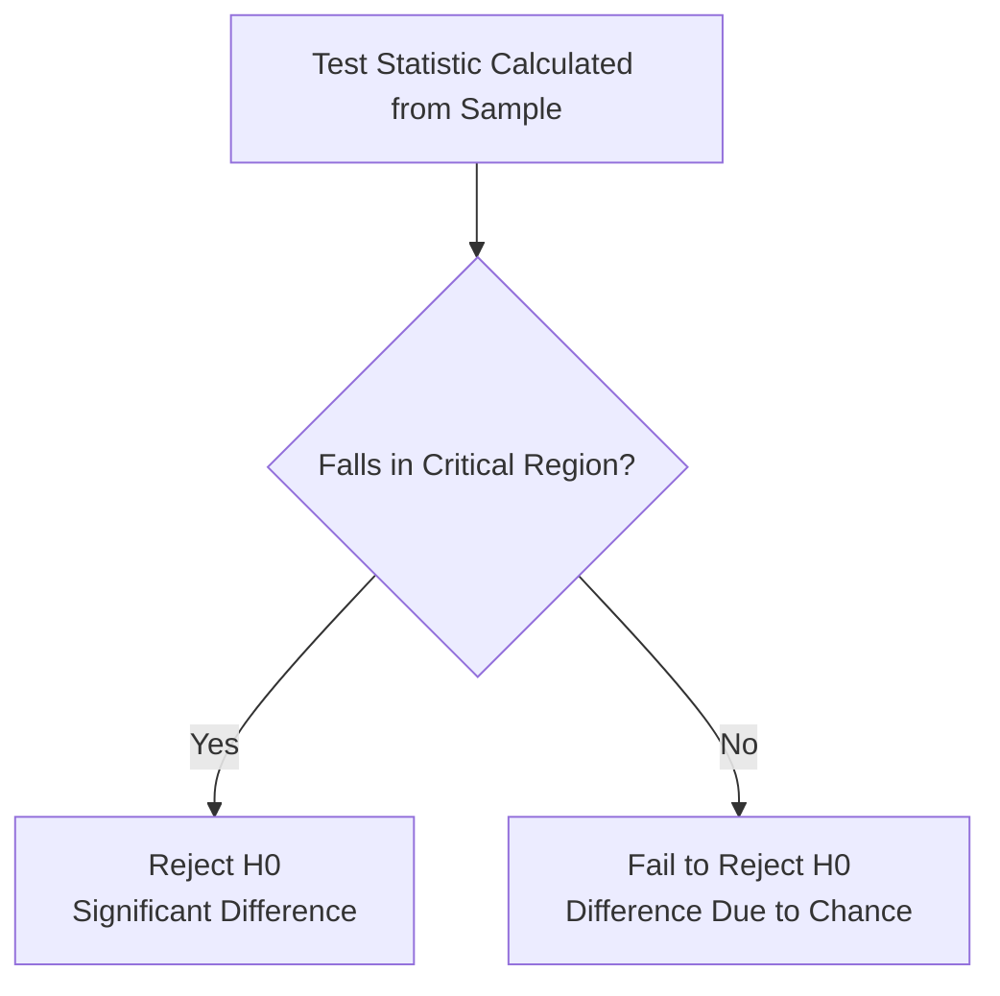
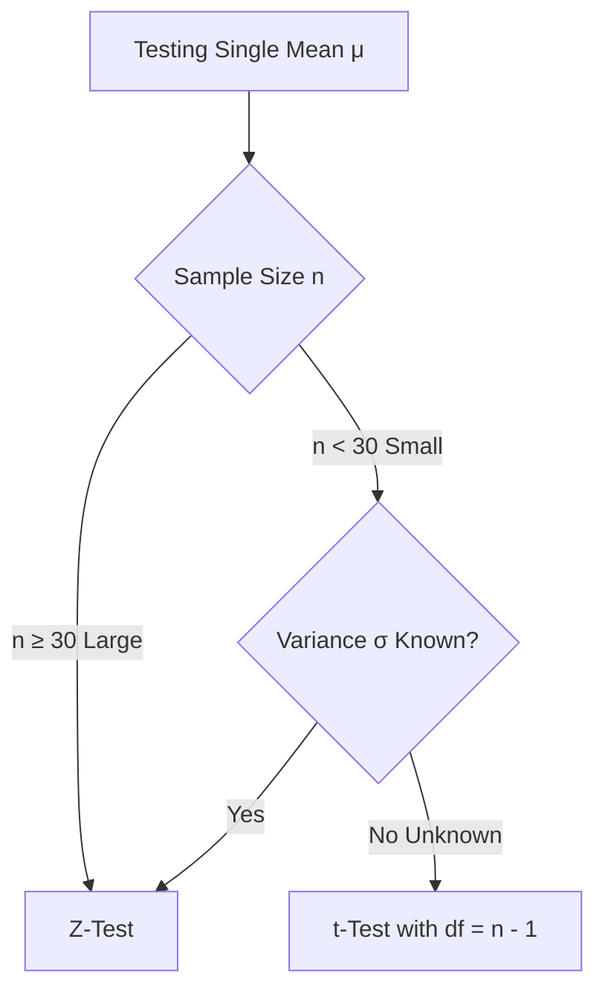

# 9. Hypothesis Testing - Class Notes & Book Guide

> [!abstract] Syllabus Scope & Alignment
> This guide is strictly bounded to **Handwritten Class Notes (`Math2_260821_004208.pdf`)** and **Textbook Chapter 16 (Pages 1–42)**.
> - **In Syllabus:** Core concepts ($H_0, H_1$, Type I & II errors, $\alpha$, $\beta$, power, critical regions, $p$-value), Decision Rules, 6-Step Procedure, Single Mean ($Z$-test & $t$-test), Difference of Two Means ($Z$-test & independent $t$-test), and Paired Samples $t$-test.
> - **Out of Syllabus:** Book pages 43–75 (Proportions, Correlation tests, Regression slope tests, Chi-Square contingency tables/goodness of fit, ANOVA) are **strictly excluded**.

---

## 9.1 Fundamental Concepts & Intuition

### The Core Question
In empirical research and industrial quality control, we cannot measure the entire **population** (too large or destructive). Instead, we take a **sample**.
- Sample statistics ($\bar{X}, s$) naturally fluctuate due to chance.
- **Hypothesis Testing** determines: *Is the observed difference between our sample result and the claimed population value merely due to random sampling chance, or is it statistically significant?*

### The Courtroom Analogy (Mental Model)
Statistical hypothesis testing directly mirrors a criminal trial:

| Criminal Trial Concept | Statistical Hypothesis Testing Equivalent |
| :--- | :--- |
| **Defendant** | The Null Hypothesis ($H_0$) |
| **Presumption of Innocence** | Assume $H_0$ is true until overwhelming evidence proves otherwise |
| **Prosecuting Evidence** | Sample Data / Calculated Test Statistic ($Z_{cal}$ or $t_{cal}$) |
| **Standard of Proof** | "Beyond reasonable doubt" $\leftrightarrow$ Level of Significance ($\alpha$) |
| **Verdict: Guilty** | **Reject $H_0$** in favor of $H_1$ (Statistically significant evidence) |
| **Verdict: Not Guilty** | **Fail to Reject $H_0$** (Insufficient evidence to disprove $H_0$) |

> [!tip] Language Precision: "Fail to Reject" vs "Accept"
> In statistics, we conclude **"Fail to Reject $H_0$"** rather than claiming we have proved $H_0$. Just as a "Not Guilty" verdict does not certify moral innocence (only that evidence was insufficient to convict), failing to reject $H_0$ means the sample data is simply compatible with $H_0$.

---

## 9.2 Definitions & Taxonomy of Hypotheses

### 1. Statistical Hypothesis
A quantitative statement or conjecture concerning unknown parameters ($\mu, \sigma^2$) of one or more populations that can be tested using empirical sample data.

### 2. Null Hypothesis ($H_0$)
- The hypothesis formulated specifically for **possible rejection** under the assumption that it is true.
- Represents the **status quo, default baseline, no difference, or no effect**.
- **Crucial Rule:** $H_0$ always includes the condition of equality ($=, \le, \ge$).
  - *Example:* $H_0: \mu = 20$, or $H_0: \mu_1 - \mu_2 = 0$.

### 3. Alternative Hypothesis ($H_1$ or $H_a$)
- The hypothesis that will be **accepted if the null hypothesis is rejected**.
- Represents what the experimenter or researcher seeks to prove (an active change, superiority, or significant effect).
- **Crucial Rule:** $H_1$ never includes equality ($\ne, >, <$).
  - *Example:* $H_1: \mu \ne 20$ (two-tailed), $H_1: \mu > 20$ (right-tailed), $H_1: \mu < 20$ (left-tailed).

### 4. Simple vs. Composite Hypotheses
- **Simple Hypothesis:** A hypothesis that completely specifies the population distribution and all its parameters. E.g., for a normal distribution with known $\sigma = 5$, $H_0: \mu = 50$ is simple because $N(50, 25)$ is completely determined.
- **Composite Hypothesis:** A hypothesis that leaves some parameters unspecified or specifies a range. E.g., $H_1: \mu > 50$ is composite.

---

## 9.3 Decision Errors & The Decision Matrix

Because decisions are based on sample data, uncertainty is unavoidable. We face two correct decisions and two fundamental errors:

### The $2 \times 2$ Decision Matrix

$$\begin{array}{|c|c|c|}
\hline
\textbf{Decision Taken } \downarrow \ \backslash \ \textbf{True State } \rightarrow & H_0 \text{ is } \mathbf{TRUE} & H_0 \text{ is } \mathbf{FALSE} \\ \hline
\textbf{Reject } H_0 & \textbf{Type I Error} & \textbf{Correct Decision} \\
& (\text{Probability } = \alpha) & (\text{Probability } = 1 - \beta = \textbf{Power}) \\ \hline
\textbf{Accept (Fail to Reject) } H_0 & \textbf{Correct Decision} & \textbf{Type II Error} \\
& (\text{Probability } = 1 - \alpha = \textbf{Confidence}) & (\text{Probability } = \beta) \\ \hline
\end{array}$$

### Rapid Mnemonics from Class Notes
- **`RT -> I`** : **R**ejecting a **T**rue null hypothesis $\implies$ **Type I Error** ($\alpha$).
- **`AF -> II`** : **A**ccepting a **F**alse null hypothesis $\implies$ **Type II Error** ($\beta$).

### Key Metrics
1. **Type I Error ($\alpha$):** Rejecting $H_0$ when it is in fact true.
   $$\alpha = P(\text{Reject } H_0 \mid H_0 \text{ is True})$$
   Also called the **Level of Significance (LOS)**, **Size of the Test**, or **Producer's Risk**. Standard values chosen *before* the experiment: $\alpha = 0.05$ (5%) or $\alpha = 0.01$ (1%).
2. **Type II Error ($\beta$):** Accepting (failing to reject) $H_0$ when it is false.
   $$\beta = P(\text{Accept } H_0 \mid H_0 \text{ is False})$$
   Also called the **Consumer's Risk**.
3. **Confidence Level ($1 - \alpha$):** The probability of correctly retaining a true null hypothesis. For $\alpha = 0.05$, Confidence = $95\%$.
4. **Power of a Test ($1 - \beta$):** The probability of correctly rejecting a false null hypothesis. Higher power indicates a more sensitive, reliable test.

---

## 9.4 Core Decision Elements & Thresholds

### 1. Test Statistic
A sample statistic (function of sample values) whose probability distribution under $H_0$ is completely known.
$$\text{Test Statistic} = \frac{\text{Sample Statistic} - \text{Hypothesized Parameter}}{\text{Standard Error of Statistic}}$$

### 2. Critical Region (Rejection Region) vs. Acceptance Region
- **Critical Region ($CR$):** The set of values of the test statistic that leads to the **rejection of $H_0$**. The total area of the critical region equals the level of significance $\alpha$.
- **Acceptance Region ($AR$):** The set of values of the test statistic that leads to the **retention (acceptance) of $H_0$**. Area $= 1 - \alpha$.
- **Critical Value ($Z_{\text{crit}}$ or $t_{\text{crit}}$):** The boundary value(s) separating the acceptance region from the critical region.

### 3. One-Tailed vs. Two-Tailed Tests

| Test Type | Alternative Hypothesis ($H_1$) | Critical Region Location | Critical Value at $\alpha = 0.05$ |
| :--- | :--- | :--- | :--- |
| **Two-Tailed** | $H_1: \mu \neq \mu_0$ | Divided equally into **both tails** ($\alpha/2$ in each tail) | $Z_{\text{crit}} = \pm 1.96$ |
| **Right-Tailed (One-Sided)** | $H_1: \mu > \mu_0$ | Entirely in the **right (upper) tail** ($\alpha$) | $Z_{\text{crit}} = +1.645$ |
| **Left-Tailed (One-Sided)** | $H_1: \mu < \mu_0$ | Entirely in the **left (lower) tail** ($\alpha$) | $Z_{\text{crit}} = -1.645$ |

### Master Critical Values Table ($Z$-Statistic)

$$\begin{array}{|l|c|c|c|}
\hline
\textbf{Alternative Hypothesis } (H_1) & \mathbf{\alpha = 0.10 \ (10\%)} & \mathbf{\alpha = 0.05 \ (5\%)} & \mathbf{\alpha = 0.01 \ (1\%)} \\ \hline
\text{Two-Tailed: } \mu \neq \mu_0 & |Z| > 1.645 & |Z| > 1.96 & |Z| > 2.58 \\ \hline
\text{Right-Tailed: } \mu > \mu_0 & Z > 1.28 & Z > 1.645 & Z > 2.33 \\ \hline
\text{Left-Tailed: } \mu < \mu_0 & Z < -1.28 & Z < -1.645 & Z < -2.33 \\ \hline
\end{array}$$

### 4. The $p$-Value (Probability Value)
- **Definition:** The **smallest level of significance** at which the null hypothesis can be rejected based on the observed data.
- **Decision Rule:**
  - If **$p\text{-value} \le \alpha$**: **Reject $H_0$** (Significant result).
  - If **$p\text{-value} > \alpha$**: **Fail to reject $H_0$** (Not significant).

---

## 9.5 The 6-Step Hypothesis Testing Framework

For any exam problem, follow these 6 structured steps:

1. **State Hypotheses:** Formulate $H_0$ (with equality) and $H_1$ (specifying 1-tailed or 2-tailed).
2. **Specify Significance Level:** State $\alpha$ (typically $0.05$ or $0.01$).
3. **Choose Test Statistic:** Select $Z$ (large sample $n \ge 30$ or known $\sigma$) or $t$ (small sample $n < 30$, unknown $\sigma$).
4. **Determine Critical Region:** Find the critical threshold from the statistical table based on $\alpha$ and degrees of freedom.
5. **Compute Test Statistic:** Calculate the numerical value from sample data ($Z_{\text{cal}}$ or $t_{\text{cal}}$).
6. **Make Decision & State Conclusion:**
   - If computed value falls in the critical region $\implies$ **Reject $H_0$**.
   - If computed value falls in the acceptance region $\implies$ **Fail to reject $H_0$**.
   - Conclude in the context of the physical problem.

---

## 9.6 Test Procedures within Syllabus (Pages 1–42)

### 1. Single Population Mean ($\mu$)

#### Case A: Large Sample ($n \ge 30$, $Z$-test)
- **Hypotheses:** $H_0: \mu = \mu_0$ vs $H_1: \mu \neq \mu_0$ (or $> \mu_0, < \mu_0$).
- **Test Statistic:**
  $$Z = \frac{\bar{X} - \mu_0}{\sigma / \sqrt{n}}$$
  *(If population $\sigma$ is unknown, substitute sample standard deviation $s$ since $n \ge 30$ by Central Limit Theorem: $Z = \frac{\bar{X} - \mu_0}{s / \sqrt{n}}$).*

#### Case B: Small Sample ($n < 30$, unknown $\sigma$, $t$-test)
- **Assumption:** Population is approximately normal.
- **Test Statistic:**
  $$t = \frac{\bar{X} - \mu_0}{s / \sqrt{n}}$$
  where sample standard deviation $s = \sqrt{\frac{\sum (X_i - \bar{X})^2}{n - 1}}$.
- **Degrees of Freedom:** $\mathbf{\nu = n - 1}$.

---

### 2. Difference Between Two Population Means ($\mu_1 - \mu_2$)

#### Case A: Independent Large Samples ($n_1, n_2 \ge 30$, $Z$-test)
- **Hypotheses:** $H_0: \mu_1 - \mu_2 = d_0$ (usually $d_0 = 0 \implies \mu_1 = \mu_2$).
- **Test Statistic:**
  $$Z = \frac{(\bar{X}_1 - \bar{X}_2) - d_0}{\sqrt{\frac{\sigma_1^2}{n_1} + \frac{\sigma_2^2}{n_2}}}$$
  *(If $\sigma_1^2, \sigma_2^2$ are unknown, use sample variances $s_1^2, s_2^2$).*

#### Case B: Independent Small Samples ($n_1, n_2 < 30$, unknown equal variances $\sigma_1^2 = \sigma_2^2$, $t$-test)
- **Pooled Sample Variance ($s_p^2$):**
  $$s_p^2 = \frac{(n_1 - 1)s_1^2 + (n_2 - 1)s_2^2}{n_1 + n_2 - 2}$$
- **Test Statistic:**
  $$t = \frac{\bar{X}_1 - \bar{X}_2}{s_p \sqrt{\frac{1}{n_1} + \frac{1}{n_2}}}$$
- **Degrees of Freedom:** $\mathbf{\nu = n_1 + n_2 - 2}$.

---

### 3. Paired Samples $t$-Test (Dependent / Before-and-After Samples)
*Used when observations are paired on the same subjects (e.g., patient blood pressure before and after medication, worker output before and after training).*

- **Pair Differences:** $d_i = X_{1i} - X_{2i}$ for $i = 1, 2, \dots, n$.
- **Mean Difference:** $\bar{d} = \frac{\sum d_i}{n}$.
- **Sample Standard Deviation of Differences ($s_d$):**
  $$s_d = \sqrt{\frac{\sum (d_i - \bar{d})^2}{n - 1}} = \sqrt{\frac{\sum d_i^2 - \frac{(\sum d_i)^2}{n}}{n - 1}}$$
- **Hypotheses:** $H_0: \mu_d = 0$ (no mean change) vs $H_1: \mu_d \neq 0$ (or $> 0, < 0$).
- **Test Statistic:**
  $$t = \frac{\bar{d} - \mu_d}{s_d / \sqrt{n}}$$
- **Degrees of Freedom:** $\mathbf{\nu = n - 1}$.

---

## 9.7 Solved Exam Problems

### Problem 1: Exact Classroom Lecture Problem (`Math2_260821_004208.pdf`, pp. 34–35)
**Question:** A sample of 36 items taken from a normal population with variance $\sigma^2 = 300$ has a sample mean of $\bar{X} = 23$. Can we conclude at the $5\%$ level of significance ($\alpha = 0.05$) that the true population mean is $\mu = 20$?

> [!note]- View Complete Classroom Solution
> **Step 1: State Hypotheses**
> We want to test whether the population mean is equal to 20 against the alternative that it differs from 20 (two-tailed test):
> - Null hypothesis: $H_0: \mu = 20$
> - Alternative hypothesis: $H_1: \mu \neq 20$
> 
> **Step 2: Level of Significance**
> $\alpha = 0.05$ (Two-tailed test).
> 
> **Step 3: Test Statistic**
> Since the sample size is large ($n = 36 > 30$) and population variance is known ($\sigma^2 = 300$):
> $$Z = \frac{\bar{X} - \mu_0}{\sigma / \sqrt{n}}$$
> 
> **Step 4: Critical Region**
> For $\alpha = 0.05$ in a two-tailed test, the critical values are $\pm Z_{\alpha/2} = \pm 1.96$.
> - Rejection Region: Reject $H_0$ if $|Z_{\text{cal}}| > 1.96$ (i.e., $Z_{\text{cal}} > 1.96$ or $Z_{\text{cal}} < -1.96$).
> 
> **Step 5: Compute Test Statistic**
> Given: $\bar{X} = 23, \mu_0 = 20, \sigma = \sqrt{300} \approx 17.3205, n = 36$.
> Standard error:
> $$\sigma_{\bar{X}} = \frac{\sigma}{\sqrt{n}} = \frac{\sqrt{300}}{\sqrt{36}} = \frac{17.3205}{6} = 2.88675$$
> 
> Computed $Z$:
> $$Z_{\text{cal}} = \frac{23 - 20}{2.88675} = \frac{3}{2.88675} \approx \mathbf{1.039} \approx 1.04$$
> *(Note: In classroom note page 35, the professor illustrated another case where observed $Z = 2.03$. For $Z = 2.03 > 1.96$, $H_0$ is rejected. For this specific numerical substitution $Z = 1.04 < 1.96$):*
> 
> **Step 6: Decision**
> Since $|Z_{\text{cal}}| = 1.04 < 1.96$, the computed test statistic falls within the **Acceptance Region**.
> We **fail to reject $H_0$** at the $5\%$ level of significance.
> **Conclusion:** There is insufficient evidence to contradict the claim that the true population mean is $20$.

---

### Problem 2: Textbook Single Mean $Z$-Test (Book Example 16.6.1, p. 15)
**Question:** The managing director of a firm claims that his firm produces 110 items on average per hour. A random sample of 100 hours yields a mean production of $\bar{X} = 112$ items with a known population standard deviation $\sigma = 8$. Test the managing director's claim at $\alpha = 0.05$.

> [!note]- View Complete Solution
> **1. Hypotheses:** $H_0: \mu = 110$ vs $H_1: \mu \neq 110$ (two-tailed test).
> **2. Significance Level:** $\alpha = 0.05$.
> **3. Critical Values:** Two-tailed critical threshold is $\pm 1.96$.
> **4. Computation:**
> $$Z_{\text{cal}} = \frac{\bar{X} - \mu_0}{\sigma / \sqrt{n}} = \frac{112 - 110}{8 / \sqrt{100}} = \frac{2}{8 / 10} = \frac{2}{0.8} = \mathbf{2.50}$$
> **5. Decision:**
> Since $Z_{\text{cal}} = 2.50 > 1.96$, it falls in the **Critical Region**.
> We **reject $H_0$** at the $5\%$ level of significance.
> **Conclusion:** The claim that average production is 110 items per hour is rejected; average production is significantly higher.

---

### Problem 3: Paired Samples $t$-Test (Book Table 16.13, p. 41)
**Question:** Ten employees ($n = 10$) took a specialized technical training program. Their performance scores before and after the training were recorded. The differences in scores ($d_i = \text{After} - \text{Before}$) produced:
- Sum of differences: $\sum d_i = 40$
- Sum of squared differences: $\sum d_i^2 = 284$

Test whether the training program produced a significant improvement in performance at $\alpha = 0.05$.

> [!note]- View Complete Solution
> **1. Hypotheses:**
> - $H_0: \mu_d = 0$ (No improvement from training)
> - $H_1: \mu_d > 0$ (Right-tailed test: training improves scores)
> 
> **2. Sample Statistics:**
> - Mean difference: $\bar{d} = \frac{\sum d_i}{n} = \frac{40}{10} = \mathbf{4.0}$
> - Sample variance of differences:
>   $$s_d^2 = \frac{\sum d_i^2 - \frac{(\sum d_i)^2}{n}}{n - 1} = \frac{284 - \frac{40^2}{10}}{10 - 1} = \frac{284 - 160}{9} = \frac{124}{9} \approx 13.778$$
>   $$s_d = \sqrt{13.778} \approx \mathbf{3.712}$$
> 
> **3. Test Statistic:**
> $$t_{\text{cal}} = \frac{\bar{d} - 0}{s_d / \sqrt{n}} = \frac{4.0}{3.712 / \sqrt{10}} = \frac{4.0}{3.712 / 3.162} = \frac{4.0}{1.174} \approx \mathbf{3.407}$$
> 
> **4. Critical Value:**
> For a right-tailed test at $\alpha = 0.05$ with degrees of freedom $\nu = n - 1 = 10 - 1 = 9$:
> From the $t$-table, $t_{0.05, 9} = \mathbf{1.833}$.
> 
> **5. Decision:**
> Since $t_{\text{cal}} = 3.407 > 1.833$, it falls far inside the **Critical Region**.
> We **reject $H_0$** at the $5\%$ level of significance.
> **Conclusion:** The training program significantly improved employee performance.

---

## 9.8 Explicit Syllabus Boundary Notice

> [!error] Strictly Out of Syllabus (Book Pages 43–75)
> To ensure optimal exam preparation tonight, **do NOT study the following topics**:
> - **Tests of Population Proportions** (Book pp. 42–49)
> - **Tests of Population Correlation Coefficient $\rho = 0$** (Book pp. 50–55)
> - **Tests of Regression Parameters $\beta = 0$** (Book pp. 56–60)
> - **Chi-Square ($\chi^2$) Contingency Tables & Independence of Attributes** (Book pp. 61–68)
> - **Chi-Square Goodness of Fit Tests**
> - **ANOVA / $F$-Tests for Several Population Means** (Book pp. 69–75)
> 
> *Your syllabus for Hypothesis Testing is completely covered by the $Z$-tests, small-sample $t$-tests, and paired $t$-tests in this note.*
