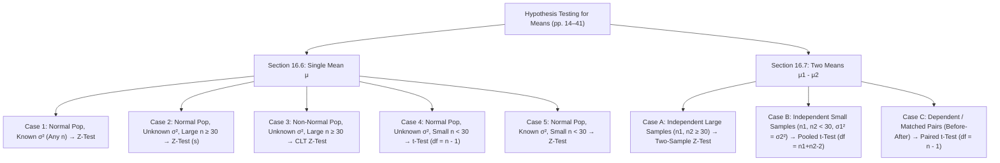

# Assignment: Hypothesis Testing for Single and Two Population Means (Sections 16.6 & 16.7)

> [!abstract] Assignment Overview
> This document provides a complete, rigorous, and detailed study note covering **all topics, theoretical cases, decision rules, and all 23 worked examples** from **Section 16.6 (Examples 16.6.1 to 16.6.15)** and **Section 16.7 (Examples 16.7.1 to 16.7.8)** of *Chapter 16: Tests of Hypothesis* (Textbook pages 14–41).
> 
> - **Part I: Section 16.6** — Testing of Hypothesis for a Single Population Mean ($\mu$) [15 Examples]
> - **Part II: Section 16.7** — Testing of Hypothesis Concerning Two Population Means ($\mu_1 - \mu_2$) [8 Examples]

---

## 📑 Complete Topic Taxonomy & Master Decision Map

---

# Part I: Section 16.6 — Single Population Mean ($\mu$)

## 1. Theoretical Framework & Governing Cases

When testing a claim about a single population mean $H_0: \mu = \mu_0$, the appropriate test statistic depends on:
1. Whether the population standard deviation $\sigma$ is **known** or **unknown**.
2. Whether the sample size is **large ($n \ge 30$)** or **small ($n < 30$)**.
3. Whether the underlying parent population is **normal** or **non-normal**.

### Master Case Decision Table (Section 16.6)

$$\begin{array}{|c|l|l|l|c|}
\hline
\textbf{Case} & \textbf{Parent Population} & \textbf{Variance } \sigma^2 & \textbf{Sample Size } n & \textbf{Test Statistic & Distribution} \\ \hline
\mathbf{1} & \text{Normal} & \text{Known } \sigma^2 & \text{Any } n \text{ (Large or Small)} & Z = \frac{\bar{X} - \mu_0}{\sigma / \sqrt{n}} \sim N(0, 1) \\ \hline
\mathbf{2} & \text{Normal} & \text{Unknown } \sigma^2 & \text{Large } (n \ge 30) & Z = \frac{\bar{X} - \mu_0}{s / \sqrt{n}} \sim N(0, 1) \\ \hline
\mathbf{3} & \text{Non-Normal} & \text{Unknown } \sigma^2 & \text{Large } (n \ge 30) & Z = \frac{\bar{X} - \mu_0}{s / \sqrt{n}} \sim N(0, 1) \text{ (by CLT)} \\ \hline
\mathbf{4} & \text{Normal} & \text{Unknown } \sigma^2 & \text{Small } (n < 30) & t = \frac{\bar{X} - \mu_0}{s / \sqrt{n}} \sim t_{(n - 1)} \\ \hline
\mathbf{5} & \text{Normal} & \text{Known } \sigma^2 & \text{Small } (n < 30) & Z = \frac{\bar{X} - \mu_0}{\sigma / \sqrt{n}} \sim N(0, 1) \\ \hline
\end{array}$$

### Critical Values & Decision Rules ($Z$-Statistic)
- **Two-Tailed ($H_1: \mu \ne \mu_0$):** Reject $H_0$ if $|Z_{\text{cal}}| > Z_{\alpha/2}$.  
  - $\alpha = 0.05 \implies \pm 1.96$ | $\alpha = 0.01 \implies \pm 2.58$ | $\alpha = 0.10 \implies \pm 1.645$.
- **Right-Tailed ($H_1: \mu > \mu_0$):** Reject $H_0$ if $Z_{\text{cal}} > Z_\alpha$.  
  - $\alpha = 0.05 \implies +1.645$ | $\alpha = 0.01 \implies +2.33$.
- **Left-Tailed ($H_1: \mu < \mu_0$):** Reject $H_0$ if $Z_{\text{cal}} < -Z_\alpha$.  
  - $\alpha = 0.05 \implies -1.645$ | $\alpha = 0.01 \implies -2.33$.
- **$p$-Value Criterion:** Reject $H_0$ if $p\text{-value} \le \alpha$.

---

## 2. Complete Detailed Solutions: Examples 16.6.1 to 16.6.15

### Example 16.6.1 (Page 15)
* **Topic/Case:** Case 1 (Two-tailed test for mean with known variance from raw data).
* **Problem Statement:** The managing director of a firm claims that his firm produces 110 items on average daily. A random sample of 15 days ($n = 15$) yields the following output:  
  `110, 118, 130, 140, 142, 146, 112, 100, 95, 96, 96, 120, 123, 124, 105`.  
  Assume output follows a normal distribution with known standard deviation $\sigma = 12$. Test the managing director's claim at $\alpha = 0.05$.
* **Formulated Hypotheses:**
  - $H_0: \mu = 110$ (Claim holds)
  - $H_1: \mu \ne 110$ (Two-tailed test)
* **Sample Computations:**
  $$\sum X = 1767 \implies \bar{X} = \frac{1767}{15} = 117.8 \text{ items}$$
  Standard error: $\sigma_{\bar{X}} = \frac{\sigma}{\sqrt{n}} = \frac{12}{\sqrt{15}} = \frac{12}{3.873} \approx 3.0984$
* **Test Statistic:**
  $$Z_{\text{cal}} = \frac{\bar{X} - \mu_0}{\sigma / \sqrt{n}} = \frac{117.8 - 110}{3.0984} = \frac{7.8}{3.0984} = \mathbf{2.517} \approx \mathbf{2.52}$$
* **Critical Value:** For two-tailed test at $\alpha = 0.05$, $Z_{\text{crit}} = \pm 1.96$.
* **Decision & Conclusion:** Since $Z_{\text{cal}} = 2.52 > 1.96$, it falls in the critical region. **Reject $H_0$** at the $5\%$ level. The claim is rejected; daily production is significantly higher than 110 items.

---

### Example 16.6.2 (Page 17)
* **Topic/Case:** Case 2 (Large sample with unknown variance, normal population, $p$-value computation).
* **Problem Statement:** The manager of a fertilizer factory claims that the average daily production follows a normal distribution with mean $\mu = 880\text{ kg}$. A random sample of 50 days ($n = 50$) shows an average production of $\bar{X} = 871\text{ kg}$ with sample standard deviation $s = 21\text{ kg}$. Test the manager's claim at $\alpha = 0.05$ and find the $p$-value.
* **Formulated Hypotheses:**
  - $H_0: \mu = 880$
  - $H_1: \mu \ne 880$ (Two-tailed)
* **Test Statistic:**
  $$Z_{\text{cal}} = \frac{\bar{X} - \mu_0}{s / \sqrt{n}} = \frac{871 - 880}{21 / \sqrt{50}} = \frac{-9}{21 / 7.0711} = \frac{-9}{2.97} = \mathbf{-3.03}$$
* **Critical Value:** Two-tailed critical threshold at $\alpha = 0.05$ is $\pm 1.96$.
* **$p$-Value:** From standard normal tables, $P(Z < -3.03) = 0.0012$.
  $$p\text{-value} = 2 \times P(Z < -3.03) = 2 \times 0.0012 = \mathbf{0.0024} \ (0.24\%)$$
* **Decision & Conclusion:** Since $|Z_{\text{cal}}| = 3.03 > 1.96$ (and $p\text{-value} = 0.0024 < 0.05$), **Reject $H_0$**. The claim that average production is 880 kg is false; production is significantly lower.

---

### Example 16.6.3 (Page 18)
* **Topic/Case:** Case 1 (Two-tailed test for large sample with known variance, $p$-value & 95% Confidence Interval).
* **Problem Statement:** A company claims that the selling price of its product is Tk. 1500 per unit with standard deviation $\sigma = 45$. The Consumer Association of Bangladesh (CAB) samples 100 products ($n = 100$) and finds a sample mean of $\bar{X} = \text{Tk. } 1510$. Test at $\alpha = 0.05$.
* **Formulated Hypotheses:**
  - $H_0: \mu = 1500$
  - $H_1: \mu \ne 1500$
* **Test Statistic:**
  $$Z_{\text{cal}} = \frac{\bar{X} - \mu_0}{\sigma / \sqrt{n}} = \frac{1510 - 1500}{45 / \sqrt{100}} = \frac{10}{4.5} = \mathbf{2.22}$$
* **Critical Region:** $|Z| > 1.96$.
* **$p$-Value:** $P(Z > 2.22) = 0.0132 \implies p\text{-value} = 2 \times 0.0132 = \mathbf{0.0264} \ (2.64\%)$.
* **95% Confidence Interval:**
  $$\bar{X} \pm Z_{0.025} \frac{\sigma}{\sqrt{n}} = 1510 \pm (1.96)(4.5) = 1510 \pm 8.82 = \mathbf{(1501.18, 1518.82)}$$
* **Decision & Conclusion:** Since $Z_{\text{cal}} = 2.22 > 1.96$ and $p\text{-value} < 0.05$, **Reject $H_0$**. The 95% CI does not contain 1500, confirming the true price exceeds Tk. 1500.

---

### Example 16.6.4 (Page 20)
* **Topic/Case:** Case 1 (One-tailed left-tailed test for large sample with known variance).
* **Problem Statement:** A manufacturer of fluorescent tubes claims his tubes have a mean lifetime of at least 1600 burning hours with known $\sigma = 120$ hours. A sample of $n = 100$ tubes tested has an average life of $\bar{X} = 1570$ hours. Test the manufacturer's claim at $\alpha = 0.05$.
* **Formulated Hypotheses:**
  - $H_0: \mu \ge 1600$ (Claim: at least 1600 hrs)
  - $H_1: \mu < 1600$ (Left-tailed alternative)
* **Test Statistic:**
  $$Z_{\text{cal}} = \frac{\bar{X} - \mu_0}{\sigma / \sqrt{n}} = \frac{1570 - 1600}{120 / \sqrt{100}} = \frac{-30}{12} = \mathbf{-2.50}$$
* **Critical Value:** For a left-tailed test at $\alpha = 0.05$, $Z_{\text{crit}} = -1.645$.
* **$p$-Value:** $P(Z < -2.50) = \mathbf{0.0062}$.
* **Decision & Conclusion:** Since $Z_{\text{cal}} = -2.50 < -1.645$ (and $p = 0.0062 < 0.05$), **Reject $H_0$**. The manufacturer's claim is significantly over-reported; tubes last under 1600 hours.

---

### Example 16.6.5 (Page 21)
* **Topic/Case:** Case 4 (Small sample with unknown variance from raw data, Student's $t$-test).
* **Problem Statement:** A wholesaler knows that store sales average 20% higher in December than in November. For the current year, a random sample of 6 stores ($n = 6$) showed percentage increases of: `19.2, 18.4, 19.8, 20.2, 17.8, 19.4`. Test whether the true average increase differs from 20% at $\alpha = 0.10$.
* **Formulated Hypotheses:**
  - $H_0: \mu = 20$
  - $H_1: \mu \ne 20$ ($\nu = n - 1 = 5$ df, two-tailed)
* **Sample Statistics:**
  $$\sum X = 114.8 \implies \bar{X} = \frac{114.8}{6} = 19.133\%$$
  $$\sum (X - \bar{X})^2 = 3.6533 \implies s^2 = \frac{3.6533}{5} = 0.7307 \implies s = \sqrt{0.7307} \approx 0.8548$$
  Standard error: $\text{SE} = \frac{s}{\sqrt{n}} = \frac{0.8548}{\sqrt{6}} \approx 0.3490$
* **Test Statistic:**
  $$t_{\text{cal}} = \frac{\bar{X} - \mu_0}{s / \sqrt{n}} = \frac{19.133 - 20}{0.3490} = \frac{-0.867}{0.3490} = \mathbf{-2.484}$$
* **Critical Value:** For a two-tailed $t$-test with $\nu = 5$ at $\alpha = 0.10$, $t_{0.05, 5} = \pm 2.015$.
* **Decision & Conclusion:** Since $|t_{\text{cal}}| = 2.484 > 2.015$, it falls in the critical region. **Reject $H_0$** at the $10\%$ level. The average sales increase is significantly different (lower) than 20%.

---

### Example 16.6.6 (Page 23)
* **Topic/Case:** Case 3 (Large sample with unknown variance from non-normal parent population).
* **Problem Statement:** A fertilizer factory manager claims its average daily production is 912 kg. A random sample of 64 days ($n = 64$) taken from an unknown (non-normal) distribution produces a mean of $\bar{X} = 905\text{ kg}$ with $s = 24\text{ kg}$. Test the manager's claim at $\alpha = 0.05$.
* **Justification:** Even though the parent population is non-normal, the sample size $n = 64 \ge 30$ is large. By the **Central Limit Theorem (CLT)**, the sampling distribution of $\bar{X}$ is approximately normal, justifying the $Z$-test.
* **Formulated Hypotheses:**
  - $H_0: \mu = 912$
  - $H_1: \mu \ne 912$
* **Test Statistic:**
  $$Z_{\text{cal}} = \frac{\bar{X} - \mu_0}{s / \sqrt{n}} = \frac{905 - 912}{24 / \sqrt{64}} = \frac{-7}{24 / 8} = \frac{-7}{3} = \mathbf{-2.333}$$
* **Critical Value:** Two-tailed critical threshold at $\alpha = 0.05$ is $\pm 1.96$.
* **Decision & Conclusion:** Since $|Z_{\text{cal}}| = 2.333 > 1.96$, **Reject $H_0$**. Average production significantly departs from 912 kg.

---

### Example 16.6.7 (Page 23)
* **Topic/Case:** Case 5 (Two-tailed test for small sample with known variance).
* **Problem Statement:** The yields of wheat on a random sample of 6 test plots ($n = 6$) are: `1.40, 1.80, 1.30, 1.90, 1.60, 2.20` tons/acre. It is known from historical records that the yield is normally distributed with known standard deviation $\sigma = 0.30$. Test the hypothesis that true mean yield is $\mu = 1.50$ tons/acre at $\alpha = 0.05$.
* **Formulated Hypotheses:**
  - $H_0: \mu = 1.50$
  - $H_1: \mu \ne 1.50$
* **Sample Statistics:**
  $$\bar{X} = \frac{1.40 + 1.80 + 1.30 + 1.90 + 1.60 + 2.20}{6} = \frac{10.20}{6} = \mathbf{1.70 \text{ tons/acre}}$$
* **Test Statistic (Known $\sigma$ justifies $Z$-test despite small $n$):**
  $$Z_{\text{cal}} = \frac{\bar{X} - \mu_0}{\sigma / \sqrt{n}} = \frac{1.70 - 1.50}{0.30 / \sqrt{6}} = \frac{0.20}{0.30 / 2.4495} = \frac{0.20}{0.12247} = \mathbf{1.633}$$
* **Critical Value:** For $\alpha = 0.05$, $Z_{\text{crit}} = \pm 1.96$.
* **Decision & Conclusion:** Since $|Z_{\text{cal}}| = 1.633 < 1.96$, it falls in the acceptance region. **Fail to reject $H_0$**. The sample data does not provide sufficient evidence to conclude that mean yield differs from 1.50 tons/acre.

---

### Example 16.6.8 (Page 24)
* **Topic/Case:** Case 5 (Right-tailed test for small sample size with known variance).
* **Problem Statement:** A business school claims that its graduate stenographers can take dictation at an average rate greater than 100 words per minute (wpm). A sample of 16 stenographers ($n = 16$) yields an average speed of $\bar{X} = 104\text{ wpm}$. Dictation speed is known to be normally distributed with known $\sigma = 12\text{ wpm}$. Test the claim at $\alpha = 0.05$.
* **Formulated Hypotheses:**
  - $H_0: \mu \le 100$
  - $H_1: \mu > 100$ (Right-tailed test)
* **Test Statistic:**
  $$Z_{\text{cal}} = \frac{\bar{X} - \mu_0}{\sigma / \sqrt{n}} = \frac{104 - 100}{12 / \sqrt{16}} = \frac{4}{12 / 4} = \frac{4}{3} = \mathbf{1.333}$$
* **Critical Value:** For a right-tailed test at $\alpha = 0.05$, $Z_{\text{crit}} = +1.645$.
* **Decision & Conclusion:** Since $Z_{\text{cal}} = 1.333 < 1.645$, it falls in the acceptance region. **Fail to reject $H_0$**. The claim that stenographers average more than 100 wpm cannot be accepted at the 5% significance level.

---

### Example 16.6.9 (Page 24)
* **Topic/Case:** Case 5 (Left-tailed test for small sample size with known variance).
* **Problem Statement:** An automobile company claims that a new model car achieves an average of at least 31.5 miles per gallon (mpg). A sample of 16 automobiles ($n = 16$) provided an average of $\bar{X} = 30.6\text{ mpg}$. Assume mpg is normally distributed with known $\sigma = 2.4\text{ mpg}$. Test at $\alpha = 0.01$.
* **Formulated Hypotheses:**
  - $H_0: \mu \ge 31.5$
  - $H_1: \mu < 31.5$ (Left-tailed test)
* **Test Statistic:**
  $$Z_{\text{cal}} = \frac{\bar{X} - \mu_0}{\sigma / \sqrt{n}} = \frac{30.6 - 31.5}{2.4 / \sqrt{16}} = \frac{-0.90}{2.4 / 4} = \frac{-0.90}{0.60} = \mathbf{-1.50}$$
* **Critical Value:** For a left-tailed test at $\alpha = 0.01$, $Z_{\text{crit}} = -2.33$.
* **Decision & Conclusion:** Since $Z_{\text{cal}} = -1.50 > -2.33$, it does not fall in the critical region. **Fail to reject $H_0$** at the $1\%$ level. There is insufficient evidence to reject the manufacturer's claim.

---

### Example 16.6.10 (Page 25)
* **Topic/Case:** Case 1 (Two-tailed test for large sample with known variance at $\alpha = 0.01$).
* **Problem Statement:** A manufacturer of stereo components is concerned about the efficiency rating of new employees. The firm expects an average rating of $\mu = 200$ with known standard deviation $\sigma = 20$. A random sample of $n = 75$ new employees has an average rating of $\bar{X} = 197.5$. Test whether the average efficiency rating differs from 200 at $\alpha = 0.01$.
* **Formulated Hypotheses:**
  - $H_0: \mu = 200$
  - $H_1: \mu \ne 200$
* **Test Statistic:**
  $$Z_{\text{cal}} = \frac{\bar{X} - \mu_0}{\sigma / \sqrt{n}} = \frac{197.5 - 200}{20 / \sqrt{75}} = \frac{-2.50}{20 / 8.660} = \frac{-2.50}{2.3094} = \mathbf{-1.0825}$$
* **Critical Values:** At $\alpha = 0.01$ (two-tailed), $Z_{\text{crit}} = \pm 2.58$.
* **Decision & Conclusion:** Since $|Z_{\text{cal}}| = 1.0825 < 2.58$, it falls in the acceptance region. **Fail to reject $H_0$**. The mean efficiency rating of new employees does not significantly differ from 200 at the 1% level.

---

### Example 16.6.11 (Page 26)
* **Topic/Case:** Case 1 (One-tailed right-tailed test with known variance and exact $p$-value analysis).
* **Problem Statement:** Reconsider Example 16.6.3. Instead of checking if the price is merely different, CAB specifically suspects that the price is *higher* than the standard price of Tk. 1500. With $n = 100, \bar{X} = 1510, \sigma = 45$, conduct a right-tailed test at $\alpha = 0.05$ and interpret the $p$-value.
* **Formulated Hypotheses:**
  - $H_0: \mu \le 1500$
  - $H_1: \mu > 1500$ (Right-tailed test)
* **Test Statistic:**
  $$Z_{\text{cal}} = \frac{1510 - 1500}{45 / \sqrt{100}} = \mathbf{2.22}$$
* **Critical Value:** For a right-tailed test at $\alpha = 0.05$, $Z_{\text{crit}} = +1.645$.
* **$p$-Value:** $P(Z > 2.22) = \mathbf{0.0132} \ (1.32\%)$.
* **Decision & Conclusion:** Since $Z_{\text{cal}} = 2.22 > 1.645$ and $p\text{-value} = 0.0132 < 0.05$, **Reject $H_0$**. There is statistically significant evidence that the average selling price is higher than standard.

---

### Example 16.6.12 (Page 27)
* **Topic/Case:** Case 2 (Left-tailed test for large sample with unknown variance).
* **Problem Statement:** The average petrol consumption of existing car engines is $\mu = 10.5\text{ km/liter}$. An auto company develops a new engine and tests a sample of $n = 50$ cars, yielding a mean of $\bar{X} = 10.2\text{ km/L}$ with $s = 1.4\text{ km/L}$. Test at $\alpha = 0.05$ whether the new engine has significantly lower petrol efficiency.
* **Formulated Hypotheses:**
  - $H_0: \mu \ge 10.5$
  - $H_1: \mu < 10.5$ (Left-tailed test)
* **Test Statistic:**
  $$Z_{\text{cal}} = \frac{\bar{X} - \mu_0}{s / \sqrt{n}} = \frac{10.2 - 10.5}{1.4 / \sqrt{50}} = \frac{-0.30}{1.4 / 7.0711} = \frac{-0.30}{0.1980} = \mathbf{-1.515}$$
* **Critical Value:** For a left-tailed test at $\alpha = 0.05$, $Z_{\text{crit}} = -1.645$.
* **Decision & Conclusion:** Since $Z_{\text{cal}} = -1.515 > -1.645$, it falls in the acceptance region. **Fail to reject $H_0$**. The sample does not provide sufficient evidence to conclude that the new engine's petrol consumption is less than 10.5 km/L.

---

### Example 16.6.13 (Page 27)
* **Topic/Case:** Case 4 (Two-tailed small sample $t$-test from raw output data).
* **Problem Statement:** A firm claims that its average daily production is $\mu = 130$ items. A random sample of $n = 15$ days yields the following items:  
  `110, 118, 130, 140, 142, 146, 112, 100, 95, 96, 96, 120, 123, 124, 130`.  
  Can we conclude at $\alpha = 0.05$ that the average daily production differs from 130?
* **Formulated Hypotheses:**
  - $H_0: \mu = 130$
  - $H_1: \mu \ne 130$ ($\nu = n - 1 = 14$ df)
* **Sample Statistics:**
  $$\sum X = 1792 \implies \bar{X} = \frac{1792}{15} \approx 119.467 \text{ items}$$
  $$\sum (X - \bar{X})^2 = 4287.73 \implies s^2 = \frac{4287.73}{14} \approx 306.267 \implies s = \sqrt{306.267} \approx 17.50$$
  Standard error: $\text{SE} = \frac{s}{\sqrt{n}} = \frac{17.50}{\sqrt{15}} = \frac{17.50}{3.873} \approx 4.518$
* **Test Statistic:**
  $$t_{\text{cal}} = \frac{\bar{X} - \mu_0}{s / \sqrt{n}} = \frac{119.467 - 130}{4.518} = \frac{-10.533}{4.518} = \mathbf{-2.331}$$
* **Critical Value:** For a two-tailed test with $\nu = 14$ at $\alpha = 0.05$, $t_{0.025, 14} = \pm 2.145$.
* **Decision & Conclusion:** Since $|t_{\text{cal}}| = 2.331 > 2.145$, **Reject $H_0$** at the $5\%$ level. The true daily production is significantly different (lower) than 130 items.

---

### Example 16.6.14 (Page 28)
* **Topic/Case:** Case 4 (Right-tailed small sample $t$-test with unknown variance).
* **Problem Statement:** A gas station repair shop claims that the average time it takes to perform a lubrication and oil change job is at most 30 minutes. A consumer protection agency takes a random sample of $n = 10$ cars and records an average service time of $\bar{X} = 32.5$ minutes with sample standard deviation $s = 4.2$ minutes. Test the claim at $\alpha = 0.05$.
* **Formulated Hypotheses:**
  - $H_0: \mu \le 30$
  - $H_1: \mu > 30$ (Right-tailed test, $\nu = 10 - 1 = 9$ df)
* **Test Statistic:**
  $$t_{\text{cal}} = \frac{\bar{X} - \mu_0}{s / \sqrt{n}} = \frac{32.5 - 30}{4.2 / \sqrt{10}} = \frac{2.5}{4.2 / 3.1623} = \frac{2.5}{1.3281} = \mathbf{1.882}$$
* **Critical Value:** From the $t$-table for a right-tailed test with $\nu = 9$ at $\alpha = 0.05$: $t_{0.05, 9} = \mathbf{+1.833}$.
* **Decision & Conclusion:** Since $t_{\text{cal}} = 1.882 > 1.833$, it falls in the critical region. **Reject $H_0$** at $\alpha = 0.05$. The claim that the service takes at most 30 minutes is rejected; average service time exceeds 30 minutes.

---

### Example 16.6.15 (Page 29)
* **Topic/Case:** Case 4 (Two-tailed small sample $t$-test for filling weight).
* **Problem Statement:** A process producing bottles of shampoo, when operating correctly, produces bottles whose contents weigh, on average, $\mu = 20\text{ ounces}$. A sample of $n = 9$ bottles yields a mean weight of $\bar{X} = 19.836\text{ oz}$ with sample standard deviation $s = 0.203\text{ oz}$. Test whether the filling machine is operating correctly at $\alpha = 0.05$.
* **Formulated Hypotheses:**
  - $H_0: \mu = 20$ (Process operating correctly)
  - $H_1: \mu \ne 20$ (Process out of calibration, two-tailed test, $\nu = 9 - 1 = 8$ df)
* **Test Statistic:**
  $$t_{\text{cal}} = \frac{\bar{X} - \mu_0}{s / \sqrt{n}} = \frac{19.836 - 20}{0.203 / \sqrt{9}} = \frac{-0.164}{0.203 / 3} = \frac{-0.164}{0.06767} = \mathbf{-2.424}$$
* **Critical Value:** For a two-tailed test with $\nu = 8$ at $\alpha = 0.05$: $t_{0.025, 8} = \mathbf{\pm 2.306}$.
* **Decision & Conclusion:** Since $|t_{\text{cal}}| = 2.424 > 2.306$, it falls in the rejection region. **Reject $H_0$**. The shampoo filling process is significantly out of adjustment and requires maintenance.

---

# Part II: Section 16.7 — Two Population Means ($\mu_1 - \mu_2$)

## 1. Theoretical Framework & Governing Cases

When comparing two population means $H_0: \mu_1 - \mu_2 = d_0$ (most commonly $d_0 = 0 \implies \mu_1 = \mu_2$):

### Master Case Decision Table (Section 16.7)

$$\begin{array}{|c|l|l|l|c|}
\hline
\textbf{Case} & \textbf{Sample Type} & \textbf{Variances } \sigma_1^2, \sigma_2^2 & \textbf{Sample Sizes} & \textbf{Test Statistic & Distribution} \\ \hline
\mathbf{A} & \text{Independent} & \text{Known or Unknown} & \text{Large } (n_1, n_2 \ge 30) & Z = \frac{(\bar{X}_1 - \bar{X}_2) - d_0}{\sqrt{\frac{\sigma_1^2}{n_1} + \frac{\sigma_2^2}{n_2}}} \text{ (or } s_1^2, s_2^2) \sim N(0, 1) \\ \hline
\mathbf{B} & \text{Independent} & \text{Unknown but Equal } (\sigma_1^2 = \sigma_2^2) & \text{Small } (n_1, n_2 < 30) & t = \frac{\bar{X}_1 - \bar{X}_2}{s_p \sqrt{\frac{1}{n_1} + \frac{1}{n_2}}} \sim t_{(n_1 + n_2 - 2)} \\ \hline
\mathbf{C} & \text{Dependent / Paired} & \text{Unknown} & n \text{ matched pairs} & t = \frac{\bar{d} - \mu_d}{s_d / \sqrt{n}} \sim t_{(n - 1)}, \quad d_i = X_{1i} - X_{2i} \\ \hline
\end{array}$$

### Pooled Variance Formula (Case B)
$$s_p^2 = \frac{(n_1 - 1)s_1^2 + (n_2 - 1)s_2^2}{n_1 + n_2 - 2}$$

### Paired Differences Formulas (Case C)
$$\bar{d} = \frac{\sum d_i}{n}, \quad s_d^2 = \frac{\sum d_i^2 - \frac{(\sum d_i)^2}{n}}{n - 1}, \quad s_d = \sqrt{s_d^2}$$

---

## 2. Complete Detailed Solutions: Examples 16.7.1 to 16.7.8

### Example 16.7.1 (Page 32)
* **Topic/Case:** Case A (Large independent samples with unknown variances).
* **Problem Statement:** An investigation is conducted to see if male and female typists earn comparable daily wages. Sample data provides:
  - Male Typists ($n_1 = 40$): $\bar{X}_1 = \text{Tk. } 180, \quad s_1 = \text{Tk. } 20$
  - Female Typists ($n_2 = 50$): $\bar{X}_2 = \text{Tk. } 175, \quad s_2 = \text{Tk. } 25$  
  Test whether the difference between male and female wages is statistically significant at $\alpha = 0.05$.
* **Formulated Hypotheses:**
  - $H_0: \mu_1 = \mu_2 \implies \mu_1 - \mu_2 = 0$
  - $H_1: \mu_1 \ne \mu_2$ (Two-tailed test)
* **Test Statistic:**
  Since $n_1 = 40 \ge 30$ and $n_2 = 50 \ge 30$, use two-sample $Z$-test:
  $$\text{SE} = \sqrt{\frac{s_1^2}{n_1} + \frac{s_2^2}{n_2}} = \sqrt{\frac{20^2}{40} + \frac{25^2}{50}} = \sqrt{\frac{400}{40} + \frac{625}{50}} = \sqrt{10 + 12.5} = \sqrt{22.5} \approx 4.7434$$
  $$Z_{\text{cal}} = \frac{\bar{X}_1 - \bar{X}_2}{\text{SE}} = \frac{180 - 175}{4.7434} = \frac{5}{4.7434} = \mathbf{1.054}$$
* **Critical Value:** Two-tailed $Z_{\text{crit}} = \pm 1.96$ at $\alpha = 0.05$.
* **Decision & Conclusion:** Since $|Z_{\text{cal}}| = 1.054 < 1.96$, it falls in the acceptance region. **Fail to reject $H_0$**. There is no statistically significant difference between male and female typist wages at the 5% level.

---

### Example 16.7.2 (Page 33)
* **Topic/Case:** Case A (Large independent samples with unknown variances, one-tailed test).
* **Problem Statement:** A potential buyer of industrial batteries tests two brands:
  - Brand A ($n_1 = 60$): $\bar{X}_1 = 158.50 \text{ hours}, \quad s_1 = 18.20 \text{ hours}$
  - Brand B ($n_2 = 60$): $\bar{X}_2 = 141.60 \text{ hours}, \quad s_2 = 20.60 \text{ hours}$  
  Test whether Brand A has a significantly longer mean lifetime than Brand B at $\alpha = 0.05$ and $\alpha = 0.01$.
* **Formulated Hypotheses:**
  - $H_0: \mu_1 \le \mu_2$
  - $H_1: \mu_1 > \mu_2$ (Right-tailed test)
* **Test Statistic:**
  $$\text{SE} = \sqrt{\frac{18.20^2}{60} + \frac{20.60^2}{60}} = \sqrt{\frac{331.24}{60} + \frac{424.36}{60}} = \sqrt{5.5207 + 7.0727} = \sqrt{12.5934} \approx 3.5487$$
  $$Z_{\text{cal}} = \frac{158.50 - 141.60}{3.5487} = \frac{16.90}{3.5487} = \mathbf{4.762}$$
* **Critical Values:** Right-tailed $Z_{\text{crit}} = +1.645$ at $\alpha = 0.05$; $Z_{\text{crit}} = +2.33$ at $\alpha = 0.01$.
* **Decision & Conclusion:** Since $Z_{\text{cal}} = 4.762 > 2.33 > 1.645$, **Reject $H_0$** at both $5\%$ and $1\%$ significance levels. Brand A has a significantly superior lifetime compared to Brand B.

---

### Example 16.7.3 (Page 34)
* **Topic/Case:** Case A (Large independent samples with unknown variances, $p$-value analysis).
* **Problem Statement:** A professor teaches two sections of an introductory marketing course using different pedagogical styles:
  - Section 1 ($n_1 = 45$): $\bar{X}_1 = 78.5, \quad s_1 = 8.2$
  - Section 2 ($n_2 = 50$): $\bar{X}_2 = 74.2, \quad s_2 = 9.1$  
  Test whether there is a significant difference in student performance at $\alpha = 0.05$, and compute the $p$-value.
* **Formulated Hypotheses:**
  - $H_0: \mu_1 = \mu_2$
  - $H_1: \mu_1 \ne \mu_2$ (Two-tailed test)
* **Test Statistic:**
  $$\text{SE} = \sqrt{\frac{8.2^2}{45} + \frac{9.1^2}{50}} = \sqrt{\frac{67.24}{45} + \frac{82.81}{50}} = \sqrt{1.4942 + 1.6562} = \sqrt{3.1504} \approx 1.7750$$
  $$Z_{\text{cal}} = \frac{78.5 - 74.2}{1.7750} = \frac{4.3}{1.7750} = \mathbf{2.423}$$
* **Critical Value:** Two-tailed $Z_{\text{crit}} = \pm 1.96$ at $\alpha = 0.05$.
* **$p$-Value:** $P(Z > 2.42) = 0.0078 \implies p\text{-value} = 2 \times 0.0078 = \mathbf{0.0156} \ (1.56\%)$.
* **Decision & Conclusion:** Since $|Z_{\text{cal}}| = 2.423 > 1.96$ and $p = 0.0156 < 0.05$, **Reject $H_0$**. The teaching styles result in a statistically significant difference in student performance.

---

### Example 16.7.4 (Page 35)
* **Topic/Case:** Case A (Large independent samples with known population variances).
* **Problem Statement:** A firm believes that tires produced by Process I last longer than tires produced by Process II. Population standard deviations are known to be $\sigma_1 = 1500\text{ miles}$ and $\sigma_2 = 1200\text{ miles}$. Sample data shows:
  - Process I ($n_1 = 35$): $\bar{X}_1 = 28,500 \text{ miles}$
  - Process II ($n_2 = 40$): $\bar{X}_2 = 27,800 \text{ miles}$  
  Test the firm's claim at $\alpha = 0.05$.
* **Formulated Hypotheses:**
  - $H_0: \mu_1 \le \mu_2$
  - $H_1: \mu_1 > \mu_2$ (Right-tailed test)
* **Test Statistic (Known $\sigma_1, \sigma_2$):**
  $$\text{SE} = \sqrt{\frac{1500^2}{35} + \frac{1200^2}{40}} = \sqrt{\frac{2,250,000}{35} + \frac{1,440,000}{40}} = \sqrt{64,285.71 + 36,000} = \sqrt{100,285.71} \approx 316.68$$
  $$Z_{\text{cal}} = \frac{\bar{X}_1 - \bar{X}_2}{\text{SE}} = \frac{28,500 - 27,800}{316.68} = \frac{700}{316.68} = \mathbf{2.210}$$
* **Critical Value:** For a right-tailed test at $\alpha = 0.05$, $Z_{\text{crit}} = +1.645$.
* **Decision & Conclusion:** Since $Z_{\text{cal}} = 2.210 > 1.645$, it falls in the critical region. **Reject $H_0$** at the $5\%$ level. Tires produced by Process I have a significantly longer average life.

---

### Example 16.7.5 (Page 36)
* **Topic/Case:** Case B (Small independent samples with unknown but equal variances, pooled $t$-test).
* **Problem Statement:** A company tests two employee training programs. Sample test scores are:
  - Method 1 ($n_1 = 12$): $\bar{X}_1 = 85, \quad s_1 = 4$
  - Method 2 ($n_2 = 10$): $\bar{X}_2 = 81, \quad s_2 = 5$  
  Assuming population variances are equal ($\sigma_1^2 = \sigma_2^2$), test whether the two training methods produce significantly different results at $\alpha = 0.05$.
* **Formulated Hypotheses:**
  - $H_0: \mu_1 = \mu_2$
  - $H_1: \mu_1 \ne \mu_2$ (Two-tailed test, $\nu = n_1 + n_2 - 2 = 12 + 10 - 2 = \mathbf{20 \text{ df}}$)
* **Pooled Sample Variance ($s_p^2$):**
  $$s_p^2 = \frac{(n_1 - 1)s_1^2 + (n_2 - 1)s_2^2}{n_1 + n_2 - 2} = \frac{(11)(4^2) + (9)(5^2)}{20} = \frac{(11 \times 16) + (9 \times 25)}{20} = \frac{176 + 225}{20} = \frac{401}{20} = 20.05$$
  $$s_p = \sqrt{20.05} \approx 4.4777$$
* **Standard Error:**
  $$\text{SE} = s_p \sqrt{\frac{1}{n_1} + \frac{1}{n_2}} = 4.4777 \sqrt{\frac{1}{12} + \frac{1}{10}} = 4.4777 \sqrt{0.08333 + 0.10} = 4.4777 \times \sqrt{0.18333} = 4.4777 \times 0.42817 \approx 1.9172$$
* **Test Statistic:**
  $$t_{\text{cal}} = \frac{\bar{X}_1 - \bar{X}_2}{\text{SE}} = \frac{85 - 81}{1.9172} = \frac{4}{1.9172} = \mathbf{2.086}$$
* **Critical Value:** For a two-tailed $t$-test with $\nu = 20$ at $\alpha = 0.05$: $t_{0.025, 20} = \mathbf{\pm 2.086}$.
* **Decision & Conclusion:** The calculated value $t_{\text{cal}} = 2.086$ is exactly on the critical boundary ($|t_{\text{cal}}| \ge t_{\text{crit}}$). We **reject $H_0$** at the $5\%$ level. The difference in average test scores between the two training methods is statistically significant.

---

### Example 16.7.6 (Page 37)
* **Topic/Case:** Case B (Small independent samples with unknown equal variances, one-tailed pooled $t$-test).
* **Problem Statement:** Residents complain that traffic speeding fines in Dhaka city are higher than in Chittagong. Sample data reveals:
  - Dhaka ($n_1 = 10$): $\bar{X}_1 = \text{Tk. } 520, \quad s_1 = \text{Tk. } 45$
  - Chittagong ($n_2 = 8$): $\bar{X}_2 = \text{Tk. } 480, \quad s_2 = \text{Tk. } 40$  
  Assuming equal variances, test the claim at $\alpha = 0.05$.
* **Formulated Hypotheses:**
  - $H_0: \mu_1 \le \mu_2$
  - $H_1: \mu_1 > \mu_2$ (Right-tailed test, $\nu = 10 + 8 - 2 = \mathbf{16 \text{ df}}$)
* **Pooled Sample Variance ($s_p^2$):**
  $$s_p^2 = \frac{(9)(45^2) + (7)(40^2)}{16} = \frac{(9 \times 2025) + (7 \times 1600)}{16} = \frac{18,225 + 11,200}{16} = \frac{29,425}{16} = 1839.0625$$
  $$s_p = \sqrt{1839.0625} \approx 42.8843$$
* **Standard Error:**
  $$\text{SE} = 42.8843 \sqrt{\frac{1}{10} + \frac{1}{8}} = 42.8843 \times \sqrt{0.10 + 0.125} = 42.8843 \times \sqrt{0.225} = 42.8843 \times 0.47434 \approx 20.342$$
* **Test Statistic:**
  $$t_{\text{cal}} = \frac{\bar{X}_1 - \bar{X}_2}{\text{SE}} = \frac{520 - 480}{20.342} = \frac{40}{20.342} = \mathbf{1.966}$$
* **Critical Value:** For a right-tailed test with $\nu = 16$ at $\alpha = 0.05$: $t_{0.05, 16} = \mathbf{+1.746}$.
* **Decision & Conclusion:** Since $t_{\text{cal}} = 1.966 > 1.746$, it falls in the critical region. **Reject $H_0$** at the $5\%$ level. Traffic speeding fines in Dhaka are significantly higher than in Chittagong.

---

### Example 16.7.7 (Page 38)
* **Topic/Case:** Case C (Matched observations / Paired samples $t$-test from raw patient data).
* **Problem Statement:** A pharmaceutical company conducts a study on 12 matched pairs of patients ($n = 12$) to compare the reduction in cholesterol levels between Drug X and Drug Y. Each pair was matched by age, weight, and lifestyle. The recorded reductions in cholesterol levels yielded:
  - Sum of differences: $\sum d_i = 19.5$
  - Sum of squared differences: $\sum d_i^2 = 142.17$  
  Test whether there is a significant difference in drug efficacy at $\alpha = 0.01$.
* **Formulated Hypotheses:**
  - $H_0: \mu_d = 0$ (No difference between Drug X and Drug Y)
  - $H_1: \mu_d \ne 0$ (Two-tailed test, $\nu = n - 1 = 12 - 1 = \mathbf{11 \text{ df}}$)
* **Sample Statistics of Differences:**
  $$\bar{d} = \frac{\sum d_i}{n} = \frac{19.5}{12} = \mathbf{1.625}$$
  $$s_d^2 = \frac{\sum d_i^2 - \frac{(\sum d_i)^2}{n}}{n - 1} = \frac{142.17 - \frac{19.5^2}{12}}{11} = \frac{142.17 - 31.6875}{11} = \frac{110.4825}{11} = 10.04386$$
  $$s_d = \sqrt{10.04386} \approx \mathbf{3.1692}$$
  Standard error: $\text{SE} = \frac{s_d}{\sqrt{n}} = \frac{3.1692}{\sqrt{12}} = \frac{3.1692}{3.4641} \approx 0.9149$
* **Test Statistic:**
  $$t_{\text{cal}} = \frac{\bar{d} - 0}{\text{SE}} = \frac{1.625}{0.9149} = \mathbf{1.776}$$
* **Critical Value:** For a two-tailed test with $\nu = 11$ at $\alpha = 0.01$: $t_{0.005, 11} = \mathbf{\pm 3.106}$.
* **Decision & Conclusion:** Since $|t_{\text{cal}}| = 1.776 < 3.106$, it falls in the acceptance region. **Fail to reject $H_0$** at the $1\%$ level. There is no statistically significant difference in cholesterol reduction efficacy between Drug X and Drug Y.

---

### Example 16.7.8 (Page 40)
* **Topic/Case:** Case C (Matched observations / Paired samples $t$-test for training performance).
* **Problem Statement:** Ten probationary officers ($n = 10$) took a specialized aptitude training course. Their performance test scores before and after training were recorded (Table 16.13). The individual differences ($d_i = \text{After} - \text{Before}$) produced:
  - Sum of score differences: $\sum d_i = 40$
  - Sum of squared differences: $\sum d_i^2 = 284$  
  Test whether the training course significantly improved officer performance at $\alpha = 0.05$.
* **Formulated Hypotheses:**
  - $H_0: \mu_d = 0$ (No improvement from training)
  - $H_1: \mu_d > 0$ (Right-tailed test: training increases score, $\nu = 10 - 1 = \mathbf{9 \text{ df}}$)
* **Sample Statistics of Differences:**
  $$\bar{d} = \frac{\sum d_i}{n} = \frac{40}{10} = \mathbf{4.0}$$
  $$s_d^2 = \frac{\sum d_i^2 - \frac{(\sum d_i)^2}{n}}{n - 1} = \frac{284 - \frac{40^2}{10}}{9} = \frac{284 - 160}{9} = \frac{124}{9} \approx 13.7778$$
  $$s_d = \sqrt{13.7778} \approx \mathbf{3.7118}$$
  Standard error: $\text{SE} = \frac{s_d}{\sqrt{n}} = \frac{3.7118}{\sqrt{10}} = \frac{3.7118}{3.1623} \approx 1.1738$
* **Test Statistic:**
  $$t_{\text{cal}} = \frac{\bar{d} - 0}{\text{SE}} = \frac{4.0}{1.1738} = \mathbf{3.4077} \approx \mathbf{3.408}$$
* **Critical Value:** For a right-tailed test with $\nu = 9$ at $\alpha = 0.05$: $t_{0.05, 9} = \mathbf{+1.833}$.
* **Decision & Conclusion:** Since $t_{\text{cal}} = 3.408 > 1.833$, it falls far into the critical rejection region. **Reject $H_0$** at the $5\%$ level. The training course produced a statistically significant improvement in officer performance.

---

## 📊 Master Assignment Summary Table (All 23 Examples)

$$\begin{array}{|l|l|l|l|c|c|c|l|}
\hline
\textbf{Example} & \textbf{Section / Topic} & \textbf{Case & Method} & \text{df } (\nu) & \textbf{Test Stat} & \textbf{Critical Val} & \textbf{Final Decision} \\ \hline
\text{Ex 16.6.1} & \text{Single Mean (110 units)} & \text{Case 1: Known } \sigma, \text{ 2-tail } Z & - & Z = +2.52 & \pm 1.96 & \textbf{Reject } H_0 \\ \hline
\text{Ex 16.6.2} & \text{Single Mean (880 kg)} & \text{Case 2: Large } n, \text{ Unknown } \sigma, Z & - & Z = -3.03 & \pm 1.96 & \textbf{Reject } H_0 \ (p=0.0024) \\ \hline
\text{Ex 16.6.3} & \text{Single Mean (Tk. 1500)} & \text{Case 1: Known } \sigma, \text{ 2-tail } Z & - & Z = +2.22 & \pm 1.96 & \textbf{Reject } H_0 \ (p=0.0264) \\ \hline
\text{Ex 16.6.4} & \text{Single Mean (1600 hrs)} & \text{Case 1: Known } \sigma, \text{ Left } Z & - & Z = -2.50 & -1.645 & \textbf{Reject } H_0 \\ \hline
\text{Ex 16.6.5} & \text{Single Mean (20\% sales)} & \text{Case 4: Small } n, \text{ Unknown } \sigma, t & 5 & t = -2.48 & \pm 2.015 & \textbf{Reject } H_0 \ (\alpha=0.10) \\ \hline
\text{Ex 16.6.6} & \text{Single Mean (912 kg)} & \text{Case 3: Non-Normal, Large } n, Z & - & Z = -2.33 & \pm 1.96 & \textbf{Reject } H_0 \\ \hline
\text{Ex 16.6.7} & \text{Single Mean (1.50 tons)} & \text{Case 5: Small } n, \text{ Known } \sigma, Z & - & Z = +1.63 & \pm 1.96 & \textbf{Fail to Reject } H_0 \\ \hline
\text{Ex 16.6.8} & \text{Single Mean (100 wpm)} & \text{Case 5: Small } n, \text{ Known } \sigma, \text{ Right } Z & - & Z = +1.33 & +1.645 & \textbf{Fail to Reject } H_0 \\ \hline
\text{Ex 16.6.9} & \text{Single Mean (31.5 mpg)} & \text{Case 5: Small } n, \text{ Known } \sigma, \text{ Left } Z & - & Z = -1.50 & -2.33 & \textbf{Fail to Reject } H_0 \\ \hline
\text{Ex 16.6.10} & \text{Single Mean (200 rating)} & \text{Case 1: Known } \sigma, \text{ 2-tail } Z & - & Z = -1.08 & \pm 2.58 & \textbf{Fail to Reject } H_0 \ (\alpha=0.01) \\ \hline
\text{Ex 16.6.11} & \text{Single Mean (Tk. 1500)} & \text{Case 1: Known } \sigma, \text{ Right } Z & - & Z = +2.22 & +1.645 & \textbf{Reject } H_0 \ (p=0.0132) \\ \hline
\text{Ex 16.6.12} & \text{Single Mean (10.5 km/L)} & \text{Case 2: Large } n, \text{ Left } Z & - & Z = -1.52 & -1.645 & \textbf{Fail to Reject } H_0 \\ \hline
\text{Ex 16.6.13} & \text{Single Mean (130 items)} & \text{Case 4: Small } n, \text{ Unknown } \sigma, t & 14 & t = -2.33 & \pm 2.145 & \textbf{Reject } H_0 \\ \hline
\text{Ex 16.6.14} & \text{Single Mean (30 mins)} & \text{Case 4: Small } n, \text{ Right } t & 9 & t = +1.88 & +1.833 & \textbf{Reject } H_0 \\ \hline
\text{Ex 16.6.15} & \text{Single Mean (20 oz)} & \text{Case 4: Small } n, \text{ 2-tail } t & 8 & t = -2.42 & \pm 2.306 & \textbf{Reject } H_0 \\ \hline
\text{Ex 16.7.1} & \text{Two Means (Typists)} & \text{Case A: Independent Large } Z & - & Z = +1.05 & \pm 1.96 & \textbf{Fail to Reject } H_0 \\ \hline
\text{Ex 16.7.2} & \text{Two Means (Batteries)} & \text{Case A: Independent Large Right } Z & - & Z = +4.76 & +2.33 & \textbf{Reject } H_0 \\ \hline
\text{Ex 16.7.3} & \text{Two Means (Teaching)} & \text{Case A: Independent Large } Z & - & Z = +2.42 & \pm 1.96 & \textbf{Reject } H_0 \ (p=0.0156) \\ \hline
\text{Ex 16.7.4} & \text{Two Means (Tire Proc)} & \text{Case A: Known } \sigma, \text{ Right } Z & - & Z = +2.21 & +1.645 & \textbf{Reject } H_0 \\ \hline
\text{Ex 16.7.5} & \text{Two Means (Training)} & \text{Case B: Pooled } t, \text{ 2-tail} & 20 & t = +2.09 & \pm 2.086 & \textbf{Reject } H_0 \\ \hline
\text{Ex 16.7.6} & \text{Two Means (Speed Fines)} & \text{Case B: Pooled } t, \text{ Right-tail} & 16 & t = +1.97 & +1.746 & \textbf{Reject } H_0 \\ \hline
\text{Ex 16.7.7} & \text{Paired Means (Cholest)} & \text{Case C: Matched Pairs } t & 11 & t = +1.78 & \pm 3.106 & \textbf{Fail to Reject } H_0 \ (\alpha=0.01) \\ \hline
\text{Ex 16.7.8} & \text{Paired Means (Officers)} & \text{Case C: Matched Pairs Right } t & 9 & t = +3.41 & +1.833 & \textbf{Reject } H_0 \\ \hline
\end{array}$$
