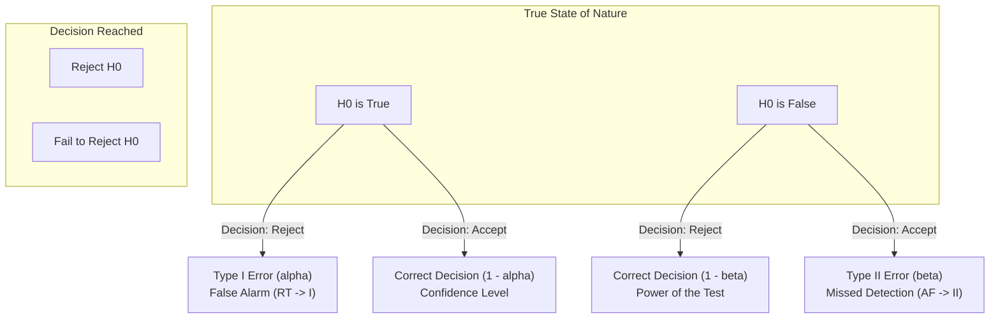
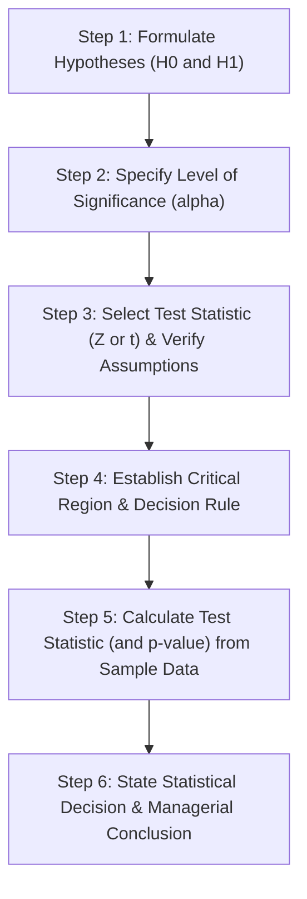
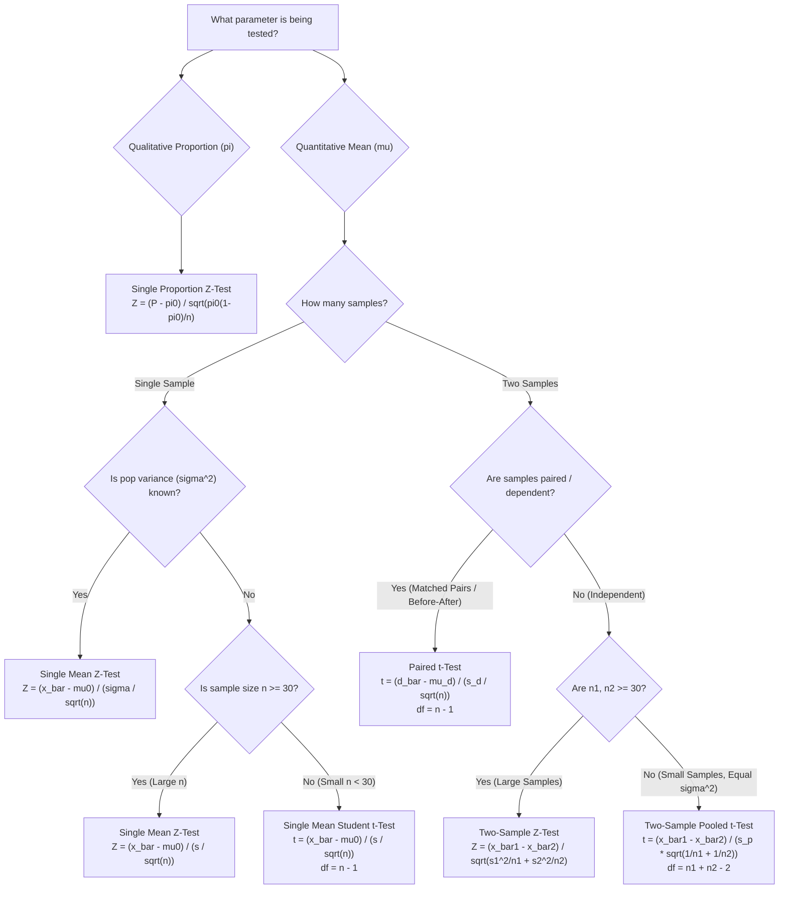

# Comprehensive Study Notes: Test of Hypothesis (Hypothesis Testing)

---

## 1. Fundamental Concepts & Intuitive Foundations

### 1.1 Motivation: Why Hypothesis Testing?
In most scientific, engineering, and business situations, it is practically impossible, destructive, or prohibitively expensive to examine an entire **population**. Instead, we collect a representative **sample** to draw inferences about unknown **population parameters** ($\mu, \sigma^2, \pi$).

However, sample statistics ($\bar{x}, s^2, P$) vary from sample to sample due to natural sampling fluctuations.
- **The Core Problem:** Is the observed difference between our sample statistic and a hypothesized parameter value purely due to **chance (sampling fluctuation)**, or is it statistically **significant** (reflecting a genuine real-world effect)?
- **Hypothesis Testing** provides an objective, probabilistic decision-making framework to answer this question rigorously.

> [!example] Motivating Example: Toothpaste Net Weight Verification
> A manufacturer claims that their large-size toothpaste tubes contain an average of $140\text{ gm}$. A regulatory authority (e.g., CAB - Consumer Association) wants to verify this claim:
> 1. Collect a random sample of toothpaste tubes.
> 2. Measure the sample mean weight $\bar{x}$.
> 3. Perform a formal hypothesis test to determine whether any observed shortfall from $140\text{ gm}$ is statistically significant or within expected sampling variance.

---

### 1.2 The Courtroom / Criminal Jury Trial Analogy
Statistical hypothesis testing is conceptually identical to the criminal trial process:

| Criminal Trial Concept | Statistical Hypothesis Testing Equivalent |
| :--- | :--- |
| **Defendant** | The Null Hypothesis ($H_0$) |
| **Presumption of Innocence** | Assume $H_0$ is true until overwhelming evidence proves otherwise |
| **Prosecution Evidence** | Sample data / Calculated Test Statistic |
| **Standard of Proof** | "Beyond a reasonable doubt" $\leftrightarrow$ Level of Significance ($\alpha$) |
| **Verdict: Guilty** | Reject $H_0$ in favor of $H_1$ (Strong evidence against $H_0$) |
| **Verdict: Not Guilty** | Fail to Reject $H_0$ (Insufficient evidence to convict; does **not** prove absolute innocence) |

> [!tip] Important Distinction: "Fail to Reject" vs. "Accept"
> In statistical testing, we say we **"Fail to Reject $H_0$"** rather than claiming we have definitively proved $H_0$. Just as a "Not Guilty" verdict means the prosecution failed to prove guilt beyond reasonable doubt (not that the defendant is certified innocent), failing to reject $H_0$ means the sample data is simply consistent with $H_0$.

---

### 1.3 Definitions and Taxonomy of Hypotheses

#### 1. General Hypothesis vs. Statistical Hypothesis
- **Hypothesis:** Any statement or conjecture about a phenomenon.
- **Statistical Hypothesis:** A quantitative assertion or conjecture concerning population parameters or distributions, testable using empirical sample data.

#### 2. Classification by Role: Null ($H_0$) vs. Alternative ($H_1$ or $H_a$)
- **Null Hypothesis ($H_0$):**
  - The hypothesis formulated specifically for possible rejection based on sample data.
  - Represents the status quo, baseline, no effect, no difference, or exact equality.
  - *Mathematical Notation:* Always contains an equality sign ($=, \le, \ge$). E.g., $H_0: \mu = \mu_0$.
- **Alternative Hypothesis ($H_1$ or $H_a$):**
  - The logical opposite hypothesis that is accepted if $H_0$ is rejected.
  - Represents what the researcher aims to prove (a significant change, superiority, or difference).
  - Determines the directionality of the test (left-tailed, right-tailed, or two-tailed).
  - *Mathematical Notation:* Always contains a strict inequality ($\neq, <, >$). E.g., $H_1: \mu \neq \mu_0$, $H_1: \mu > \mu_0$, or $H_1: \mu < \mu_0$.

#### 3. Classification by Nature: Simple vs. Composite
- **Simple Hypothesis:** A hypothesis that completely specifies the population distribution and all its parameters.
  - *Example:* In a normal distribution with known variance $\sigma^2 = 16$, the hypothesis $H_0: \mu = 50$ is **simple** because the distribution $N(50, 16)$ is completely and uniquely defined.
- **Composite Hypothesis:** A hypothesis that does not completely specify all parameters, or specifies an interval/range of values.
  - *Example:* $H_1: \mu > 50$ or $H_1: \mu \neq 50$ are **composite** because they contain infinitely many possible parameter values.

---

## 2. Errors in Decision Making & The Decision Matrix

Because we make decisions about a whole population using only a finite sample, uncertainty is inherent. A decision can result in one of two correct outcomes or one of two fundamental errors.

### 2.1 The $2 \times 2$ Decision Matrix

| Decision Taken $\downarrow$ \ True State $\rightarrow$ | $H_0$ is **TRUE** | $H_0$ is **FALSE** |
| :---: | :---: | :---: |
| **Reject $H_0$** | **Type I Error** Probability = $\alpha$ *(False Alarm / Convict Innocent)* | **Correct Decision** Probability = $1 - \beta$ *(Power of the Test)* |
| **Accept (Fail to Reject) $H_0$** | **Correct Decision** Probability = $1 - \alpha$ *(Confidence Coefficient)* | **Type II Error** Probability = $\beta$ *(Missed Detection / Acquit Guilty)* |

> [!abstract] Fast Recall Mnemonics (from Lecture Notes)
> - **`RT -> I`** : **R**ejecting a **T**rue null hypothesis $\implies$ **Type I Error**
> - **`AF -> II`** : **A**ccepting a **F**alse null hypothesis $\implies$ **Type II Error**

---

### 2.2 Error Probabilities & Key Metrics

#### 1. Type I Error & Level of Significance (LOS, $\alpha$)
- **Type I Error:** Rejecting $H_0$ when $H_0$ is in fact true.
- **Level of Significance ($\alpha$):** The maximum probability with which we are willing to risk committing a Type I error.
  $$\alpha = P(\text{Type I Error}) = P(\text{Reject } H_0 \mid H_0 \text{ is True})$$
- Also called the **"Size of the Test"** or the total area under the probability curve allocated to the **Critical Region**.
- **Standard Values:** $\alpha = 0.05$ (5%), $\alpha = 0.01$ (1%), or $\alpha = 0.10$ (10%). It is specified **before** the sample is collected to ensure objective decision-making.

#### 2. Type II Error ($\beta$)
- **Type II Error:** Accepting (failing to reject) $H_0$ when $H_0$ is in fact false.
  $$\beta = P(\text{Type II Error}) = P(\text{Accept } H_0 \mid H_0 \text{ is False})$$

#### 3. Confidence Coefficient ($1 - \alpha$)
- The probability of making the correct decision to accept (retain) $H_0$ when it is true.
  $$1 - \alpha = P(\text{Accept } H_0 \mid H_0 \text{ is True})$$
- For $\alpha = 0.05$, the confidence level is $0.95$ (or $95\%$).

#### 4. Power of a Test ($1 - \beta$)
- The probability of making the correct decision to reject a false null hypothesis.
  $$\text{Power} = 1 - \beta = P(\text{Reject } H_0 \mid H_0 \text{ is False})$$
- Represents the sensitivity of the test in detecting a real effect or difference.

---

### 2.3 The $\alpha$ vs. $\beta$ Trade-off
For a fixed sample size $n$, decreasing $\alpha$ automatically increases $\beta$.
- To decrease both $\alpha$ and $\beta$ simultaneously, one must **increase the sample size $n$**.

---

## 3. Directionality of Tests: One-Tailed vs. Two-Tailed

The alternative hypothesis ($H_1$) dictates whether the test is two-tailed, right-tailed, or left-tailed.

| Feature | Two-Tailed Test | Right-Tailed (Upper) Test | Left-Tailed (Lower) Test |
| :--- | :--- | :--- | :--- |
| **Hypotheses** | $H_0: \mu = \mu_0$ $H_1: \mu \neq \mu_0$ | $H_0: \mu = \mu_0$ (or $\le \mu_0$) $H_1: \mu > \mu_0$ | $H_0: \mu = \mu_0$ (or $\ge \mu_0$) $H_1: \mu < \mu_0$ |
| **Rejection Region (RR)** | Split equally into **both tails** ($\alpha/2$ left, $\alpha/2$ right) | Located entirely in the **right tail** (area = $\alpha$) | Located entirely in the **left tail** (area = $\alpha$) |
| **Critical Region Rule** | $\lvert Z \rvert > Z_{\alpha/2}$ ($Z < -Z_{\alpha/2}$ or $Z > Z_{\alpha/2}$) | $Z > Z_\alpha$ | $Z < -Z_\alpha$ |
| **Contextual Keywords** | "is different from", "has changed", "is not equal to" | "is greater than", "has increased", "exceeds", "superior" | "is less than", "has decreased", "reduced", "inferior" |

---

## 4. Test Statistics, Critical Values & $P$-Values

### 4.1 Test Statistic
A sample-derived quantity whose theoretical probability distribution under $H_0$ is completely known.
$$\text{Test Statistic} = \frac{\text{Observed Sample Statistic} - \text{Hypothesized Parameter}}{\text{Standard Error of the Statistic}}$$

### 4.2 Critical Region, Acceptance Region & Critical Value
- **Critical Region (Rejection Region - CR/RR):** The set of test statistic values that provide sufficient evidence to reject $H_0$.
- **Acceptance Region (AR):** The set of test statistic values consistent with $H_0$.
- **Critical Value ($Z_c$ or $t_c$):** The boundary point separating the Acceptance Region from the Critical Region.

---

### 4.3 Comprehensive $Z$-Critical Values Table
Keep these standard normal critical values ready for quick reference:

| Significance Level ($\alpha$) | $10\%\ (\alpha=0.10)$ | $5\%\ (\alpha=0.05)$ | $2.5\%\ (\alpha=0.025)$ | $1\%\ (\alpha=0.01)$ | $0.5\%\ (\alpha=0.005)$ | $0.2\%\ (\alpha=0.002)$ |
| :--- | :---: | :---: | :---: | :---: | :---: | :---: |
| **Right-Tailed Test** ($+Z_\alpha$) | $+1.28$ | $+1.645$ | $+1.96$ | $+2.33$ | $+2.58$ | $+2.88$ |
| **Left-Tailed Test** ($-Z_\alpha$) | $-1.28$ | $-1.645$ | $-1.96$ | $-2.33$ | $-2.58$ | $-2.88$ |
| **Two-Tailed Test** ($\pm Z_{\alpha/2}$) | $\pm 1.645$ | $\pm 1.96$ | $\pm 2.24$ | $\pm 2.58$ | $\pm 2.81$ | $\pm 3.08$ |

---

### 4.4 $P$-Value (Observed Significance Level)
- **Definition:** The smallest level of significance at which the null hypothesis can be rejected based on the observed sample data. It measures the exact probability of obtaining a test statistic at least as extreme as the observed one, assuming $H_0$ is true.
- **Decision Rule using $P$-value:**
  $$\text{If } p\text{-value} \le \alpha \implies \text{Reject } H_0$$
  $$\text{If } p\text{-value} > \alpha \implies \text{Fail to Reject } H_0$$

#### Formal Interpretation Benchmark Scale (from Lecture Notes & Textbook)
- **$p < 0.01$:** Very strong evidence against $H_0$. The result is **highly statistically significant** $\implies$ Reject $H_0$.
- **$0.01 \le p \le 0.05$:** Strong evidence against $H_0$. The result is **statistically significant** $\implies$ Reject $H_0$.
- **$0.05 < p \le 0.10$:** Weak/marginal evidence against $H_0$. Result is **tending toward significance** $\implies$ Usually fail to reject $H_0$ (unless $\alpha=0.10$ is explicitly used).
- **$p > 0.10$:** No evidence against $H_0$. Result is **not statistically significant** $\implies$ Fail to reject $H_0$.

---

## 5. Universal 6-Step Hypothesis Testing Framework

All hypothesis testing problems should follow this systematic structure:

1. **Step 1: Formulate Hypotheses:** State $H_0$ and $H_1$ clearly with parameter symbols ($\mu, \pi, \mu_1 - \mu_2$).
2. **Step 2: Specify Level of Significance:** State $\alpha$ (e.g., $\alpha = 0.05$).
3. **Step 3: Select Test Statistic:** Select between $Z$-test and $t$-test based on sample size $n$, population normality, and variance knowledge (known $\sigma^2$ vs. unknown $s^2$).
4. **Step 4: Establish Decision Rule:** Find critical values from tables and write the rejection condition (e.g., Reject $H_0$ if $Z_{cal} > 1.645$).
5. **Step 5: Compute Test Statistic:** Compute sample statistics ($\bar{x}, s, P$) and calculate the numerical value of $Z_{cal}$ or $t_{cal}$.
6. **Step 6: State Conclusion:** 
   - *Statistical Decision:* Reject $H_0$ or Fail to reject $H_0$ at $\alpha$ level of significance.
   - *Managerial Conclusion:* Translate the decision into the problem's real-world context.

---

## 6. Detailed Mathematical Test Modules

---

### Module A: Single Population Mean ($\mu$)

We test whether a population mean $\mu$ equals a hypothesized value $\mu_0$:
$$H_0: \mu = \mu_0$$

#### Case A.1: $Z$-Test for Single Mean
- **When to Use:**
  1. Population is normal with **known population variance** $\sigma^2$ (for any sample size $n$).
  2. **Large sample** ($n \ge 30$) even if population variance $\sigma^2$ is unknown (replace $\sigma$ with sample standard deviation $s$ by Central Limit Theorem).
- **Test Statistic:**
  $$Z = \frac{\bar{x} - \mu_0}{\sigma / \sqrt{n}} \quad \text{or} \quad Z = \frac{\bar{x} - \mu_0}{s / \sqrt{n}} \sim N(0, 1)$$

#### Case A.2: Student's $t$-Test for Single Mean
- **When to Use:**
  - **Small sample** ($n < 30$), parent population is approximately normal, and **population variance $\sigma^2$ is unknown**.
- **Test Statistic:**
  $$t = \frac{\bar{x} - \mu_0}{s / \sqrt{n}} \sim t_{\nu}$$
  where degrees of freedom $\nu = n - 1$, and sample standard deviation $s$ is:
  $$s = \sqrt{\frac{\sum (x_i - \bar{x})^2}{n - 1}} = \sqrt{\frac{\sum x_i^2 - \frac{(\sum x_i)^2}{n}}{n - 1}}$$

---

### Module B: Difference Between Two Independent Means ($\mu_1 - \mu_2$)

We test whether two independent populations have identical means ($H_0: \mu_1 - \mu_2 = 0$ or $\mu_1 = \mu_2$).

#### Case B.1: Two-Sample $Z$-Test (Large Independent Samples)
- **When to Use:** Large sample sizes ($n_1 \ge 30, n_2 \ge 30$) or known population variances $\sigma_1^2, \sigma_2^2$.
- **Test Statistic:**
  $$Z = \frac{(\bar{x}_1 - \bar{x}_2) - d_0}{\sqrt{\frac{\sigma_1^2}{n_1} + \frac{\sigma_2^2}{n_2}}}$$
  *(If $\sigma_1^2, \sigma_2^2$ are unknown, substitute sample variances $s_1^2, s_2^2$.)*

#### Case B.2: Two-Sample Pooled $t$-Test (Small Independent Samples, Equal Variances)
- **When to Use:** Small samples ($n_1 < 30, n_2 < 30$), normal populations, **unknown but assumed equal variances** ($\sigma_1^2 = \sigma_2^2 = \sigma^2$).
- **Test Statistic:**
  $$t = \frac{(\bar{x}_1 - \bar{x}_2) - d_0}{s_p \sqrt{\frac{1}{n_1} + \frac{1}{n_2}}} \sim t_{\nu = n_1 + n_2 - 2}$$
- **Pooled Sample Variance ($s_p^2$):**
  $$s_p^2 = \frac{(n_1 - 1)s_1^2 + (n_2 - 1)s_2^2}{n_1 + n_2 - 2} = \frac{\sum (x_{1i} - \bar{x}_1)^2 + \sum (x_{2i} - \bar{x}_2)^2}{n_1 + n_2 - 2}$$
  $$s_p = \sqrt{s_p^2}$$

---

### Module C: Paired Samples / Matched Observations (Dependent $t$-Test)

- **When to Use:** The two samples are **dependent** or matched pairs (e.g., *Before vs. After* measurements on the same subjects, twins, or matched subjects receiving Drug X vs. Drug Y).
- **Calculation Procedure:**
  1. For each pair $i$, calculate the difference: $d_i = x_{1i} - x_{2i}$ (or $x_{2i} - x_{1i}$).
  2. Compute the mean difference: $\bar{d} = \frac{\sum d_i}{n}$.
  3. Compute the standard deviation of differences ($s_d$):
     $$s_d = \sqrt{\frac{\sum (d_i - \bar{d})^2}{n - 1}} = \sqrt{\frac{\sum d_i^2 - \frac{(\sum d_i)^2}{n}}{n - 1}}$$
  4. Formulate Hypotheses: $H_0: \mu_d = 0$ vs. $H_1: \mu_d \neq 0$ (or $\mu_d > 0, \mu_d < 0$).
- **Test Statistic:**
  $$t = \frac{\bar{d} - \mu_{d0}}{s_d / \sqrt{n}} \sim t_{\nu = n - 1}$$
  where $n$ is the number of **pairs**.

---

### Module D: Test of Hypothesis Concerning Attributes (Population Proportion $\pi$)

*(From Textbook Page 41 / Section 16.8)*

When dealing with qualitative characteristics (attributes such as defective/non-defective, employed/unemployed, compliant/non-compliant), we test a single population proportion $\pi$.

- **Hypotheses:**
  - Two-tailed: $H_0: \pi = \pi_0$ vs. $H_1: \pi \neq \pi_0$
  - Right-tailed: $H_0: \pi = \pi_0$ vs. $H_1: \pi > \pi_0$
  - Left-tailed: $H_0: \pi = \pi_0$ vs. $H_1: \pi < \pi_0$
- **Sample Proportion ($P$):**
  $$P = \frac{x}{n}$$
  where $x$ is the observed number of successes/occurrences and $n$ is the total sample size.
- **Sampling Distribution:** For large $n$ (specifically $n\pi_0 \ge 5$ and $n(1-\pi_0) \ge 5$), the sampling distribution of $P$ is approximately Normal with:
  $$E(P) = \pi_0, \quad \text{Var}(P) = \sigma_P^2 = \frac{\pi_0 (1 - \pi_0)}{n}, \quad \text{SE}(P) = \sqrt{\frac{\pi_0 (1 - \pi_0)}{n}}$$
- **Test Statistic ($Z$-Test):**
  $$Z = \frac{P - \pi_0}{\sqrt{\frac{\pi_0 (1 - \pi_0)}{n}}} \sim N(0, 1)$$

---

## 7. Master Test Selection Flowchart

Use this decision tree to immediately identify the exact test statistic for any problem:

---

## 8. Summary Formula Reference Sheet

| Test Type | Null Hypothesis ($H_0$) | Assumptions / Conditions | Test Statistic Formula | Degrees of Freedom |
| :--- | :--- | :--- | :--- | :---: |
| **Single Mean $Z$-Test** | $\mu = \mu_0$ | $\sigma^2$ known, or $n \ge 30$ | $$Z = \frac{\bar{x} - \mu_0}{\sigma / \sqrt{n}}$$ | $\text{Standard Normal}$ |
| **Single Mean $t$-Test** | $\mu = \mu_0$ | Normal pop, $\sigma^2$ unknown, $n < 30$ | $$t = \frac{\bar{x} - \mu_0}{s / \sqrt{n}}$$ | $\nu = n - 1$ |
| **Two-Sample $Z$-Test** | $\mu_1 - \mu_2 = d_0$ | Independent, $n_1, n_2 \ge 30$ | $$Z = \frac{(\bar{x}_1 - \bar{x}_2) - d_0}{\sqrt{\frac{\sigma_1^2}{n_1} + \frac{\sigma_2^2}{n_2}}}$$ | $\text{Standard Normal}$ |
| **Two-Sample Pooled $t$-Test** | $\mu_1 - \mu_2 = d_0$ | Independent, normal, $\sigma_1^2 = \sigma_2^2$, $n_1, n_2 < 30$ | $$t = \frac{(\bar{x}_1 - \bar{x}_2) - d_0}{s_p \sqrt{\frac{1}{n_1} + \frac{1}{n_2}}}$$ | $\nu = n_1 + n_2 - 2$ |
| **Paired $t$-Test** | $\mu_d = d_0$ | Matched pairs / dependent, normal diffs | $$t = \frac{\bar{d} - \mu_d}{s_d / \sqrt{n}}$$ | $\nu = n - 1$ |
| **Single Proportion $Z$-Test** | $\pi = \pi_0$ | Large $n$ ($n\pi_0 \ge 5, n(1-\pi_0) \ge 5$) | $$Z = \frac{P - \pi_0}{\sqrt{\frac{\pi_0 (1 - \pi_0)}{n}}}$$ | $\text{Standard Normal}$ |\n