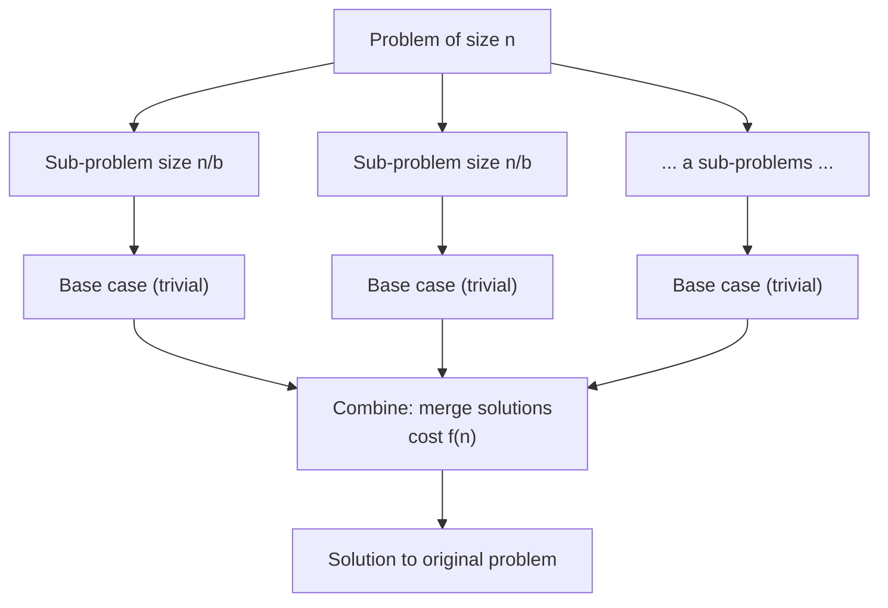
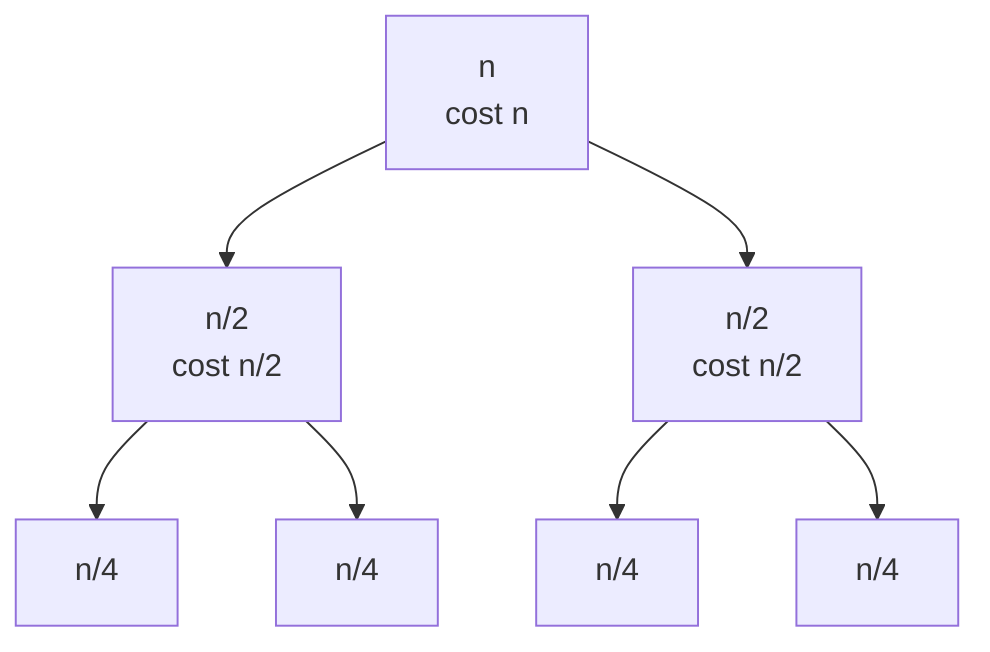
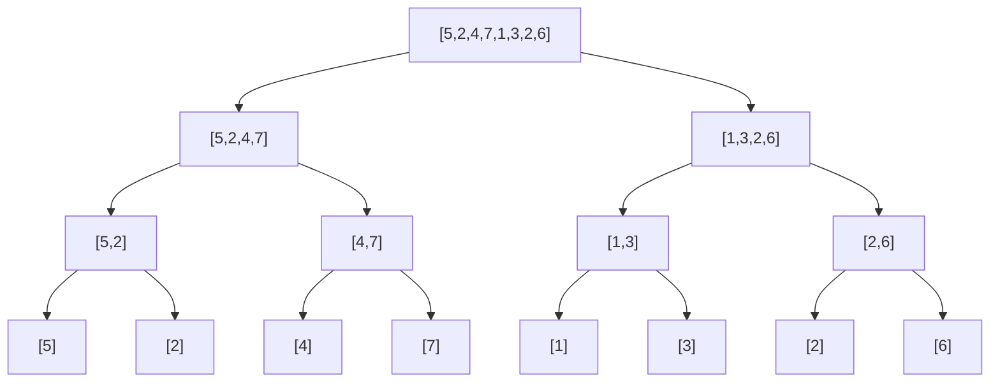

---
tags:
  - algorithms
  - divide-and-conquer
  - recurrences
  - quiz-prep
---

# Divide & Conquer

> [!note]- The paradigm
> **Divide & Conquer** solves a problem in three steps:
>
> 1. **Divide** — break the problem into smaller *independent* sub-problems of the same type.
> 2. **Conquer** — solve each sub-problem recursively (base case: trivial size).
> 3. **Combine** — merge the sub-solutions into a solution for the original problem.
>
> Cost model: if $a$ sub-problems of size $n/b$ each and combining costs $f(n)$, the running time follows the recurrence
>
> $$T(n) = a\,T(n/b) + f(n)$$



> [!tip]- When is D&C the right tool?
> - The problem can be split into **independent** sub-problems (if sub-problems overlap → **dynamic programming** is usually better).
> - Combining is cheap relative to the split (merge sort: O(n) merge vs O(n log n) total).
> - You can express the cost as a recurrence and solve it.

---

## 1. Solving Recurrences — the Math You Must Know

### 1.1 Substitution Method
Guess the form of the solution, prove it by **induction**. *Example:* guess $T(n) = 2T(n/2) + n$ is $O(n \log n)$, prove by induction with the inductive hypothesis $T(k) \le ck\log k$.

### 1.2 Recursion-Tree Method
Draw the tree of recursive calls, sum the work per level, sum over levels. *Example:*



For $T(n) = 2T(n/2) + n$: level $i$ has $2^i$ nodes each costing $n/2^i$ → **n per level**, $\log_2 n + 1$ levels → $T(n) = \Theta(n \log n)$.

### 1.3 Master Theorem *(the exam favorite)*

> [!important]- Master Theorem statement
> Let $T(n) = a\,T(n/b) + f(n)$ with $a \ge 1$, $b > 1$, and let $c_{crit} = \log_b a$ (the **critical exponent**). Compare $f(n)$ with $n^{c_{crit}}$:
>
> | Case | Condition on $f(n)$ | Solution |
> |------|--------------------|----------|
> | **1** | $f(n) = O(n^{c_{crit} - \epsilon})$ for some $\epsilon > 0$ | $T(n) = \Theta(n^{c_{crit}})$ |
> | **2** | $f(n) = \Theta(n^{c_{crit}} \log^k n)$ for $k \ge 0$ | $T(n) = \Theta(n^{c_{crit}} \log^{k+1} n)$ |
> | **3** | $f(n) = \Omega(n^{c_{crit} + \epsilon})$ **and** $a f(n/b) \le c f(n)$ for some $c < 1$ | $T(n) = \Theta(f(n))$ |
>
> Intuition: the winner is whichever grows faster — the **leaves** ($n^{c_{crit}}$) or the **root** ($f(n)$); case 2 is the tie.

> [!example]- Master Theorem in action
> ```python
> # Not Python — a worked cheat-sheet for the 3 cases.
> # Case 1: leaves dominate
> #   T(n) = 9T(n/3) + n          ->  c_crit = log_3(9) = 2, f(n) = n = O(n^(2-e))
> #   T(n) = Theta(n^2)
> #
> # Case 2: balanced
> #   T(n) = 2T(n/2) + n          ->  c_crit = log_2(2) = 1, f(n) = n
> #   T(n) = Theta(n log n)       (merge sort, closest pair, D&C hull)
> #   T(n) = T(2n/3) + 1          ->  c_crit = log_(3/2)(1) = 0, f(n) = 1
> #   T(n) = Theta(log n)         (ternary-ish search)
> #
> # Case 3: root dominates
> #   T(n) = 2T(n/2) + n^2        ->  c_crit = 1, f(n) = n^2 = Omega(n^(1+e))
> #   T(n) = Theta(n^2)
> ```

> [!warning]- Master Theorem traps
> - **Watch the exponent $k$ in case 2:** $T(n) = 2T(n/2) + n$ is case 2 with $k=0$ → $\Theta(n \log n)$, but $T(n) = 2T(n/2) + n \log n$ is case 2 with $k=1$ → $\Theta(n \log^2 n)$. Check $k$ carefully!
> - **Does not apply** to unbalanced splits like $T(n) = T(n-1) + n$ (Quicksort worst case → $\Theta(n^2)$) — use the recursion tree instead.
> - $a$ and $b$ must be **constants**; floor/ceil in the split don't change the answer.
> - Regularity condition in case 3 must hold (it almost always does in practice).

---

## 2. Classic D&C Algorithms

### 2.1 Binary Search — O(log n)

> [!example]- Python: binary search
> ```python
> def binary_search(arr, target):
>     """Iterative binary search on a sorted array. Returns index or -1."""
>     lo, hi = 0, len(arr) - 1
>     while lo <= hi:
>         mid = (lo + hi) // 2
>         if arr[mid] == target:
>             return mid
>         elif arr[mid] < target:
>             lo = mid + 1
>         else:
>             hi = mid - 1
>     return -1
> 
> print(binary_search([1, 3, 5, 7, 9, 11], 7))   # 3
> print(binary_search([1, 3, 5, 7, 9, 11], 4))   # -1
> ```
>
> Recurrence: $T(n) = T(n/2) + O(1)$ → **O(log n)** (Master Theorem case 2 with $c_{crit} = 0$, $f(n) = 1$).

### 2.2 Merge Sort — Θ(n log n)

1. **Divide:** split the array in half.
2. **Conquer:** recursively sort each half.
3. **Combine:** merge two sorted halves in O(n) — the merge is the heart of the algorithm.



> [!example]- Python: merge sort
> ```python
> def merge_sort(arr):
>     if len(arr) <= 1:
>         return arr
>     mid = len(arr) // 2
>     left = merge_sort(arr[:mid])       # conquer
>     right = merge_sort(arr[mid:])      # conquer
>     return merge(left, right)          # combine
> 
> def merge(a, b):
>     i = j = 0
>     out = []
>     while i < len(a) and j < len(b):   # two-pointer merge, O(n)
>         if a[i] <= b[j]:
>             out.append(a[i]); i += 1
>         else:
>             out.append(b[j]); j += 1
>     out += a[i:] + b[j:]
>     return out
> 
> print(merge_sort([5, 2, 4, 7, 1, 3, 2, 6]))  # [1,2,2,3,4,5,6,7]
> ```
>
> Recurrence: $T(n) = 2T(n/2) + \Theta(n)$ → **Θ(n log n)**. Stable, but uses **O(n)** extra space.

### 2.3 Quicksort — Θ(n log n) average, Θ(n²) worst

Partition around a **pivot** so smaller elements go left, larger go right; recurse on both sides. The partition itself does the "combine" (no work after recursion).

> [!example]- Python: quicksort (Lomuto partition)
> ```python
> def quicksort(arr):
>     if len(arr) <= 1:
>         return arr
>     pivot = arr[-1]                     # naive pivot choice
>     left  = [x for x in arr[:-1] if x <= pivot]
>     right = [x for x in arr[:-1] if x > pivot]
>     return quicksort(left) + [pivot] + quicksort(right)
> 
> print(quicksort([5, 2, 4, 7, 1, 3, 2, 6]))
> ```
>
> - Average: $T(n) = 2T(n/2) + \Theta(n)$ → **Θ(n log n)**
> - Worst (sorted input + bad pivot): $T(n) = T(n-1) + \Theta(n)$ → **Θ(n²)**
> - In-place version uses **O(log n)** stack space (vs merge sort's O(n)).

> [!note]- D&C vs "in-place" nuance
> Quicksort's recursive structure is D&C, but its *combine step is empty* — the work happens during the divide (partitioning). Merge sort does its work during combine. This contrast is a classic short-answer question: **"where does the work happen?"**

### 2.4 Maximum Subarray (D&C version) — Θ(n log n)

Find the contiguous subarray with the largest sum. The maximum crossing the middle is found by expanding left and right from the midpoint; the answer is the max of (left best, right best, crossing best).

> [!example]- Python: max subarray, D&C
> ```python
> def max_subarray(arr, lo, hi):
>     """Max subarray sum of arr[lo:hi+1]. Returns (best_sum, l, r)."""
>     if lo == hi:
>         return arr[lo], lo, hi
>     mid = (lo + hi) // 2
>     left_best  = max_subarray(arr, lo, mid)
>     right_best = max_subarray(arr, mid + 1, hi)
> 
>     # best crossing the middle: extend left from mid, right from mid+1
>     best_left_sum = float('-inf'); s = 0; l = mid
>     for i in range(mid, lo - 1, -1):
>         s += arr[i]
>         if s > best_left_sum:
>             best_left_sum = s; l = i
>     best_right_sum = float('-inf'); s = 0; r = mid + 1
>     for i in range(mid + 1, hi + 1):
>         s += arr[i]
>         if s > best_right_sum:
>             best_right_sum = s; r = i
>     crossing = (best_left_sum + best_right_sum, l, r)
>     return max(left_best, right_best, crossing, key=lambda t: t[0])
> 
> arr = [-2, 1, -3, 4, -1, 2, 1, -5, 4]
> print(max_subarray(arr, 0, len(arr) - 1))   # (6, 3, 6) -> [4,-1,2,1]
> ```

> [!tip]- Kadane's algorithm is better!
> The **O(n)** solution (Kadane) is greedy/DP: keep the best sum *ending at* each position. The D&C version exists mainly to illustrate the paradigm — mention **both** in an exam and you look strong. Recurrence: $T(n) = 2T(n/2) + \Theta(n)$ → Θ(n log n).

### 2.5 Closest Pair of Points — Θ(n log n)

Find the pair of points with the smallest Euclidean distance.

1. **Divide:** split by x-coordinate.
2. **Conquer:** closest pair in each half (recursively), distance $\delta$ = min of both.
3. **Combine:** check the **strip** of width $2\delta$ around the split line. Sort strip points by y, compare each point only with the next **7** (at most) — a packing argument shows few points can fit in a $\delta \times 2\delta$ box.

> [!example]- Python: closest pair (sketch with full strip check)
> ```python
> import math
> 
> def closest_pair(points):
>     px = sorted(points)                     # sort once by x
>     return _cp(px)[0]
> 
> def _cp(px):
>     n = len(px)
>     if n <= 3:                              # brute force base case
>         return min(((math.dist(a, b), a, b)
>                     for i, a in enumerate(px) for b in px[i + 1:]),
>                    default=(float('inf'), None, None))
>     mid = n // 2
>     d_l, a_l, b_l = _cp(px[:mid])
>     d_r, a_r, b_r = _cp(px[mid:])
>     d, a, b = min((d_l, a_l, b_l), (d_r, a_r, b_r))
> 
>     # strip: points within d of the midline
>     line_x = px[mid][0]
>     strip = [p for p in px if abs(p[0] - line_x) < d]
>     strip.sort(key=lambda p: p[1])          # sort by y (can be maintained)
>     for i, p in enumerate(strip):
>         for q in strip[i+1: i+8]:           # only next 7 needed in theory
>             if q[1] - p[1] >= d:
>                 break
>             dd = math.dist(p, q)
>             if dd < d:
>                 d, a, b = dd, p, q
>     return d, a, b
> 
> pts = [(2, 3), (12, 30), (40, 50), (5, 1), (12, 10), (3, 4)]
> print(closest_pair(pts))    # 1.414... (2,3)-(3,4)
> ```

> [!warning]- The 7-point (or 8-point) rule
> The combine step is O(n) **only because** each strip point needs comparison with a *constant* number of successors (≤ 7 for the standard $\delta \times 2\delta$ rectangle argument). If you compare every strip point with every other, the combine becomes O(n²) and the whole algorithm degrades to O(n log² n) or worse. This "why is the constant small?" question appears in exams constantly.

### 2.6 Karatsuba Multiplication — Θ(n^1.585)

Multiply two $n$-digit numbers with **3** multiplications of size $n/2$ instead of 4:

For $x = x_1 10^{n/2} + x_0$, $y = y_1 10^{n/2} + y_0$:

$$
xy = z_2 10^n + z_1 10^{n/2} + z_0
$$
where $z_2 = x_1y_1$, $z_0 = x_0y_0$, and $z_1 = (x_1 + x_0)(y_1 + y_0) - z_2 - z_0$.

> [!example]- Python: Karatsuba
> ```python
> def karatsuba(x, y):
>     """Multiply two non-negative integers."""
>     if x < 10 or y < 10:
>         return x * y
>     n = max(len(str(x)), len(str(y)))
>     m = n // 2
> 
>     x1, x0 = divmod(x, 10 ** m)     # split: x = x1 * 10^m + x0
>     y1, y0 = divmod(y, 10 ** m)
> 
>     z2 = karatsuba(x1, y1)          # 3 recursive calls, not 4!
>     z0 = karatsuba(x0, y0)
>     z1 = karatsuba(x1 + x0, y1 + y0) - z2 - z0
> 
>     return z2 * 10 ** (2 * m) + z1 * 10 ** m + z0
> 
> print(karatsuba(1234, 5678))        # 7006652
> ```
>
> Recurrence: $T(n) = 3T(n/2) + \Theta(n)$ → $c_{crit} = \log_2 3 \approx 1.585$ → **Θ(n^1.585)** — beats schoolbook Θ(n²).

### 2.7 Strassen's Matrix Multiplication — Θ(n^2.807)

Multiply $n \times n$ matrices with **7** recursive multiplications of size $n/2$ instead of 8 (the "7 products" trick with additions/subtractions of block sums):

$$
\begin{bmatrix} A & B \\ C & D \end{bmatrix} \begin{bmatrix} E & F \\ G & H \end{bmatrix}
= \begin{bmatrix} P_5 + P_4 - P_2 + P_6 & P_1 + P_2 \\ P_3 + P_4 & P_1 + P_5 - P_3 - P_7 \end{bmatrix}
$$

> [!example]- Strassen's 7 products (memorize the pattern, not the algebra)
> ```python
> # P1 = A(F - H)          P2 = (A + B)H          P3 = (C + D)E
> # P4 = D(G - E)          P5 = (A + D)(E + H)    P6 = (B - D)(G + H)
> # P7 = (A - C)(E + F)
> #
> # Result blocks:
> #   top-left     = P5 + P4 - P2 + P6
> #   top-right    = P1 + P2
> #   bottom-left  = P3 + P4
> #   bottom-right = P1 + P5 - P3 - P7
> ```
>
> Recurrence: $T(n) = 7T(n/2) + \Theta(n^2)$ → $c_{crit} = \log_2 7 \approx 2.807$ → **Θ(n^2.807)**, beating the naive Θ(n³). (Theoretical record is ~O(n^2.37), but Strassen is the classic exam answer.)

### 2.8 D&C Convex Hull — Θ(n log n)

Split points by x, compute hulls recursively, merge via **upper & lower common tangents**. See [[01-Convex-Hull]] §3.6.

---

## 3. When D&C Fails or Is Not the Best Choice

> [!warning]- Watch for these
> - **Overlapping sub-problems** → same sub-problem solved many times → use **dynamic programming** (e.g. Fibonacci with recursion is $2^{n/2}$; with memoization it's O(n)).
> - **Expensive combine** → if combining is $\Theta(n^2)$, the whole algorithm may be no better than brute force.
> - **Small inputs** → recursion overhead makes D&C slower than insertion sort for tiny $n$; production sorts switch strategies (Timsort's hybrid approach).
> - **Not independent sub-problems** → e.g. closest pair "needs" cross-half pairs, handled by the strip trick; if the coupling is stronger, D&C breaks.

---

## 4. Complexity Summary

> [!summary]- Recurrence → complexity cheat-sheet
>
> | Algorithm | Recurrence | $c_{crit}$ | Complexity |
> |-----------|-----------|-----------|------------|
> | Binary Search | $T(n) = T(n/2) + O(1)$ | 0 | Θ(log n) |
> | Merge Sort | $T(n) = 2T(n/2) + Θ(n)$ | 1 | Θ(n log n) |
> | Quicksort (avg) | $T(n) = 2T(n/2) + Θ(n)$ | 1 | Θ(n log n) |
> | Quicksort (worst) | $T(n) = T(n-1) + Θ(n)$ | — | Θ(n²) |
> | Max Subarray (D&C) | $T(n) = 2T(n/2) + Θ(n)$ | 1 | Θ(n log n) |
> | Closest Pair | $T(n) = 2T(n/2) + Θ(n)$ | 1 | Θ(n log n) |
> | D&C Convex Hull | $T(n) = 2T(n/2) + Θ(n)$ | 1 | Θ(n log n) |
> | Karatsuba | $T(n) = 3T(n/2) + Θ(n)$ | $\log_2 3 \approx 1.585$ | Θ(n^1.585) |
> | Strassen | $T(n) = 7T(n/2) + Θ(n²)$ | $\log_2 7 \approx 2.807$ | Θ(n^2.807) |
> | Naive MatMul | $T(n) = 8T(n/2) + Θ(n²)$ | 3 | Θ(n³) |
>
> Note how the "D&C trio" (Merge Sort, Closest Pair, D&C Hull) all share $T(n) = 2T(n/2) + \Theta(n)$ → same Θ(n log n).

---

## 5. Practice Questions

> [!question]- Quick self-check
> 1. Solve $T(n) = 4T(n/2) + n$ using the Master Theorem. (Answer: Θ(n²).)
> 2. Solve $T(n) = 2T(n/2) + n \log n$. Why is this *not* a clean Master Theorem case-3 application? (It is case 2 with $k=1$ → Θ(n log² n).)
> 3. Why can't the Master Theorem solve $T(n) = T(n-1) + n$? What is its solution?
> 4. In closest pair, why do we only compare each strip point with a constant number of successors?
> 5. Karatsuba uses 3 multiplications; Strassen uses 7. What would their recurrences look like with 2 and 6, and why don't those work?
>
> <details><summary>Hints</summary>
>
> 1. $c_{crit} = \log_2 4 = 2 > 1 = f(n)$ → case 1 → Θ(n²).
> 2. $f(n) = n \log n = Θ(n^{c_{crit}} \log^1 n)$ → case 2, $k=1$ → Θ(n log² n).
> 3. Split is not by a constant factor $b > 1$ — the recursion tree has $n$ levels each costing Θ(n) → Θ(n²).
> 4. Packing argument: at most 7 other points can sit inside a $\delta \times 2\delta$ rectangle without two being closer than $\delta$ (pigeonhole over 8 sub-squares).
> 5. 2 mults would need $T(n) = 2T(n/2) + Θ(n)$ → Θ(n log n) — but no known way to combine with 2; 6 mults gives Θ(n^log_2 6) ≈ n^2.585, only slightly better than 7... and 6-mult formulas exist (Winograd) but the 7-mult version is the classic.
> </details>

---

## 6. One-Page Summary

> [!success]- The whole topic in 5 bullets
> - **Divide → Conquer → Combine**; cost = recurrence $T(n) = aT(n/b) + f(n)$.
> - Solve recurrences with **substitution**, **recursion trees**, or the **Master Theorem** (compare $f(n)$ with $n^{\log_b a}$).
> - Workhorse examples: Merge Sort & Closest Pair & D&C Hull all run $2T(n/2) + Θ(n)$ = **Θ(n log n)**.
> - Multiply smarter: **Karatsuba** (3 mults, n^1.585) and **Strassen** (7 mults, n^2.807) beat the naive algorithms.
> - If sub-problems **overlap** → that's dynamic programming, not D&C.
