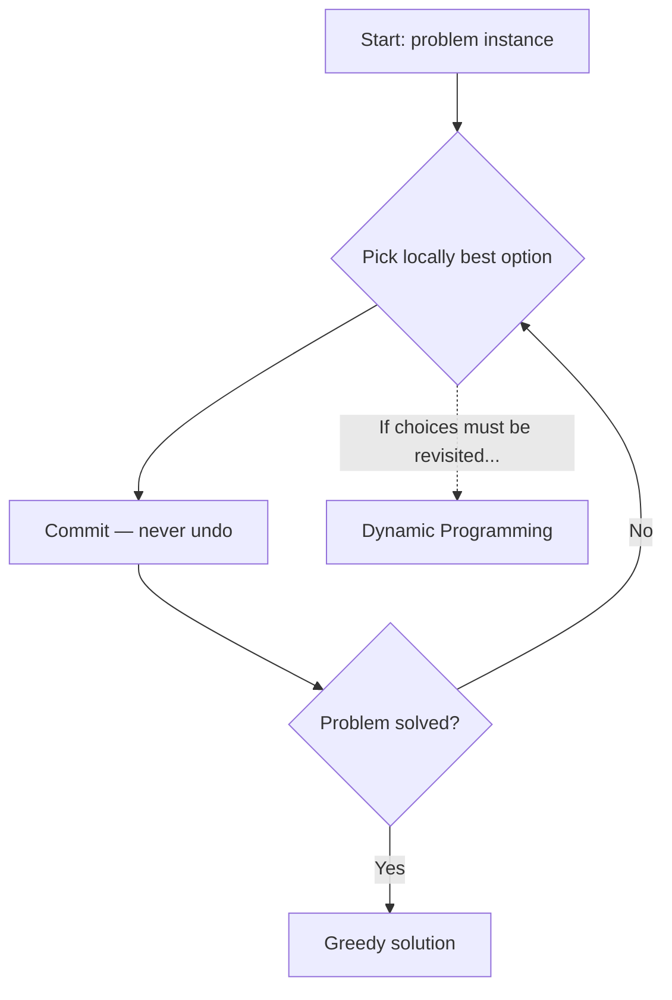

---
tags:
  - algorithms
  - greedy
  - optimization
  - quiz-prep
---

# Greedy Algorithm

> [!note]- Definition
> A **greedy algorithm** builds a solution step by step. At every step it makes the choice that is **locally optimal** — the best-looking option *right now* — and **never revisits or undoes** a previous choice.
>
> "Take what looks best, commit, move on."
>
> It works only for problems with two properties:
>
> 1. **Greedy-choice property** — a globally optimal solution can be built by making locally optimal (greedy) choices.
> 2. **Optimal substructure** — an optimal solution to the problem contains optimal solutions to its sub-problems.
>
> The same two properties also define dynamic programming; the difference is *how many* sub-problems you must solve (see §5).



> [!tip]- The 4-step design recipe (exam answer template)
> 1. **Cast** the problem as: pick a set/sequence of items, with a feasibility constraint and an objective.
> 2. **Define** the greedy choice rule (e.g. "earliest finish time", "highest value/weight ratio").
> 3. **Prove** optimal substructure: an optimal solution contains an optimal solution to the remaining sub-problem.
> 4. **Prove** the greedy-choice property: there exists an optimal solution that starts with the greedy choice (exchange argument).

---

## 1. Proving Correctness — the Exchange Argument

> [!important]- The exchange argument, generalized
> To prove greedy is optimal, show you can **transform** any optimal solution into the greedy one *without losing optimality*:
>
> 1. Let $G$ = greedy solution, $O$ = an optimal solution.
> 2. Find the **first position** where $G$ and $O$ differ.
> 3. **Exchange**: swap the greedy choice into $O$. Show the result $O'$ is still feasible and **no worse** than $O$.
> 4. Repeat until $O' = G$ → greedy is optimal.
>
> A second common technique is **staying ahead**: show that after $k$ steps, greedy's partial solution is at least as good as *any* partial solution's first $k$ elements (e.g. "greedy's k-th finished activity ends no later than the optimal's k-th").

> [!example]- Worked exchange argument: activity selection
> ```python
> # Setup: activities (start, finish). Greedy rule: pick the one that
> # finishes EARLIEST and is compatible with what we've picked so far.
> #
> # Proof sketch (exchange argument):
> #   Let a1 = greedy's first choice (earliest finish time f1).
> #   Let O = optimal; its first activity b1 has finish time g1 >= f1.
> #   Swap b1 -> a1. Still feasible: a1 finishes no later than b1, so it
> #   cannot overlap any activity after b1 in O (they all start after g1).
> #   |O'| = |O|, so O' is still optimal. Repeat for every position.
> #   => Greedy solution is optimal. QED.
> ```

---

## 2. Classic Greedy Problems

### 2.1 Activity Selection — O(n log n)

Maximize the number of non-overlapping activities. **Greedy rule: always pick the compatible activity with the earliest finish time.**

> [!example]- Python: activity selection
> ```python
> def activity_selection(activities):
>     """activities: list of (start, finish). Returns max compatible subset."""
>     acts = sorted(activities, key=lambda a: a[1])   # sort by finish time
>     picked = []
>     last_finish = float('-inf')
>     for start, finish in acts:
>         if start >= last_finish:                    # compatible
>             picked.append((start, finish))
>             last_finish = finish
>     return picked
> 
> acts = [(1, 4), (3, 5), (0, 6), (5, 7), (3, 9), (5, 9),
>         (6, 10), (8, 11), (8, 12), (2, 14), (12, 16)]
> print(activity_selection(acts))
> # [(1,4), (5,7), (8,11), (12,16)]  -> 4 activities, optimal
> ```
>
> Complexity: **O(n log n)** (sorting dominates). Proof: exchange argument (above).

> [!warning]- Why "earliest *start*" and "shortest duration" fail
> - **Earliest start:** activity (0, 100) blocks everything → 1 activity instead of many.
> - **Shortest duration:** (5, 6) blocks (4, 8) and (4, 7)... pick (4,8) and (8,12) = 2 > 1.
> - **Fewest conflicts:** can also fail (ties and edge effects).
> - Only **earliest finish** is provably optimal — classic exam question: "which greedy rule fails, and why?"

### 2.2 Fractional Knapsack — O(n log n)

Fill a knapsack of capacity $W$ maximizing value; you may take **fractions** of items. **Greedy rule: take items in decreasing value/weight ratio, take as much as fits.**

> [!example]- Python: fractional knapsack
> ```python
> def fractional_knapsack(items, capacity):
>     """items: list of (value, weight)."""
>     items = sorted(items, key=lambda it: it[0] / it[1], reverse=True)
>     total = 0.0
>     for value, weight in items:
>         if capacity >= weight:
>             capacity -= weight
>             total += value
>         else:
>             total += value * (capacity / weight)    # take the fraction
>             break
>     return total
> 
> items = [(60, 10), (100, 20), (120, 30)]   # ratios: 6, 5, 4
> print(fractional_knapsack(items, 50))      # 240.0 (all of 1&2, 2/3 of 3)
> ```

> [!danger]- Fractional vs 0/1 knapsack — the #1 confusion
> | | Fractional Knapsack | 0/1 Knapsack |
> |---|---|---|
> | Can you take part of an item? | Yes | No (take or leave) |
> | Best approach | **Greedy** by value/weight ratio | **Dynamic programming** O(n·W) |
> | Why greedy fails on 0/1 | — | The best ratio item may fill the bag and block a better combination (see counterexample in §6) |
>
> Exam question almost guaranteed: **"Why does greedy work for fractional but not 0/1 knapsack?"** Answer: fractional has the greedy-choice property (you can always top up with the best ratio); 0/1 doesn't, because taking an item changes capacity discretely and blocks future choices.

### 2.3 Huffman Coding — O(n log n)

Build a **prefix-free** binary code minimizing total encoded length. **Greedy rule: repeatedly merge the two symbols with the smallest frequencies.**

> [!example]- Python: Huffman tree
> ```python
> import heapq
> 
> def huffman(freqs):
>     """freqs: dict symbol -> frequency. Returns dict symbol -> code string."""
>     heap = [[w, [sym, ""]] for sym, w in freqs.items()]
>     heapq.heapify(heap)
>     while len(heap) > 1:
>         lo = heapq.heappop(heap)        # two smallest
>         hi = heapq.heappop(heap)
>         for pair in lo[1:]:
>             pair[1] = '0' + pair[1]
>         for pair in hi[1:]:
>             pair[1] = '1' + pair[1]
>         heapq.heappush(heap, [lo[0] + hi[0]] + lo[1:] + hi[1:])
>     return dict(sorted(heap[0][1:], key=lambda p: len(p[1])))
> 
> print(huffman({'a': 45, 'b': 13, 'c': 12, 'd': 16, 'e': 9, 'f': 5}))
> # {'a': '0', 'c': '100', 'b': '101', 'd': '111', 'f': '1100', 'e': '1101'}
> # Most frequent symbol 'a' gets the shortest code — greedy pays off.
> ```

> [!note]- Why greedy is optimal here
> Two properties make it work:
> 1. **Optimal substructure:** in an optimal tree for $C$, the two lowest-frequency symbols are *siblings at maximum depth*; replacing them by their parent yields an optimal tree for $C'$.
> 2. **Greedy choice:** merging the two smallest frequencies is always part of some optimal tree (exchange argument: swap any deepest pair with the two smallest, total cost doesn't increase).
>
> This is one of the few greedy proofs you should be able to outline fully.

### 2.4 Dijkstra's Shortest Path — O((V+E) log V)

Single-source shortest paths on graphs with **non-negative** weights. **Greedy rule: repeatedly finalize the unvisited vertex with the smallest tentative distance.**

> [!example]- Python: Dijkstra
> ```python
> import heapq
> 
> def dijkstra(graph, source):
>     """graph: dict node -> list of (neighbor, weight). Returns dist dict."""
>     dist = {node: float('inf') for node in graph}
>     dist[source] = 0
>     pq = [(0, source)]                      # (distance, node) min-heap
>     while pq:
>         d, u = heapq.heappop(pq)
>         if d > dist[u]:
>             continue                        # stale heap entry
>         for v, w in graph[u]:
>             nd = d + w
>             if nd < dist[v]:
>                 dist[v] = nd
>                 heapq.heappush(pq, (nd, v))
>     return dist
> 
> g = {
>     'A': [('B', 4), ('C', 2)],
>     'B': [('C', 1), ('D', 5)],
>     'C': [('D', 8), ('E', 10)],
>     'D': [('E', 2)],
>     'E': [],
> }
> print(dijkstra(g, 'A'))   # {'A':0, 'C':2, 'B':4, 'D':9, 'E':11}
> ```

> [!warning]- Dijkstra's failure modes (exam favorites)
> - **Negative edges → wrong answer.** Dijkstra finalizes nodes too early; a later negative edge can offer a shorter path to an already-finalized node.
> - **Negative cycles** are worse — no shortest path exists at all (use Bellman–Ford).
> - The greedy proof is by induction on the number of finalized nodes: "the k-th finalized node has its true shortest distance" — be ready to state it.

### 2.5 Minimum Spanning Tree — Kruskal & Prim

**MST:** connect all vertices with minimum total edge weight.

- **Kruskal:** sort edges by weight; add an edge if it doesn't create a cycle (union-find). **Greedy rule: smallest edge first.** O(E log E).
- **Prim:** grow one tree from a start vertex, always adding the cheapest edge crossing the cut. **Greedy rule: closest vertex to the tree.** O(E log V).

> [!example]- Python: Kruskal's MST
> ```python
> def kruskal(n, edges):
>     """edges: list of (weight, u, v). Returns MST as list of edges."""
>     parent = list(range(n))
>     def find(x):
>         while parent[x] != x:
>             parent[x] = parent[parent[x]]   # path compression
>             x = parent[x]
>         return x
>     def union(a, b):
>         ra, rb = find(a), find(b)
>         if ra != rb:
>             parent[ra] = rb
>             return True
>         return False
> 
>     mst = []
>     for w, u, v in sorted(edges):           # greedy: lightest edge first
>         if union(u, v):
>             mst.append((w, u, v))
>     return mst
> 
> edges = [(10, 0, 1), (6, 0, 2), (5, 0, 3), (15, 1, 3), (4, 2, 3)]
> print(kruskal(4, edges))   # [(4,2,3), (5,0,3), (10,0,1)]  total 19
> ```

> [!example]- Python: Prim's MST
> ```python
> import heapq
> 
> def prim(graph, start=0):
>     """graph: dict node -> list of (neighbor, weight)."""
>     visited = {start}
>     pq = [(w, start, v) for v, w in graph[start]]
>     heapq.heapify(pq)
>     mst = []
>     while pq:
>         w, u, v = heapq.heappop(pq)
>         if v in visited:
>             continue
>         visited.add(v)
>         mst.append((w, u, v))
>         for nxt, w2 in graph[v]:
>             if nxt not in visited:
>                 heapq.heappush(pq, (w2, v, nxt))
>     return mst
> ```
>
> Correctness of both rests on the **cut property**: for any cut, the lightest edge crossing it belongs to *some* MST — that's the greedy-choice property for MSTs.

### 2.6 Coin Change — when greedy works and when it doesn't

**Greedy rule: always take the largest coin that doesn't overshoot.** Works for *canonical* systems (1, 5, 10, 25 — US coins), **fails** for others.

> [!example]- Python: greedy coin change + counterexample
> ```python
> def greedy_coins(coins, amount):
>     """Returns count of coins using largest-first greedy."""
>     coins = sorted(coins, reverse=True)
>     count, remaining = 0, amount
>     for c in coins:
>         take = remaining // c
>         count += take
>         remaining -= take * c
>     return count if remaining == 0 else float('inf')
> 
> # US system: greedy is optimal
> print(greedy_coins([1, 5, 10, 25], 30))    # 3  (25 + 5)
> 
> # Counterexample: coins {1, 3, 4}, amount 6
> print(greedy_coins([1, 3, 4], 6))          # 3  (4 + 1 + 1)  -- WRONG
> # Optimal: 3 + 3 = 2 coins. Greedy fails!
> ```
>
> Why? Greedy's 4-coin choice blocks the two-3s combination. 0/1-knapsack-like discreteness. When greedy fails → **dynamic programming** (O(amount × #coins)).

### 2.7 Job Sequencing with Deadlines — O(n log n + n·d)

Maximize profit scheduling unit-time jobs, each with a deadline. **Greedy rule: process jobs by decreasing profit; schedule each in its latest free slot before the deadline.**

> [!example]- Python: job sequencing
> ```python
> def job_scheduling(jobs, max_deadline):
>     """jobs: list of (profit, deadline). Returns scheduled jobs."""
>     jobs = sorted(jobs, reverse=True)       # by profit descending
>     slots = [None] * (max_deadline + 1)     # slot t = free time unit t
>     for profit, deadline in jobs:
>         for t in range(min(deadline, max_deadline), 0, -1):
>             if slots[t] is None:            # latest free slot -> greedy
>                 slots[t] = profit
>                 break
>     return [p for p in slots if p is not None]
> 
> jobs = [(35, 3), (30, 4), (25, 4), (20, 2), (15, 3), (12, 1), (5, 2)]
> print(job_scheduling(jobs, 4))   # [20, 25, 35, 30] -> total profit 110
> ```

### 2.8 Interval Partitioning (Classroom Scheduling)

Schedule all intervals on the minimum number of resources (classrooms). **Greedy rule: sort by start time; put each interval in any free room (e.g. the one that frees earliest); if none, open a new room.** Equivalent to computing the **maximum depth** of interval overlap.

> [!tip]- The one-line connection
> Interval *selection* (2.1) maximizes the number of **compatible** intervals on ONE resource; interval *partitioning* minimizes the number of resources for **all** intervals. Different objectives, both greedy — know which is which.

---

## 3. Greedy vs Dynamic Programming

> [!summary]- When to use which
>
> | | Greedy | Dynamic Programming |
> |---|---|---|
> | Choice at each step | Locally optimal, **final** (never undone) | Considers all options, keeps many |
> | Sub-problems solved | One (the chosen path) | All overlapping sub-problems |
> | Memory | Usually O(1)–O(n) | Table O(n·W), O(n²)… |
> | Correctness proof | Exchange / staying-ahead argument | Optimal substructure + overlapping sub-problems |
> | Typical problems | Activity selection, Huffman, MST, Dijkstra | 0/1 knapsack, LCS, edit distance, matrix chain |
> | Key property | **Greedy-choice property** | Overlapping sub-problems |
>
> **Rule of thumb:** if you can't prove the greedy-choice property, use DP. Greedy is DP with only one "surviving" partial solution.

---

## 4. When Greedy Fails — Must-Know Counterexamples

> [!warning]- The classic failures
> 1. **0/1 Knapsack** — items (value, weight): (60,10), (100,20), (120,30), capacity 50. Ratio-greedy takes item 1, then item 2 → 160. Optimal: items 2 + 3 = **220**. (Fractional version: greedy takes all of 1 & 2 plus 20/30 of item 3 = 240 — greedy *does* work there.)
> 2. **Coin change** — coins {1, 3, 4}, amount 6 → greedy 3 coins, optimal 2.
> 3. **Shortest path with negative edges** — Dijkstra finalizes too early and misses cheaper later routes.
> 4. **Travelling Salesman (nearest neighbor)** — the nearest-city heuristic can force a huge final edge; no constant-factor guarantee.
> 5. **Longest path / maximum clique** — greedy picks the highest-degree vertex, but optimal clique may avoid it.
>
> Exam pattern: "Give a counterexample showing greedy fails for X" → pick the smallest instance you can find and *trace both greedy and optimal*.

---

## 5. Complexity Summary

> [!summary]- Greedy problems at a glance
>
> | Problem | Greedy rule | Time | Key proof |
> |---------|-------------|------|----------|
> | Activity Selection | Earliest finish time | O(n log n) | Exchange argument |
> | Fractional Knapsack | Best value/weight | O(n log n) | Exchange / top-up argument |
> | Huffman Coding | Merge two smallest freqs | O(n log n) | Sibling lemma + exchange |
> | Dijkstra | Smallest tentative dist | O((V+E) log V) | Induction on finalized set |
> | Kruskal MST | Lightest edge, no cycle | O(E log E) | Cut property |
> | Prim MST | Cheapest edge across cut | O(E log V) | Cut property |
> | Job Sequencing | Highest profit, latest slot | O(n log n + n·d) | Exchange argument |
> | Coin Change (canonical) | Largest coin first | O(#coins) | System-specific, NOT general |

---

## 6. Practice Questions

> [!question]- Quick self-check
> 1. Activities **(1, 5), (5, 8), (4, 6)**. Durations: 4, 3, 2. Shortest-duration greedy picks (4, 6) first, then nothing is compatible → 1 activity. Optimal: (1, 5) + (5, 8) = **2**. Greedy fails.
> 2. Why does the greedy ratio rule work for fractional but not 0/1 knapsack?
> 3. Sketch the exchange argument for Huffman coding's "merge two smallest" rule.
> 4. Dijkstra with one negative edge: construct a 3-node graph where it returns the wrong answer.
> 5. True or false: "If a problem has optimal substructure, greedy always works." Justify.
>
> <details><summary>Hints</summary>
>
> 1. **(1, 5), (5, 8), (4, 6)**: durations 4, 3, 2. Shortest-duration greedy picks (4, 6) → overlaps both others → 1 activity. Optimal: (1, 5) + (5, 8) = **2**. Greedy fails.
> 2. Fractional knapsack's LP relaxation is integral-friendly: you can always replace unused capacity with the best remaining ratio without hurting value. 0/1's integrality constraint breaks this — taking an item consumes discrete capacity and can block a higher-value combination (coins {1,3,4} @ 6).
> 3. In an optimal tree, the two deepest symbols are siblings; swap them with the two smallest-frequency symbols — the weighted path length can't increase (smallest frequencies at greatest depth minimizes $\sum f_i \cdot depth_i$). Hence merging the two smallest is safe.
> 4. **A→B = 2, A→C = 5, C→B = −4**: Dijkstra pops and finalizes B at distance 2 first. Later it pops C (5) and relaxes C→B to 5 + (−4) = **1 < 2** — but B is already finalized, so the reported answer stays 2. True shortest A→B = 1 via C. The key: the negative edge must be relaxed **after** its target has already been finalized.
> 5. **False.** Optimal substructure is necessary but not sufficient; you also need the greedy-choice property. 0/1 knapsack has optimal substructure yet greedy fails.
> </details>

---

## 7. One-Page Summary

> [!success]- The whole topic in 5 bullets
> - Greedy = **locally optimal, irreversible** choices; correct only with **greedy-choice property + optimal substructure**.
> - Prove with **exchange arguments** (transform any optimum into greedy's solution) or **staying-ahead** induction.
> - Workhorse problems: **activity selection** (earliest finish), **fractional knapsack** (best ratio), **Huffman** (merge smallest), **Dijkstra/Kruskal/Prim** (graph greedy).
> - Greedy vs DP: greedy keeps ONE partial solution; DP keeps all. No greedy-choice property → DP.
> - Always be ready with a **counterexample** (coin {1,3,4}@6, 0/1 knapsack, negative-edge Dijkstra).
