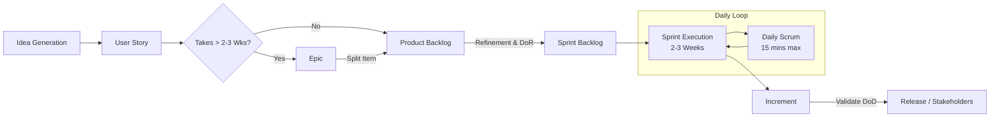
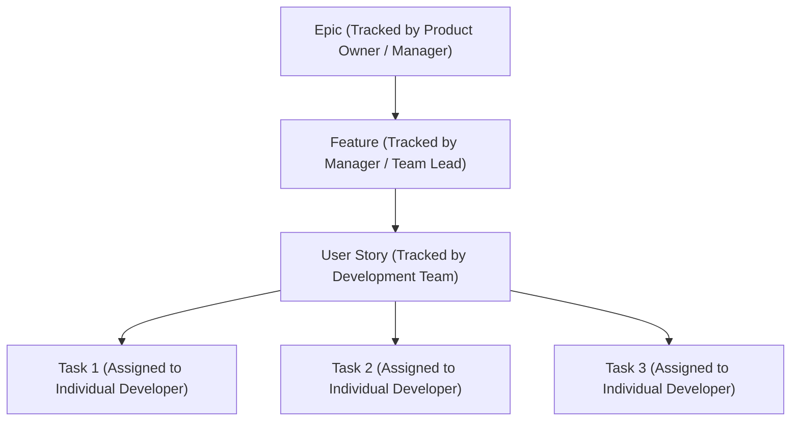
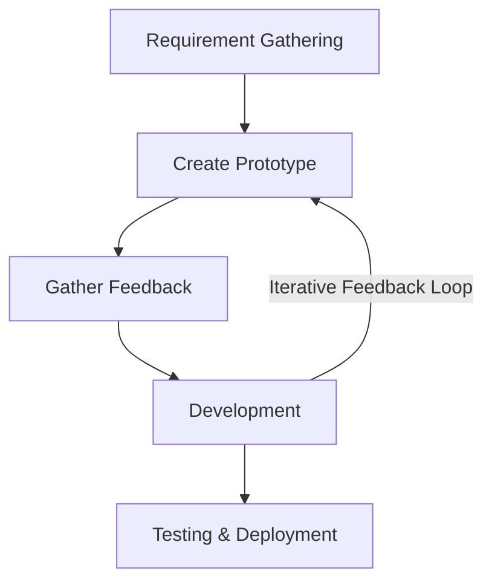
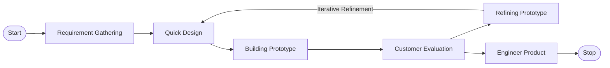

---

## 📌 Exam Analysis & Key Lessons
> [!warning] Exam Insight: Acceptance Criteria & Edge Cases
> - **Common Student Pitfall:** Average marks for writing **Acceptance Criteria** were low because students failed to identify and document **edge cases** and **negative paths**.
> - **Remedy:** Always consider positive paths, negative paths, boundary conditions, edge cases, and exception handling when writing acceptance criteria.

---

## 1. Traditional vs. Agile Methodologies

### 1.1 Problems in Traditional SDLC (Waterfall)
- **Time Constraints:** In traditional SDLC models, predicting the exact duration of each phase upfront is difficult.
- **Delayed Feedback:** Execution progress cannot be truly understood or validated until actual coding begins.
- **Irreversibility:** Traditional models do not allow easy backtracking to previous phases without massive time loss.

```
Waterfall Model (Rigid):
[ Planning ] ──> [ Design ] ──> [ Development ] ──> [ Testing ] ──> [ Deployment ]
     │                                                                   │
     └────────────────────────── Cannot Go Back ─────────────────────────┘
```

> [!example] The Tree Swing Example
> If a team plans to build a "swing on a tree" during the initial planning phase, but discovers later during deployment that the outcome is unusable, reverting to the planning phase causes severe project delay and wasted development hours.

---

### 1.2 Core Concepts: Incremental vs. Iterative

```
              ┌─────────────────────────────────────────┐
              │           AGILE METHODOLOGY             │
              └────────────────────┬────────────────────┘
                                   │
         ┌─────────────────────────┴─────────────────────────┐
         ▼                                                   ▼
┌──────────────────┐                               ┌──────────────────┐
│   INCREMENTAL    │                               │    ITERATIVE     │
│ (Piece by Piece) │                               │ (Adding Info/   │
└────────┬─────────┘                               │  Refining Stuff) │
         │                                         └────────┬─────────┘
         │                                                  │
         ▼                                                  ▼
Build module-by-module                            Refine existing feature
(e.g., Auth ──> Payment)                          (e.g., Add Email ──> Add Gender)
```

- **Incremental:** Software is built piece by piece (feature by feature).
  - *Example:* First release the **Authentication** module, then the **Booking** module, then **Payment**, and finally **Consultation**.
- **Iterative:** Functionality is continually refined and expanded based on feedback.
  - *Example:* Authentication initial release contains `Username`, `Email`, and `Password`. The next iteration adds `Age` and `Gender` fields based on revised user needs.
- **Agile Combination:** Agile blends both **Incremental** and **Iterative** approaches.

---

## 2. The Agile Manifesto

### 2.1 The 4 Core Values

> [!abstract] Agile Manifesto Values
> 1. **Individuals & Interactions** *over* Processes and Tools
> 2. **Working Software** *over* Comprehensive Documentation
> 3. **Customer Collaboration** *over* Contract Negotiation
> 4. **Responding to Change** *over* Following a Plan

- **Key Goal:** Maximize productive output within a defined time constraint while maintaining adaptability for the product to evolve.
- **Hybrid Approaches:** Blends traditional practices with Agile frameworks when required by domain constraints.

> [!note] When to use Traditional Waterfall?
> For **sensitive, high-risk, or mission-critical applications** (e.g., aviation safety systems, medical device software, or regulatory platforms like **NATA**), rigid documentation via detailed SRS documents and Waterfall models are preferred because requirements must remain strictly locked.

---

## 3. Agile / Scrum Framework & Lifecycle

### 3.1 Overview of Frameworks
Common Agile frameworks include:
- **Scrum** (Primary focus)
- **Extreme Programming (XP)**
- **Kanban**
- **Scaled Agile Framework (SAFe)**

---

### 3.2 End-to-End Agile Lifecycle Workflow



> [!abstract]- Detailed Step-by-Step Workflow Breakdown
> 1. **Product Backlog (Master Wishlist):**
>    - **What it is:** The centralized, prioritized master list of all features, user stories, bug fixes, and technical tasks owned by the Product Owner (PO).
>    - **Analogy:** A restaurant's full menu of everything customers might order.
> 
> 2. **Refinement & Definition of Ready (DoR):**
>    - **Refinement (Grooming):** PO and dev team clarify vague stories, break them down, and estimate effort (using Fibonacci/Planning Poker).
>    - **Definition of Ready (DoR):** Entrance quality gate before a story can enter a sprint (clear acceptance criteria, estimated, no blockers).
> 
> 3. **Sprint Backlog (2-Week To-Do List):**
>    - **What it is:** The small set of high-priority user stories pulled from the top of the Product Backlog that the development team commits to build in the upcoming 2-3 week sprint.
> 
> 4. **Sprint Execution (2-3 Weeks):**
>    - **What it is:** A strictly timeboxed working phase (2-3 weeks) where developers write code, build features, and run unit tests without external scope interruptions.
> 
> 5. **Daily Loop (Daily Scrum / Standup):**
>    - **What it is:** A daily $\le 15$-minute meeting where team members report: (1) what was done yesterday, (2) what will be done today, and (3) any blockers/impediments.
> 
> 6. **Increment (Working Software Piece):**
>    - **What it is:** The tangible, additive, working software component produced at the end of the sprint execution.
> 
> 7. **Validate Definition of Done (DoD):**
>    - **Definition of Done (DoD):** Exit quality gate checked before shipping (code reviewed, unit tests passed, backwards compatibility verified, acceptance criteria met).
> 
> 8. **Release / Stakeholders:**
>    - **What it is:** Presenting the tested increment to clients/stakeholders in a Sprint Review demo. Feedback collected feeds directly back into the Product Backlog for the next iteration.


---

### 3.3 Roles and Artifacts

| Role | Key Responsibility |
| :--- | :--- |
| **Product Owner (PO)** | Owns and prioritizes the **Product Backlog**; represents stakeholder interests. |
| **Scrum Master (SM)** | Acts as a team lead/facilitator; removes blockers; ensures Scrum practices are followed. |
| **Development Team** | Cross-functional team responsible for delivering working software increments. |
| **Stakeholders** | End-users/clients who review deliverables at the end of sprints. |

---

### 3.4 Key Ceremonies & Timeboxes

> [!tip] Timebox Rules & Best Practices
> - **Daily Standup / Scrum:** Held daily; strictly limited to **$\le 15$ minutes**.
> - **Backlog Refinement Effort:** Creating and refining backlogs should take **no more than 10%** of total development time.
> - **Task Duration:** Individual sprint tasks should **not take more than 8 hours**. If a task exceeds 8 hours, it must be broken down further.
> - **One-on-One Meetings:** If deep technical discussion is needed beyond the 15-minute daily standup, schedule separate one-on-one sessions.

---

### 3.5 Definition of Ready (DoR) vs. Definition of Done (DoD)

> [!info] Quality Gates in Scrum
> - **Definition of Ready (DoR):** A strict checklist that a User Story must satisfy **before** it can be pulled into a Sprint Backlog (e.g., clear acceptance criteria, estimations complete, dependencies resolved).
> - **Definition of Done (DoD):** A standardized checklist that a feature/increment must meet **before** it is considered complete (e.g., code reviewed, unit tests passed, functional testing verified, backwards compatibility ensured).

---

## 4. User Story Breakdown & Work Item Hierarchy

### 4.1 Work Breakdown Structure (WBS) Hierarchy



#### Concrete Example:

```
[Epic]: Improve the checkout experience
  └── [Feature]: Save payment options
        └── [User Story]: Save user address
              ├── [Task 1]: Design Home / Apt field input UI
              ├── [Task 2]: Build House/Road validation logic
              └── [Task 3]: Implement District drop-down API
```

---

## 5. User Stories, Acceptance Criteria & The 3 C's

### 5.1 User Story Template
A user story must be concise, actionable, and non-vague.

$$\text{As a } \langle \text{role} \rangle, \text{ I want } \langle \text{goal} \rangle, \text{ so that } \langle \text{benefit} \rangle.$$

> [!example] Standard User Story Format
> **As an** Account Manager,  
> **I want** a sales report of my account to be sent to my inbox daily,  
> **So that** I can monitor the sales progress of my customer portfolio.

---

### 5.2 The 3 C's of User Stories
1. **Card:** The written statement of the format ($\text{As a... I want... So that...}$).
2. **Conversation:** The ongoing discussion between developers, PO, and clients to detail implementation specifics.
3. **Confirmation:** The **Acceptance Criteria** confirming that the story is complete.

```
       ┌──────────────────────────────────────────────┐
       │             ACCEPTANCE CRITERIA              │
       ├──────────────────────────────────────────────┤
       │  • Positive Path   (Standard expected flow)   │
       │  • Negative Path   (Validation failure flow)  │
       │  • Edge Cases      (Extreme boundaries)      │
       │  • Exceptions      (Error handling)          │
       └──────────────────────────────────────────────┘
```

> [!quote] Non-Technical Client Language
> Acceptance Criteria must be written in **plain, common-sense language** without technical jargon so clients can evaluate them.
> - **User Story:** *"I can register using email and password."*
> - **Acceptance Criteria:**
>   - Password must be at least 6 characters.
>   - Email field must accept standard format (`user@domain.com`).

---

## 6. Prioritization & Estimations

### 6.1 Prioritization: MoSCoW Method
Backlogs are prioritized to focus effort on critical value:

- **M - Must Have:** Non-negotiable core functionality.
- **S - Should Have:** Important features, but not vital for current release.
- **C - Could Have:** Desirable enhancements if time permits.
- **W - Won't Have:** Deferred for future releases.

---

### 6.2 The INVEST Framework for Good User Stories

| Letter | Principle | Description |
| :---: | :--- | :--- |
| **I** | **Independent** | Should not strictly depend on other stories; team shouldn't be blocked waiting. |
| **N** | **Negotiable** | Details can be modified during discussion/planning. |
| **V** | **Valuable** | Must deliver clear business/user value. |
| **E** | **Estimable** | Must be understandable enough for the team to estimate effort. |
| **S** | **Small** | Small enough to be completed within a single sprint (2–3 weeks). |
| **T** | **Testable** | Must have clear acceptance criteria to verify completion. |

---

### 6.3 Estimation Techniques & Fibonacci Story Points
Story points represent the relative **effort, complexity, and risk** involved in implementing a story.

- **Fibonacci Scale:** $1, 2, 3, 5, 8, 13, 21, \dots$

```
Point Scale Example:
[1 Point] ──> Minimal Effort
[2 Points] ──> Double effort of 1
[13 Points] ──> Needs double the effort of an 8-point story
[21+ Points] ──> TOO LARGE! (Must be split into smaller stories)
```

#### Planning Poker Process
1. Each of the team members assigns a point value **individually** via cards.
2. The team reveals cards simultaneously.
3. Members with high and low estimates **converse** to explain their rationale.
4. The team consensus forms the **Final Story Points**.

#### Alternative Estimation Techniques
- **T-Shirt Sizing:** $XS, S, M, L, XL$
- **Affinity Estimation:** Grouping user stories based on relative similarity in implementation effort.

---

## 7. Tracking Progress: Sprint Burndown Chart

The **Sprint Burndown Chart** visually displays remaining effort over time for a given sprint.

### 7.1 Visual Structure

```
Remaining
 Work
  100 ┼───● (Start)
   80 ┼───│─╲─────────── Ideal Line
   60 ┼───│───╲───────── [Behind Schedule (Above Line)]
   40 ┼───│────●──────┐
   20 ┼───│────│───●──│─ [Ahead of Schedule (Below Line)]
    0 ┼───┴────┴───┴──╲───────● (Finish)
      0   2    4   6   8   10  Days
```

- **Ideal Line:** Linear line running from maximum remaining effort down to zero at sprint end.
- **Actual Line:** Step-down plot based on completed tasks.
  - **Above Ideal Line:** Project is **Behind Schedule**.
  - **Below Ideal Line:** Project is **Ahead of Schedule**.

---

## 8. Alternative Development Models: RAD & Prototyping

### 8.1 Rapid Application Development (RAD)
Ideal for small-to-medium projects targeting rapid delivery ($\le 90\text{ days}$).



> [!check] Characteristics of RAD
> - **Parallel Modules:** Development is divided across multiple teams (Team 1, Team 2, Team 3) working in parallel to accelerate completion.
> - **High Client Involvement:** Continuous review loops with clients.
> - **Requirements:** Suitable when requirement changes are well-understood and expected.
> - **Prerequisites:** Requires **experienced developers** and **low-risk/non-critical applications**.
> - **In-House Teams:** Works best with closely integrated, inter-departmental teams.

---

### 8.2 Prototyping / Mock-Up Model



#### Prototype Types

```
                       ┌─────────────────────────────────┐
                       │       PROTOTYPE VARIETIES       │
                       └────────────────┬────────────────┘
                                        │
     ┌───────────────────┬──────────────┴──────────────┬───────────────────┐
     ▼                   ▼                             ▼                   ▼
┌─────────┐    ┌──────────────────┐          ┌───────────────────┐    ┌─────────┐
│Throwaway│    │   Evolutionary   │          │    Incremental    │    │ Extreme │
└────┬────┘    └──────────────────┘          └───────────────────┘    └────┬────┘
     │                                                                     │
Discarded after                              Built iteratively        Used for web
gathering feedback                           into final product       application UI
```

> [!note]- Detailed Breakdown of Prototype Varieties
> 1. **Throwaway (Rapid) Prototyping**:
>    - **Concept**: Built quickly to explore ideas, clarify ambiguous requirements, or test technical feasibility.
>    - **Outcome**: Completely discarded after feedback is gathered. The real system is re-written cleanly from scratch.
>    - **Best For**: High-risk features or unclear user requirements.
> 
> 2. **Evolutionary Prototyping**:
>    - **Concept**: A basic functional system is built and continuously refined through user feedback.
>    - **Outcome**: The prototype directly **evolves into the final production product**.
>    - **Best For**: Rapidly changing requirements, agile teams, and **Minimum Viable Products (MVPs)**.
> 
> 3. **Incremental Prototyping**:
>    - **Concept**: The system is split into independent sub-components or modules.
>    - **Outcome**: Each module is prototyped and tested separately before being merged into a single master system.
>    - **Best For**: Large enterprise software with distinct modular subsystems.
> 
> 4. **Extreme Prototyping**:
>    - **Concept**: A 3-phase prototyping framework designed specifically for **Web Applications**:
>      - **Phase 1 (Static UI)**: HTML/CSS web page wireframes and layout.
>      - **Phase 2 (Interactive Client UI)**: Functional frontend screens with buttons, forms, and navigation using **mock/simulated data**.
>      - **Phase 3 (Backend Integration)**: Connecting the validated frontend UI to real server APIs, database tables, and business logic.
>    - **Why for Web Apps?**: Web applications have a natural physical separation between the **Client (Browser)** and **Server (Database/APIs)**. This client-server decoupling allows developers to test complex interactive UI/UX in the browser before spending heavy resources on backend infrastructure.

> [!info]- Deep Dive: Minimum Viable Products (MVPs)
> An **MVP** is the simplest functional version of a product released to early users to gather validated learning with minimal effort.
> 
> * **Core Purpose**: Execute the **Build-Measure-Learn** loop to test business hypotheses before building full software.
> * **The "Skateboard to Car" Metaphor**:
>   - ❌ *Wrong*: Wheel $\rightarrow$ Axle $\rightarrow$ Chassis $\rightarrow$ Car *(User gets zero value until the very end)*
>   - ✅ *Right*: Skateboard $\rightarrow$ Scooter $\rightarrow$ Bicycle $\rightarrow$ Motorcycle $\rightarrow$ Car *(User gets usable transportation at every stage)*
> 
> | Feature | Prototype | Minimum Viable Product (MVP) |
> | :--- | :--- | :--- |
> | **Primary Goal** | Test feasibility, design, or ideas | Test market demand and user adoption |
> | **Target Audience** | Internal teams / test users | Real end-users / early adopters |
> | **Longevity** | Often discarded | Continuously iterated into final product |

---

### 8.3 Prototyping Fidelity Techniques

```
PROTOTYPING TECHNIQUES
 ├── 1. Low-Fidelity Prototypes
 │     ├── Storyboarding (Screen-to-screen flows)
 │     ├── Wireframing (Clean layout details with explicit visual notations)
 │     └── Example notation: (L) = Logo, [X] = Image/Banner
 └── 2. High-Fidelity Prototypes
       ├── Interactive UI mockups (e.g., Figma buttons, functional inputs)
       ├── Workable prototype without actual backend/server code
       └── Risk Note: Watch out for "Scope Creep"!
```

#### Low-Fidelity Wireframe Notation Example:

```
┌────────────────────────────────────────────────────────┐
│  [  (L)  ]   [ Menu Item 1 | Menu Item 2 | Item 3 ]    │
├────────────────────────────────────────────────────────┤
│ ┌────────────────────────────────────────────────────┐ │
│ │                                                    │ │
│ │             [ Banner / Image Box (X) ]             │ │
│ │                                                    │ │
│ └────────────────────────────────────────────────────┘ │
│ Title: Section Heading                                 │
│ More Info: Lorem ipsum dolor sit amet...              │
│────────────────────────────────────────────────────────│
│ Footer / Sitemap                                       │
└────────────────────────────────────────────────────────┘
```

> [!abstract]- Explanation of Prototyping Fidelity & Notations
> **Fidelity** measures how close a prototype is to the final look, feel, and functionality of the product.
> 
> #### 1. Low-Fidelity (Lo-Fi) Prototypes
> * **Focus**: Page layout, information architecture, and user flow without aesthetic distractions (colors, fonts, real graphics).
> * **Storyboarding**: Visual sequence of screens mapping out a user's task flow.
> * **Wireframe Notations**: Shorthand notation symbols for fast drawing:
>   - `(L)` = Logo placement
>   - `[X]` / `(X)` = Image or Banner box placeholder
>   - `Lorem ipsum` = Placeholder text content
> 
> #### 2. High-Fidelity (Hi-Fi) Prototypes
> * **Focus**: Realistic visual aesthetics, interactions, and clickable navigation (using Figma, Framer, or frontend code).
> 
> > [!warning] Risk: Scope Creep in Hi-Fi Prototypes
> > High-fidelity prototypes can trigger the **"It looks finished!" illusion**. Stakeholders see a working UI and mistakenly assume the software is almost complete (ignoring missing backend logic), leading to endless feature requests and inflated project scope.
> 
> #### Lo-Fi vs. Hi-Fi Comparison
> 
> | Property | Low-Fidelity (Lo-Fi) | High-Fidelity (Hi-Fi) |
> | :--- | :--- | :--- |
> | **Speed & Cost** | Very fast & low cost | Time-consuming & higher cost |
> | **Primary Goal** | Validate structural layout & user flow | Validate visual UI/UX & micro-interactions |
> | **Best Stage** | Early requirement gathering | Usability testing & developer handoff |

---

## 9. Exam Overview & Question Patterns

> [!tip] Expected Final Exam Questions
> 1. **Scenario-Based Analysis:** Given a business case, write user stories, define acceptance criteria (including positive/negative paths), and estimate story points/tasks.
> 2. **Theoretical & Model Selection:** Evaluating project parameters (e.g., risk level, team experience, clarity of requirements, timeline) and recommending the correct development methodology:
>    - **Waterfall:** High risk, mission-critical, fixed requirements (e.g., medical, flight control, NATA).
>    - **RAD:** Low risk, strict short timeline ($\le 90$ days), experienced dev team, rapid delivery needs.
>    - **Prototyping / Agile:** Dynamic requirements, client feedback-driven, evolving digital products.

