# 📚 Modern Software Engineering: Agile, RAD & Prototyping

> [!abstract] Overview  
> This comprehensive guide covers modern software development methodologies for students who haven't attended class. Topics include **Agile**, **Scrum**, **Rapid Application Development (RAD)**, and **Prototyping** models with detailed frameworks, techniques, best practices, and exam preparation material.

---

## 📌 Exam Analysis & Key Lessons

> [!warning] Exam Insight: Acceptance Criteria & Edge Cases  
> - **Common Student Pitfall:** Average marks for writing **Acceptance Criteria** were low because students failed to identify and document **edge cases** and **negative paths**.
> - **Remedy:** Always consider positive paths, negative paths, boundary conditions, edge cases, and exception handling when writing acceptance criteria.

---

## 1. Traditional vs. Agile Methodologies

### 1.1 Problems in Traditional SDLC (Waterfall)

- **Time Constraints:** In traditional SDLC models, predicting the exact duration of each phase upfront is difficult.
- **Delayed Feedback:** Execution progress cannot be truly understood or validated until actual coding begins.
- **Irreversibility:** Traditional models do not allow easy backtracking to previous phases without massive time loss.

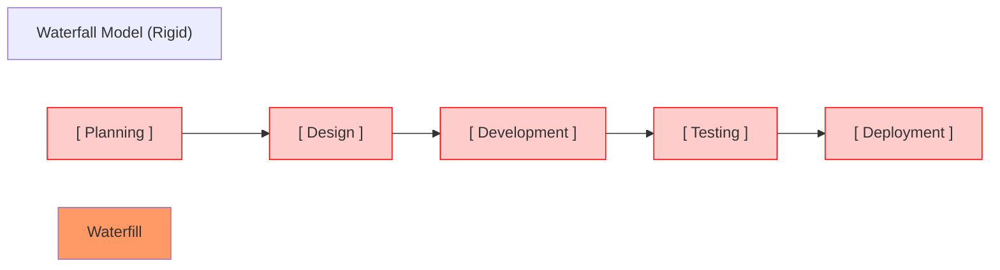

> [!example] The Tree Swing Example  
> If a team plans to build a "swing on a tree" during the initial planning phase, but discovers later during deployment that the outcome is unusable, reverting to the planning phase causes severe project delay and wasted development hours.

### 1.2 Core Concepts: Incremental vs. Iterative

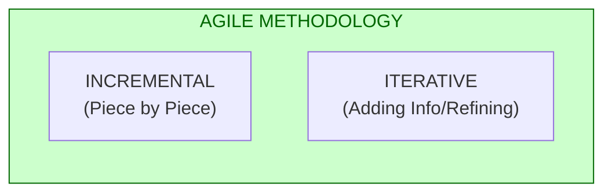

- **Incremental:** Software is built piece by piece (feature by feature).
  - *Example:* First release the **Authentication** module, then the **Booking** module, then **Payment**, and finally **Consultation**.
- **Iterative:** Functionality is continually refined and expanded based on feedback.
  - *Example:* Authentication initial release contains `Username`, `Email`, and `Password`. The next iteration adds `Age` and `Gender` fields based on revised user needs.
- **Agile Combination:** Agile blends both **Incremental** and **Iterative** approaches.

> [!note] When to use Traditional Waterfall?  
> For **sensitive, high-risk, or mission-critical applications** (e.g., aviation safety systems, medical device software, or regulatory platforms like **NATA**), rigid documentation via detailed SRS documents and Waterfall models are preferred because requirements must remain strictly locked.

---

## 2. The Agile Manifesto

### 2.1 The 4 Core Values

> [!abstract] Agile Manifesto Values  
> 1. **Individuals & Interactions** *over* Processes and Tools  
> 2. **Working Software** *over* Comprehensive Documentation  
> 3. **Customer Collaboration** *over* Contract Negotiation  
> 4. **Responding to Change** *over* Following a Plan  

- **Key Goal:** Maximize productive output within a defined time constraint while maintaining adaptability for the product to evolve.
- **Hybrid Approaches:** Blends traditional practices with Agile frameworks when required by domain constraints.

### 2.1.1 The 12 Agile Principles

> [!example] Detailed Agile Principles  
> 1. Our highest priority is to satisfy customers through early and continuous delivery of valuable software.
> 2. Welcome changing requirements, even late in development.
> 3. Deliver frequently, with a preference to the shorter timescales.
> 4. Business people and developers must work together daily.
> 5. Build projects around motivated individuals. Give them the environment and support they need.
> 6. The most efficient and effective method of conveying information is face-to-face conversation.
> 7. Working software is the primary measure of progress.
> 8. Agile processes promote sustainable development.
> 9. Our attention to excellence promotes a competitive edge.
> 10. Simplicity—the art of maximizing the amount of work not done—is essential.
> 11. The best architectures, requirements, and designs emerge from self-organizing teams.
> 12. At regular intervals, the team reflects on how to become more effective.

---

### 2.2 Key Agile Principles in Practice

| Principle | Application |
|-----------|-------------|
| **Customer Centricity** | Continuous stakeholder feedback loops |
| **Small Increments** | Deliver working software every 1-4 weeks |
| **Early Adoption** | Release MVP (Minimum Viable Product) quickly |
| **Iterative Learning** | Each iteration teaches and improves the product |

---

## 3. Agile / Scrum Framework & Lifecycle

### 3.1 Overview of Frameworks

Common Agile frameworks include:
- **Scrum** (Primary focus) - Most popular, structured with ceremonies and roles
- **Extreme Programming (XP)** - Emphasizes engineering practices (TDD, pair programming)
- **Kanban** - Visual workflow management with WIP limits
- **Scaled Agile Framework (SAFe)** - For large organizations scaling Agile
- **LeSS (Large Scale Scrum)** - Extends Scrum to multiple teams
- **Nexus** - Scrum framework for 3+ teams

> [!tip] Choosing the Right Framework  
> | Framework | Best For | Key Feature |
> |-----------|----------|-------------|
> | Scrum | Most projects, cross-functional teams | Fixed iterations (sprints) |
> | Kanban | Support/maintenance work | Continuous flow, WIP limits |
> | XP | Technical teams needing code quality | Engineering excellence |
> | SAFe | Enterprise scale (50+ people) | Organizational alignment |

### 3.2 End-to-End Agile Lifecycle Workflow

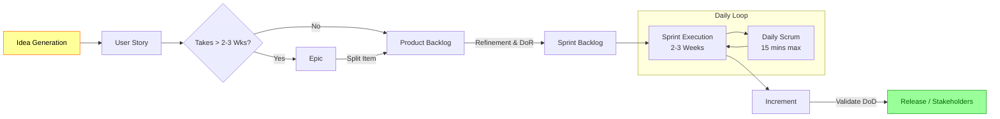

### 3.3 Roles and Artifacts

| Role | Key Responsibility | Key Responsibilities (Expanded) |
| :--- | :--- | :--- |
| **Product Owner (PO)** | Owns and prioritizes the **Product Backlog**; represents stakeholder interests. | - Defines product vision<br>- Manages backlog priorities<br>- Accepts/rejects completed work<br>- Maximize product value |
| **Scrum Master (SM)** | Acts as a team lead/facilitator; removes blockers; ensures Scrum practices are followed. | - Coaches team on Agile/Scrum<br>- Removes impediments<br>- Facilitates ceremonies<br>- Protects team from distractions |
| **Development Team** | Cross-functional team responsible for delivering working software increments. | 5-9 members, self-organizing,<br>cross-functional skill set<br>Takes collective accountability |
| **Stakeholders** | End-users/clients who review deliverables at the end of sprints. | - Provide feedback<br>- Accept work<br>- Influence priorities |

### 3.4 Key Ceremonies & Timeboxes

> [!tip] Timebox Rules & Best Practices  
> - **Daily Standup / Scrum:** Held daily; strictly limited to **≤ 15 minutes**.
> - **Backlog Refinement Effort:** Creating and refining backlogs should take **no more than 10%** of total development time.
> - **Task Duration:** Individual sprint tasks should **not take more than 8 hours**. If a task exceeds 8 hours, it must be broken down further.
> - **One-on-One Meetings:** If deep technical discussion is needed beyond the 15-minute daily standup, schedule separate one-on-one sessions.

**Agile Ceremony Guide:**

| Ceremony | Duration | Participants | Purpose |
|----------|----------|--------------|---------|
| Sprint Planning | 8h (for 2-week sprint) | PO, SM, Dev Team | Define sprint goals and select backlog items |
| Daily Scrum | 15 min | Dev Team | Sync up, identify blockers |
| Sprint Review | 4h max | All stakeholders | Demo increment, gather feedback |
| Sprint Retrospective | 2h max | Dev Team + SM+PO | Inspect process, plan improvements |

### 3.5 Definition of Ready (DoR) vs. Definition of Done (DoD)

> [!info] Quality Gates in Scrum  
> - **Definition of Ready (DoR):** A strict checklist that a User Story must satisfy **before** it can be pulled into a Sprint Backlog (e.g., clear acceptance criteria, estimations complete, dependencies resolved).
> - **Definition of Done (DoD):** A standardized checklist that a feature/increment must meet **before** it is considered complete (e.e., code reviewed, unit tests passed, functional testing verified, backwards compatibility ensured).

**Sample DoR Checklist:**
- [ ] User story follows INVEST framework
- [ ] Acceptance criteria clearly defined
- [ ] Estimated with team consensus
- [ ] Dependencies identified and resolved
- [ ] UI/UX mockups available (if applicable)
- [ ] Spike completed (if needed for research)

**Sample DoD Checklist:**
- [ ] Code written and committed to repository
- [ ] Code peer-reviewed and approved
- [ ] Unit tests written and passing
- [ ] Integration tests passing
- [ ] Functional testing completed
- [ ] Documentation updated
- [ ] Performance benchmarks met
- [ ] Security scan passed
- [ ] Deployment scripts tested

---

## 4. User Story Breakdown & Work Item Hierarchy

### 4.1 Work Breakdown Structure (WBS) Hierarchy

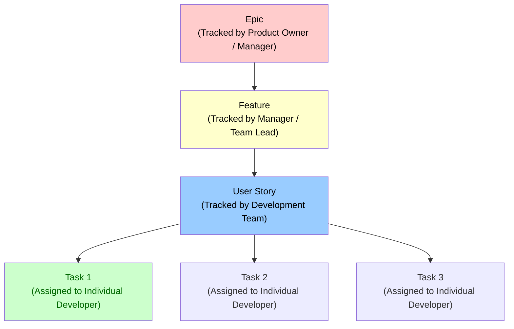

#### Concrete Example:

```yaml
Epic: Improve the checkout experience
└── Feature: Save payment options for returning customers
        └── User Story: As a returning customer, I want to save my address so that I don't have to re-enter it each time
              ├── Task 1: Design Home / Apt field input UI
              ├── Task 2: Build House/Road validation logic
              └── Task 3: Implement District drop-down API integration
```

### 4.2 User Story Mapping

> [!abstract] User Story Mapping Technique  
> A visual technique to organize user stories by grouping similar activities and mapping them across horizontal layers representing time/progression through the customer journey.

**Story Map Structure:**
```
┌─────────────────────────────────────────────────────────┐
│  BACKSPINE (Must-haves)                                 │
│  ─────────────────────────────────────────────────────   │
│  • User logs in                                          │
│  • View products                                         │
│  • Add to cart                                           │
│  └─────────────────────────────────────────────────────   │
│                  Checkout flow                            │
│  • Enter shipping address                                 │
│  • Select payment method                                   │
│  • Review order                                           │
│                                                          │
│  WINGS (Nice-to-haves / Innovations)                     │
│  ─────────────────────────────────────────────────────   │
│  • Social login                                            │
│  • AR product preview                                      │
│  • One-click checkout                                       │
└─────────────────────────────────────────────────────────┘
```

---

## 5. User Stories, Acceptance Criteria & The 3 C's

### 5.1 User Story Template

A user story must be concise, actionable, and non-vague.

$$\text{As a } \langle \text{role} \rangle, \text{ I want } \langle \text{goal} \rangle, \text{ so that } \langle \text{benefit} \rangle.$$

> [!example] Standard User Story Format  
> **As an** Account Manager,  
> **I want** a sales report of my account to be sent to my inbox daily,  
> **So that** I can monitor the sales progress of my customer portfolio.

**Tips for Writing Good User Stories:**
- ✅ Write from end-user perspective
- ✅ Focus on "what" not "how" (technical details come in refinement)
- ✅ Keep it concise (one screen if possible)
- ✅ Make it testable with clear acceptance criteria
- ❌ Don't write technical requirements in the story itself

### 5.2 The 3 C's of User Stories

1. **Card:** The written statement of the format ($\text{As a... I want... So that...}$).
2. **Conversation:** The ongoing discussion between developers, PO, and clients to detail implementation specifics.
3. **Confirmation:** The **Acceptance Criteria** confirming that the story is complete.

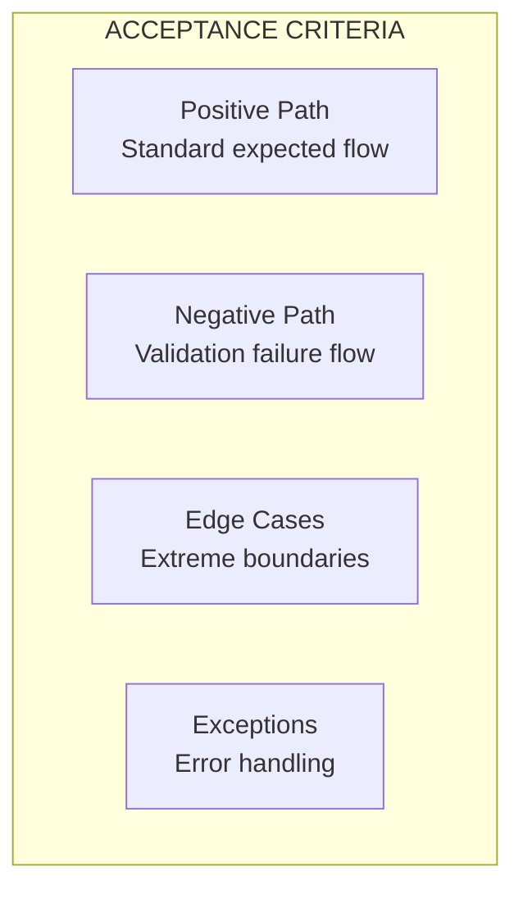

> [!quote] Non-Technical Client Language  
> Acceptance Criteria must be written in **plain, common-sense language** without technical jargon so clients can evaluate them.
> - **User Story:** *"I can register using email and password."*
> - **Acceptance Criteria:**
>   - Password must be at least 6 characters.
>   - Email field must accept standard format (`user@domain.com`).
>   - Registration fails if email is already taken.
>   - Error message guides user to correct invalid input.

### 5.3 Acceptance Criteria Types

| Type | Description | Example |
|------|-------------|---------|
| **Functional** | System behavior under specific conditions | "User can upload PDF files up to 10MB" |
| **Non-functional** | Quality attributes (performance, security) | "Page loads within 2 seconds on 4G" |
| **UI/UX** | User interface specifications | "Submit button turns green on success" |
| **Security** | Security requirements | "Passwords hashed with bcrypt" |
| **Accessibility** | WCAG compliance | "All images have alt text" |

### 5.4 BDD (Behavior-Driven Development) Format

> [!example] Gherkin Syntax Example  
> ```gherkin
> Feature: User Registration
>   As a new user
>   I want to register with my email address
>   So that I can access the application
>   
>   Scenario: Valid registration
>     Given I am on the registration page
>     When I enter valid email "user@example.com"
>     And I enter a password of at least 8 characters
>     Then I see a success message
>     And I am redirected to the dashboard
>   
>   Scenario Outline: Invalid email formats
>     Given I am on the registration page
>     When I enter invalid email "<email>"
>     Then I see error message "<expectedMessage>"
>     
>     Examples:
>       | email              | expectedMessage                |
>       | @invalid.com       | "Please use valid email format" |
>       | user@domain        | "Please add domain to email"   |
>       | not-an-email       | "Enter a valid email address"   |
> ```

---

## 6. Prioritization & Estimations

### 6.1 Prioritization: MoSCoW Method

Backlogs are prioritized to focus effort on critical value:

- **M - Must Have:** Non-negotiable core functionality (MVP). Failure = System broken.
- **S - Should Have:** Important features, but not vital for current release.
- **C - Could Have:** Desirable enhancements if time permits.
- **W - Won't Have:** Deferred for future releases (not a promise to never implement).

**Prioritization Example Matrix:**

| Priority | Sprint 1 | Sprint 2 | Sprint 3 |
|----------|----------|----------|----------|
| Must Have | ✅ Auth, Login | ✅ Dashboard View | ✅ Create Item |
| Should Have | ✅ Search | ✅ Filter Results | ✅ Sort Options |
| Could Have | - | - | ✅ Dark Mode |
| Won't Have | - | ✅ v2.0 Features | - |

### 6.1.1 WSJF (Weighted Shortest Job First)

For economic prioritization in SAFe:

$$\text{WSJF} = \frac{\text{Cost of Delay}}{\text{Job Size}}$$

Where:
- **Cost of Delay** = User Value × Time Criticality × Risk/Uncertainty
- **Job Size** = Story points or ideal hours to complete

### 6.2 The INVEST Framework for Good User Stories

| Letter | Principle | Description | Example |
| :---: | :--- | :--- | :-------- |
| **I** | **Independent** | Should not strictly depend on other stories; team shouldn't be blocked waiting. | "Login" story should work independently of "Search" |
| **N** | **Negotiable** | Details can be modified during discussion/planning. | Exact validation rules can be refined |
| **V** | **Valuable** | Must deliver clear business/user value. | Users can see benefit before development |
| **E** | **Estimable** | Must be understandable enough for the team to estimate effort. | Clear enough for planning poker |
| **S** | **Small** | Small enough to be completed within a single sprint (2–3 weeks). | ≤8 story points ideally |
| **T** | **Testable** | Must have clear acceptance criteria to verify completion. | Acceptance criteria written beforehand |

### 6.3 Estimation Techniques & Fibonacci Story Points

Story points represent the relative **effort, complexity, and risk** involved in implementing a story.

- **Fibonacci Scale:** $1, 2, 3, 5, 8, 13, 21, \dots$
  - Represents diminishing certainty as values increase
  - Larger numbers mean larger relative differences (e.g., 13 is much harder than 8)

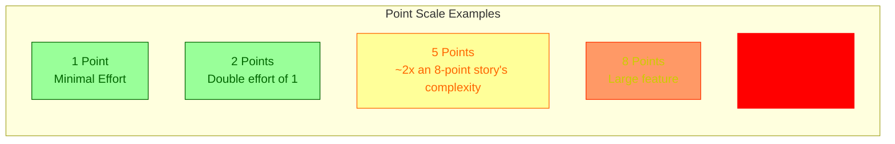

**Point Scale Example:**

| Points | Relative Size | What it Contains |
|--------|---------------|------------------|
| 1-2 | Tiny | Small UI tweaks, copy changes |
| 3-5 | Small-Medium | Feature additions within existing flows |
| 8-13 | Medium-Large | New features with some complexity |
| 20+ | Very Large | Multiple user stories combined (must be broken down) |

#### Planning Poker Process

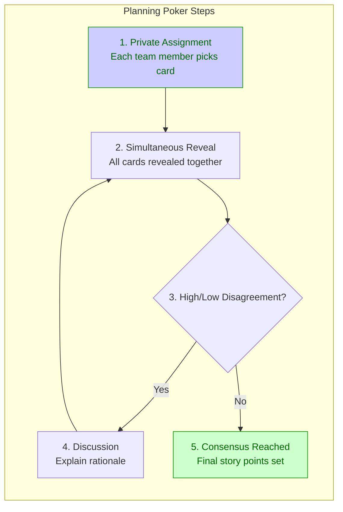

**Steps:**
1. Each of the team members assigns a point value **individually** via cards (no peeking).
2. The team reveals cards simultaneously (synchronized reveal).
3. Members with high and low estimates **converse** to explain their rationale.
4. The team consensus forms the **Final Story Points**.

#### Alternative Estimation Techniques

| Technique | Description | When to Use |
|-----------|-------------|-------------|
| **T-Shirt Sizing** | $XS, S, M, L, XL$ representing relative sizes | Early backlog when precise estimation isn't needed |
| **Affinity Estimating** | Grouping user stories based on relative similarity in implementation effort | Large epics being broken down |
| **Planning Poker** | Collaborative estimation with Fibonacci numbers | Sprint planning sessions |

> [!warning] Common Estimation Pitfalls  
> - **Parkinson's Law:** Work expands to fill available time. Don't overestimate for "safety margin."
> - **Hickam's Dictate:** Everything can be true, but don't count everything. Focus on known unknowns.
> - **Planning Fallacy:** People underestimate future tasks because they focus on best-case scenarios.
> - **Van Gogh's Law:** Complexity increases exponentially with size (not linearly).

### 6.4 Velocity Tracking

**Velocity = Total Story Points Completed per Sprint**

- Track average velocity over last 3-5 sprints for realistic planning
- Use for forecasting, not for comparing individuals
- Velocity stabilizes as team becomes familiar with work

---

## 7. Tracking Progress: Sprint Burndown Chart

The **Sprint Burndown Chart** visually displays remaining effort over time for a given sprint.

### 7.1 Visual Structure

```mermaid
xychart-beta
    title "Sprint Burndown Chart"
    x-axis [0, 2, 4, 6, 8, 10] Days
    y-axis "Remaining Work (Points)" 0 --> 100
    line "Ideal Line" [100, 90, 80, 70, 60, 50, 40, 30, 20, 10, 0]
    line "Actual (Behind)" [100, 95, 85, 80, 75, 70, 68, 65, 62, 58, 50]
    line "Actual (Ahead)" [100, 92, 82, 72, 62, 55, 48, 42, 35, 28, 0]
```

- **Ideal Line:** Linear line running from maximum remaining effort down to zero at sprint end.
- **Actual Line:** Step-down plot based on completed tasks.
  - **Above Ideal Line:** Project is **Behind Schedule**. Needs acceleration or scope reduction.
  - **Below Ideal Line:** Project is **Ahead of Schedule**. Can accommodate additional work or buffer for risks.

### 7.2 Sprint Burndown Chart Types

| Type | Shows | Use Case |
|------|-------|----------|
| **Team Burn Down** | Total remaining story points vs. ideal line | Daily sprint tracking |
| **Individual Burn Down** | Each developer's task completion | Team velocity balancing |
| **Cumulative Flow Diagram (CFD)** | Work in progress by state (To Do, In Progress, Done) | Identifying bottlenecks |

---

## 8. Alternative Development Models: RAD & Prototyping

### 8.1 Rapid Application Development (RAD)

Ideal for small-to-medium projects targeting rapid delivery ($\le 90$ days).

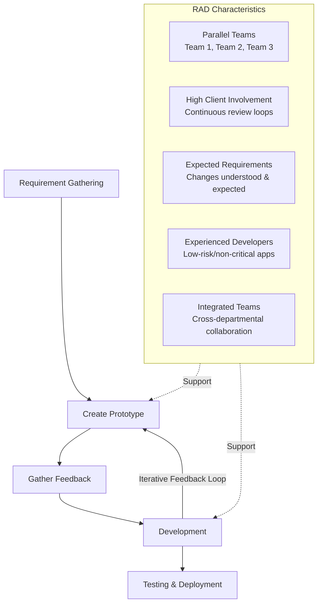

> [!check] Characteristics of RAD  
> - **Parallel Modules:** Development is divided across multiple teams (Team 1, Team 2, Team 3) working in parallel to accelerate completion.
> - **High Client Involvement:** Continuous review loops with clients.
> - **Requirements:** Suitable when requirement changes are well-understood and expected.
> - **Prerequisites:** Requires **experienced developers** and **low-risk/non-critical applications**.
> - **In-House Teams:** Works best with closely integrated, inter-departmental teams.

#### RAD Phases (4 Phases)

| Phase | Duration | Activities | Deliverables |
|-------|----------|------------|--------------|
| **User Requirement & Feasibility** | 1-2 weeks | Workshops, prototyping sessions | High-level requirements |
| **Design** | 1-3 weeks | UI/UX design, architecture planning | Wireframes, system design docs |
| **Build** | 3-6 weeks | Parallel team development | Working prototype |
| **Transfer/Deploy** | 1-2 weeks | Testing, user training, deployment | Production-ready system |

### 8.2 Prototyping / Mock-Up Model

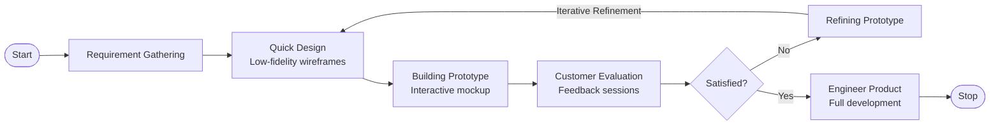

#### Prototype Types

```mermaid
flowchart TD
    subgraph Varieties["PROTOTYPE VARIETIES"]
        direction TB
        
        T1[Throwaway<br/>(Discarded after<br/>gathering feedback)]
        
        E[Evolutionary<br/>(Built iteratively<br/>into final product)]
        
        I[Incremental<br/>(Web application UI<br/>delivered in parts)]
        
        X["Extreme<br/>(Used for web<br/>application UI<br/>exploration)"]
    end
    
    Varieties --> Types["All aim to:<br/>• Reduce risk<br/>• Validate assumptions<br/>• Save development cost"]
    
    style T1 fill:#ccc,stroke:#666
    style E fill:#9f9,stroke:#090,color:#060
    style I fill:#ccf,stroke:#090,color:#060
    style X fill:#ff9,stroke:#f60,color:#f60
```

**Throwaway Prototype:** Used for requirements validation only. Discarded after feedback is collected.

**Evolutionary Prototype:** Starts as a rough prototype and gradually evolves into the final product through continuous refinement.

**Incremental Prototype:** The final system is built in parts, with each part serving as a prototype for user testing.

**Extreme Prototype:** Pushes boundaries to explore creative solutions, often used in UX/UI design exploration.

#### When to Use Each Prototype Type:

| Scenario | Recommended Type |
|----------|------------------|
| Unclear requirements | Throwaway |
| Building MVP | Evolutionary |
| Web dashboard | Incremental |
| UI/UX innovation | Extreme |

### 8.3 Prototyping Fidelity Techniques

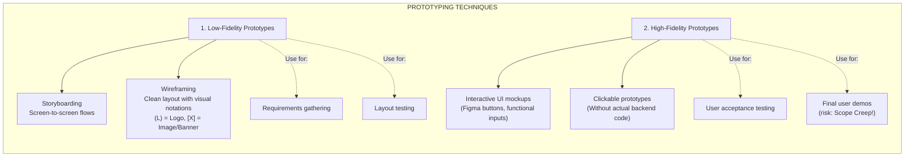

#### Low-Fidelity Wireframe Notation Example:

```
┌────────────────────────────────────────────────────────┐
│  [  (L)  ]   [ Menu Item 1 | Menu Item 2 | Item 3 ]    │
├────────────────────────────────────────────────────────┤
│ ┌────────────────────────────────────────────────────┐ │
│ │                                                    │ │
│ │             [ Banner / Image Box (X) ]             │ │
│ │                                                    │ │
│ └────────────────────────────────────────────────────┘ │
│ Title: Section Heading                                 │
│ More Info: Lorem ipsum dolor sit amet...              │
│────────────────────────────────────────────────────────│
│ Footer / Sitemap                                       │
└────────────────────────────────────────────────────────┘
```

**Wireframe Elements:**
- `[ ]` = Text input field
- `(L)` = Logo placeholder
- `[X]` = Image/banner placeholder
- `───` = Horizontal line/divider
- Numbers like `1`, `2`, `3` = Menu items/links

#### Low-Fidelity vs. High-Fidelity Comparison:

| Aspect | Low-Fidelity | High-Fidelity |
|--------|--------------|---------------|
| **Purpose** | Requirements gathering, layout testing | User acceptance testing, stakeholder demos |
| **Time to Create** | Hours or days | Weeks or months |
| **Interactivity** | Static images or simple hotlinks | Clickable navigation, realistic behavior |
| **Detail Level** | Basic structure, placeholders | Realistic content, colors, typography |
| **Risk of Scope Creep** | Low (obviously not final) | High (may be mistaken for finished product) |

---

## 9. Agile vs. RAD vs. Prototyping: Decision Matrix

### 9.1 Methodology Selection Guide

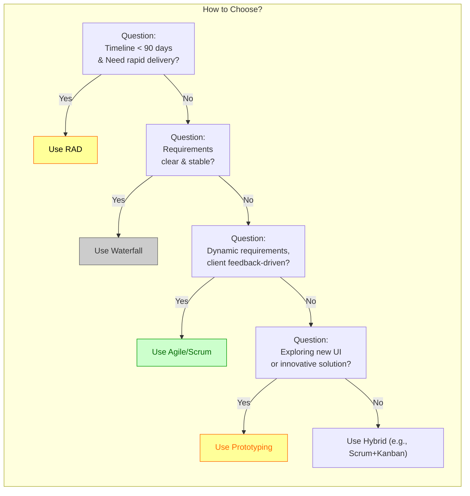

### 9.2 Comparison Table

| Aspect | Waterfall | Agile/Scrum | RAD | Prototyping |
|--------|-----------|-------------|-----|-------------|
| **Requirements** | Fixed upfront | Evolving | Semi-fixed, changes expected | Fluid, discovered through feedback |
| **Timeline** | Long (months to years) | Flexible (2-4 week sprints) | Short (<90 days ideal) | Variable based on iteration cycles |
| **Client Involvement** | At beginning and end | Continuous throughout | Very high (weekly reviews) | Very high (prototype reviews) |
| **Risk Management** | Late detection (end of phases) | Early and continuous | High client involvement reduces risk | Risk spread across iterations |
| **Best For** | Mission-critical, regulated industries | Dynamic products, startups | Small-medium projects with experienced teams | UX exploration, MVP validation |
| **Team Structure** | Specialized (designers separate from devs) | Cross-functional squads | Parallel teams working concurrently | Flexible, evolving structure |

### 9.3 When to Use Each Model: Summary Table

| Scenario | Recommended Approach |
|----------|---------------------|
| **Aviation software, medical devices** | Waterfall (mission-critical requirements) |
| **Start-up with uncertain market fit** | Agile/Scrum (fast iteration based on feedback) |
| **90-day project deadline with experienced team** | RAD (parallel development for speed) |
| **Exploring new UI concepts** | Prototyping (validate before full implementation) |
| **Enterprise scaling beyond one team** | SAFe or LeSS (scaled frameworks) |

---

## 10. Advanced Agile Concepts

### 10.1 Technical Debt & Refactoring

> [!warning] Technical Debt  
> Code shortcuts taken to meet deadlines that need to be paid back later. Not always negative—strategic technical debt can accelerate initial delivery.

**Common Types:**
- **Code Quality:** Lack of unit tests, code duplication, poor naming conventions
- **Documentation:** Outdated or missing documentation
- **Architecture:** Quick-and-dirty solutions that don't scale
- **Security:** Deferred security patches or vulnerabilities

**Managing Technical Debt:**

| Strategy | Description | When to Use |
|----------|-------------|-------------|
| **Refactoring Sprint** | Dedicate 20% of capacity to technical debt | End of sprint for long-term projects |
| **Debt Board** | Track and prioritize debt items like backlog items | Transparent team management |
| **Pay-as-you-go** | Allocate story points for debt alongside features | Continuous maintenance |

**Refactoring Checklist:**
- [ ] Code is clean and readable
- [ ] Unit tests cover critical paths
- [ ] Architecture supports future changes
- [ ] No significant performance bottlenecks
- [ ] Security vulnerabilities addressed

### 10.2 Continuous Improvement (Kaizen)

> [!abstract] Kaizen Philosophy  
> Continuous improvement in Agile is formalized through the retrospective ceremony and action item tracking.

**Retrospective Outcomes:**
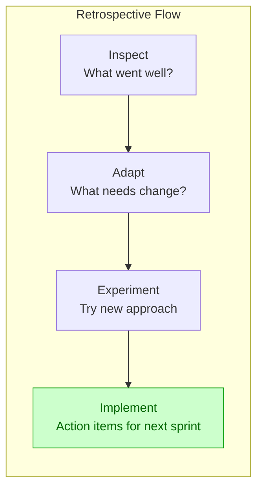

**Improvement Metrics:**
- Cycle time reduction
- Lead time improvement
- Defect rate decrease
- Team happiness score (e.g., Net Promoter Score)

### 10.3 Spikes (Time-boxed Research Sprints)

> [!example] Spike User Story  
> ```
> As a Product Owner,
> I want to research available payment gateway APIs
> So that we can select the best option for our project
> 
> Acceptance Criteria:
> - Compare 3+ payment gateways
> - Document pros/cons of each
> - Make recommendation with estimated implementation effort
> ```

- **Time-boxed research** to gather information before planning real stories
- Used when requirements are unclear or new technology needs evaluation
- Must have clear exit criteria (e.g., "decision made" or "prototype built")

---

## 11. Common Anti-Patterns & Pitfalls

### 11.1 Agile Anti-Patterns

> [!warning] These patterns undermine Agile effectiveness:

| Anti-Pattern | Symptoms | Remedy |
|---------------|----------|--------|
| **Agile Theater** | Performing ceremonies without real collaboration | Focus on value, not rituals |
| **Story Sprinkling** | Random small stories added to backlog | Group related functionality into epics/features |
| **Gold Plating** | Team adds features outside user stories | Stay within story boundaries until PO approves |
| **Scope Creep** | Constantly adding new requirements mid-sprint | Protect sprint scope, move new items to backlog |
| **Parkinson's Law in Agile** | Tasks expand to fill available time | Break down large stories, use smaller timeboxes |

### 11.2 RAD Anti-Patterns

> [!warning] RAD pitfalls:

- **Insufficient requirements:** Jumping into development without adequate workshops leads to rework
- **Over-scope:** Trying to build everything in parallel creates integration nightmares
- **Lack of standards:** Parallel teams working differently causes technical debt

### 11.3 Prototyping Anti-Patterns

> [!warning] Prototyping mistakes:

| Pitfall | Consequence | Prevention |
|---------|-------------|------------|
| **Building high-fidelity too early** | Scope creep, wasted effort | Start with low-fidelity wireframes |
| **Treating prototype as final product** | Development delays, rework | Clearly communicate prototype limitations |
| **No iteration in feedback loop** | Missed opportunities for improvement | Schedule regular review sessions |

---

## 12. Hybrid Methodologies & Modern Practices

### 12.1 When to Blend Approaches

> [!example] ScrumBan (Scrum + Kanban)  
> Uses Scrum's sprint framework with Kanban's continuous flow elements for work that doesn't fit perfect sprints.

**Hybrid Approach Examples:**

| Hybrid Model | Description | Use Case |
|--------------|-------------|----------|
| **Scrumban** | Sprints with WIP limits | Teams transitioning from Waterfall to Agile |
| **Kanban with Sprints** | Continuous flow with sprint goals | Support teams needing some iteration planning |
| **DevOps Integration** | CI/CD pipelines + Agile development | Fast feedback loops in production |

### 12.2 Modern Software Development Practices

**Test-Driven Development (TDD):**
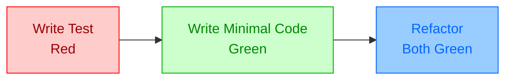

**Cycle:** Red (test fails) → Green (passing test) → Refactor (improve code)

**Pair Programming:**
- One driver (writes code), one navigator (reviews in real-time)
- Improves code quality and knowledge sharing
- Recommended for complex tasks, onboarding new developers

### 12.3 DevOps Integration with Agile

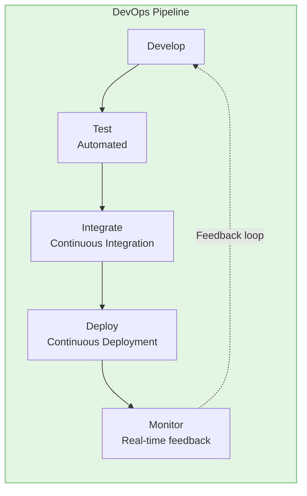

---

## 13. Exam Overview & Question Patterns

> [!tip] Expected Final Exam Questions  
> 
> 1. **Scenario-Based Analysis:** Given a business case, write user stories, define acceptance criteria (including positive/negative paths), and estimate story points/tasks.
> 2. **Theoretical & Model Selection:** Evaluating project parameters (e.g., risk level, team experience, clarity of requirements, timeline) and recommending the correct development methodology:
>    - **Waterfall:** High risk, mission-critical, fixed requirements (e.g., medical, flight control, NATA).
>    - **RAD:** Low risk, strict short timeline ($\le 90$ days), experienced dev team, rapid delivery needs.
>    - **Prototyping / Agile:** Dynamic requirements, client feedback-driven, evolving digital products.
> 3. **Agile Role Identification:** Given a project scenario, identify the appropriate role (PO vs. SM) and their responsibilities.
> 4. **Acceptance Criteria Writing:** Create comprehensive acceptance criteria covering positive paths, negative paths, edge cases, and exceptions.
> 5. **Diagram Drawing:** Draw sprint burndown charts, user story maps, or workflow diagrams from descriptions.

### 13.1 Practice Questions

**Q1: Given a healthcare app for managing patient appointments with these constraints:**
- High security requirements (HIPAA compliance)
- Fixed regulatory specifications
- Critical uptime requirements

**A1:** Use **Waterfall** methodology due to mission-critical nature and locked requirements. However, consider **Agile within Waterfall phases** (e.g., iterative development during testing phase).

---

**Q2: A startup wants to launch an MVP in 3 months to validate market demand.**

**A2:** Use **Agile/Scrum** with 2-week sprints. Prioritize backlog using MoSCoW, focusing on Must-Have features for MVP. Release incrementally after each sprint based on customer feedback.

---

**Q3: Write acceptance criteria for the story: "As a user, I want to upload my profile picture"**

**A3:**
- **Positive Path:** User selects image file (JPG/PNG, ≤5MB), uploads successfully, sees preview, sees success message.
- **Negative Path:** User selects file >5MB → error: "Image must be 5MB or smaller."
- **Edge Cases:** Image is network drive → show browser dialog asking to select locally.
- **Exceptions:** User has no internet → show offline indicator, retry button appears after reconnecting.

---

## 14. Quick Reference Cheat Sheet

### 14.1 Agile vs. Traditional Comparison

| Feature | Waterfall | Agile |
|---------|-----------|-------|
| **Requirements** | Fixed upfront | Evolving throughout |
| **Deliverables** | At end of project | After each sprint (2-4 weeks) |
| **Stakeholder Feedback** | End of phases | Continuous, every sprint |
| **Change Handling** | Expensive and difficult | Expected and accommodated |
| **Risk Detection** | Late (end of phases) | Early and continuous |

### 14.2 Agile Ceremonies at a Glance

| Ceremony | Frequency | Duration | Who Attends | Goal |
|----------|-----------|----------|-------------|------|
| Sprint Planning | Every sprint start | 8h (2-week sprint) | All Scrum Team | Plan next sprint work |
| Daily Scrum | Daily | 15 min max | Dev Team only | Sync, identify blockers |
| Sprint Review | Every sprint end | 4h max | All stakeholders | Demo increment, gather feedback |
| Sprint Retrospective | Every sprint end | 2h max | Scrum Team + SM+PO | Improve team process |

### 14.3 Story Point Scale Reference

```
Story Points: 1  2  3   5    8    13   21+
Difficulty: Tiny Small-Medium Medium-Large Large Very Large TOO BIG (split!)
```

**Example Relative Sizing:**
- Login as user = 3 points
- View profile = 3 points  
- Edit profile = 5 points
- Change password = 5 points
- Upload avatar = 8 points
- Forgot password flow = 8 points
- Reset via email with expiry = 13 points

### 14.4 INVEST Checklist for User Stories

Use this checklist before sprint planning:

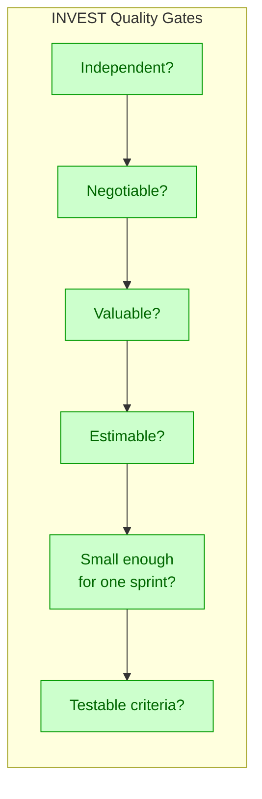

All boxes should be checked green (✅) before a story enters the sprint backlog.

### 14.5 DoR vs. DoD Quick Reference

**Definition of Ready (DoR)** — Story requirements:
- [ ] Clear user story (As a... I want... So that...)
- [ ] Acceptance criteria defined
- [ ] Estimated by team (story points)
- [ ] Dependencies identified/resolved
- [ ] UI/UX designs available
- [ ] Priority assigned by Product Owner

**Definition of Done (DoD)** — Completed work:
- [ ] Code committed to version control
- [ ] Code peer-reviewed and approved
- [ ] Unit tests written and passing
- [ ] Integration tests passing
- [ ] Functional testing completed
- [ ] Documentation updated
- [ ] Security scanning passed
- [ ] Performance benchmarks met

---

## 15. Summary & Key Takeaways

> [!success] Essential Points to Remember  
> 
> 1. **Agile is not a single methodology** — It's a mindset with multiple frameworks (Scrum, Kanban, XP). Choose based on project needs.
> 
> 2. **User stories must be INVEST-compliant** — Independent, Negotiable, Valuable, Estimable, Small, Testable.
> 
> 3. **Acceptance criteria are critical** — Include positive paths, negative paths, edge cases, and exceptions to avoid ambiguity in exam answers.
> 
> 4. **RAD is for speed** — Ideal when timeline <90 days, team experienced, requirements semi-fixed. High client involvement throughout.
> 
> 5. **Prototyping validates assumptions** — Use low-fidelity for requirements gathering, high-fidelity for user acceptance testing. Watch for scope creep!
> 
> 6. **Ceremonies have strict timeboxes** — Daily scrum ≤15 minutes, tasks ≤8 hours. Respect these limits to maintain Agile rhythm.
> 
> 7. **Metrics track progress and predictability** — Velocity (story points per sprint) and Burndown charts help forecast delivery.
> 
> 8. **Technical debt is inevitable** — Allocate time for refactoring or plan debt sprints. Don't accumulate beyond manageable levels.

---

## 📖 References & Further Reading

1. **Agile Manifesto**: https://agilemanifesto.org/
2. **Scrum Guide**: https://www.scrumguide.com/
3. **Kanban Method**: https://kanbanspy.com/
4. **Extreme Programming**: https://www.mountaingoatsoftware.com/extreme-programming
5. **"Succeeding with Agile" by Mike Cohn** — Practical Scrum guide for practitioners
6. **"User Story Mapping" by Jeff Patton** — Visualizing product roadmaps

---

<details>
<summary><b>📋 More Resources (Click to Expand)</b></summary>

- **Agile Testing**: https://agiletesting.wordpress.com/
- **SAFe Framework**: https://www.safeworks.org/
- **Scrum.org Certification**: https://www.scrum.org/scrum
- **GitHub Guides**: https://guides.github.com/introduction/git-handbook/

</details>

---

> [!info] Last Updated  
> This comprehensive guide was last reviewed and updated on 2026-08-01. For the latest Agile trends, check industry resources listed above.