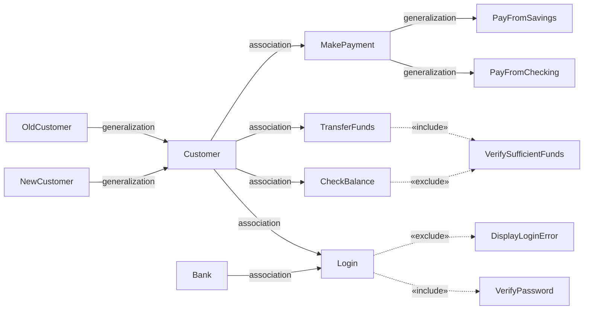
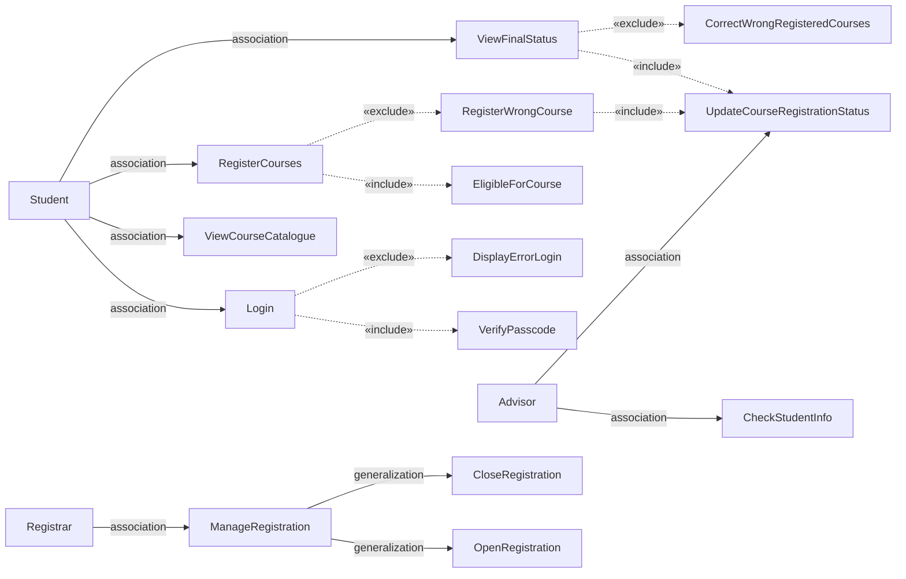
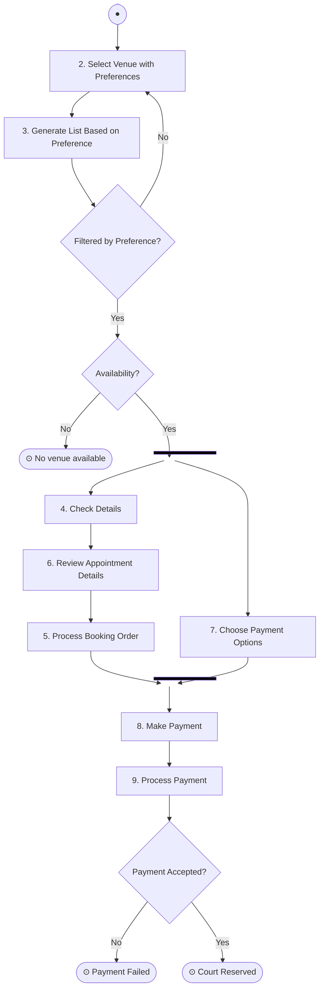
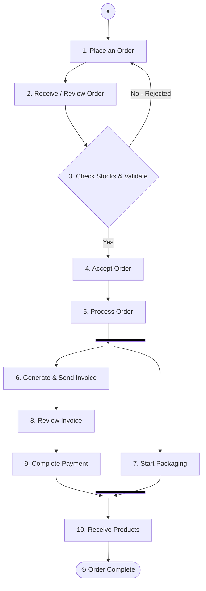
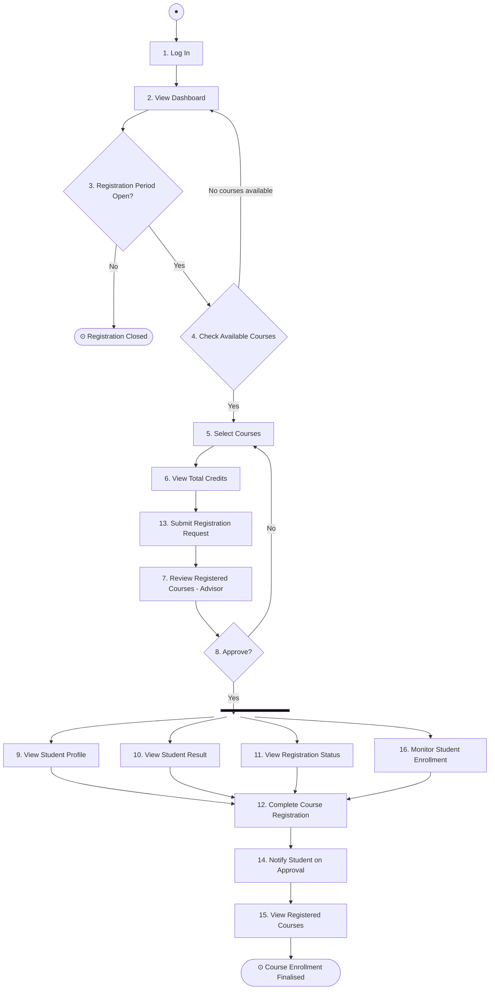

# SWE 4401 — Software Requirements & Specification

### Exam Prep Notes · Scenario-Based Focus

> [!tip] Exam Structure **1 scenario → 6 questions** covering: Stakeholders · FR/NFR · Acceptance Criteria · Use Case Diagram · Use Case Description · Activity Diagram
> 
> - No definitions needed — apply directly
> - FR answers can differ (no single correct answer)
> - Cover all possible criteria in diagrams (assumptions + activities)
> - Identify **14–15 major FRs**

---

# Part 1 · User / Stakeholder Identification

> [!important] Identify in This Order Primary → Secondary → External → Time/Event actors Then identify **their particular requirements**.

## Types of Stakeholders

|Type|Who|Example (Medical System)|
|---|---|---|
|**Internal**|Company employees, managers, owners|Hospital admin, IT dept|
|**External**|Clients, end-users, suppliers|Patients, doctors|
|**Primary**|Direct impact (positive or negative)|Patients, Doctors|
|**Secondary**|Indirect impact|Legal dept, accountants|

> [!note] Rule For a **govt project**, internal stakeholders = the government. Externals can be primary (direct) or secondary (indirect).

### Worked Example — Nationwide Medical System

- **Primary:** Patients, Doctors, Faculty/IUT Staff
- **Secondary:** Medical Staff, Admin, Developers
- **External:** Pharmacy, SMS Gateway, Payment Gateway (SSLCommerz)

### Worked Example — IUT Medical System (UCD actors)

```
IUT Patients (superclass)
    ├── Student
    ├── Faculty
    └── IUT Staff

Secondary Actors → Medical Staff, Admin, Developers
External Actors  → Pharmacy, SMS Gateway, Payment Gateway
```

---

# Part 2 · Requirements Writing

## The Three Terms (Don't Confuse)

|Term|Meaning|Example|
|---|---|---|
|**Requirement**|What/Why we need|User needs to log in|
|**Feature**|How to do the process|How to log in?|
|**Specification**|Details about the feature; constraints|Username + password for authentication|

## User Requirement vs System Requirement

```
User Requirement 1  →  System Req: 1.1, 1.2, 1.3 ...
User Requirement 2  →  System Req: 2.1, 2.2, 2.3 ...
```

> [!tip] Rule Break each user requirement into **multiple atomic system requirements**. Each req (user/system) should be **max 2 sentences**. Each system req info **must come from users/clients**.

### Example (Mentcare System)

**User Requirement:**

> 1. The Mentcare system shall generate monthly management reports showing the cost of drugs prescribed by each clinic during that month.

**System Requirements:**

> 1.1 On the last working day of each month, a summary of drugs prescribed, their cost and prescribing clinics shall be generated. 
> 1.2 The system shall generate the report for printing after 17:30 on the last working day of the month. 
> 1.3 A report shall be created for each clinic listing individual drug names, total prescriptions, doses prescribed, and total cost. 
> 1.4 If drugs are available in different dose units (e.g. 10mg, 20mg), separate reports shall be created for each dose unit. 
> 1.5 Access to drug cost reports shall be restricted to authorized users on a management access control list.

---

## Functional Requirements (FR)

**What the system does** — specific services, inputs, outputs. These are **features** of the system.

### 2 Properties of FR

|Property|Meaning|
|---|---|
|**Complete**|Specified clearly enough that devs can implement and testers can verify — no ambiguity, no missing info|
|**Consistent**|No two requirements contradict each other|

> [!warning] Common Mistakes ❌ `The system shall allow users to search for books quickly.` — "quickly" is vague, and "search" needs to specify what field
> 
> ✅ Split into:
> 
> 1. `The system shall allow users to search books by title and ISBN.` (FR)
> 2. `The system shall display search results within 2 seconds.` (NFR)

> [!warning] Another Common Mistake ❌ `The system shall allow students to register, login and update their profile.` — 3 tasks in 1 requirement. Create **3 separate requirements**.

> [!danger] Ambiguity Test If **2 people read the same line and interpret it differently** → the requirement is **ambiguous**. Rewrite it.

### Characteristics of a Good FR (10 Properties)

|#|Property|What it means|
|---|---|---|
|1|**Clear**|One interpretation only|
|2|**Unambiguous**|No vague adjectives|
|3|**Complete**|All info for dev + test|
|4|**Consistent**|No contradiction with other reqs|
|5|**Verifiable**|Can be tested|
|6|**Feasible**|Actually implementable|
|7|**Necessary**|Stakeholder actually needs it|
|8|**Modular/Atomic**|1 requirement = 1 task|
|9|**Traceable**|Has UniqueID (FR001), source, reason, priority|
|10|**Modifiable**|Easy to update without breaking others|

### Rules for Writing FR

- Use **shall** (mandatory) or **should** (optional) — never vague words
- **One requirement per sentence**
- **Don't combine FR and NFR**
- **Specify actor** (who), **condition** (when/where), **data** (what)
- **Avoid design decisions** unless they are real constraints
- **Add rationale** (reasons)
- **Avoid jargon** — stakeholders read this too

### Bad → Good Examples

| Bad                                       | Problem                       | Good                                                                                                |
| ----------------------------------------- | ----------------------------- | --------------------------------------------------------------------------------------------------- |
| `The system will notify users.`           | No type, no frequency         | `The system shall send a push notification to the user within 5 seconds of an order status change.` |
| `The report should be generated quickly.` | "quickly" is vague            | `The system shall generate the report within 3 seconds of the user's request.`                      |
| `The system shall reset passwords.`       | Whose? How?                   | `The system shall allow students to reset their own passwords via email or phone verification.`     |
| `The system shall use MongoDB.`           | Implementation detail, not FR | Remove — this belongs in design docs                                                                |
| `The system shall have an attractive UI.` | Not testable                  | Perform a survey; ask clients which design they prefer                                              |

---

## Non-Functional Requirements (NFR)

**How the system behaves** — quality attributes. NFR keywords end in **"-ty"**: Security, Reliability, Usability, Scalability, Availability.

> [!important] Key Rule **All NFRs must be testable — quantify every adjective.** ❌ `System should be easy to use` → not testable ✅ `A first-time user shall be able to complete a leave application within 3 minutes without external assistance.`

> [!note] **NFRs are not workarounds. FRs can be workarounds.** NFR focuses on the **overall system** but can also target specific features.

### 3 Categories of NFR

```
NFR
├── Product Requirements      → Quality of the system itself
│     (Performance, Usability, Security, Reliability)
├── Organizational Requirements → Internal company rules & constraints
│     (coding standards, internal policies)
└── External Requirements     → Legal, regulatory, environmental
      (safety standards, legal requirements)
```

### NFR → FR Conversion Example

|Stage|Statement|
|---|---|
|**Bad NFR**|`The system should be user-friendly.`|
|**Problem**|Not quantified, not testable, no user type mentioned|
|**Fix**|Change "should" → "shall"; quantify "user-friendly"; specify user type|
|**Good FR (from NFR)**|`The system shall allow a first-time user to submit a leave application within 3 minutes after logging in, without external assistance.`|

> [!tip] You can identify NFRs _from_ FRs — NFRs often emerge as quality constraints on functional behaviors.

---

## EARS Format (Easy Approach to Requirement Syntax)

Use EARS to write precise, structured requirements.

|Pattern|Syntax|Use When|
|---|---|---|
|**Ubiquitous**|`The system shall <action>`|Always required, no condition|
|**Event-driven**|`When <trigger>, the system shall <response>`|Triggered by a user/external event|
|**State-driven**|`While <state>, the system shall <action>`|Active during a specific system state|
|**Unwanted Behavior**|`If <condition>, the system shall <response>`|Error handling / exceptions|

### EARS Examples

```
Ubiquitous:
  The system shall encrypt all stored user passwords using bcrypt.

Event-driven:
  When a student submits a leave application, the system shall send a
  confirmation email to the student within 30 seconds.

State-driven:
  While the registration period is open, the system shall allow students
  to add or drop courses.

Unwanted Behavior:
  If a user enters an incorrect password 10 consecutive times, the system
  shall lock the account and notify the user via email.
```

> [!note]
> 
> - **Reset password** is NOT ubiquitous (depends on user being registered first)
> - **Ubiquitous** = standalone, always needed regardless of context

---

# Part 3 · Acceptance Criteria (AC)

> **Definition (Atlassian):** Predefined requirements and conditions that a product/task must meet to be marked complete and accepted by the user. AC = **pass/fail conditions** of the system.

|Who it's for|Purpose|
|---|---|
|Specification|For **developers**|
|Acceptance Criteria|For **testers and clients**|

### Why AC Matters

1. Removes ambiguity
2. Helps developers understand boundaries
3. Helps testers create test cases
4. Helps customers accept/reject failures

> [!tip] The Final Validation Pipeline
> `Scope ➔ Requirements ➔ FR, NFR ➔ AC ➔ Write test cases based on AC ➔ Validate from user side`
> Once validated from the user side, the requirements are considered completed with **no room for further discussions**.

> [!important] AC Rule Include both **"must"** and **"must not"** conditions. Standard: **5–10 ACs per FR**. If more, break FR into two.

### FR → AC Mapping Structure

```
FR01  ──────────────►  AC01.001
                   └─► AC01.002
                       AC01.003 ...
FR02  ──────────────►  AC02.1, AC02.2 ...
```

Use a **mapping table**:

|FR|Summary/User Req|AC|
|---|---|---|
|01||01.1, 01.2 ... 01.10|
|02||02.1, 02.2 ...|

### 2 Formats for AC

#### Format 1 — Checklist Format

Use for **sequential steps** where flow is linear.

**Example — IUT SIS Course Registration:**

```
FR: The system shall allow registered students to register for courses
    during the registration period.

AC:
1. Students must log in before accessing course registration.
2. System must check whether the registration period is open.
3. System must display only valid/available courses.
4. System must identify and list courses the student is eligible for.
5. System must calculate and display total credit count.
6. System must show a confirmation message after successful registration.
7. Academic advisor must review and approve the registration.
8. Student must not be able to register if credit limit is exceeded.
9. Student must not be able to register for a course already completed.
10. System must not allow registration after the registration period closes.
```

#### Format 2 — Gherkin Format

Use for **multiple scenarios / branching logic**.

```gherkin
Given <initial condition>
When  <user action>
Then  <system output / expected result>
```

**Example — Login:**

```gherkin
Given that the user is on the login page
When the user enters an incorrect username or password and clicks login
Then the system shall display an error message on the same page
  and the user shall remain on the login page
```

> [!tip] Which format?
> 
> - **Checklist** → subsequent steps, linear flow
> - **Gherkin** → multiple scenarios, branching, edge cases

### Completeness Checklist for AC

|Check|Question|
|---|---|
|**Happy path**|What happens when everything goes right?|
|**Edge cases**|What if data is missing / wrong format / no data?|
|**Roles**|Are all primary stakeholder expectations covered?|
|**Implicit NFR**|Are availability, performance, access constraints included?|
|**Failure cases**|For every success AC, is there a corresponding failure AC?|

---

# Part 4 · Use Case Diagrams

## UML Overview

```
UML Diagram
├── Structural Design  → What the system IS  (Class Diagram)
└── Behavioral Design  → What the system DOES (Use Case, Activity, Sequence Diagrams)
```

> **SRS uses:** Use Case Diagram + Class Diagram

## 4 Components of a Use Case Diagram

|Component|Symbol|Notes|
|---|---|---|
|**System**|Rectangle boundary|The app/website being built|
|**Actor**|Stick figure|General entity, not a specific person|
|**Use Case**|Oval/Ellipse|Verb + Noun format|
|**Relationship**|Lines/arrows|See types below|

### Actor Types

|Type|Position|Role|Example|
|---|---|---|---|
|**Primary**|Left of system|Directly uses the system|Customer|
|**Secondary**|Right of system|Assists primary actors|Bank|
|**External System**|Right of system|3rd party API/auth|Payment Gateway|
|**Time/Event**|Outside|Triggers at a time/event|End of month report|

> [!tip] Inheritance between Actors If actors share behavior, use generalization: `IUT Patient (superclass) ← Student, Faculty, IUT Staff`

### Use Case Rules

- **Normal form: Verb + Noun** → `Register Course`, `Make Payment`, `Book Appointment`
- Not too descriptive, not too vague
- Keep use cases **sequential** where possible
- Each actor must have **at least one relationship** with a use case

### 4 Types of Relationships

|Type|Symbol|Meaning|
|---|---|---|
|**Association**|Solid line `——`|Actor directly uses the use case (always)|
|**Include**|Dashed arrow `- - ►` with `«include»`|One UC always invokes another UC|
|**Extend (Exclude)**|Dashed arrow `◄ - -` with `«extend»` (or `«exclude»`)|Optional UC, not always invoked|
|**Generalization**|Solid arrow with hollow head `——►`|Inheritance between actors or UCs|

> [!warning] Include vs Extend (Exclude)
> 
> - **Include**: the base UC **always** calls the included UC (mandatory sub-step)
> - **Extend**: the base UC **sometimes** calls the extending UC (optional/exception)
> - ⚠️ **Terminology Alert**: Standard UML uses `«extend»`, but the class notes explicitly use **`«exclude»`** for this relationship. Be prepared to use `«exclude»` in diagrams if the professor expects it.

### Domain vs Sub-Domain

- **Domain:** Overall problem area the software addresses
- **Sub-Domain:** A specific functional part of the domain
- Create **separate Use Case Diagrams** for each sub-domain
- Use unique IDs: `UC-01`, `UC-02`...

**Examples:**
- **Banking App:** Sub-domains could be Basic Functionalities (user auth), Loan, and Savings.
- **IUT SIS:** Main System is SIS; a Sub-domain is Course Registration.

---

## Worked Example 1 — Banking App UCD



> **Notes:**
> 
> - `Verify Password` is **included** by Login — always runs
> - `Display Login Error` is **excluded** (extended) from Login — only when login fails
> - `Pay From Checking` and `Pay From Savings` are specializations (generalization) of `Make Payment`
> - `Bank` is a **Secondary Actor** (right side) — assists primary actor Customer
> - If Bank logs in → it becomes a Primary Actor

---

## Worked Example 2 — IUT SIS Course Registration UCD



> **Actors:**
> 
> - Primary (left): Student
> - Secondary/External (right): Advisor, Registrar

---

## Use Case Description Table

Explains how an actor interacts with the system to achieve a specific goal. **Max 1–2 lines per field.**

|Field|Description|
|---|---|
|**UC ID**|UC-01, UC-02 ...|
|**UC Name**||
|**Primary Actor**||
|**Secondary Actor**||
|**External System**||
|**Brief Description**|2–3 sentence summary, no technical terms (reviewed by managers)|
|**Trigger**|Event/action that starts the use case|
|**Pre Condition**|What must be true before UC starts|
|**Alternative Way**|Other paths to achieve the same goal|
|**Failure Scenario**|What happens when it fails|
|**Related Requirement**|FR/NFR associated with the use case|
|**Business Requirement**||
|**Acceptance Criteria**|Specific conditions stakeholders use to verify UC is complete|

---

# Part 5 · Activity Diagrams

> Use Case Diagram → shows **what** actors can do 
> Activity Diagram → shows **sequence** of how the whole system flows

### Purpose

- Describes business processes & system workflows
- Helps stakeholders understand how the system behaves
- Extends use cases from user's perspective
- Is essentially a **flowchart** with swimlanes

## 10 Components

|#|Component|Symbol|Notes|
|---|---|---|---|
|1|**Start Node**|● (filled circle)|Always exactly **one**|
|2|**End Node**|⊙ (circle with dot)|Can have **multiple** end nodes|
|3|**Activity/Action**|Rectangle|Start name with a verb|
|4|**Decision Node**|Diamond ◇|One input, multiple outputs|
|5|**Guard**|Label on decision arrow|Yes/No or condition labels|
|6|**Merge Node**|Diamond ◇|Multiple inputs, one output (OR)|
|7|**Fork**|Thick horizontal bar ══|One input → multiple **parallel** outputs|
|8|**Join**|Thick horizontal bar ══|Multiple inputs → one output (AND — all must complete)|
|9|**Time Event**|⊠ (hourglass)|Triggered after a time delay|
|10|**Swimlane / Activity Partition**|Vertical columns|Clarifies which actor performs which activity|

> [!important] Fork vs Join
> 
> - **Fork → Join**: Use when later activities depend on ALL parallel branches completing
> - **Fork without Join**: Branches are independent, no synchronization needed
> - **Merge** (OR): Only ONE of the incoming paths needs to be true

> [!tip] Swimlane Rules
> 
> - One activity → under **one** role/swimlane
> - Decision nodes **can** span multiple swimlanes
> - Fork/decision can share roles
> - Keep end node ⊙ at the **lowest level**; add descriptive text to final end state

### Activity Naming Rules

- Each activity must be a **clear sentence starting with a verb**
- Maintain sequence flow: use arrows `→`, not branching numbers in the wrong lane
- One activity per role; only fork/decision can cross lanes

---

## Worked Example 1 — Booking and Paying Venue

**Scenario:** Ahmed books an indoor basketball court online.

**Activities identified:**

1. Reserve a court (select preferences)
2. Select venue with preferences
3. Generate list based on preference + availability
4. Check details
5. Prepare/Process booking order
6. Review appointment details
7. Choose payment options
8. Make payment
9. Process payment

**Roles:** User · Booking System · Payment System



> **Swimlane assignment:**
> 
> - User: 2, 4, 7, 8
> - Booking System: 3, 5, 6
> - Payment System: 9

---

## Worked Example 2 — Ordering an Item (E-commerce)

**Scenario:** David orders a laptop online.

**Activities:**

1. Place an order
2. Receive/Review order
3. Check stocks & validate details
4. Accept order
5. Process order
6. Generate & send invoice
7. Start packaging
8. Review invoice
9. Complete payment
10. Receive products

**Roles:** User · Ecommerce System · Billing Team · Warehouse



> **Swimlane assignment:**
> 
> - User: 1, 8, 9, 10
> - Ecommerce: 2, 3, 4, 5
> - Billing: 6
> - Warehouse: 7

---

## Worked Example 3 — IUT SIS Course Registration

**Activities:**

1. Log in
2. View dashboard
3. Open registration period
4. Check available courses
5. Select courses
6. View total credits
7. Review registered courses
8. Approve courses (Decision)
9. View student profile
10. View student result
11. View registration status
12. Complete course registration
13. Submit registration request
14. Notify student on approval
15. View registered courses
16. Monitor student enrollment

**Roles:** Student · Registrar · Advisor · Faculty



> **Swimlane assignment:**
> 
> - Student: 1, 2, 5, 6, 13, 15
> - Registrar: 3
> - Advisor: 4, 7, 8, 9, 10, 11, 12
> - Faculty: 16

---

# Part 6 · Requirement Engineering Process (Reference)

```
RE Process (Incremental / Spiral)
├── 1. Elicitation   → Gather requirements from stakeholders
├── 2. Specification → Convert user needs into SRS
└── 3. Validation    → Verify specified requirements are correct & acceptable
```

## Team Workflow & Roles

1. **Business Analyst:** Deals with clients, identifies features, creates the SRS.
2. **Design Team (UI/UX):** Hones the SRS and designs the interfaces.
3. **Developers:** Write the code based on the designs and SRS.
4. **QA Team (Quality Assurance):** Involved during the design process to design test cases. **QA is specifically responsible for identifying edge cases** and sharing them with developers.

## Elicitation Techniques (14 Techniques)

| #   | Phase            | Technique                      | Primary Goal                                |
| --- | ---------------- | ------------------------------ | ------------------------------------------- |
| 1   | Pre-Work         | Stakeholder Identification     | Know WHO to talk to                         |
| 2   | Pre-Work         | Document Analysis              | Understand what ALREADY EXISTS              |
| 3   | Context          | Brainstorming                  | Open up possibilities, identify scope       |
| 4   | Context          | JAD / Requirements Workshop    | Align all stakeholders simultaneously       |
| 5   | Deep Elicitation | One-on-One Interviews          | Extract detailed needs from key individuals |
| 6   | Deep Elicitation | Focus Groups                   | Capture group consensus and conflicts       |
| 7   | Deep Elicitation | Surveys & Questionnaires       | Gather broad input at scale                 |
| 8   | Observation      | Shadowing / Ethnography        | See how work ACTUALLY happens               |
| 9   | Observation      | Protocol Analysis              | Capture hidden mental steps in a process    |
| 10  | Visual Methods   | Prototyping & Wireframing      | Make abstract requirements tangible         |
| 11  | Visual Methods   | Use Case / User Story Mapping  | Model every user–system interaction         |
| 12  | Analysis         | Interface Analysis             | Define how systems talk to each other       |
| 13  | Analysis         | Gap Analysis                   | Expose what's missing vs. what's needed     |
| 14  | Validation       | Requirements Review & Sign-Off | Confirm correctness before development      |

## Interview Question Types

|Type|Purpose|
|---|---|
|**Open-ended**|Confirm facts based on closed Q; broad exploration|
|**Closed**|Yes/No answers|
|**Probing**|More detail, answers "why", technical depth|
|**Scenario**|"What happens when it rains?" — situational|
|**Conflict**|Resolve disagreement about features|

## Survey Rules

- Never more than **10 minutes**
- Only **1–2 open-ended** questions; rest = rating, yes/no, multiple choice
- Don't make all questions open-ended → tires people, reduces accuracy

## Shadowing Types

|Type|Description|
|---|---|
|**Active observation**|Follow every step; ask questions as you go|
|**Participatory observation**|Shadow AND perform tasks yourself|

> [!note] Case Study: Improving Existing Workflows
> - **Nokia** used ethnography to observe real-life users and improve existing workflows (resulting in long-lasting batteries and button phones).
> - **Apple** focused on aesthetics ("show-off"), better cameras, and removing button phones altogether, rather than just observing existing user workflows.

## 4 Specification Notations

|Notation|Use|Trade-off|
|---|---|---|
|**Natural Language**|Most widely used; flexible|Risk: ambiguity. Use "shall" not "should"; 1 req per sentence|
|**Structured Natural Language**|Standard form (function, inputs, outputs, action, pre/post conditions)|Good for functional system requirements|
|**Graphical Notations (UML)**|Use case, sequence, activity diagrams|Less useful for precise behavioral specification|
|**Mathematical Specifications**|Formally verified (finite-state machines)|Rarely used; customers can't understand|

> Natural Language is **mandatory**; others are **highly recommended**.

---

# Part 7 · SDLC Reference

```
SDLC Phases:
1. Planning
2. Requirement Analysis  ← mistake here costs $1
3. Design                ← end result: DDS (Design Document Specification)
4. Implementation        ← phases 4 & 5 handled in parallel
5. Testing               ← finding same mistake costs $100
6. Deployment + Maintenance ← fixing here costs $1000
```

> End of Phase 2 → **SRS** produced End of Phase 3 → **DDS** produced Unit Testing → TDD → done by developers

---

# Quick Reference Cards

## FR Writing Checklist

- [ ] Uses "shall" (mandatory) or "should" (optional)
- [ ] No vague words (quickly, easily, friendly)
- [ ] One task per requirement
- [ ] FR and NFR are separate
- [ ] Actor is specified
- [ ] Condition is specified
- [ ] Data/object is specified
- [ ] No design/implementation decisions (unless real constraint)
- [ ] Rationale included
- [ ] Unique ID assigned (FR001, FR002...)

## AC Completeness Checklist

- [ ] Happy path covered (all positive outcomes)
- [ ] Edge cases covered (wrong format, missing data, empty input)
- [ ] Role-based expectations covered
- [ ] Implicit NFRs included (availability, access control)
- [ ] Failure AC for every success AC
- [ ] 5–10 ACs per FR
- [ ] Format is consistent (all checklist OR all Gherkin)

## Use Case Diagram Checklist

- [ ] System boundary drawn
- [ ] Primary actors on left, secondary/external on right
- [ ] Each actor has ≥ 1 association
- [ ] Use cases in Verb + Noun form
- [ ] Include/Extend relationships correctly labeled
- [ ] Inheritance (generalization) used where actors/UCs share behavior
- [ ] Separate UCD per sub-domain if needed
- [ ] Unique ID for each UC

## Activity Diagram Checklist

- [ ] Exactly one start node ●
- [ ] End nodes ⊙ at lowest level with descriptive label
- [ ] Each activity starts with a verb
- [ ] Each activity belongs to exactly one swimlane
- [ ] Decision nodes have guards (Yes/No or condition labels)
- [ ] Fork used for parallel activities; Join used when all must complete
- [ ] Merge used when only one path needs to be true (OR)
- [ ] Overall flow is sequential and logical