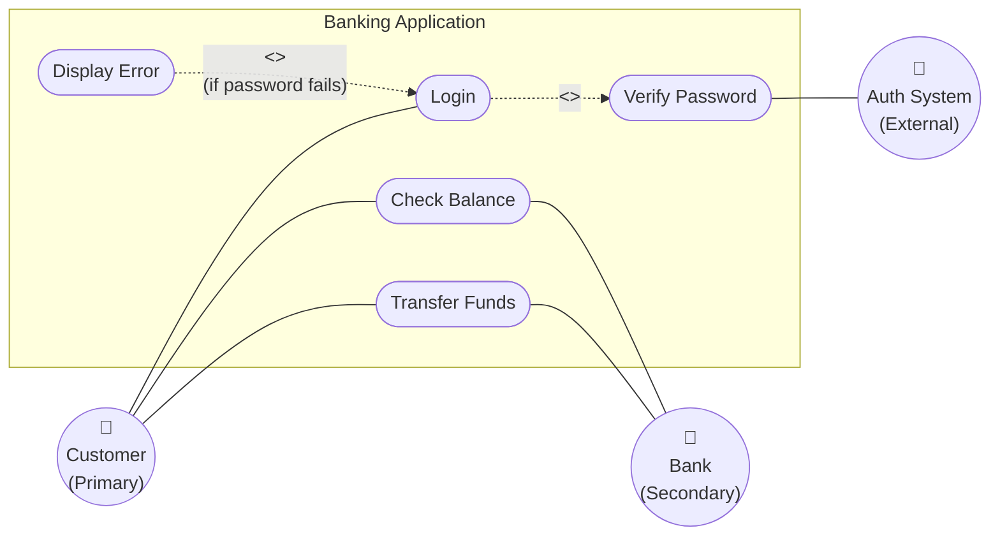
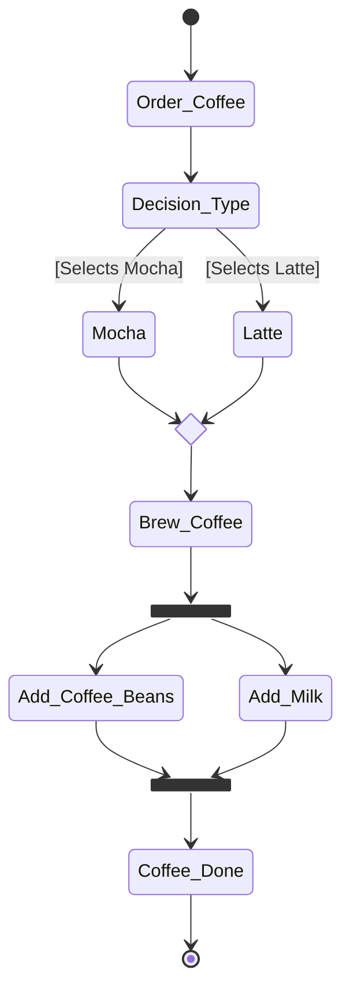
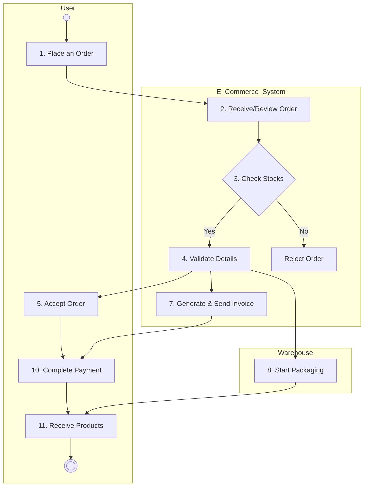

***

# 📚 Software Requirements & Specification (SWE 4401)
**Tags:** #software-engineering #requirements #SDLC #UML #system-design #use-cases #activity-diagrams

---

## 1. Introduction to Software Engineering & SDLC

**Software Engineering** is the practice of scaling a piece of code that executes instructions into a robust, reliable, and maintainable software system.

### Software Development Life Cycle (SDLC)
Building software on a whim leads to failure. We use SDLC to plan and execute systematically.
1. **Planning:** Plan it out, decide functionalities, features, and the deciding phase. Output: *SRS Document*.
2. **Requirement Analysis:** Understanding what to build. 
3. **Designing (System Design):** Output: *DDS (Design Document Specification)*. Senior architects usually handle this.
4. **Implementation:** Writing the actual code.
5. **Testing:** Ensuring the code works. *(Note: In practices like TDD - Test Driven Development, unit testing is written by developers before/during implementation).*
6. **Deployment:** Making the application available for usage.
7. **Maintenance:** Post-deployment bug fixes and updates.

> [!warning] The Cost of Mistakes
> The cost of fixing a mistake grows exponentially the later it is found in the SDLC.
> *   Found in Requirement phase: **$1**
> *   Found in Testing phase: **$100**
> *   Found in Deployment phase: **$1,000**

---

## 2. Requirements vs. Specifications

### Definitions
*   **Requirement:** *What* the system needs to provide as services to the stakeholders. (e.g., "I want to implement a login"). User requests.
*   **Feature:** A specific function of the software. (e.g., "Username and password fields").
*   **Specification:** *How* it will be done and *what constraints* are needed. (e.g., "Username must be unique, password must be at least 6 characters"). Used by developers.

### Types of Requirements

#### 1. Functional Requirements (FR)
Describe **what the system does**, specific services, inputs, and outputs. They need to be complete and consistent.
*   *Example:* "The system shall authenticate users."
*   *Complete Example:* "The system shall search every clinic nationwide and get the result for a specific clinic based on user input."

#### 2. Non-Functional Requirements (NFR)
Describe **how well the system performs**. These are constraints on runtime behaviors. They **must be quantifiable/measurable**. Avoid vague adjectives like "user-friendly" or "fast."
*   **Product Requirements:** Performance, Reliability (handling errors), Usability, Security.
    *   *Bad:* "The system should be fast."
    *   *Good:* "The report should be generated in 3 seconds."
*   **Organizational Requirements:** Delivery, Implementation (e.g., "Must be a desktop application").
*   **External Requirements:** Interoperability, Ethical, Legal (e.g., "A patient cannot view the profile of another patient").

> [!info] Implicit NFRs
> Sometimes Functional Requirements map directly to implicit NFRs (e.g., a feature requiring users to reset passwords implies a Security NFR).

---

## 3. Stakeholders

A stakeholder is anyone affected by the system or who can affect the system.
*   **Primary Stakeholders:** Who uses the system directly (e.g., Patients, Doctors in a hospital app).
*   **Secondary Stakeholders:** Indirectly affected or administrative users (e.g., Accounts department, System Admins).
*   **Internal Stakeholders:** Whoever runs the company building the software.
*   **External Stakeholders:** Outside entities (e.g., Government, Pharmaceutical suppliers, Auth providers).

> **Why identify stakeholders?** To know exactly *for whom* we are building the software. Always identify Primary stakeholders first.

---

## 4. The Requirement Engineering Process

The Requirement Engineering (RE) Process consists of three main phases:

### Phase 1: Elicitation (Gathering Requirements)
Identifying requirements by interacting with stakeholders and analyzing needs.
*   **Document Analysis:** Ask business analysts what to analyze and the context.
*   **Brainstorming:** Open discussion on what features to include.
*   **Requirement Workshop / JAD (Joint Application Development):** Gather every stakeholder for an open discussion. If conflicts arise, ask the product owner.
*   **Interviews:** 
    *   *Open-ended:* Broad discussions.
    *   *Closed-ended:* Asking for confirmation.
    *   *Probing:* Asking "Why?" repeatedly. Give a scenario and ask how it is handled. This forces stakeholders to think deeply *(Deep Elicitation)*.
*   **Focus Groups:** Understanding expectations.
*   **Surveys & Questionnaires:** Good for low attention span or mass audiences (Ratings, MCQs, Ranking).
*   **Shadowing / Ethnography:** Observing users in their working location.
    *   *Passive:* Just watching.
    *   *Active:* Detailed observation, asking questions.
    *   *Participatory:* Doing the job alongside them.
*   **Protocol Analysis:** Capturing hidden mental steps in a process (e.g., having a user "think aloud" while doing a task).
*   **Prototyping & Wireframing:** Visual methods to show the stakeholder before coding begins.

### Phase 2: Specification
Breaking down everything collected into detailed system requirements written for developers.
*   Uses **Natural Language** (numbered sentences).
*   **Graphical Notations:** UML, Use Case diagrams, Sequence diagrams.
*   **Mathematical Specifications:** Finite state machines for validations.

### Phase 3: Validation
Ensuring the requirements actually solve the user's problem without conflict. (Are they complete? Do they contradict?).

---

## 5. Writing High-Quality Requirements

### Characteristics of a Good Requirement
1. **Clean & Unambiguous:** Cannot be interpreted in two completely different ways.
2. **Complete & Consistent:** No contradictions between two requirements.
3. **Verifiable (Testable):** You must be able to write an Acceptance Criterion for it.
4. **Feasible:** Technically and financially possible.
5. **Necessary:** Adds actual value.
6. **Modular / Atomic:** One requirement per sentence. Do not combine FRs and NFRs.
7. **Traceable:** Use unique IDs (e.g., `FR-001`) to trace back to source, priority, or code.
8. **Modifiable:** Easy to update as the project evolves.

### Wording Choices (IEEE Standards)
*   **Shall:** Mandatory requirement (System *has* to do it).
*   **Should:** Desirable / Optional requirement.
*   *Rule:* First do the mandatory "shall" features, then the optional "should" features.

### The EARS Format (Easy Approach to Requirement Syntax)
A template to structure natural language requirements clearly:
*   **Syntax:** `While <conditions>, the system shall <response>`
*   **Event-Driven:** `When <trigger>, the system shall <response>` *(e.g., "When students send a leave request, the system shall send a notification to the teacher.")*
*   **State-Driven:** `While <system state>, the system shall <response>`
*   **Unwanted Behavior (Exception):** `If <error condition>, then the system shall <response>` *(e.g., "If students give the wrong password 3 times consecutively, then the system shall lock the user for one day.")*

---

## 6. Acceptance Criteria (AC)

Acceptance Criteria define the boundaries of a user story/requirement. They define **"Done"**.
*   Written for **testers** and **clients** (in Natural Language).
*   If AC passes -> Action. If AC fails -> Action.
*   **Why needed?** Removes ambiguity, helps developers understand implementation bounds, helps testers create test cases, and lets customers know exactly what will be delivered.

### Formatting AC

**1. Checklist Format**
A simple, sequential step-by-step checklist.

**2. Gherkin Format (Behavior-Driven Development)**
*   **Given:** Initial condition / Precondition.
*   **When:** User action / Trigger.
*   **Then:** System output / Expected result.

> **Scenario:** Invalid Login
> **Given:** The user is on the login page.
> **When:** The user provides an invalid username and password and clicks submit.
> **Then:** The system will show an error message.

### Mapping FRs to ACs
Requirements and ACs must be traceable. 
*   `FR-01` maps to `AC.01.001`, `AC.01.002`, etc.
*   There cannot be too many ACs (break down the FR) or too few ACs (break down the AC).

---

## 7. Unified Modeling Language (UML) & Use Case Diagrams

UML is the blueprint of how the whole system works. There are 14 types divided into two main categories:
1.  **Structural Diagrams:** Describe what the system *is* (e.g., Class, Object, Component, Deployment).
2.  **Behavioral Diagrams:** Describe what the system *does* (e.g., Use Case, Activity, Sequence, State Machine).

### Use Case Diagrams
A Use Case is a **goal** that an actor wants to achieve using the system.

**Four Components:**
1.  **System Boundary:** A box defining what is inside the system vs. outside.
2.  **Actors:** Who uses the system (Stick figures).
    *   *Primary Actors:* Users acting directly on the system (placed on the **Left**).
    *   *Secondary Actors/External Systems:* Systems/Auth gateways/Databases assisting the primary actor (placed on the **Right**).
    *   *Time/Event Actors:* Auto-triggers (e.g., a system automatically generating a report at midnight).
3.  **Use Cases:** The actions/goals (Ovals inside the system box).
4.  **Relationships:** How actors and use cases interact.

### Relationships in Use Cases
*   **Association:** Direct connection between an actor and a use case (solid line).
*   **`<<include>>`:** A mandatory sub-use case. The main use case *needs* this to complete. (Dashed arrow pointing *towards* the included use case).
*   **`<<extend>>`:** An optional/conditional use case. A pop-up or alternative flow. (Dashed arrow pointing *from* the extended use case *back to* the main use case). Requires an *Extension Point*.
*   **Generalization (Inheritance):** A parent-child relationship between actors (e.g., "Regular Customer" and "Pensioner Customer" inherit from "Customer") or use cases.

#### Example: Banking App Use Case Diagram

### Use Case Descriptions
Diagrams alone don't explain everything. We write descriptions using a standard table format:
*   **UC ID & Name**
*   **Primary/Secondary Actors**
*   **Brief Description**
*   **Preconditions:** What must be true before this starts.
*   **Trigger:** What initiates the use case.
*   **Main Success Scenario (Flow):** Step-by-step normal execution.
*   **Alternative Paths/Exception Flows:** What happens if things go wrong.
*   **Post-conditions:** What is true after it completes.

---

## 8. Activity Diagrams

An Activity Diagram visualizes the **workflow** of a Use Case diagram. It describes how the system works from the first step to the last step chronologically.

### Notations
*   **Start Node:** Solid black circle. (Only 1 per diagram).
*   **End Node:** Bullseye/Target circle. (Can be multiple).
*   **Activity/Action:** Rounded rectangles (start with a verb).
*   **Decision Node:** Diamond. One input, multiple outputs (conditional logic: Yes/No). Requires **Guards** (e.g., `[yes]`, `[no]`).
*   **Merge Node:** Diamond. Multiple inputs merging back into one flow.
*   **Fork:** A thick black line dividing one flow into multiple *concurrent/parallel* activities. (All activities branched out *must* be done).
*   **Join:** A thick black line joining multiple parallel activities into one outcome. (All incoming activities must be completed to proceed).
*   **Swimlanes:** Used to divide the diagram into columns/rows based on which Actor or Subsystem is performing the action.

#### Example: Making Coffee (Showing Merge, Fork, and Join)

#### Example: Booking System with Swimlanes

*(Note: If outcomes are contradictory or ambiguous during diagramming, add them to an "Assumptions" list, as this highlights gaps in the requirement collection phase).*