# IUT Medical Center System — Comprehensive Use Case Guide (All Scopes)

> [!abstract] 📚 Lab Final Master Reference
> This comprehensive document contains **all 109 Use Cases** across Scopes 1 to 5 of the IUT Medical Center Management System.
> Each use case is equipped with its complete metadata, trigger, preconditions, postconditions, basic flow, alternative flows, exceptions, and a **dedicated Obsidian-compatible Mermaid Diagram**.
> 
> 💡 **Exam Tip**: In your lab final, when asked to write the description and diagram for any random use case, follow the exact standard IEEE structure shown in each section below.

## Table of Contents
- [Scope 1: Patient Registration, Profiles, Scheduling & Consultations](#scope-1-patient-registration-profiles-scheduling--consultations)
- [Scope 2: Intake, Emergency, Triage, Diagnosis & Referrals](#scope-2-intake-emergency-triage-diagnosis--referrals)
- [Scope 3: Pharmacy, Inventory, Procurement & Laboratory](#scope-3-pharmacy-inventory-procurement--laboratory)
- [Scope 4: Financial, Billing & Multi-Stage Reimbursement Management](#scope-4-financial-billing--multi-stage-reimbursement-management)
- [Scope 5: Administrative System, Duty Rosters, Notifications & Reporting](#scope-5-administrative-system-duty-rosters-notifications--reporting)


---

## Scope 1: Patient Registration, Profiles, Scheduling & Consultations

> [!info] 🎯 Scope Overview & Context
> **Primary Actors**: Patient, Receptionist, Nurse, Doctor, IUT Authentication Database
> 
> **Key Responsibilities**: Covers user authentication via IUT accounts, patient profile creation/updates, walk-in registration, appointment booking (online and walk-in), doctor availability matching, vital signs logging by nurses, queue management, consultation record access, digital prescriptions with automated allergy conflict checks, and medical record viewing.

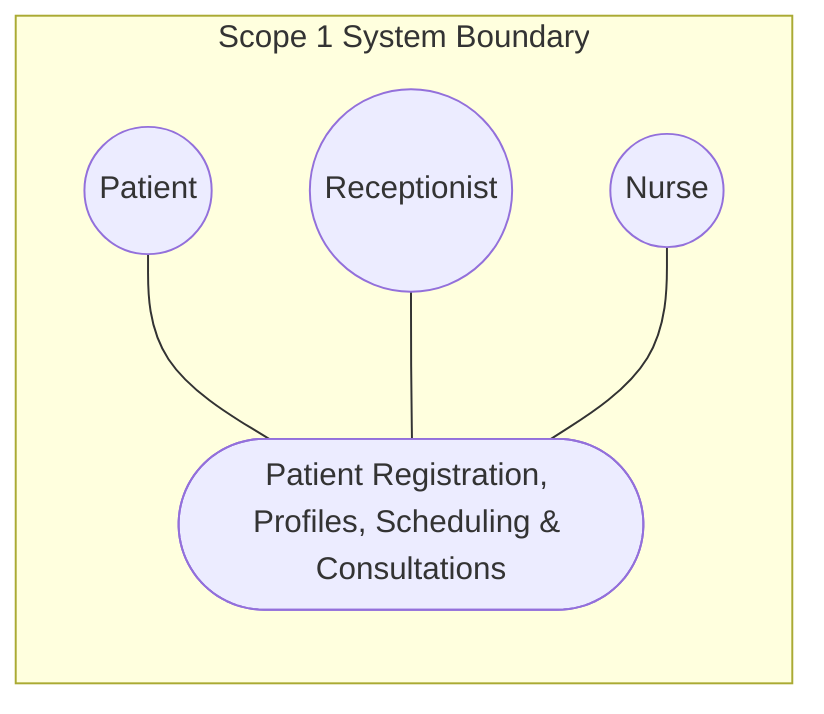

### UC-1.01: Log In

> [!note]- 📋 Quick Use Case Specification Table
> | Specification Field | Description / Value |
> | :--- | :--- |
> | **Use Case ID** | `UC-1.01` |
> | **Use Case Name** | Log In |
> | **Primary Actor** | Patient; Medical Staff |
> | **Secondary Actor** | None |
> | **External System** | IUT Authentication Database |
> | **Priority / Frequency** | High / Very High |
> | **Trigger** | User opens the app and enters their IUT login. |
> | **Preconditions** | User has a valid IUT account. |
> | **Postconditions** | User is signed in and sees their dashboard. |

#### Detailed Workflow & Logic
- **Primary Actor**: Patient; Medical Staff
- **External System**: IUT Authentication Database
- **Brief Description**: Lets a user sign in with their IUT account and opens the right dashboard for their role.
- **Preconditions**: User has a valid IUT account.
- **Main Flow**:
  1. 15, FR-
  2. 25, FR-
  3. 26  If this is a patient's first login, the system creates their profile automatically. System opens the dashboard that matches the user's role (patient, nurse, doctor, or staff).
- **Alternative Flows**: First-time patient: a profile is created automatically.
- **Exceptions & Failures**: Wrong login: an error is shown and access is blocked.
- **Postconditions**: User is signed in and sees their dashboard.
- **Acceptance Criteria**: Correct login opens the dashboard. Wrong login is rejected.

#### Use Case Diagram
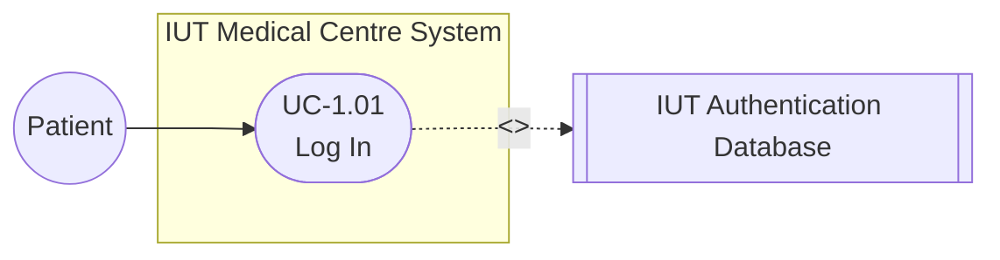

### UC-1.02: Verify Credentials

> [!note]- 📋 Quick Use Case Specification Table
> | Specification Field | Description / Value |
> | :--- | :--- |
> | **Use Case ID** | `UC-1.02` |
> | **Use Case Name** | Verify Credentials |
> | **Primary Actor** | System |
> | **Secondary Actor** | None |
> | **External System** | IUT Authentication Database |
> | **Priority / Frequency** | High / Very High |
> | **Trigger** | Called during login. |
> | **Preconditions** | A login attempt is happening. |
> | **Postconditions** | Login is marked valid or invalid. |

#### Detailed Workflow & Logic
- **Primary Actor**: System
- **External System**: IUT Authentication Database
- **Brief Description**: Checks the entered login against the IUT database.
- **Preconditions**: A login attempt is happening.
- **Main Flow**:
  1. System receives the IUT ID and password from the login step.
  2. System sends them to the IUT Authentication Database.
  3. The database checks the ID and password.
  4. System receives a valid or invalid result.
  5. System passes the result back to the login step.
- **Alternative Flows**: None
- **Exceptions & Failures**: IUT database is down: login fails with a retry message.
- **Postconditions**: Login is marked valid or invalid.
- **Acceptance Criteria**: Valid logins pass; invalid ones fail.

#### Use Case Diagram
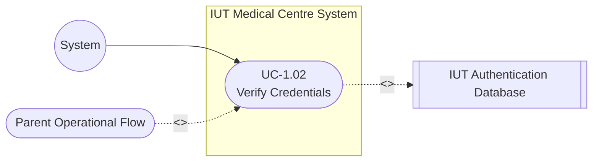

### UC-1.03: Retrieve User Details

> [!note]- 📋 Quick Use Case Specification Table
> | Specification Field | Description / Value |
> | :--- | :--- |
> | **Use Case ID** | `UC-1.03` |
> | **Use Case Name** | Retrieve User Details |
> | **Primary Actor** | System |
> | **Secondary Actor** | None |
> | **External System** | IUT Authentication Database |
> | **Priority / Frequency** | Medium / Very High |
> | **Trigger** | Called right after the login is verified. |
> | **Preconditions** | User is verified. |
> | **Postconditions** | User details are loaded into the session. |

#### Detailed Workflow & Logic
- **Primary Actor**: System
- **External System**: IUT Authentication Database
- **Brief Description**: Loads the user's name, role and contact info after a successful login.
- **Preconditions**: User is verified.
- **Main Flow**:
  1. Once the login is verified, the system requests the user's record from the IUT database.
  2. System reads the user's name, ID, role, and contact details.
  3. System loads these details into the current session.
  4. System uses the role to decide which features to show.
- **Alternative Flows**: None
- **Exceptions & Failures**: Details missing: profile is flagged to complete later.
- **Postconditions**: User details are loaded into the session.
- **Acceptance Criteria**: Name, role and contact are loaded.

#### Use Case Diagram
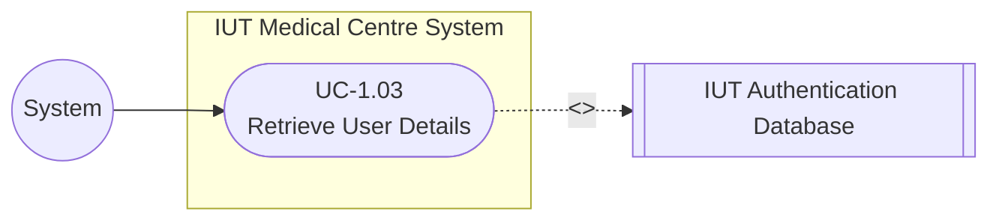

### UC-1.04: Create Patient Profile

> [!note]- 📋 Quick Use Case Specification Table
> | Specification Field | Description / Value |
> | :--- | :--- |
> | **Use Case ID** | `UC-1.04` |
> | **Use Case Name** | Create Patient Profile |
> | **Primary Actor** | System |
> | **Secondary Actor** | None |
> | **External System** | None |
> | **Priority / Frequency** | Medium / Low |
> | **Trigger** | A patient logs in and has no profile yet. |
> | **Preconditions** | Patient is verified. No profile exists yet. |
> | **Postconditions** | A new patient profile is created. |

#### Detailed Workflow & Logic
- **Primary Actor**: System
- **Brief Description**: Creates a patient profile the first time a patient logs in.
- **Preconditions**: Patient is verified. No profile exists yet.
- **Main Flow**:
  1. System checks whether the patient already has a profile.
  2. Finding none, the system starts a new patient profile.
  3. System fills it with the details retrieved from the IUT database.
  4. System assigns a unique patient record ID.
  5. System links the profile to the patient's IUT identity and saves it.
- **Alternative Flows**: None
- **Exceptions & Failures**: Profile already exists: system links to it instead of making a new one.
- **Postconditions**: A new patient profile is created.
- **Acceptance Criteria**: A single profile is created and linked.

#### Use Case Diagram
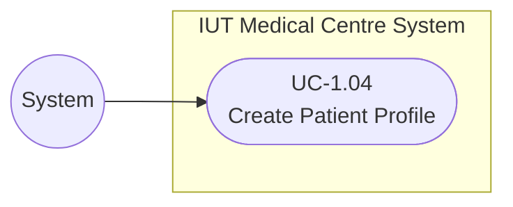

### UC-1.05: Update Patient Profile

> [!note]- 📋 Quick Use Case Specification Table
> | Specification Field | Description / Value |
> | :--- | :--- |
> | **Use Case ID** | `UC-1.05` |
> | **Use Case Name** | Update Patient Profile |
> | **Primary Actor** | Patient |
> | **Secondary Actor** | None |
> | **External System** | None |
> | **Priority / Frequency** | Medium / Low |
> | **Trigger** | Patient opens their profile to edit it. |
> | **Preconditions** | Patient is logged in. |
> | **Postconditions** | Updated details are saved. |

#### Detailed Workflow & Logic
- **Primary Actor**: Patient
- **Brief Description**: Lets a patient update their own contact details.
- **Preconditions**: Patient is logged in.
- **Main Flow**:
  1. Patient opens the My Profile page.
  2. System shows the current contact and personal details.
  3. Patient edits the fields they want to change (e.g., phone, address, emergency contact).
  4. Patient submits the changes.
  5. System checks the entries are valid and saves them.
  6. System shows the updated details.
- **Alternative Flows**: None
- **Exceptions & Failures**: Invalid input (e.g., bad phone number): the change is rejected.
- **Postconditions**: Updated details are saved.
- **Acceptance Criteria**: Valid edits are saved; invalid ones are blocked.

#### Use Case Diagram
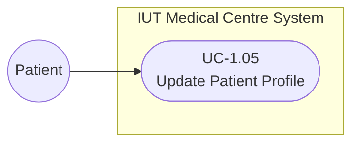

### UC-1.06: Register Walk-In Patient

> [!note]- 📋 Quick Use Case Specification Table
> | Specification Field | Description / Value |
> | :--- | :--- |
> | **Use Case ID** | `UC-1.06` |
> | **Use Case Name** | Register Walk-In Patient |
> | **Primary Actor** | Receptionist |
> | **Secondary Actor** | None |
> | **External System** | None |
> | **Priority / Frequency** | High / High |
> | **Trigger** | A patient arrives at the front desk. |
> | **Preconditions** | Receptionist is logged in. |
> | **Postconditions** | Patient is identified by exactly one record. |

#### Detailed Workflow & Logic
- **Primary Actor**: Receptionist
- **Brief Description**: Registers a patient who comes to the desk, reusing their record if one already exists.
- **Preconditions**: Receptionist is logged in.
- **Main Flow**:
  1. Receptionist starts a new walk-in registration.
  2. Receptionist searches for the patient by IUT ID, phone, or name.
  3. If a record is found, the receptionist opens it and continues.
  4. If none is found, the receptionist enters the patient's details.
  5. System checks for duplicates before saving.
  6. System creates one patient record with a unique ID and confirms it.
- **Alternative Flows**: Existing patient found: skip creating a new one.
- **Exceptions & Failures**: Duplicate found: the system shows the existing record instead.
- **Postconditions**: Patient is identified by exactly one record.
- **Acceptance Criteria**: No duplicate records are created for the same person.

#### Use Case Diagram
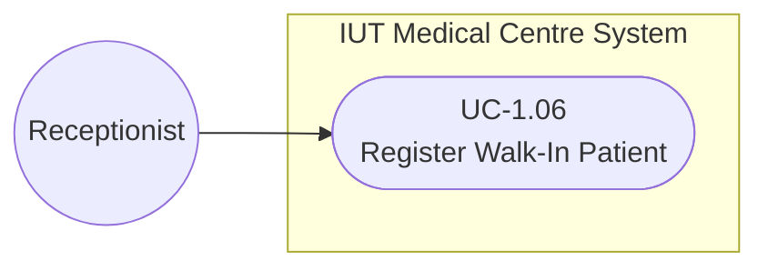

### UC-1.07: Search Patient Record

> [!note]- 📋 Quick Use Case Specification Table
> | Specification Field | Description / Value |
> | :--- | :--- |
> | **Use Case ID** | `UC-1.07` |
> | **Use Case Name** | Search Patient Record |
> | **Primary Actor** | Receptionist |
> | **Secondary Actor** | None |
> | **External System** | None |
> | **Priority / Frequency** | Medium / High |
> | **Trigger** | Called while registering a walk-in. |
> | **Preconditions** | A registration is in progress. |
> | **Postconditions** | A matching record is found, or none exists. |

#### Detailed Workflow & Logic
- **Primary Actor**: Receptionist
- **Brief Description**: Looks for an existing patient by ID, phone or name.
- **Preconditions**: A registration is in progress.
- **Main Flow**:
  1. Receptionist enters a search term (IUT ID, phone, or name).
  2. System searches the patient records.
  3. System shows the matching patients in a list.
  4. Receptionist reviews the results and picks the correct patient, or confirms none match.
- **Alternative Flows**: None
- **Exceptions & Failures**: No match: system says none found so a new record can be made.
- **Postconditions**: A matching record is found, or none exists.
- **Acceptance Criteria**: Search finds the right record or confirms none.

#### Use Case Diagram
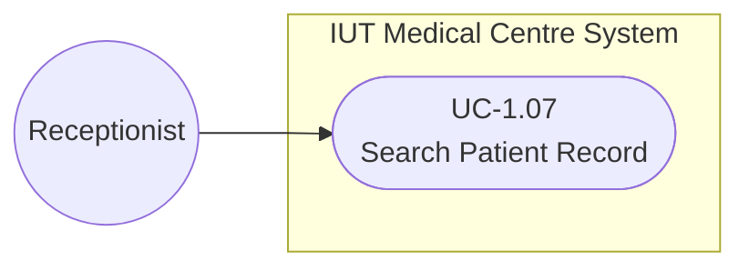

### UC-1.08: Verify Patient Eligibility

> [!note]- 📋 Quick Use Case Specification Table
> | Specification Field | Description / Value |
> | :--- | :--- |
> | **Use Case ID** | `UC-1.08` |
> | **Use Case Name** | Verify Patient Eligibility |
> | **Primary Actor** | Receptionist |
> | **Secondary Actor** | None |
> | **External System** | None |
> | **Priority / Frequency** | High / High |
> | **Trigger** | Called while registering a patient. |
> | **Preconditions** | Patient is identified. |
> | **Postconditions** | The patient's category is saved on the visit. |

#### Detailed Workflow & Logic
- **Primary Actor**: Receptionist
- **Brief Description**: Confirms the patient's category (student, staff, family, or walk-in) for the visit.
- **Preconditions**: Patient is identified.
- **Main Flow**:
  1. System reads the patient's category (student, staff, family, or walk-in).
  2. Receptionist confirms the category against the patient's ID or documents.
  3. System records the eligibility category on the visit.
  4. If the patient is a non-IUT walk-in, the system continues to record their details (UC-1.09).
- **Alternative Flows**: Walk-in with no IUT account: record their details (UC-1.09).
- **Exceptions & Failures**: None
- **Postconditions**: The patient's category is saved on the visit.
- **Acceptance Criteria**: The category is saved for the visit.

#### Use Case Diagram
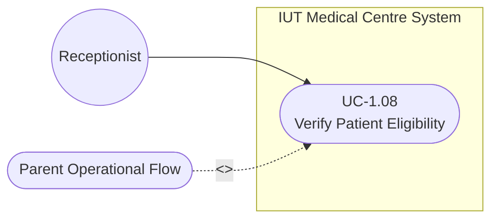

### UC-1.09: Record Walk-In Patient

> [!note]- 📋 Quick Use Case Specification Table
> | Specification Field | Description / Value |
> | :--- | :--- |
> | **Use Case ID** | `UC-1.09` |
> | **Use Case Name** | Record Walk-In Patient |
> | **Primary Actor** | Receptionist |
> | **Secondary Actor** | None |
> | **External System** | None |
> | **Priority / Frequency** | Medium / Medium |
> | **Trigger** | A walk-in patient has no IUT record. |
> | **Preconditions** | Patient has no IUT account. |
> | **Postconditions** | The walk-in patient's details are saved. |

#### Detailed Workflow & Logic
- **Primary Actor**: Receptionist
- **Brief Description**: Records the details of a walk-in patient who has no IUT account.
- **Preconditions**: Patient has no IUT account.
- **Main Flow**:
  1. Receptionist chooses to add a walk-in patient who has no IUT account.
  2. Receptionist enters the patient's name, contact, and other required details.
  3. System checks the required fields are filled and not duplicated.
  4. System saves the walk-in patient as a valid record with a unique ID.
- **Alternative Flows**: None
- **Exceptions & Failures**: Missing required details: the record can't be saved until they're added.
- **Postconditions**: The walk-in patient's details are saved.
- **Acceptance Criteria**: The walk-in patient is saved as a valid record.

#### Use Case Diagram
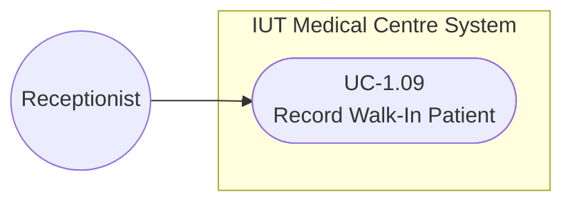

### UC-1.10: Create Visit Record

> [!note]- 📋 Quick Use Case Specification Table
> | Specification Field | Description / Value |
> | :--- | :--- |
> | **Use Case ID** | `UC-1.10` |
> | **Use Case Name** | Create Visit Record |
> | **Primary Actor** | Receptionist |
> | **Secondary Actor** | None |
> | **External System** | None |
> | **Priority / Frequency** | High / Very High |
> | **Trigger** | A patient checks in for a visit. |
> | **Preconditions** | Patient record exists. |
> | **Postconditions** | A new visit is created and linked to the patient. |

#### Detailed Workflow & Logic
- **Primary Actor**: Receptionist
- **Brief Description**: Starts a new visit for the patient and adds it to their timeline.
- **Preconditions**: Patient record exists.
- **Main Flow**:
  1. Staff selects the patient's profile.
  2. Staff starts a new visit for today.
  3. System stamps the visit with the date, time, and eligibility category.
  4. System links the visit to the patient's timeline.
  5. System sets the visit status to open and confirms it.
- **Alternative Flows**: A visit is already open today: reuse it.
- **Exceptions & Failures**: None
- **Postconditions**: A new visit is created and linked to the patient.
- **Acceptance Criteria**: The visit shows up in the patient's timeline.

#### Use Case Diagram
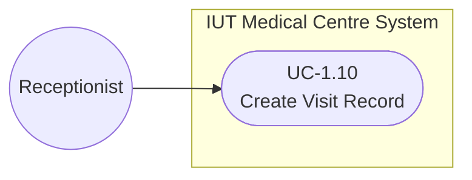

### UC-1.11: Book Appointment

> [!note]- 📋 Quick Use Case Specification Table
> | Specification Field | Description / Value |
> | :--- | :--- |
> | **Use Case ID** | `UC-1.11` |
> | **Use Case Name** | Book Appointment |
> | **Primary Actor** | Patient; Receptionist |
> | **Secondary Actor** | None |
> | **External System** | None |
> | **Priority / Frequency** | High / Very High |
> | **Trigger** | A patient needs to see a doctor. |
> | **Preconditions** | Patient is identified. |
> | **Postconditions** | An appointment is created. |

#### Detailed Workflow & Logic
- **Primary Actor**: Patient; Receptionist
- **Brief Description**: The general booking step: the patient books online or the receptionist books a walk-in.
- **Preconditions**: Patient is identified.
- **Main Flow**:
  1. The patient or receptionist starts a booking.
  2. System asks how the booking will be made (online or walk-in).
  3. The requester chooses the channel.
  4. System hands over to the matching booking step (online or walk-in).
  5. Once that step finishes, the system records the confirmed appointment.
- **Alternative Flows**: None
- **Exceptions & Failures**: None
- **Postconditions**: An appointment is created.
- **Acceptance Criteria**: A confirmed appointment is created.

#### Use Case Diagram
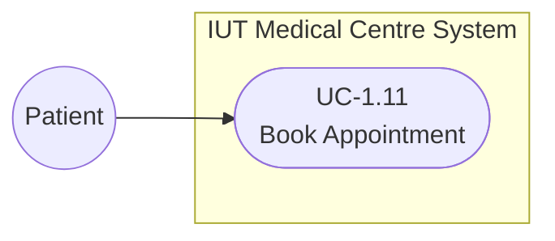

### UC-1.12: Book Online Appointment

> [!note]- 📋 Quick Use Case Specification Table
> | Specification Field | Description / Value |
> | :--- | :--- |
> | **Use Case ID** | `UC-1.12` |
> | **Use Case Name** | Book Online Appointment |
> | **Primary Actor** | Patient |
> | **Secondary Actor** | None |
> | **External System** | None |
> | **Priority / Frequency** | High / Very High |
> | **Trigger** | Patient books through the app. |
> | **Preconditions** | Patient is logged in. |
> | **Postconditions** | An online appointment is created. |

#### Detailed Workflow & Logic
- **Primary Actor**: Patient
- **Brief Description**: Lets a patient book online, including psychiatric appointments.
- **Preconditions**: Patient is logged in.
- **Main Flow**:
  1. Patient opens the booking page and picks a service (including psychiatric).
  2. Patient selects a date.
  3. System shows the available doctors and slots for that date.
  4. Patient picks a doctor and time slot.
  5. System checks the slot is free and creates the appointment.
  6. System shows a confirmation to the patient.
- **Alternative Flows**: No slot: system suggests another doctor (UC-1.15).
- **Exceptions & Failures**: None
- **Postconditions**: An online appointment is created.
- **Acceptance Criteria**: The online appointment is created.

#### Use Case Diagram
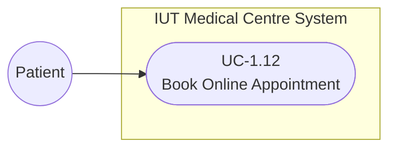

### UC-1.13: Book Walk-In Appointment

> [!note]- 📋 Quick Use Case Specification Table
> | Specification Field | Description / Value |
> | :--- | :--- |
> | **Use Case ID** | `UC-1.13` |
> | **Use Case Name** | Book Walk-In Appointment |
> | **Primary Actor** | Receptionist |
> | **Secondary Actor** | None |
> | **External System** | None |
> | **Priority / Frequency** | High / High |
> | **Trigger** | A walk-in patient asks to see a doctor. |
> | **Preconditions** | Patient has an open visit. |
> | **Postconditions** | A walk-in appointment is created, or the request is rejected. |

#### Detailed Workflow & Logic
- **Primary Actor**: Receptionist
- **Brief Description**: Lets the receptionist book a walk-in patient with an available doctor.
- **Preconditions**: Patient has an open visit.
- **Main Flow**:
  1. Receptionist starts a walk-in booking for the patient.
  2. Receptionist selects the service the patient needs.
  3. System shows the available doctors and slots.
  4. Receptionist assigns an available doctor.
  5. System checks the appointment is valid and creates it.
  6. System confirms the walk-in appointment.
- **Alternative Flows**: Psychiatric service: the walk-in is rejected (UC-1.16) and sent to online booking.
- **Exceptions & Failures**: None
- **Postconditions**: A walk-in appointment is created, or the request is rejected.
- **Acceptance Criteria**: A valid walk-in appointment is created, or clearly rejected.

#### Use Case Diagram
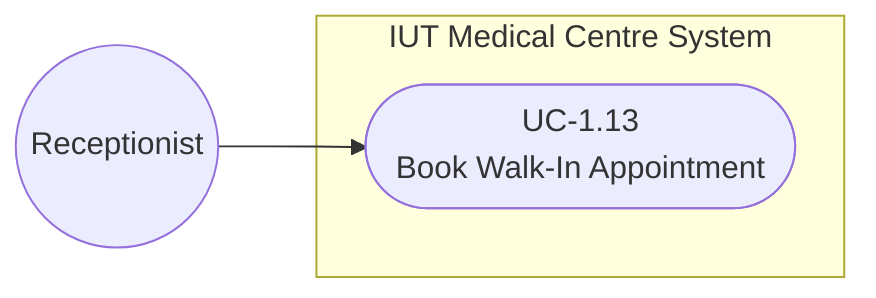

### UC-1.14: View Doctor Availability

> [!note]- 📋 Quick Use Case Specification Table
> | Specification Field | Description / Value |
> | :--- | :--- |
> | **Use Case ID** | `UC-1.14` |
> | **Use Case Name** | View Doctor Availability |
> | **Primary Actor** | Patient; Receptionist |
> | **Secondary Actor** | None |
> | **External System** | None |
> | **Priority / Frequency** | Medium / Very High |
> | **Trigger** | Called while booking. |
> | **Preconditions** | A service is selected. |
> | **Postconditions** | Available doctors and slots are shown. |

#### Detailed Workflow & Logic
- **Primary Actor**: Patient; Receptionist
- **Brief Description**: Shows which doctors and slots are free, based on the duty schedule.
- **Preconditions**: A service is selected.
- **Main Flow**:
  1. System reads the published doctor duty schedule.
  2. System filters doctors by the chosen service or department.
  3. System works out which slots are still open.
  4. System shows the available doctors and their open slots to the requester.
- **Alternative Flows**: None
- **Exceptions & Failures**: No schedule yet: no slots are shown and the user is asked to try later.
- **Postconditions**: Available doctors and slots are shown.
- **Acceptance Criteria**: Open slots are shown correctly.

#### Use Case Diagram
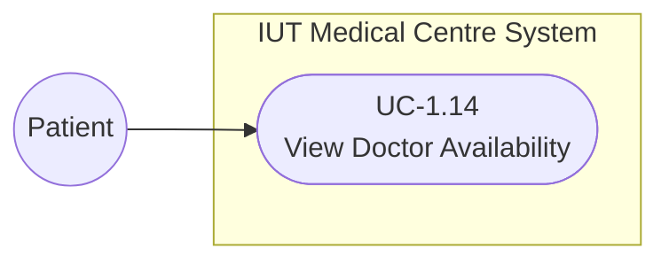

### UC-1.15: Suggest Alternate Doctor

> [!note]- 📋 Quick Use Case Specification Table
> | Specification Field | Description / Value |
> | :--- | :--- |
> | **Use Case ID** | `UC-1.15` |
> | **Use Case Name** | Suggest Alternate Doctor |
> | **Primary Actor** | System |
> | **Secondary Actor** | None |
> | **External System** | None |
> | **Priority / Frequency** | Low / Medium |
> | **Trigger** | The chosen doctor is full. |
> | **Preconditions** | No slot with the chosen doctor. |
> | **Postconditions** | Other doctors are suggested, or none are found. |

#### Detailed Workflow & Logic
- **Primary Actor**: System
- **Brief Description**: Offers another doctor when the chosen one has no free slot.
- **Preconditions**: No slot with the chosen doctor.
- **Main Flow**:
  1. System notices the chosen doctor has no open slot.
  2. System searches the same department for other doctors with free slots.
  3. System sorts them by the earliest available time.
  4. System shows these alternate doctors to the requester.
- **Alternative Flows**: None
- **Exceptions & Failures**: No one free: system says none are available.
- **Postconditions**: Other doctors are suggested, or none are found.
- **Acceptance Criteria**: Alternatives are shown when they exist.

#### Use Case Diagram
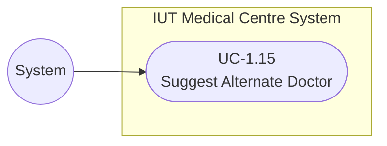

### UC-1.16: Reject Walk-In Attempt

> [!note]- 📋 Quick Use Case Specification Table
> | Specification Field | Description / Value |
> | :--- | :--- |
> | **Use Case ID** | `UC-1.16` |
> | **Use Case Name** | Reject Walk-In Attempt |
> | **Primary Actor** | System |
> | **Secondary Actor** | None |
> | **External System** | None |
> | **Priority / Frequency** | Medium / Low |
> | **Trigger** | A walk-in is requested for psychiatry. |
> | **Preconditions** | A walk-in booking is being tried for psychiatry. |
> | **Postconditions** | The walk-in is blocked and redirected online. |

#### Detailed Workflow & Logic
- **Primary Actor**: System
- **Brief Description**: Blocks a walk-in for psychiatric care and sends the patient to online booking.
- **Preconditions**: A walk-in booking is being tried for psychiatry.
- **Main Flow**:
  1. System sees the requested service is psychiatric.
  2. System blocks the walk-in booking.
  3. System shows a message that psychiatric care needs an online appointment.
  4. System points the patient to the online booking option.
- **Alternative Flows**: None
- **Exceptions & Failures**: None
- **Postconditions**: The walk-in is blocked and redirected online.
- **Acceptance Criteria**: Psychiatric walk-ins are blocked.

#### Use Case Diagram
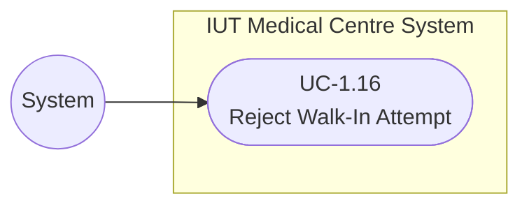

### UC-1.17: Verify Appointment Validity

> [!note]- 📋 Quick Use Case Specification Table
> | Specification Field | Description / Value |
> | :--- | :--- |
> | **Use Case ID** | `UC-1.17` |
> | **Use Case Name** | Verify Appointment Validity |
> | **Primary Actor** | System |
> | **Secondary Actor** | None |
> | **External System** | None |
> | **Priority / Frequency** | Medium / High |
> | **Trigger** | Called just before confirming a walk-in. |
> | **Preconditions** | A doctor and slot are chosen. |
> | **Postconditions** | The appointment is confirmed or rejected. |

#### Detailed Workflow & Logic
- **Primary Actor**: System
- **Brief Description**: Checks the slot is still free before confirming a walk-in appointment.
- **Preconditions**: A doctor and slot are chosen.
- **Main Flow**:
  1. Before confirming, the system re-checks the chosen slot is still open.
  2. System checks the patient has no clashing appointment at that time.
  3. If everything is fine, the system marks the appointment valid.
  4. System lets the booking be confirmed.
- **Alternative Flows**: None
- **Exceptions & Failures**: Slot taken meanwhile: user is asked to pick another.
- **Postconditions**: The appointment is confirmed or rejected.
- **Acceptance Criteria**: Only valid appointments are confirmed.

#### Use Case Diagram
```mermaid
flowchart LR
    Actor_System(("System"))
    subgraph IUT Medical Centre System
        UC_117(["UC-1.17<br>Verify Appointment Validity"])
    end
    Actor_System --> UC_117
    ParentUC(["Parent Operational Flow"]) -.->|<<includes>>| UC_117
```

### UC-1.18: Record Vital Signs

> [!note]- 📋 Quick Use Case Specification Table
> | Specification Field | Description / Value |
> | :--- | :--- |
> | **Use Case ID** | `UC-1.18` |
> | **Use Case Name** | Record Vital Signs |
> | **Primary Actor** | Nurse |
> | **Secondary Actor** | None |
> | **External System** | None |
> | **Priority / Frequency** | High / Very High |
> | **Trigger** | The patient reaches the vitals station. |
> | **Preconditions** | Patient is checked in. |
> | **Postconditions** | Vitals are saved to the visit. |

#### Detailed Workflow & Logic
- **Primary Actor**: Nurse
- **Brief Description**: The nurse records the patient's vitals for the visit.
- **Preconditions**: Patient is checked in.
- **Main Flow**:
  1. Nurse calls the patient to the vitals station and opens their visit.
  2. Nurse measures the vitals (temperature, blood pressure, pulse, weight).
  3. Nurse enters the readings into the system.
  4. System checks the readings look reasonable.
  5. System saves the vitals to the visit.
- **Alternative Flows**: None
- **Exceptions & Failures**: Odd reading: nurse re-checks before saving.
- **Postconditions**: Vitals are saved to the visit.
- **Acceptance Criteria**: Vitals are saved to the visit.

#### Use Case Diagram
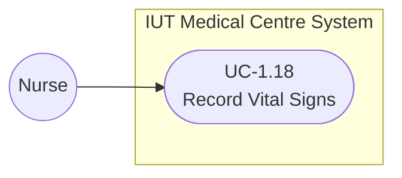

### UC-1.19: Mark Vitals Ready for Review

> [!note]- 📋 Quick Use Case Specification Table
> | Specification Field | Description / Value |
> | :--- | :--- |
> | **Use Case ID** | `UC-1.19` |
> | **Use Case Name** | Mark Vitals Ready for Review |
> | **Primary Actor** | Nurse |
> | **Secondary Actor** | None |
> | **External System** | None |
> | **Priority / Frequency** | Medium / Very High |
> | **Trigger** | Vitals are finished. |
> | **Preconditions** | Vitals are recorded. |
> | **Postconditions** | The visit is marked vitals-ready. |

#### Detailed Workflow & Logic
- **Primary Actor**: Nurse
- **Brief Description**: Marks the vitals as done so the doctor can review them.
- **Preconditions**: Vitals are recorded.
- **Main Flow**:
  1. Nurse checks that all required vitals are recorded.
  2. Nurse confirms the vitals are complete.
  3. System marks the visit's vitals as ready for the doctor.
  4. System updates the patient's status so the doctor can see them.
- **Alternative Flows**: None
- **Exceptions & Failures**: Something missing: the visit stays pending.
- **Postconditions**: The visit is marked vitals-ready.
- **Acceptance Criteria**: Visit is marked ready only when vitals are complete.

#### Use Case Diagram
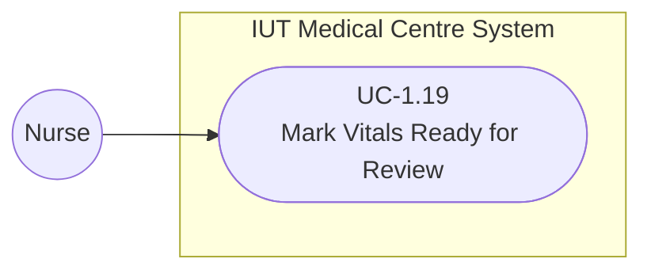

### UC-1.20: Update Patient Queue Status

> [!note]- 📋 Quick Use Case Specification Table
> | Specification Field | Description / Value |
> | :--- | :--- |
> | **Use Case ID** | `UC-1.20` |
> | **Use Case Name** | Update Patient Queue Status |
> | **Primary Actor** | Nurse |
> | **Secondary Actor** | None |
> | **External System** | None |
> | **Priority / Frequency** | Medium / Very High |
> | **Trigger** | The patient's stage changes. |
> | **Preconditions** | Patient is checked in. |
> | **Postconditions** | The queue shows the patient's current stage. |

#### Detailed Workflow & Logic
- **Primary Actor**: Nurse
- **Brief Description**: Updates where the patient is in the queue (waiting, ready, with doctor).
- **Preconditions**: Patient is checked in.
- **Main Flow**:
  1. The patient moves to a new stage (waiting, vitals done, with doctor, or completed).
  2. Nurse or staff sets the patient's new status.
  3. System updates the patient's place in the queue.
  4. System shows the change in the shared queue view.
- **Alternative Flows**: None
- **Exceptions & Failures**: None
- **Postconditions**: The queue shows the patient's current stage.
- **Acceptance Criteria**: The queue matches the patient's real stage.

#### Use Case Diagram
```mermaid
flowchart LR
    Actor_Nurse(("Nurse"))
    subgraph IUT Medical Centre System
        UC_120(["UC-1.20<br>Update Patient Queue Status"])
    end
    Actor_Nurse --> UC_120
```

### UC-1.21: View Patient Queue

> [!note]- 📋 Quick Use Case Specification Table
> | Specification Field | Description / Value |
> | :--- | :--- |
> | **Use Case ID** | `UC-1.21` |
> | **Use Case Name** | View Patient Queue |
> | **Primary Actor** | Medical Staff |
> | **Secondary Actor** | None |
> | **External System** | None |
> | **Priority / Frequency** | Medium / Very High |
> | **Trigger** | Staff opens the queue. |
> | **Preconditions** | Staff is logged in. |
> | **Postconditions** | The current queue is shown. |

#### Detailed Workflow & Logic
- **Primary Actor**: Medical Staff
- **Brief Description**: Shows the live queue of waiting patients and their status.
- **Preconditions**: Staff is logged in.
- **Main Flow**:
  1. Staff opens the queue view.
  2. System reads the current queue.
  3. System lists the patients in order with their current status.
  4. Staff uses the list to see who is next and at what stage.
- **Alternative Flows**: Queue empty: an empty list is shown.
- **Exceptions & Failures**: None
- **Postconditions**: The current queue is shown.
- **Acceptance Criteria**: The queue is shown in the right order.

#### Use Case Diagram
```mermaid
flowchart LR
    Actor_MedicalStaff(("Medical Staff"))
    subgraph IUT Medical Centre System
        UC_121(["UC-1.21<br>View Patient Queue"])
    end
    Actor_MedicalStaff --> UC_121
```

### UC-1.22: Open Patient Record

> [!note]- 📋 Quick Use Case Specification Table
> | Specification Field | Description / Value |
> | :--- | :--- |
> | **Use Case ID** | `UC-1.22` |
> | **Use Case Name** | Open Patient Record |
> | **Primary Actor** | Doctor |
> | **Secondary Actor** | None |
> | **External System** | None |
> | **Priority / Frequency** | High / Very High |
> | **Trigger** | Doctor calls the next patient. |
> | **Preconditions** | Patient is queued for this doctor. |
> | **Postconditions** | The patient's record is open. |

#### Detailed Workflow & Logic
- **Primary Actor**: Doctor
- **Brief Description**: Opens the next patient's record to start the consultation.
- **Preconditions**: Patient is queued for this doctor.
- **Main Flow**:
  1. Doctor selects the next patient from the queue.
  2. System opens that patient's record and current visit.
  3. System sets the patient's status to with doctor.
  4. System gets the record ready for the doctor to review.
- **Alternative Flows**: None
- **Exceptions & Failures**: Record won't load: doctor retries or calls IT.
- **Postconditions**: The patient's record is open.
- **Acceptance Criteria**: The correct record opens.

#### Use Case Diagram
```mermaid
flowchart LR
    Actor_Doctor(("Doctor"))
    subgraph IUT Medical Centre System
        UC_122(["UC-1.22<br>Open Patient Record"])
    end
    Actor_Doctor --> UC_122
```

### UC-1.23: Review Vitals and History

> [!note]- 📋 Quick Use Case Specification Table
> | Specification Field | Description / Value |
> | :--- | :--- |
> | **Use Case ID** | `UC-1.23` |
> | **Use Case Name** | Review Vitals and History |
> | **Primary Actor** | Doctor |
> | **Secondary Actor** | None |
> | **External System** | None |
> | **Priority / Frequency** | High / Very High |
> | **Trigger** | Called when the record is opened. |
> | **Preconditions** | The patient's record is open. |
> | **Postconditions** | Vitals and history are shown. |

#### Detailed Workflow & Logic
- **Primary Actor**: Doctor
- **Brief Description**: Shows the doctor the patient's vitals and past history.
- **Preconditions**: The patient's record is open.
- **Main Flow**:
  1. System displays the visit's recorded vitals.
  2. System displays the patient's past visits, diagnoses, and prescriptions.
  3. Doctor reviews the vitals and history.
  4. If the vitals are missing, the system notifies the nurse (UC-1.24).
- **Alternative Flows**: Vitals missing: the nurse is notified (UC-1.24).
- **Exceptions & Failures**: None
- **Postconditions**: Vitals and history are shown.
- **Acceptance Criteria**: Vitals and history are visible before care.

#### Use Case Diagram
```mermaid
flowchart LR
    Actor_Doctor(("Doctor"))
    subgraph IUT Medical Centre System
        UC_123(["UC-1.23<br>Review Vitals and History"])
    end
    Actor_Doctor --> UC_123
```

### UC-1.24: Notify Nurse of Missing Vitals

> [!note]- 📋 Quick Use Case Specification Table
> | Specification Field | Description / Value |
> | :--- | :--- |
> | **Use Case ID** | `UC-1.24` |
> | **Use Case Name** | Notify Nurse of Missing Vitals |
> | **Primary Actor** | System |
> | **Secondary Actor** | Nurse |
> | **External System** | Notification Service (Scope 5) |
> | **Priority / Frequency** | Medium / Medium |
> | **Trigger** | Doctor opens a record with no vitals. |
> | **Preconditions** | Vitals are missing. |
> | **Postconditions** | The nurse is asked to record the vitals. |

#### Detailed Workflow & Logic
- **Primary Actor**: System
- **Secondary Actor**: Nurse
- **External System**: Notification Service (Scope 5)
- **Brief Description**: Tells the nurse to take vitals when they're missing at consultation.
- **Preconditions**: Vitals are missing.
- **Main Flow**:
  1. System detects that the visit has no recorded vitals.
  2. System prepares a notification for the nurse.
  3. System sends it through the notification service.
  4. The nurse receives the prompt to record the missing vitals.
- **Alternative Flows**: None
- **Exceptions & Failures**: None
- **Postconditions**: The nurse is asked to record the vitals.
- **Acceptance Criteria**: The nurse gets a clear prompt.

#### Use Case Diagram
```mermaid
flowchart LR
    Actor_System(("System"))
    subgraph IUT Medical Centre System
        UC_124(["UC-1.24<br>Notify Nurse of Missing Vitals"])
    end
    Actor_System --> UC_124
    Ext_NotificationService[["Notification Service"]]
    UC_124 -.->|<<interacts>>| Ext_NotificationService
    Sec_Nurse(("Nurse"))
    UC_124 --> Sec_Nurse
```

### UC-1.25: Create Prescription

> [!note]- 📋 Quick Use Case Specification Table
> | Specification Field | Description / Value |
> | :--- | :--- |
> | **Use Case ID** | `UC-1.25` |
> | **Use Case Name** | Create Prescription |
> | **Primary Actor** | Doctor |
> | **Secondary Actor** | None |
> | **External System** | None |
> | **Priority / Frequency** | High / Very High |
> | **Trigger** | The doctor decides to prescribe medicine. |
> | **Preconditions** | The record is open and reviewed. |
> | **Postconditions** | A prescription is drafted. |

#### Detailed Workflow & Logic
- **Primary Actor**: Doctor
- **Brief Description**: The doctor writes a prescription, which is checked for allergies.
- **Preconditions**: The record is open and reviewed.
- **Main Flow**:
  1. Doctor opens the prescription form for the visit.
  2. Doctor enters each medicine with its dose, frequency, duration, and instructions.
  3. System checks the medicines against the patient's recorded allergies.
  4. If a conflict is found, the system shows a warning (UC-1.27) and the doctor revises.
  5. Once it is clear, the doctor finalizes the prescription.
- **Alternative Flows**: Allergy found: a warning is shown (UC-1.27) and the doctor edits it.
- **Exceptions & Failures**: None
- **Postconditions**: A prescription is drafted.
- **Acceptance Criteria**: A prescription is created and allergy-checked.

#### Use Case Diagram
```mermaid
flowchart LR
    Actor_Doctor(("Doctor"))
    subgraph IUT Medical Centre System
        UC_125(["UC-1.25<br>Create Prescription"])
    end
    Actor_Doctor --> UC_125
```

### UC-1.26: Check Allergy Conflict

> [!note]- 📋 Quick Use Case Specification Table
> | Specification Field | Description / Value |
> | :--- | :--- |
> | **Use Case ID** | `UC-1.26` |
> | **Use Case Name** | Check Allergy Conflict |
> | **Primary Actor** | System |
> | **Secondary Actor** | None |
> | **External System** | None |
> | **Priority / Frequency** | High / Very High |
> | **Trigger** | Called while writing a prescription. |
> | **Preconditions** | A prescription draft exists. Allergy info is available. |
> | **Postconditions** | Each medicine is cleared or flagged. |

#### Detailed Workflow & Logic
- **Primary Actor**: System
- **Brief Description**: Compares the medicines against the patient's known allergies.
- **Preconditions**: A prescription draft exists. Allergy info is available.
- **Main Flow**:
  1. System takes the list of medicines from the prescription.
  2. System compares each medicine against the patient's recorded allergies.
  3. System flags any medicine that conflicts.
  4. System returns the result to the prescription step.
- **Alternative Flows**: None
- **Exceptions & Failures**: None
- **Postconditions**: Each medicine is cleared or flagged.
- **Acceptance Criteria**: Conflicts are always caught.

#### Use Case Diagram
```mermaid
flowchart LR
    Actor_System(("System"))
    subgraph IUT Medical Centre System
        UC_126(["UC-1.26<br>Check Allergy Conflict"])
    end
    Actor_System --> UC_126
    ParentUC(["Parent Operational Flow"]) -.->|<<includes>>| UC_126
```

### UC-1.27: Display Allergy Warning

> [!note]- 📋 Quick Use Case Specification Table
> | Specification Field | Description / Value |
> | :--- | :--- |
> | **Use Case ID** | `UC-1.27` |
> | **Use Case Name** | Display Allergy Warning |
> | **Primary Actor** | System |
> | **Secondary Actor** | None |
> | **External System** | None |
> | **Priority / Frequency** | High / Medium |
> | **Trigger** | An allergy conflict is found. |
> | **Preconditions** | A medicine conflicts with an allergy. |
> | **Postconditions** | The doctor sees the warning and fixes it. |

#### Detailed Workflow & Logic
- **Primary Actor**: System
- **Brief Description**: Shows the doctor a warning when a medicine clashes with an allergy.
- **Preconditions**: A medicine conflicts with an allergy.
- **Main Flow**:
  1. System shows the doctor the conflicting medicine and the matching allergy.
  2. Doctor decides to remove or replace the medicine.
  3. If the doctor overrides, they record a reason.
  4. System re-checks the updated prescription for conflicts.
- **Alternative Flows**: Doctor overrides with a reason: it is recorded.
- **Exceptions & Failures**: None
- **Postconditions**: The doctor sees the warning and fixes it.
- **Acceptance Criteria**: A warning always appears before submit.

#### Use Case Diagram
```mermaid
flowchart LR
    Actor_System(("System"))
    subgraph IUT Medical Centre System
        UC_127(["UC-1.27<br>Display Allergy Warning"])
    end
    Actor_System --> UC_127
```

### UC-1.28: Lock Prescription

> [!note]- 📋 Quick Use Case Specification Table
> | Specification Field | Description / Value |
> | :--- | :--- |
> | **Use Case ID** | `UC-1.28` |
> | **Use Case Name** | Lock Prescription |
> | **Primary Actor** | System |
> | **Secondary Actor** | None |
> | **External System** | None |
> | **Priority / Frequency** | Medium / Very High |
> | **Trigger** | The doctor finalizes the prescription. |
> | **Preconditions** | The prescription has no blocking conflict. |
> | **Postconditions** | The prescription is read-only. |

#### Detailed Workflow & Logic
- **Primary Actor**: System
- **Brief Description**: Locks the finished prescription so it can't be changed.
- **Preconditions**: The prescription has no blocking conflict.
- **Main Flow**:
  1. Doctor finalizes the prescription.
  2. System checks there are no unresolved allergy conflicts.
  3. System locks the prescription so it cannot be edited.
  4. System marks it as read-only.
- **Alternative Flows**: None
- **Exceptions & Failures**: None
- **Postconditions**: The prescription is read-only.
- **Acceptance Criteria**: The prescription can't be changed after locking.

#### Use Case Diagram
```mermaid
flowchart LR
    Actor_System(("System"))
    subgraph IUT Medical Centre System
        UC_128(["UC-1.28<br>Lock Prescription"])
    end
    Actor_System --> UC_128
```

### UC-1.29: Publish Prescription

> [!note]- 📋 Quick Use Case Specification Table
> | Specification Field | Description / Value |
> | :--- | :--- |
> | **Use Case ID** | `UC-1.29` |
> | **Use Case Name** | Publish Prescription |
> | **Primary Actor** | System |
> | **Secondary Actor** | None |
> | **External System** | Pharmacy (Scope 3) |
> | **Priority / Frequency** | High / Very High |
> | **Trigger** | The prescription is locked. |
> | **Preconditions** | The prescription is locked. |
> | **Postconditions** | The prescription is visible to the patient, nurse and pharmacy. |

#### Detailed Workflow & Logic
- **Primary Actor**: System
- **External System**: Pharmacy (Scope 3)
- **Brief Description**: Shares the locked prescription with the patient, nurse and pharmacy.
- **Preconditions**: The prescription is locked.
- **Main Flow**:
  1. System takes the locked prescription.
  2. System publishes it to the patient's and nurse's portals.
  3. System sends it to the pharmacy so it can be dispensed.
  4. System confirms the prescription is now visible to everyone who needs it.
- **Alternative Flows**: None
- **Exceptions & Failures**: Publish fails: it retries automatically.
- **Postconditions**: The prescription is visible to the patient, nurse and pharmacy.
- **Acceptance Criteria**: The prescription shows up for patient, nurse and pharmacy.

#### Use Case Diagram
```mermaid
flowchart LR
    Actor_System(("System"))
    subgraph IUT Medical Centre System
        UC_129(["UC-1.29<br>Publish Prescription"])
    end
    Actor_System --> UC_129
    Ext_Pharmacy[["Pharmacy"]]
    UC_129 -.->|<<interacts>>| Ext_Pharmacy
```

### UC-1.30: View Medical Record

> [!note]- 📋 Quick Use Case Specification Table
> | Specification Field | Description / Value |
> | :--- | :--- |
> | **Use Case ID** | `UC-1.30` |
> | **Use Case Name** | View Medical Record |
> | **Primary Actor** | Patient |
> | **Secondary Actor** | None |
> | **External System** | None |
> | **Priority / Frequency** | Medium / Medium |
> | **Trigger** | Patient opens their medical record. |
> | **Preconditions** | Patient is logged in. |
> | **Postconditions** | The record is shown (read-only). |

#### Detailed Workflow & Logic
- **Primary Actor**: Patient
- **Brief Description**: Lets a patient see their own medical record.
- **Preconditions**: Patient is logged in.
- **Main Flow**:
  1. Patient opens the My Medical Record section.
  2. System gathers the patient's profile, visits, results, and prescriptions.
  3. System shows only the records the patient is allowed to see.
  4. Patient browses their record.
- **Alternative Flows**: None
- **Exceptions & Failures**: Nothing yet: an empty record is shown.
- **Postconditions**: The record is shown (read-only).
- **Acceptance Criteria**: Patients see only their own record.

#### Use Case Diagram
```mermaid
flowchart LR
    Actor_Patient(("Patient"))
    subgraph IUT Medical Centre System
        UC_130(["UC-1.30<br>View Medical Record"])
    end
    Actor_Patient --> UC_130
```

### UC-1.31: View Prescription

> [!note]- 📋 Quick Use Case Specification Table
> | Specification Field | Description / Value |
> | :--- | :--- |
> | **Use Case ID** | `UC-1.31` |
> | **Use Case Name** | View Prescription |
> | **Primary Actor** | Patient; Nurse |
> | **Secondary Actor** | None |
> | **External System** | None |
> | **Priority / Frequency** | Medium / Very High |
> | **Trigger** | Someone opens a prescription. |
> | **Preconditions** | A published prescription exists. |
> | **Postconditions** | The prescription is shown (read-only). |

#### Detailed Workflow & Logic
- **Primary Actor**: Patient; Nurse
- **Brief Description**: Shows a prescription to the patient or nurse.
- **Preconditions**: A published prescription exists.
- **Main Flow**:
  1. The patient or nurse opens a prescription for the visit.
  2. System finds the published prescription.
  3. System shows the medicines, doses, and instructions as read-only.
  4. The patient or nurse reads the details.
- **Alternative Flows**: None
- **Exceptions & Failures**: None issued: system shows that none exists.
- **Postconditions**: The prescription is shown (read-only).
- **Acceptance Criteria**: The prescription is shown correctly.

#### Use Case Diagram
```mermaid
flowchart LR
    Actor_Patient(("Patient"))
    subgraph IUT Medical Centre System
        UC_131(["UC-1.31<br>View Prescription"])
    end
    Actor_Patient --> UC_131
```


---

## Scope 2: Intake, Emergency, Triage, Diagnosis & Referrals

> [!info] 🎯 Scope Overview & Context
> **Primary Actors**: Patient, Attendant, Receptionist, Nurse, Doctor, Administrator, Ambulance Driver, External Hospital
> 
> **Key Responsibilities**: Covers emergency arrival triage, category override, temporary token reconciliation, eligibility & guest sponsorship, emergency procedure logging (oxygen, dressing, IV), emergency outcome disposition (discharged, converted to diagnosis, hospital transfer), after-hours hotline care, ambulance standby maintenance, clinical dispatch authorisation (doctor with nurse fallback), off-campus trip incidents, comprehensive diagnosis records, follow-up tracking, test result recording, and external hospital referral with cost coverage.

```mermaid
flowchart LR
    subgraph "Scope 2 System Boundary"
        A_Patient(("Patient"))
        A_Attendant(("Attendant"))
        A_Receptionist(("Receptionist"))
        UC_Mod(["Intake, Emergency, Triage, Diagnosis & Referrals"])
        A_Patient --- UC_Mod
        A_Attendant --- UC_Mod
        A_Receptionist --- UC_Mod
    end
```

### UC-2.32: Triage & Route Arrival

> [!note]- 📋 Quick Use Case Specification Table
> | Specification Field | Description / Value |
> | :--- | :--- |
> | **Use Case ID** | `UC-2.32` |
> | **Use Case Name** | Triage & Route Arrival |
> | **Primary Actor** | Receptionist; Nurse |
> | **Secondary Actor** | Patient; Attendant |
> | **External System** | None |
> | **Priority / Frequency** | High / Very High |
> | **Trigger** | Patient or attendant arrives at the Medical Centre and requests care. |
> | **Preconditions** | • Staff member is authenticated.  • A patient record exists, or a temporary token record has been opened (UC-34). |
> | **Postconditions** | • Arrival is routed to exactly one workflow — Emergency or Diagnosis. • The self-declared category is stored for later staff confirmation (UC-33). |

#### Detailed Workflow & Logic
- **Primary Actor**: Receptionist; Nurse
- **Secondary Actor**: Patient; Attendant
- **Brief Description**: Captures the patient’s self-declared care category on arrival and routes the case into either the Emergency or the Diagnosis workflow. Patient and visit records themselves are created under Scope 1; this use case owns the triage decision only.
- **Preconditions**: • Staff member is authenticated.  • A patient record exists, or a temporary token record has been opened (UC-34).
- **Main Flow**:
  1. Patient or attendant states the nature of the complaint.
  2. Staff records the self-declared category (Emergency or Diagnosis).
  3. System routes the case to the corresponding workflow.
  4. Life-threatening presentations are routed to Emergency immediately, ahead of any eligibility determination.
- **Alternative Flows**: • A1 — Unknown identity: a temporary token record is opened first (UC-34), then routing proceeds without delay.  • A2 — Category cannot be determined: the case defaults to Emer gency pending staff assessment (UC-33).
- **Exceptions & Failures**: • Patient is unable to communicate and no attendant is present *→* staff as signs Emergency by default.
- **Postconditions**: • Arrival is routed to exactly one workflow — Emergency or Diagnosis. • The self-declared category is stored for later staff confirmation (UC-33).
- **Acceptance Criteria**: • Every registered arrival is routed to exactly one workflow.  • An ambiguous or undeclared category always defaults to Emergency. • Routing occurs before eligibility classification (UC-35) completes.

#### Use Case Diagram
```mermaid
flowchart LR
    Actor_Receptionist(("Receptionist"))
    subgraph IUT Medical Centre System
        UC_232(["UC-2.32<br>Triage & Route Arrival"])
    end
    Actor_Receptionist --> UC_232
    Sec_Patient(("Patient"))
    UC_232 --> Sec_Patient
```

### UC-2.33: Confirm/Override Visit Category

> [!note]- 📋 Quick Use Case Specification Table
> | Specification Field | Description / Value |
> | :--- | :--- |
> | **Use Case ID** | `UC-2.33` |
> | **Use Case Name** | Confirm/Override Visit Category |
> | **Primary Actor** | Doctor; Nurse |
> | **Secondary Actor** | None |
> | **External System** | None |
> | **Priority / Frequency** | High / High |
> | **Trigger** | Clinical staff reviews the self-declared category assigned at triage. |
> | **Preconditions** | • Arrival has been triaged and routed (UC-32).  • Reviewing staff member holds clinical assessment permission. |
> | **Postconditions** | • A final, staff-confirmed category is set on the visit.  • If overridden, the change is logged with staff identity and timestamp, and the case is re-routed. |

#### Detailed Workflow & Logic
- **Primary Actor**: Doctor; Nurse
- **Brief Description**: Allows clinical staff to confirm or change the patient’s self-declared category, recording the identity of whoever made the change and re-routing the case if the category changes.
- **Preconditions**: • Arrival has been triaged and routed (UC-32).  • Reviewing staff member holds clinical assessment permission.
- **Main Flow**:
  1. Staff reviews the declared category against clinical presentation.
  2. Staff confirms the category, or overrides it.
  3. System records the decision with staff identity and timestamp.
  4. If the category changed, system re-routes the case to the other workflow.
- **Alternative Flows**: • A1 — Category confirmed unchanged: no re-routing occurs; confir mation is still logged.
- **Exceptions & Failures**: • Repeated overrides on the same visit *`→`* visit is flagged for supervisory re view.  • Override attempted after the case is closed *`→`* blocked; case must be re opened first.
- **Postconditions**: • A final, staff-confirmed category is set on the visit.  • If overridden, the change is logged with staff identity and timestamp, and the case is re-routed.
- **Acceptance Criteria**: • Every override is stored with the acting staff identity and a timestamp. • Re-routing takes effect immediately on override.  • A confirmed-unchanged decision is distinguishable from no decision at all.

#### Use Case Diagram
```mermaid
flowchart LR
    Actor_Doctor(("Doctor"))
    subgraph IUT Medical Centre System
        UC_233(["UC-2.33<br>Confirm/Override Visit Category"])
    end
    Actor_Doctor --> UC_233
```

### UC-2.34: Open & Reconcile Temporary Patient Record

> [!note]- 📋 Quick Use Case Specification Table
> | Specification Field | Description / Value |
> | :--- | :--- |
> | **Use Case ID** | `UC-2.34` |
> | **Use Case Name** | Open & Reconcile Temporary Patient Record |
> | **Primary Actor** | Receptionist; Nurse |
> | **Secondary Actor** | None |
> | **External System** | IUT Student Management System |
> | **Priority / Frequency** | Medium / Low |
> | **Trigger** | Patient arrives with unknown, unverifiable, or undisclosed identity. |
> | **Preconditions** | • Identity cannot be confirmed at intake. |
> | **Postconditions** | • A temporary token record exists and treatment can proceed against it. • If and when identity is confirmed, the token record is reconciled to a veri fied profile with no loss of recorded clinical data. |

#### Detailed Workflow & Logic
- **Primary Actor**: Receptionist; Nurse
- **External System**: IUT Student Management System
- **Brief Description**: Creates a treatment record under a temporary token when the patient’s iden tity is unknown or unverifiable, and links that record to a verified profile once identity is later established.
- **Preconditions**: • Identity cannot be confirmed at intake.
- **Main Flow**:
  1. Staff opens a temporary record under a system-generated token.
  2. Treatment proceeds against the token record without delay.
  3. When identity is later established, staff searches the IUT Student Man agement System for the matching profile.
  4. Staff reconciles the token record to the verified profile; all clinical entries carry across.
- **Alternative Flows**: • A1 — Identity never confirmed: the record remains under its token indefinitely and stays clinically valid.  • A2 — Patient already has a token record from a prior visit: staff links to the existing token rather than issuing a new one.
- **Exceptions & Failures**: • Conflicting identity claims *`→`* reconciliation is escalated for manual verifi cation and the token record stays open.  • IUT Student Management System unreachable *`→`* reconciliation is de ferred; treatment is unaffected (NFR-2.4).
- **Postconditions**: • A temporary token record exists and treatment can proceed against it. • If and when identity is confirmed, the token record is reconciled to a veri fied profile with no loss of recorded clinical data.
- **Acceptance Criteria**: • A token record can be created without any identity field populated. • Reconciliation preserves every clinical entry made under the token. • An unreconciled token record remains fully usable for treatment.

#### Use Case Diagram
```mermaid
flowchart LR
    Actor_Receptionist(("Receptionist"))
    subgraph IUT Medical Centre System
        UC_234(["UC-2.34<br>Open & Reconcile<br>Temporary Patient Record"])
    end
    Actor_Receptionist --> UC_234
    Ext_IUTStudentManagementSystem[["IUT Student Management System"]]
    UC_234 -.->|<<interacts>>| Ext_IUTStudentManagementSystem
```

### UC-2.35: Verify Eligibility & Record Guest Sponsor

> [!note]- 📋 Quick Use Case Specification Table
> | Specification Field | Description / Value |
> | :--- | :--- |
> | **Use Case ID** | `UC-2.35` |
> | **Use Case Name** | Verify Eligibility & Record Guest Sponsor |
> | **Primary Actor** | Receptionist |
> | **Secondary Actor** | Patient |
> | **External System** | IUT identity systems |
> | **Priority / Frequency** | Medium / Medium |
> | **Trigger** | Staff performs the eligibility check during or immediately after intake. |
> | **Preconditions** | • Arrival has been triaged (UC-32).  • Patient identity is established, or a token record exists (UC-34). |
> | **Postconditions** | • An eligibility class is assigned to the visit.  • A guest sponsor is recorded where applicable.  • Service level and referral entitlement are set accordingly. |

#### Detailed Workflow & Logic
- **Primary Actor**: Receptionist
- **Secondary Actor**: Patient
- **External System**: IUT identity systems
- **Brief Description**: Classifies the patient as member, family, guest, or outsider, records the spon soring IUT member for guests, and sets the service level and cost-coverage class that applies to the visit.
- **Preconditions**: • Arrival has been triaged (UC-32).  • Patient identity is established, or a token record exists (UC-34).
- **Main Flow**:
  1. Staff checks the presented ID against member and family records.
  2. Where the patient is a guest, staff records the sponsoring IUT member.
  3. System assigns the eligibility class and applies the matching service level.
  4. Guests receive restricted service and cannot have referrals created for them.
  5. Unsponsored outsiders are capped at bare-minimum emergency care: sta bilising treatment is provided, but the Diagnosis workflow and referral creation are blocked.
- **Alternative Flows**: • A1 — Unsponsored outsider: stabilising emergency care proceeds; the visit is marked restricted and non-emergency services are blocked. • A2 — Sponsor named but not yet verified: guest is provisionally served at emergency minimum until the sponsor is confirmed.
- **Exceptions & Failures**: • IUT identity systems unreachable *`→`* eligibility is provisionally set to emer gency minimum and flagged for later confirmation.  • Sponsor cannot be verified at all *`→`* guest remains capped at emergency minimum.
- **Postconditions**: • An eligibility class is assigned to the visit.  • A guest sponsor is recorded where applicable.  • Service level and referral entitlement are set accordingly.
- **Acceptance Criteria**: • Every visit carries exactly one eligibility class.  • No eligibility class prevents stabilising emergency treatment. • Guests and unsponsored outsiders are blocked from referral creation. • Guest sponsor identity is stored with the visit.

#### Use Case Diagram
```mermaid
flowchart LR
    Actor_Receptionist(("Receptionist"))
    subgraph IUT Medical Centre System
        UC_235(["UC-2.35<br>Verify Eligibility &<br>Record Guest Sponsor"])
    end
    Actor_Receptionist --> UC_235
    Ext_IUTidentitysystems[["IUT identity systems"]]
    UC_235 -.->|<<interacts>>| Ext_IUTidentitysystems
    Sec_Patient(("Patient"))
    UC_235 --> Sec_Patient
    ParentUC(["Parent Operational Flow"]) -.->|<<includes>>| UC_235
```

### UC-2.36: Create Emergency Record

> [!note]- 📋 Quick Use Case Specification Table
> | Specification Field | Description / Value |
> | :--- | :--- |
> | **Use Case ID** | `UC-2.36` |
> | **Use Case Name** | Create Emergency Record |
> | **Primary Actor** | Doctor; Nurse |
> | **Secondary Actor** | None |
> | **External System** | None |
> | **Priority / Frequency** | High / Medium |
> | **Trigger** | A case is routed into the Emergency workflow. |
> | **Preconditions** | • Arrival has been routed to Emergency (UC-32 or UC-33).  • A patient ID or temporary token is available. |
> | **Postconditions** | • An emergency record exists carrying patient ID or token, presenting de scription, attending staff, and creation timestamp. |

#### Detailed Workflow & Logic
- **Primary Actor**: Doctor; Nurse
- **Brief Description**: Creates an emergency treatment record from the minimum possible identify ing information — a valid Student/Staff ID or a temporary token — so that treatment is never gated on full registration.
- **Preconditions**: • Arrival has been routed to Emergency (UC-32 or UC-33).  • A patient ID or temporary token is available.
- **Main Flow**:
  1. Doctor or nurse opens a new emergency record.
  2. Staff enters the presenting description.
  3. System stores the patient ID or token, the attending staff identity, and the timestamp.
  4. Record becomes immediately available for procedure logging (UC-37).
- **Alternative Flows**: • A1 — Identity unknown: record is created against a temporary token issued under UC-34.
- **Exceptions & Failures**: • Neither ID nor token available *`→`* system issues a token automatically rather than blocking creation.  • Presenting description not yet known *`→`* record is created with the field pending and flagged for completion.
- **Postconditions**: • An emergency record exists carrying patient ID or token, presenting de scription, attending staff, and creation timestamp.
- **Acceptance Criteria**: • A record can be created with only an ID or token present.  • Creation completes within 3 seconds (NFR-2.2).  • Creation succeeds while external identity systems are unreachable.

#### Use Case Diagram
```mermaid
flowchart LR
    Actor_Doctor(("Doctor"))
    subgraph IUT Medical Centre System
        UC_236(["UC-2.36<br>Create Emergency Record"])
    end
    Actor_Doctor --> UC_236
```

### UC-2.37: Log Emergency Procedures

> [!note]- 📋 Quick Use Case Specification Table
> | Specification Field | Description / Value |
> | :--- | :--- |
> | **Use Case ID** | `UC-2.37` |
> | **Use Case Name** | Log Emergency Procedures |
> | **Primary Actor** | Nurse; Doctor |
> | **Secondary Actor** | None |
> | **External System** | None |
> | **Priority / Frequency** | Medium / Medium |
> | **Trigger** | An emergency procedure is performed on the patient. |
> | **Preconditions** | • An emergency record exists (UC-36).  • Performing staff member is authenticated. |
> | **Postconditions** | • Each performed procedure is logged against the emergency record with performing staff identity and timestamp. |

#### Detailed Workflow & Logic
- **Primary Actor**: Nurse; Doctor
- **Brief Description**: Records emergency procedures performed on the patient — oxygen adminis tration, dressing, stitching, and IV/IM injections — against the emergency record, each with its own timestamp and performing staff member. Routine vital-sign capture is specified in Scope 1 and is not duplicated here.
- **Preconditions**: • An emergency record exists (UC-36).  • Performing staff member is authenticated.
- **Main Flow**:
  1. Staff performs a procedure.
  2. Staff selects the procedure type and records any relevant detail.
  3. System timestamps the entry and attributes it to the performing staff member.
  4. Steps 1–3 repeat for each additional procedure.
- **Alternative Flows**: • A1 — Retrospective entry: a procedure performed during an urgent phase is logged afterwards, marked as a retrospective entry with a reason note.
- **Exceptions & Failures**: • Procedure type not in the configured list *`→`* staff records it under “Other” with a free-text description.  • Attempt to edit a logged procedure *`→`* blocked; a correcting entry must be added instead (NFR-2.3).
- **Postconditions**: • Each performed procedure is logged against the emergency record with performing staff identity and timestamp.
- **Acceptance Criteria**: • Every logged procedure carries a timestamp and performing staff identity. • Retrospective entries are visibly distinguishable from real-time entries. • Logged entries cannot be silently altered or deleted.

#### Use Case Diagram
```mermaid
flowchart LR
    Actor_Nurse(("Nurse"))
    subgraph IUT Medical Centre System
        UC_237(["UC-2.37<br>Log Emergency Procedures"])
    end
    Actor_Nurse --> UC_237
```

### UC-2.38: Record Emergency Outcome & Linked Diagnosis

> [!note]- 📋 Quick Use Case Specification Table
> | Specification Field | Description / Value |
> | :--- | :--- |
> | **Use Case ID** | `UC-2.38` |
> | **Use Case Name** | Record Emergency Outcome & Linked Diagnosis |
> | **Primary Actor** | Doctor |
> | **Secondary Actor** | None |
> | **External System** | None |
> | **Priority / Frequency** | High / Medium |
> | **Trigger** | Emergency treatment concludes and the doctor determines the disposition. |
> | **Preconditions** | • An emergency record exists with procedures logged as applicable. • The acting user holds the Doctor role. |
> | **Postconditions** | • Exactly one outcome is recorded against the emergency record. • Where converted, a diagnosis record exists and is linked to the emergency record.  • Where transferred, the case proceeds to UC-39. |

#### Detailed Workflow & Logic
- **Primary Actor**: Doctor
- **Brief Description**: Records the doctor’s decided disposition for an emergency case — recovered and discharged, converted to diagnosis, or transferred — and opens a linked diagnosis record where the case is escalated.
- **Preconditions**: • An emergency record exists with procedures logged as applicable. • The acting user holds the Doctor role.
- **Main Flow**:
  1. Doctor reviews the emergency record and selects the outcome.
  2. System records the outcome with doctor identity and timestamp.
  3. Where the outcome is “converted to diagnosis”, system creates a linked diagnosis record (UC-47).
  4. Where the outcome is “transferred”, system hands off to hospital transfer creation (UC-39).
- **Alternative Flows**: • A1 — Recovered and discharged: the emergency case is closed with no downstream record.  • A2 — Converted to diagnosis: the linked diagnosis record inherits the patient reference and emergency context.
- **Exceptions & Failures**: • Outcome not selected before the attending doctor’s shift ends *`→`* record is flagged incomplete and surfaced to the incoming doctor.  • Attempt to record a second outcome *`→`* blocked; the existing outcome must be formally revised.
- **Postconditions**: • Exactly one outcome is recorded against the emergency record. • Where converted, a diagnosis record exists and is linked to the emergency record.  • Where transferred, the case proceeds to UC-39.
- **Acceptance Criteria**: • Every closed emergency record carries exactly one outcome. • A conversion always produces a linked, retrievable diagnosis record. • Incomplete records are surfaced at shift handover.

#### Use Case Diagram
```mermaid
flowchart LR
    Actor_Doctor(("Doctor"))
    subgraph IUT Medical Centre System
        UC_238(["UC-2.38<br>Record Emergency Outcome<br>& Linked Diagnosis"])
    end
    Actor_Doctor --> UC_238
```

### UC-2.39: Create Hospital Transfer & Retrieve Transfer Slip

> [!note]- 📋 Quick Use Case Specification Table
> | Specification Field | Description / Value |
> | :--- | :--- |
> | **Use Case ID** | `UC-2.39` |
> | **Use Case Name** | Create Hospital Transfer & Retrieve Transfer Slip |
> | **Primary Actor** | Doctor |
> | **Secondary Actor** | Receptionist; Patient; Attendant |
> | **External System** | None |
> | **Priority / Frequency** | Medium / Low |
> | **Trigger** | Doctor determines that transfer to an external hospital is required. |
> | **Preconditions** | • Emergency outcome has been recorded as “transferred” (UC-38). |
> | **Postconditions** | • A transfer record exists with destination hospital, clinical description, at tending staff, and timestamp.  • An Emergency Transfer Slip is generated and retrievable. |

#### Detailed Workflow & Logic
- **Primary Actor**: Doctor
- **Secondary Actor**: Receptionist; Patient; Attendant
- **Brief Description**: Creates a hospital transfer record for an emergency patient requiring treat ment beyond the Medical Centre’s capability, and generates an Emergency Transfer Slip that can be viewed, downloaded, and printed.
- **Preconditions**: • Emergency outcome has been recorded as “transferred” (UC-38).
- **Main Flow**:
  1. Doctor selects the destination hospital and records the clinical description.
  2. System stores the transfer record with attending staff identity and times tamp.
  3. System generates the digital Emergency Transfer Slip.
  4. Staff, patient, or attendant retrieves the slip for viewing, download, or printing.
- **Alternative Flows**: • A1 — Ambulance required: transfer creation proceeds in parallel with ambulance dispatch (UC-43).  • A2 — Patient self-transports: transfer record is still created and the fallback is logged under UC-45.
- **Exceptions & Failures**: • Destination hospital unreachable or unable to accept *`→`* doctor selects an alternate destination and the slip is regenerated.  • Slip generation fails *`→`* transfer record is retained and the slip can be re generated on demand.
- **Postconditions**: • A transfer record exists with destination hospital, clinical description, at tending staff, and timestamp.  • An Emergency Transfer Slip is generated and retrievable.
- **Acceptance Criteria**: • The slip contains destination, clinical description, attending staff, and timestamp.  • The slip is retrievable immediately after transfer creation.  • The slip prints correctly on A4 (NFR-2.6).

#### Use Case Diagram
```mermaid
flowchart LR
    Actor_Doctor(("Doctor"))
    subgraph IUT Medical Centre System
        UC_239(["UC-2.39<br>Create Hospital Transfer<br>& Retrieve Transfer Slip"])
    end
    Actor_Doctor --> UC_239
    Sec_Receptionist(("Receptionist"))
    UC_239 --> Sec_Receptionist
```

### UC-2.40: Retrieve & Search Emergency Records

> [!note]- 📋 Quick Use Case Specification Table
> | Specification Field | Description / Value |
> | :--- | :--- |
> | **Use Case ID** | `UC-2.40` |
> | **Use Case Name** | Retrieve & Search Emergency Records |
> | **Primary Actor** | Doctor; Nurse |
> | **Secondary Actor** | Patient |
> | **External System** | None |
> | **Priority / Frequency** | Medium / High |
> | **Trigger** | Staff needs to review a patient’s earlier emergency episode, or a patient re quests their own record. |
> | **Preconditions** | • At least one emergency record exists.  • Requesting user is authenticated and holds a role permitting emergency record access. |
> | **Postconditions** | • Matching emergency records are displayed, filtered to the requester’s access level.  • The access is written to the audit log. |

#### Detailed Workflow & Logic
- **Primary Actor**: Doctor; Nurse
- **Secondary Actor**: Patient
- **Brief Description**: Locates and displays previously created emergency records by patient ID, token, date range, or attending staff, so that prior emergency episodes can be reviewed during later care.
- **Preconditions**: • At least one emergency record exists.  • Requesting user is authenticated and holds a role permitting emergency record access.
- **Main Flow**:
  1. Requester enters a search term — patient ID, token, date range, or at tending staff.
  2. System returns matching emergency records, filtered by the requester’s permissions.
  3. Requester opens a record to view its procedures, outcome, and any linked diagnosis or transfer.
  4. System logs the access with requester identity and timestamp.
- **Alternative Flows**: • A1 — Patient self-access: results are restricted to the requesting pa tient’s own records.  • A2 — Token record: records still under a temporary token are search able by token value.
- **Exceptions & Failures**: • No matching records *`→`* system displays an empty-result state. • Requester attempts to open a record outside their permission scope *`→`* ac cess denied and the attempt is logged.
- **Postconditions**: • Matching emergency records are displayed, filtered to the requester’s access level.  • The access is written to the audit log.
- **Acceptance Criteria**: • Search returns all and only the records matching the criteria and the re quester’s scope.  • Retrieval completes within 2 seconds (NFR-2.2).  • Every access, successful or denied, is logged.

#### Use Case Diagram
```mermaid
flowchart LR
    Actor_Doctor(("Doctor"))
    subgraph IUT Medical Centre System
        UC_240(["UC-2.40<br>Retrieve & Search Emergency Records"])
    end
    Actor_Doctor --> UC_240
    Sec_Patient(("Patient"))
    UC_240 --> Sec_Patient
```

### UC-2.41: Handle After-Hours Hotline Call & On-Site Care

> [!note]- 📋 Quick Use Case Specification Table
> | Specification Field | Description / Value |
> | :--- | :--- |
> | **Use Case ID** | `UC-2.41` |
> | **Use Case Name** | Handle After-Hours Hotline Call & On-Site Care |
> | **Primary Actor** | Nurse |
> | **Secondary Actor** | Patient; Attendant |
> | **External System** | Hotline / telephony service |
> | **Priority / Frequency** | Medium / Low |
> | **Trigger** | An emergency call is received on the hotline outside normal doctor hours. |
> | **Preconditions** | • Call is received outside the hours when a doctor is on site. • A nurse is on duty. |
> | **Postconditions** | • The call is logged with caller, location, and time received.  • Nurse dispatch and care start time are recorded. |

#### Detailed Workflow & Logic
- **Primary Actor**: Nurse
- **Secondary Actor**: Patient; Attendant
- **External System**: Hotline / telephony service
- **Brief Description**: Logs an emergency call received outside normal doctor hours and records the nurse’s dispatch to the patient’s location and the commencement of on-site care before a doctor is physically present.
- **Preconditions**: • Call is received outside the hours when a doctor is on site. • A nurse is on duty.
- **Main Flow**:
  1. Nurse logs the caller identity, hall or campus location, and time of the call.
  2. Nurse is dispatched to the patient’s location.
  3. Nurse commences on-site care and records the care start time.
  4. System links the call log to the resulting emergency record once created (UC-36).
- **Alternative Flows**: • A1 — Ambulance needed immediately: nurse escalates to dispatch (UC-43), or to nurse fallback authorisation (UC-44) if the doctor is un reachable.  • A2 — Advice-only call: the call is logged and closed with no dispatch.
- **Exceptions & Failures**: • No nurse available *`→`* call is escalated directly to the on-call doctor or to ambulance dispatch.  • Location cannot be established *`→`* call remains open and is flagged for follow-up.
- **Postconditions**: • The call is logged with caller, location, and time received.  • Nurse dispatch and care start time are recorded.
- **Acceptance Criteria**: • Every hotline call is logged with a response time derived from call and care start timestamps.  • Advice-only calls are distinguishable from dispatched calls. • The hotline logging function is available 24/7 (NFR-2.1).

#### Use Case Diagram
```mermaid
flowchart LR
    Actor_Nurse(("Nurse"))
    subgraph IUT Medical Centre System
        UC_241(["UC-2.41<br>Handle After-Hours Hotline<br>Call & On-Site Care"])
    end
    Actor_Nurse --> UC_241
    Ext_Hotlinetelephonyservice[["Hotline / telephony service"]]
    UC_241 -.->|<<interacts>>| Ext_Hotlinetelephonyservice
    Sec_Patient(("Patient"))
    UC_241 --> Sec_Patient
```

### UC-2.42: Maintain Ambulance & Driver Availability

> [!note]- 📋 Quick Use Case Specification Table
> | Specification Field | Description / Value |
> | :--- | :--- |
> | **Use Case ID** | `UC-2.42` |
> | **Use Case Name** | Maintain Ambulance & Driver Availability |
> | **Primary Actor** | Administrator |
> | **Secondary Actor** | Nurse; Doctor |
> | **External System** | None |
> | **Priority / Frequency** | Medium / Medium |
> | **Trigger** | An ambulance or driver changes status, or a dispatch decision queries current availability. |
> | **Preconditions** | • Ambulance and driver entries have been registered in the system. • Acting user holds availability-management permission. |
> | **Postconditions** | • Ambulance and driver standby status reflects current reality. • Availability is queryable in real time by the dispatch flow. |

#### Detailed Workflow & Logic
- **Primary Actor**: Administrator
- **Secondary Actor**: Nurse; Doctor
- **Brief Description**: Maintains the standby status of the Medical Centre’s ambulances and drivers so that the dispatch decision in UC-43 is made against current, accurate availability rather than assumption.
- **Preconditions**: • Ambulance and driver entries have been registered in the system. • Acting user holds availability-management permission.
- **Main Flow**:
  1. Administrator opens the ambulance and driver roster.
  2. Administrator sets each vehicle and driver as available, on-trip, or out of service.
  3. System validates and stores the status with a timestamp.
  4. The dispatch flow (UC-43) queries this status in real time.
- **Alternative Flows**: • A1 — Automatic status change: a vehicle is set to on-trip automati cally when a dispatch is recorded, and released when the trip is closed.
- **Exceptions & Failures**: • Driver marked available but not physically reachable *`→`* status is corrected and the dispatch falls back to UC-45.  • All vehicles out of service *`→`* dispatch flow surfaces the self-transport fall back immediately.
- **Postconditions**: • Ambulance and driver standby status reflects current reality. • Availability is queryable in real time by the dispatch flow.
- **Acceptance Criteria**: • Status changes are reflected in the dispatch flow immediately. • Every status change carries an actor identity and timestamp. • A dispatch automatically marks its assigned vehicle as on-trip.

#### Use Case Diagram
```mermaid
flowchart LR
    Actor_Administrator(("Administrator"))
    subgraph IUT Medical Centre System
        UC_242(["UC-2.42<br>Maintain Ambulance<br>& Driver Availability"])
    end
    Actor_Administrator --> UC_242
    Sec_Nurse(("Nurse"))
    UC_242 --> Sec_Nurse
```

### UC-2.43: Dispatch Ambulance (Authorisation & Availability)

> [!note]- 📋 Quick Use Case Specification Table
> | Specification Field | Description / Value |
> | :--- | :--- |
> | **Use Case ID** | `UC-2.43` |
> | **Use Case Name** | Dispatch Ambulance (Authorisation & Availability) |
> | **Primary Actor** | Doctor |
> | **Secondary Actor** | Nurse; Driver |
> | **External System** | None |
> | **Priority / Frequency** | High / Low |
> | **Trigger** | Doctor determines that ambulance transport is required for the patient. |
> | **Preconditions** | • An emergency case is open.  • A doctor is reachable and available to authorise.  • Ambulance and driver availability is current (UC-42). |
> | **Postconditions** | • Dispatch is authorised and recorded with authoriser, driver, destination, and timestamp.  • The assigned vehicle is marked on-trip. |

#### Detailed Workflow & Logic
- **Primary Actor**: Doctor
- **Secondary Actor**: Nurse; Driver
- **Brief Description**: Authorises and initiates ambulance dispatch for an emergency case after checking standby availability, and records the dispatch with its authorising clinician. Operational execution of the trip is handled outside this scope.
- **Preconditions**: • An emergency case is open.  • A doctor is reachable and available to authorise.  • Ambulance and driver availability is current (UC-42).
- **Main Flow**:
  1. Doctor checks current ambulance and driver availability.
  2. Doctor selects the destination and authorises dispatch.
  3. System records the authorisation with authoriser identity, assigned driver, destination, and timestamp.
  4. System marks the assigned vehicle on-trip and releases the dispatch for operational execution.
- **Alternative Flows**: • A1 — Doctor unreachable: nurse fallback authorisation applies (UC 44).  • A2 — Destination changes en route: the dispatch record is updated and the change is logged.
- **Exceptions & Failures**: • No ambulance or driver available *`→`* self-transport fallback is logged (UC 45).  • Dispatch authorised but the vehicle cannot depart *`→`* dispatch is cancelled with a reason and the vehicle is released.
- **Postconditions**: • Dispatch is authorised and recorded with authoriser, driver, destination, and timestamp.  • The assigned vehicle is marked on-trip.
- **Acceptance Criteria**: • Every dispatch record carries an authoriser identity and timestamp. • Dispatch cannot be recorded without a destination.  • Unavailability always surfaces the fallback path rather than a dead end.

#### Use Case Diagram
```mermaid
flowchart LR
    Actor_Doctor(("Doctor"))
    subgraph IUT Medical Centre System
        UC_243(["UC-2.43<br>Dispatch Ambulance<br>(Authorisation & Availability)"])
    end
    Actor_Doctor --> UC_243
    Sec_Nurse(("Nurse"))
    UC_243 --> Sec_Nurse
```

### UC-2.44: Nurse Fallback Ambulance Authorisation *≪extends UC-43≫

> [!note]- 📋 Quick Use Case Specification Table
> | Specification Field | Description / Value |
> | :--- | :--- |
> | **Use Case ID** | `UC-2.44` |
> | **Use Case Name** | Nurse Fallback Ambulance Authorisation *≪extends UC-43≫ |
> | **Primary Actor** | Nurse |
> | **Secondary Actor** | Driver |
> | **External System** | None |
> | **Priority / Frequency** | Low / Very Low |
> | **Trigger** | Doctor is unreachable at the moment a time-critical dispatch decision must be taken. |
> | **Preconditions** | • An emergency case is open and dispatch is urgently required. • The doctor has been contacted and is confirmed unreachable. |
> | **Postconditions** | • Dispatch is authorised by the nurse and recorded as a fallback authorisa tion.  • The authorisation is flagged for doctor or administrator review. |

#### Detailed Workflow & Logic
- **Primary Actor**: Nurse
- **Secondary Actor**: Driver
- **Brief Description**: Permits a nurse to authorise ambulance dispatch when the doctor is unreach able during a time-critical decision, with the authorisation flagged for manda tory retrospective review.
- **Preconditions**: • An emergency case is open and dispatch is urgently required. • The doctor has been contacted and is confirmed unreachable.
- **Main Flow**:
  1. Nurse attempts to reach the on-call doctor and the attempt fails.
  2. System records the failed contact attempt.
  3. Nurse authorises dispatch and the flow rejoins UC-43 from step
  4. 
  5. System flags the authorisation as nurse-fallback and queues it for review.
- **Alternative Flows**: • A1 — Doctor becomes reachable mid-flow: authorisation reverts to the doctor and no fallback flag is raised.
- **Exceptions & Failures**: • Nurse also unavailable *`→`* escalation follows emergency protocol outside the system’s scope.  • Review not completed within the policy timeframe *`→`* the flag is escalated to the administrator.
- **Postconditions**: • Dispatch is authorised by the nurse and recorded as a fallback authorisa tion.  • The authorisation is flagged for doctor or administrator review.
- **Acceptance Criteria**: • Every nurse-authorised dispatch is flagged and enters the review queue. • The failed doctor-contact attempt is recorded alongside the authorisation. • Fallback dispatches are distinguishable from doctor-authorised dispatches in reporting.

#### Use Case Diagram
```mermaid
flowchart LR
    Actor_Nurse(("Nurse"))
    subgraph IUT Medical Centre System
        UC_244(["UC-2.44<br>Nurse Fallback Ambulance<br>Authorisation *≪extends UC-43≫"])
    end
    Actor_Nurse --> UC_244
    Sec_Driver(("Driver"))
    UC_244 --> Sec_Driver
    BaseUC(["Base Clinical Flow"]) -.->|<<extends>>| UC_244
```

### UC-2.45: Log Self-Transport Fallback

> [!note]- 📋 Quick Use Case Specification Table
> | Specification Field | Description / Value |
> | :--- | :--- |
> | **Use Case ID** | `UC-2.45` |
> | **Use Case Name** | Log Self-Transport Fallback |
> | **Primary Actor** | Nurse; Receptionist |
> | **Secondary Actor** | Patient; Attendant |
> | **External System** | None |
> | **Priority / Frequency** | Low / Very Low |
> | **Trigger** | Ambulance dispatch is required but no vehicle or driver is available. |
> | **Preconditions** | • Transfer or transport has been clinically indicated.  • Ambulance dispatch has been attempted and is not possible (UC-43). |
> | **Postconditions** | • The self-transport arrangement is logged against the case.  • The case is marked for cost reconciliation under the applicable coverage rules. |

#### Detailed Workflow & Logic
- **Primary Actor**: Nurse; Receptionist
- **Secondary Actor**: Patient; Attendant
- **Brief Description**: Records the arrangement under which a patient reaches a hospital by their own means because no ambulance or driver was available, so that the gap is documented and the resulting costs can be reconciled.
- **Preconditions**: • Transfer or transport has been clinically indicated.  • Ambulance dispatch has been attempted and is not possible (UC-43).
- **Main Flow**:
  1. Staff confirms that no ambulance or driver is available.
  2. Staff logs the self-transport arrangement, including who transported the patient and the destination.
  3. System records the unavailability as the reason for fallback.
  4. System marks the case for cost reconciliation against the affiliated/non affiliated rules.
- **Alternative Flows**: • A1 — Ambulance becomes available before departure: the fallback log is voided and dispatch proceeds under UC-43.
- **Exceptions & Failures**: • Patient departs before the arrangement can be logged *`→`* a retrospective entry is permitted with a reason note.  • Destination hospital not recorded *`→`* the case cannot be reconciled and is flagged as incomplete.
- **Postconditions**: • The self-transport arrangement is logged against the case.  • The case is marked for cost reconciliation under the applicable coverage rules.
- **Acceptance Criteria**: • Every self-transport fallback records the unavailability reason. • Fallback cases appear in reporting as a distinct category (UC-54). • A logged fallback always carries a destination for reconciliation.

#### Use Case Diagram
```mermaid
flowchart LR
    Actor_Nurse(("Nurse"))
    subgraph IUT Medical Centre System
        UC_245(["UC-2.45<br>Log Self-Transport Fallback"])
    end
    Actor_Nurse --> UC_245
    Sec_Patient(("Patient"))
    UC_245 --> Sec_Patient
```

### UC-2.46: Log Off-Campus Trip Incident

> [!note]- 📋 Quick Use Case Specification Table
> | Specification Field | Description / Value |
> | :--- | :--- |
> | **Use Case ID** | `UC-2.46` |
> | **Use Case Name** | Log Off-Campus Trip Incident |
> | **Primary Actor** | Nurse; Receptionist |
> | **Secondary Actor** | Patient; Attendant |
> | **External System** | Hotline / telephony service |
> | **Priority / Frequency** | Low / Very Low |
> | **Trigger** | A medical incident occurs during an IUT-authorised off-campus trip. |
> | **Preconditions** | • The trip is IUT-authorised.  • The incident has been reported to the Medical Centre hotline. |
> | **Postconditions** | • The incident is logged with trip reference, location, and hotline approval status.  • Cost coverage rules are applied according to approval and hospital affilia tion. |

#### Detailed Workflow & Logic
- **Primary Actor**: Nurse; Receptionist
- **Secondary Actor**: Patient; Attendant
- **External System**: Hotline / telephony service
- **Brief Description**: Records a medical incident occurring during an IUT-authorised off-campus trip, together with the hotline approval that establishes eligibility for cost coverage of treatment received away from campus.
- **Preconditions**: • The trip is IUT-authorised.  • The incident has been reported to the Medical Centre hotline.
- **Main Flow**:
  1. Staff receives the incident report and confirms the trip is IUT-authorised.
  2. Staff records the incident, its location, and the treatment sought.
  3. Staff records the hotline approval granted for off-campus treatment.
  4. System applies the applicable coverage rules and marks the case for recon ciliation.
- **Alternative Flows**: • A1 — Incident reported after return to campus: the incident is logged retrospectively and coverage is assessed against the approval evi dence available.
- **Exceptions & Failures**: • No hotline approval was obtained at the time of treatment *`→`* cost cover age may be denied; the incident is still logged.  • Trip cannot be confirmed as IUT-authorised *`→`* the incident is logged but treated as outside coverage.
- **Postconditions**: • The incident is logged with trip reference, location, and hotline approval status.  • Cost coverage rules are applied according to approval and hospital affilia tion.
- **Acceptance Criteria**: • Every incident records whether hotline approval was obtained. • Coverage outcome is derivable from approval status and hospital affiliation. • Incidents are logged regardless of whether coverage is ultimately granted.

#### Use Case Diagram
```mermaid
flowchart LR
    Actor_Nurse(("Nurse"))
    subgraph IUT Medical Centre System
        UC_246(["UC-2.46<br>Log Off-Campus Trip Incident"])
    end
    Actor_Nurse --> UC_246
    Ext_Hotlinetelephonyservice[["Hotline / telephony service"]]
    UC_246 -.->|<<interacts>>| Ext_Hotlinetelephonyservice
    Sec_Patient(("Patient"))
    UC_246 --> Sec_Patient
```

### UC-2.47: Create & Update Diagnosis Record

> [!note]- 📋 Quick Use Case Specification Table
> | Specification Field | Description / Value |
> | :--- | :--- |
> | **Use Case ID** | `UC-2.47` |
> | **Use Case Name** | Create & Update Diagnosis Record |
> | **Primary Actor** | Doctor |
> | **Secondary Actor** | Nurse |
> | **External System** | None |
> | **Priority / Frequency** | High / Very High |
> | **Trigger** | A case enters the Diagnosis workflow, either directly at triage or by escala tion from an emergency case. |
> | **Preconditions** | • Case has been routed to Diagnosis (UC-32/UC-33), or converted from an emergency case (UC-38).  • Eligibility permits the Diagnosis workflow (UC-35).  • Acting user holds the Doctor role. |
> | **Postconditions** | • A diagnosis record exists with all mandatory clinical fields populated. • Any subsequent update is attributed and timestamped. |

#### Detailed Workflow & Logic
- **Primary Actor**: Doctor
- **Secondary Actor**: Nurse
- **Brief Description**: Creates the clinical content of a diagnosis consultation — signs, symptoms, chronic or temporary status, duration, side-effects, food history, treatment given, and referral status — and permits authorised subsequent updates. The prescribed treatment period is recorded separately in UC-48.
- **Preconditions**: • Case has been routed to Diagnosis (UC-32/UC-33), or converted from an emergency case (UC-38).  • Eligibility permits the Diagnosis workflow (UC-35).  • Acting user holds the Doctor role.
- **Main Flow**:
  1. Doctor records signs and symptoms.
  2. Doctor records chronic or temporary status, duration, side-effects, and food history.
  3. Doctor records the treatment given and the referral status.
  4. System validates that mandatory fields are complete and saves the record.
  5. Authorised staff may later update the record, with each change attributed and timestamped.
- **Alternative Flows**: • A1 — Escalated from emergency: the record is pre-populated with the emergency context and remains linked to it.  • A2 — Update by another authorised doctor: the original entry is preserved and the update is recorded as a revision.
- **Exceptions & Failures**: • Mandatory fields incomplete *`→`* save is blocked until they are supplied. • Unsponsored outsider or guest *`→`* the Diagnosis workflow is unavailable and the case remains at emergency minimum (UC-35).
- **Postconditions**: • A diagnosis record exists with all mandatory clinical fields populated. • Any subsequent update is attributed and timestamped.
- **Acceptance Criteria**: • Mandatory field completion is enforced before save.  • Every update is attributed to a named user and timestamped. • Prior versions of an updated record remain retrievable.

#### Use Case Diagram
```mermaid
flowchart LR
    Actor_Doctor(("Doctor"))
    subgraph IUT Medical Centre System
        UC_247(["UC-2.47<br>Create & Update Diagnosis Record"])
    end
    Actor_Doctor --> UC_247
    Sec_Nurse(("Nurse"))
    UC_247 --> Sec_Nurse
```

### UC-2.48: Access Diagnosis Record & Record Treatment Period

> [!note]- 📋 Quick Use Case Specification Table
> | Specification Field | Description / Value |
> | :--- | :--- |
> | **Use Case ID** | `UC-2.48` |
> | **Use Case Name** | Access Diagnosis Record & Record Treatment Period |
> | **Primary Actor** | Doctor; Patient |
> | **Secondary Actor** | None |
> | **External System** | None |
> | **Priority / Frequency** | Medium / High |
> | **Trigger** | Doctor or patient opens a diagnosis case, or the doctor sets the treatment duration. |
> | **Preconditions** | • A diagnosis record exists (UC-47).  • Requester is authenticated and is either the treating clinician or the pa tient concerned. |
> | **Postconditions** | • The record is displayed, filtered to the requester’s access level. • Where set by the doctor, the treatment period is stored and drives the follow-up window in UC-49. |

#### Detailed Workflow & Logic
- **Primary Actor**: Doctor; Patient
- **Brief Description**: Provides role-appropriate access to an existing diagnosis record and allows the doctor to set or revise the prescribed treatment period that governs follow-up expectations. Clinical content itself is authored in UC-47.
- **Preconditions**: • A diagnosis record exists (UC-47).  • Requester is authenticated and is either the treating clinician or the pa tient concerned.
- **Main Flow**:
  1. Requester opens the diagnosis record.
  2. System verifies the requester’s role and record ownership, then displays the permitted view.
  3. Doctor sets or revises the prescribed treatment period.
  4. System stores the treatment period and derives the expected follow-up date.
- **Alternative Flows**: • A1 — Patient access: the record is displayed read-only, without internal clinical annotations.  • A2 — Treatment period revised: the follow-up window is recalculated and any pending auto-close is rescheduled.
- **Exceptions & Failures**: • Patient attempts to open another patient’s record *`→`* access denied and the attempt is logged.  • Treatment period set to a past date *`→`* rejected with a validation error.
- **Postconditions**: • The record is displayed, filtered to the requester’s access level. • Where set by the doctor, the treatment period is stored and drives the follow-up window in UC-49.
- **Acceptance Criteria**: • Access is correctly restricted by role and record ownership. • A stored treatment period yields a derived follow-up date.  • Revising the treatment period reschedules the follow-up window.

#### Use Case Diagram
```mermaid
flowchart LR
    Actor_Doctor(("Doctor"))
    subgraph IUT Medical Centre System
        UC_248(["UC-2.48<br>Access Diagnosis Record<br>& Record Treatment Period"])
    end
    Actor_Doctor --> UC_248
```

### UC-2.49: Record Follow-up Visit & Auto-Close Missed Follow-up

> [!note]- 📋 Quick Use Case Specification Table
> | Specification Field | Description / Value |
> | :--- | :--- |
> | **Use Case ID** | `UC-2.49` |
> | **Use Case Name** | Record Follow-up Visit & Auto-Close Missed Follow-up |
> | **Primary Actor** | Doctor |
> | **Secondary Actor** | Patient |
> | **External System** | None |
> | **Priority / Frequency** | Medium / Medium |
> | **Trigger** | Patient returns for follow-up, or the prescribed treatment period elapses without a re-visit. |
> | **Preconditions** | • A diagnosis record exists with a stored treatment period (UC-48). |
> | **Postconditions** | • A follow-up visit is recorded and linked to the original diagnosis, or • the case is closed as presumed recovered, with the closure reason recorded. |

#### Detailed Workflow & Logic
- **Primary Actor**: Doctor
- **Secondary Actor**: Patient
- **Brief Description**: Records a follow-up visit against an existing diagnosis case and, where the treatment period elapses with no re-visit, automatically closes the case as presumed recovered.
- **Preconditions**: • A diagnosis record exists with a stored treatment period (UC-48).
- **Main Flow**:
  1. Patient returns within the treatment period and the doctor records the follow-up visit.
  2. Doctor reviews progress and decides whether to continue treatment or to refer.
  3. Where treatment continues, the treatment period is extended (UC-48).
  4. Where the treatment period elapses with no re-visit, the system closes the case as presumed recovered and records the closure reason.
- **Alternative Flows**: • A1 — Doctor continues treatment: the case stays open with a revised treatment period.  • A2 — Doctor creates a referral: the flow proceeds to UC-50 and the case is linked to the referral.
- **Exceptions & Failures**: • Patient returns shortly after auto-closure *`→`* the case is reopened manually and the auto-closure is annotated.  • Treatment period was never set *`→`* auto-closure does not apply and the case is flagged for doctor review.
- **Postconditions**: • A follow-up visit is recorded and linked to the original diagnosis, or • the case is closed as presumed recovered, with the closure reason recorded.
- **Acceptance Criteria**: • Cases past their treatment period with no re-visit are closed as presumed recovered.  • Auto-closed cases are distinguishable from doctor-discharged cases. • A reopened case retains its full prior history.

#### Use Case Diagram
```mermaid
flowchart LR
    Actor_Doctor(("Doctor"))
    subgraph IUT Medical Centre System
        UC_249(["UC-2.49<br>Record Follow-up Visit<br>& Auto-Close Missed Follow-up"])
    end
    Actor_Doctor --> UC_249
    Sec_Patient(("Patient"))
    UC_249 --> Sec_Patient
```

### UC-2.50: Create Referral & Retrieve Referral Slip

> [!note]- 📋 Quick Use Case Specification Table
> | Specification Field | Description / Value |
> | :--- | :--- |
> | **Use Case ID** | `UC-2.50` |
> | **Use Case Name** | Create Referral & Retrieve Referral Slip |
> | **Primary Actor** | Doctor |
> | **Secondary Actor** | Receptionist; Patient |
> | **External System** | None |
> | **Priority / Frequency** | High / Medium |
> | **Trigger** | Doctor determines that referral is required, either at initial diagnosis or at a follow-up decision. |
> | **Preconditions** | • A diagnosis record exists (UC-47).  • The acting user holds the Doctor role.  • Patient eligibility permits referral — guests and unsponsored outsiders are excluded (UC-35). |
> | **Postconditions** | • A referral record exists with referral ID, patient ID, category, reason, desti nation, attending doctor, and timestamp.  • A Referral Slip is generated and retrievable. |

#### Detailed Workflow & Logic
- **Primary Actor**: Doctor
- **Secondary Actor**: Receptionist; Patient
- **Brief Description**: Creates a referral to an external hospital or specialist under the doctor’s ex clusive authority, and generates a Referral Slip that can be viewed, down loaded, and printed by authorised staff and the patient.
- **Preconditions**: • A diagnosis record exists (UC-47).  • The acting user holds the Doctor role.  • Patient eligibility permits referral — guests and unsponsored outsiders are excluded (UC-35).
- **Main Flow**:
  1. Doctor selects the referral category — Cardiology, Dermatology, General Medicine, or Other.
  2. Doctor records the reason for referral and selects the destination hospital or specialist.
  3. System stores the referral record with a unique referral ID and timestamp.
  4. System generates the Referral Slip.
  5. Staff or patient retrieves the slip for viewing, download, or printing.
- **Alternative Flows**: • A1 — Doctor absent: limited call-support may record the referral un der a named doctor’s instruction, flagged as call-support entry. • A2 — Category “Other”: a free-text specialty description is manda tory.
- **Exceptions & Failures**: • A non-doctor attempts to create a referral *`→`* blocked, except via the flagged call-support path.  • Patient eligibility excludes referral *`→`* creation is blocked with the reason displayed.  • Slip generation fails *`→`* the referral record is retained and the slip is regen erable.
- **Postconditions**: • A referral record exists with referral ID, patient ID, category, reason, desti nation, attending doctor, and timestamp.  • A Referral Slip is generated and retrievable.
- **Acceptance Criteria**: • Only doctor-authored or flagged call-support referrals succeed. • Every referral carries a unique ID, category, destination, and attending doctor.  • The slip is retrievable immediately after creation and prints correctly on A4.

#### Use Case Diagram
```mermaid
flowchart LR
    Actor_Doctor(("Doctor"))
    subgraph IUT Medical Centre System
        UC_250(["UC-2.50<br>Create Referral &<br>Retrieve Referral Slip"])
    end
    Actor_Doctor --> UC_250
    Sec_Receptionist(("Receptionist"))
    UC_250 --> Sec_Receptionist
```

### UC-2.51: Order & Record In-Campus/External Test Results

> [!note]- 📋 Quick Use Case Specification Table
> | Specification Field | Description / Value |
> | :--- | :--- |
> | **Use Case ID** | `UC-2.51` |
> | **Use Case Name** | Order & Record In-Campus/External Test Results |
> | **Primary Actor** | Doctor |
> | **Secondary Actor** | Lab Technician; Receptionist; Patient |
> | **External System** | Laboratory subsystem |
> | **Priority / Frequency** | Medium / High |
> | **Trigger** | Doctor orders a diagnostic test in the course of diagnosis or referral. |
> | **Preconditions** | • A diagnosis or referral context exists.  • The acting user holds the Doctor role. |
> | **Postconditions** | • A test order exists and is linked to the ordering doctor’s case. • The result, once available, is recorded and routed back to the ordering doc tor. |

#### Detailed Workflow & Logic
- **Primary Actor**: Doctor
- **Secondary Actor**: Lab Technician; Receptionist; Patient
- **External System**: Laboratory subsystem
- **Brief Description**: Orders a diagnostic test as part of a diagnosis or referral, records the result when performed in campus, and stores externally-performed results with the applicable refund cap.
- **Preconditions**: • A diagnosis or referral context exists.  • The acting user holds the Doctor role.
- **Main Flow**:
  1. Doctor orders the test and marks it as in-campus or external.
  2. For in-campus tests, the laboratory records the result against the order.
  3. For external tests, staff or the doctor stores the returned result and the applicable refund cap is applied.
  4. System routes the recorded result to the ordering doctor’s case.
- **Alternative Flows**: • A1 — Test ordered alongside a referral: the order is linked to both the diagnosis and the referral record.  • A2 — Result supersedes an earlier result: both are retained and the later one is marked current.
- **Exceptions & Failures**: • External result never returned *`→`* the order remains open and the case is flagged for follow-up.  • Result recorded against the wrong order *`→`* correction is permitted and logged as a revision.
- **Postconditions**: • A test order exists and is linked to the ordering doctor’s case. • The result, once available, is recorded and routed back to the ordering doc tor.
- **Acceptance Criteria**: • Every result is linked back to the ordering doctor’s case.  • Outstanding orders past their expected window are flagged. • External results carry the applied refund cap.

#### Use Case Diagram
```mermaid
flowchart LR
    Actor_Doctor(("Doctor"))
    subgraph IUT Medical Centre System
        UC_251(["UC-2.51<br>Order & Record<br>In-Campus/External Test Results"])
    end
    Actor_Doctor --> UC_251
    Ext_Laboratorysubsystem[["Laboratory subsystem"]]
    UC_251 -.->|<<interacts>>| Ext_Laboratorysubsystem
    Sec_LabTechnician(("Lab Technician"))
    UC_251 --> Sec_LabTechnician
```

### UC-2.52: Access & Update Referral Record

> [!note]- 📋 Quick Use Case Specification Table
> | Specification Field | Description / Value |
> | :--- | :--- |
> | **Use Case ID** | `UC-2.52` |
> | **Use Case Name** | Access & Update Referral Record |
> | **Primary Actor** | Receptionist; Patient |
> | **Secondary Actor** | Doctor |
> | **External System** | None |
> | **Priority / Frequency** | Medium / Medium |
> | **Trigger** | Staff or patient needs to check or update the status of an existing referral. |
> | **Preconditions** | • A referral record exists (UC-50).  • Requester is authenticated and is either authorised staff or the patient con cerned. |
> | **Postconditions** | • The referral is displayed to the requester at their permitted level of detail. • Any status update is stored, attributed, and timestamped. |

#### Detailed Workflow & Logic
- **Primary Actor**: Receptionist; Patient
- **Secondary Actor**: Doctor
- **Brief Description**: Retrieves a referral record by patient or referral ID and allows authorised staff to update its status as the referral progresses through acceptance, atten dance, and completion.
- **Preconditions**: • A referral record exists (UC-50).  • Requester is authenticated and is either authorised staff or the patient con cerned.
- **Main Flow**:
  1. Requester looks up the referral by patient ID or referral ID.
  2. System verifies permissions and displays the record.
  3. Authorised staff updates the referral status or destination details.
  4. System stores the update with actor identity and timestamp.
- **Alternative Flows**: • A1 — Patient access: the referral is displayed read-only. • A2 — Referral cancelled: status is set to cancelled with a mandatory reason, and the slip is marked void.
- **Exceptions & Failures**: • Patient attempts to access another patient’s referral *`→`* access denied and the attempt is logged.  • Update attempted on a completed referral *`→`* blocked unless the referral is formally reopened.
- **Postconditions**: • The referral is displayed to the requester at their permitted level of detail. • Any status update is stored, attributed, and timestamped.
- **Acceptance Criteria**: • Access is correctly scoped by role and record ownership.  • Every update is logged with actor identity and timestamp. • A cancelled referral voids its slip.

#### Use Case Diagram
```mermaid
flowchart LR
    Actor_Receptionist(("Receptionist"))
    subgraph IUT Medical Centre System
        UC_252(["UC-2.52<br>Access & Update Referral Record"])
    end
    Actor_Receptionist --> UC_252
    Sec_Doctor(("Doctor"))
    UC_252 --> Sec_Doctor
```

### UC-2.53: Hospital Affiliation & Cost Settlement

> [!note]- 📋 Quick Use Case Specification Table
> | Specification Field | Description / Value |
> | :--- | :--- |
> | **Use Case ID** | `UC-2.53` |
> | **Use Case Name** | Hospital Affiliation & Cost Settlement |
> | **Primary Actor** | Administrator |
> | **Secondary Actor** | Doctor; Patient |
> | **External System** | Affiliated Hospital Directory |
> | **Priority / Frequency** | Medium / Medium |
> | **Trigger** | A referral case requires a coverage determination, or the affiliated-hospital directory requires maintenance. |
> | **Preconditions** | • A referral exists with a named destination hospital (UC-50), or the admin istrator is performing directory maintenance. |
> | **Postconditions** | • Affiliation status of the destination is determined and recorded. • Coverage is applied per policy, with the refundable admit fee recorded and the non-affiliated cap enforced. |

#### Detailed Workflow & Logic
- **Primary Actor**: Administrator
- **Secondary Actor**: Doctor; Patient
- **External System**: Affiliated Hospital Directory
- **Brief Description**: Maintains the directory of affiliated hospitals, determines whether a referral destination is affiliated, and applies the referral-gated coverage rules — in cluding the refundable admit fee and the cap on non-affiliated coverage.
- **Preconditions**: • A referral exists with a named destination hospital (UC-50), or the admin istrator is performing directory maintenance.
- **Main Flow**:
  1. Administrator maintains the affiliated-hospital directory, adding or remov ing hospitals.
  2. System matches the referral destination against the directory and deter mines affiliation status.
  3. System confirms a valid referral exists, as coverage is referral-gated.
  4. System records the refundable admit fee and caps non-affiliated coverage at the affiliated rate.
  5. Administrator settles the resulting cost.
- **Alternative Flows**: • A1 — Destination affiliated: full policy coverage applies without the cap.  • A2 — No valid referral: coverage is refused; treatment records are un affected.
- **Exceptions & Failures**: • Hospital absent from the directory and not otherwise verifiable *`→`* treated as non-affiliated by default.  • Affiliation status changes after the referral was issued *`→`* the status current at the referral date governs.
- **Postconditions**: • Affiliation status of the destination is determined and recorded. • Coverage is applied per policy, with the refundable admit fee recorded and the non-affiliated cap enforced.
- **Acceptance Criteria**: • Coverage is granted only where a valid referral exists.  • Non-affiliated coverage never exceeds the affiliated rate.  • Every settlement records the affiliation status applied and the date it was determined.

#### Use Case Diagram
```mermaid
flowchart LR
    Actor_Administrator(("Administrator"))
    subgraph IUT Medical Centre System
        UC_253(["UC-2.53<br>Hospital Affiliation<br>& Cost Settlement"])
    end
    Actor_Administrator --> UC_253
    Ext_AffiliatedHospitalDirectory[["Affiliated Hospital Directory"]]
    UC_253 -.->|<<interacts>>| Ext_AffiliatedHospitalDirectory
    Sec_Doctor(("Doctor"))
    UC_253 --> Sec_Doctor
```


---

## Scope 3: Pharmacy, Inventory, Procurement & Laboratory

> [!info] 🎯 Scope Overview & Context
> **Primary Actors**: Patient, Doctor, Pharmacist / Nurse, Laboratory Technician, Pathologist, Chief Medical Officer (CMO), Finance Department, Chairman / PPD
> 
> **Key Responsibilities**: Covers pharmacy dispensing against digital prescriptions, patient identification, medicine inventory search, handling wrong dispensing, automatic low-stock alerts, restock workflows, CMO-authorized emergency procurements, bulk tender procurement with Chairman approval, expired drug discovery & disposal, shelf allocation, equipment asset registration & maintenance, lab test ordering, sample token labeling, test result uploading & pathologist verification, and monthly finance reporting.

```mermaid
flowchart LR
    subgraph "Scope 3 System Boundary"
        A_Patient(("Patient"))
        A_Doctor(("Doctor"))
        A_PharmacistNurse(("Pharmacist / Nurse"))
        UC_Mod(["Pharmacy, Inventory, Procurement & Laboratory"])
        A_Patient --- UC_Mod
        A_Doctor --- UC_Mod
        A_PharmacistNurse --- UC_Mod
    end
```

### UC-3.54: Patient Identification

> [!note]- 📋 Quick Use Case Specification Table
> | Specification Field | Description / Value |
> | :--- | :--- |
> | **Use Case ID** | `UC-3.54` |
> | **Use Case Name** | Patient Identification |
> | **Primary Actor** | Nurse; Doctor; Lab Technician |
> | **Secondary Actor** | None |
> | **External System** | IUT Student Management System |
> | **Priority / Frequency** | High / Very High |
> | **Trigger** | Staff needs to identify a patient for pharmacy/lab service. |
> | **Preconditions** | The patient provides ID. |
> | **Postconditions** | Patient profile info retrieved for the transaction. |

#### Detailed Workflow & Logic
- **Primary Actor**: Nurse; Doctor; Lab Technician
- **External System**: IUT Student Management System
- **Brief Description**: Identifies a patient by Student/Employee ID and fetches profile info from the central IUT system.
- **Preconditions**: The patient provides ID.
- **Main Flow**:
  1. Staff enters Student/Employee ID.
  2. System queries the IUT Student Management System.
  3. The system returns patient profile info.
- **Alternative Flows**: None
- **Exceptions & Failures**: ID not found -> staff escalates to manual verification.
- **Postconditions**: Patient profile info retrieved for the transaction.
- **Acceptance Criteria**: Correct profile retrieved for every valid ID.

#### Use Case Diagram
```mermaid
flowchart LR
    Actor_Nurse(("Nurse"))
    subgraph IUT Medical Centre System
        UC_354(["UC-3.54<br>Patient Identification"])
    end
    Actor_Nurse --> UC_354
    Ext_IUTStudentManagementSystem[["IUT Student Management System"]]
    UC_354 -.->|<<interacts>>| Ext_IUTStudentManagementSystem
```

### UC-3.55: Search Medicine

> [!note]- 📋 Quick Use Case Specification Table
> | Specification Field | Description / Value |
> | :--- | :--- |
> | **Use Case ID** | `UC-3.55` |
> | **Use Case Name** | Search Medicine |
> | **Primary Actor** | Nurse (Pharmacist) |
> | **Secondary Actor** | None |
> | **External System** | None |
> | **Priority / Frequency** | High / Very High |
> | **Trigger** | Pharmacist needs to locate a medicine to dispense. |
> | **Preconditions** | Medicine database populated. |
> | **Postconditions** | Matching results with stock shown. |

#### Detailed Workflow & Logic
- **Primary Actor**: Nurse (Pharmacist)
- **Brief Description**: Searches for a medicine by generic/brand name; displays matching brands with stock quantities.
- **Preconditions**: Medicine database populated.
- **Main Flow**:
  1. Pharmacist enters a search term.
  2. System matches by generic and brand name.
  3. The system displays matches with available stock.
- **Alternative Flows**: None
- **Exceptions & Failures**: No matches -> system suggests similar brand.
- **Postconditions**: Matching results with stock shown.
- **Acceptance Criteria**: Search returns all matching brands with correct livestock counts.

#### Use Case Diagram
```mermaid
flowchart LR
    Actor_Nurse(("Nurse"))
    subgraph IUT Medical Centre System
        UC_355(["UC-3.55<br>Search Medicine"])
    end
    Actor_Nurse --> UC_355
```

### UC-3.56: Dispense Medicine

> [!note]- 📋 Quick Use Case Specification Table
> | Specification Field | Description / Value |
> | :--- | :--- |
> | **Use Case ID** | `UC-3.56` |
> | **Use Case Name** | Dispense Medicine |
> | **Primary Actor** | Nurse (Pharmacist) |
> | **Secondary Actor** | System |
> | **External System** | None |
> | **Priority / Frequency** | High / Very High |
> | **Trigger** | Patient presents a published prescription (Scope 1) at the pharmacy. |
> | **Preconditions** | Valid prescription exists; medicine in stock. |
> | **Postconditions** | Medicine dispensed; inventory decremented. |

#### Detailed Workflow & Logic
- **Primary Actor**: Nurse (Pharmacist)
- **Secondary Actor**: System
- **Brief Description**: Verifies the prescription, searches the medicine, dispenses it, and updates inventory.
- **Preconditions**: Valid prescription exists; medicine in stock.
- **Main Flow**:
  1. The pharmacist verifies the prescription.
  2. The pharmacist searches and selects the medicine.
  3. Pharmacist dispenses it.
  4. System updates inventory quantity.
- **Alternative Flows**: None
- **Exceptions & Failures**: Insufficient stock -> dispensing blocked, restock flow triggered (UC-3.06).
- **Postconditions**: Medicine dispensed; inventory decremented.
- **Acceptance Criteria**: Inventory count decreases exactly by the dispensed quantity.

#### Use Case Diagram
```mermaid
flowchart LR
    Actor_Nurse(("Nurse"))
    subgraph IUT Medical Centre System
        UC_356(["UC-3.56<br>Dispense Medicine"])
    end
    Actor_Nurse --> UC_356
    Sec_System(("System"))
    UC_356 --> Sec_System
```

### UC-3.57: Handle Wrong Dispensing & Medicine Reissue

> [!note]- 📋 Quick Use Case Specification Table
> | Specification Field | Description / Value |
> | :--- | :--- |
> | **Use Case ID** | `UC-3.57` |
> | **Use Case Name** | Handle Wrong Dispensing & Medicine Reissue |
> | **Primary Actor** | Nurse (Pharmacist) |
> | **Secondary Actor** | None |
> | **External System** | None |
> | **Priority / Frequency** | High / Very Low |
> | **Trigger** | A dispensing error is discovered (wrong medicine/dose given). |
> | **Preconditions** | An erroneous dispense has been recorded. |
> | **Postconditions** | Error logged; correct medicine reissued; inventory corrected. |

#### Detailed Workflow & Logic
- **Primary Actor**: Nurse (Pharmacist)
- **Brief Description**: Corrects a detected dispensing error by logging it and reissuing the correct medicine.
- **Preconditions**: An erroneous dispense has been recorded.
- **Main Flow**:
  1. Pharmacist logs the dispensing error.
  2. Pharmacist reissues the correct medicine.
  3. The system corrects inventory for both the wrong and correct items.
- **Alternative Flows**: None
- **Exceptions & Failures**: Wrongly dispensed medicine not returned -> logged as loss.
- **Postconditions**: Error logged; correct medicine reissued; inventory corrected.
- **Acceptance Criteria**: Every correction has a logged reason and adjusted inventory.

#### Use Case Diagram
```mermaid
flowchart LR
    Actor_Nurse(("Nurse"))
    subgraph IUT Medical Centre System
        UC_357(["UC-3.57<br>Handle Wrong Dispensing<br>& Medicine Reissue"])
    end
    Actor_Nurse --> UC_357
```

### UC-3.58: Generate Low-Stock Alert

> [!note]- 📋 Quick Use Case Specification Table
> | Specification Field | Description / Value |
> | :--- | :--- |
> | **Use Case ID** | `UC-3.58` |
> | **Use Case Name** | Generate Low-Stock Alert |
> | **Primary Actor** | System (automated) |
> | **Secondary Actor** | None |
> | **External System** | Scope 5 Notification System |
> | **Priority / Frequency** | High / High |
> | **Trigger** | Scheduled stock check or real-time quantity update. |
> | **Preconditions** | Minimum threshold configured per medicine. |
> | **Postconditions** | Alert generated and routed via Scope 5. |

#### Detailed Workflow & Logic
- **Primary Actor**: System (automated)
- **External System**: Scope 5 Notification System
- **Brief Description**: Monitors stock and automatically generates an alert when quantity falls below threshold.
- **Preconditions**: Minimum threshold configured per medicine.
- **Main Flow**:
  1. The system checks stock levels.
  2. The system detects quantity below threshold.
  3. System generates an alert routed through Scope 5’s Notification System.
- **Alternative Flows**: None
- **Exceptions & Failures**: Threshold not configured for a medicine -> no alert possible until set.
- **Postconditions**: Alert generated and routed via Scope 5.
- **Acceptance Criteria**: Alert fires within the same check cycle the threshold is crossed.

#### Use Case Diagram
```mermaid
flowchart LR
    Actor_System(("System"))
    subgraph IUT Medical Centre System
        UC_358(["UC-3.58<br>Generate Low-Stock Alert"])
    end
    Actor_System --> UC_358
    Ext_Scope5NotificationSystem[["Scope 5 Notification System"]]
    UC_358 -.->|<<interacts>>| Ext_Scope5NotificationSystem
```

### UC-3.59: Low-Stock Restock Request & Tracking

> [!note]- 📋 Quick Use Case Specification Table
> | Specification Field | Description / Value |
> | :--- | :--- |
> | **Use Case ID** | `UC-3.59` |
> | **Use Case Name** | Low-Stock Restock Request & Tracking |
> | **Primary Actor** | Nurse -> CMO |
> | **Secondary Actor** | None |
> | **External System** | None |
> | **Priority / Frequency** | High / Medium |
> | **Trigger** | Low-stock alert received (UC-3.05). |
> | **Preconditions** | Alert exists for a medicine. |
> | **Postconditions** | Restock request created, approved/rejected, and tracked. |

#### Detailed Workflow & Logic
- **Primary Actor**: Nurse -> CMO
- **Brief Description**: Creates a restock request after a low-stock alert, submitted to the CMO for approval and tracked to fulfillment.
- **Preconditions**: Alert exists for a medicine.
- **Main Flow**:
  1. Nurse creates a restock request.
  2. CMO reviews and approves/rejects.
  3. Finance approves the request.
  4. System tracks status through fulfillment.
- **Alternative Flows**: Rejected: request closed with reason.
- **Exceptions & Failures**: No response within SLA -> escalated.
- **Postconditions**: Restock request created, approved/rejected, and tracked.
- **Acceptance Criteria**: Every restock request has a recorded approval chain.

#### Use Case Diagram
```mermaid
flowchart LR
    Actor_Nurse(("Nurse"))
    subgraph IUT Medical Centre System
        UC_359(["UC-3.59<br>Low-Stock Restock<br>Request & Tracking"])
    end
    Actor_Nurse --> UC_359
```

### UC-3.60: Emergency Medicine Procurement

> [!note]- 📋 Quick Use Case Specification Table
> | Specification Field | Description / Value |
> | :--- | :--- |
> | **Use Case ID** | `UC-3.60` |
> | **Use Case Name** | Emergency Medicine Procurement |
> | **Primary Actor** | CMO |
> | **Secondary Actor** | None |
> | **External System** | Supplier |
> | **Priority / Frequency** | High / Very Low |
> | **Trigger** | Critical shortage detected with no time for the normal restock cycle. |
> | **Preconditions** | Shortage is clinically urgent. |
> | **Postconditions** | Emergency procurement authorized and executed. |

#### Detailed Workflow & Logic
- **Primary Actor**: CMO
- **External System**: Supplier
- **Brief Description**: Authorizes direct emergency procurement outside the normal restock process when a critical shortage is detected.
- **Preconditions**: Shortage is clinically urgent.
- **Main Flow**:
  1. CMO identifies the critical shortage.
  2. CMO authorizes emergency procurement, bypassing the normal approval chain.
  3. Medicine is procured and stock updated.
- **Alternative Flows**: None
- **Exceptions & Failures**: Supplier cannot fulfill immediately -> alternate supplier sought.
- **Postconditions**: Emergency procurement authorized and executed.
- **Acceptance Criteria**: Emergency procurement is logged with justification.

#### Use Case Diagram
```mermaid
flowchart LR
    Actor_CMO(("CMO"))
    subgraph IUT Medical Centre System
        UC_360(["UC-3.60<br>Emergency Medicine Procurement"])
    end
    Actor_CMO --> UC_360
    Ext_Supplier[["Supplier"]]
    UC_360 -.->|<<interacts>>| Ext_Supplier
```

### UC-3.61: Large-Quantity Bulk Procurement & Tender

> [!note]- 📋 Quick Use Case Specification Table
> | Specification Field | Description / Value |
> | :--- | :--- |
> | **Use Case ID** | `UC-3.61` |
> | **Use Case Name** | Large-Quantity Bulk Procurement & Tender |
> | **Primary Actor** | CMO -> Chairman -> PPD -> Supplier |
> | **Secondary Actor** | None |
> | **External System** | PPD; Supplier |
> | **Priority / Frequency** | Medium / Low |
> | **Trigger** | Bulk restocking need identified (e.g., annual supply planning). |
> | **Preconditions** | Quantity/value exceeds standard restock threshold. |
> | **Postconditions** | Tender completed; stock replenished in bulk. |

#### Detailed Workflow & Logic
- **Primary Actor**: CMO -> Chairman -> PPD -> Supplier
- **External System**: PPD; Supplier
- **Brief Description**: Submits a large-quantity restock proposal approved by the Chairman, tendered via PPD, and fulfilled by a selected supplier.
- **Preconditions**: Quantity/value exceeds standard restock threshold.
- **Main Flow**:
  1. CMO proposes items/quantities/supplier options.
  2. Chairman approves.
  3. PPD runs the tender process.
  4. Supplier fulfills the order.
  5. System updates stock and procurement records.
- **Alternative Flows**: None
- **Exceptions & Failures**: Tender yields no compliant bid -> re-tendered.
- **Postconditions**: Tender completed; stock replenished in bulk.
- **Acceptance Criteria**: Every bulk procurement has Chairman approval and a documented tender record.

#### Use Case Diagram
```mermaid
flowchart LR
    Actor_CMO(("CMO"))
    subgraph IUT Medical Centre System
        UC_361(["UC-3.61<br>Large-Quantity Bulk<br>Procurement & Tender"])
    end
    Actor_CMO --> UC_361
    Ext_PPD[["PPD"]]
    UC_361 -.->|<<interacts>>| Ext_PPD
```

### UC-3.62: Expired Medicine Discovery, Registry & Disposal

> [!note]- 📋 Quick Use Case Specification Table
> | Specification Field | Description / Value |
> | :--- | :--- |
> | **Use Case ID** | `UC-3.62` |
> | **Use Case Name** | Expired Medicine Discovery, Registry & Disposal |
> | **Primary Actor** | Nurse -> CMO |
> | **Secondary Actor** | None |
> | **External System** | None |
> | **Priority / Frequency** | High / Low |
> | **Trigger** | Expiry alert (Scope 5-delivered) or routine stock check. |
> | **Preconditions** | Medicine within or past its expiry window. |
> | **Postconditions** | Medicine removed from stock; disposal authorized and logged. |

#### Detailed Workflow & Logic
- **Primary Actor**: Nurse -> CMO
- **Brief Description**: Detects near/past-expiry medicine, verifies it, removes it from stock, and obtains disposal authorization.
- **Preconditions**: Medicine within or past its expiry window.
- **Main Flow**:
  1. Nurse identifies near/past-expiry medicine.
  2. The nurse verifies and registers it for disposal.
  3. The nurse removed it from active stock.
  4. CMO authorizes disposal.
- **Alternative Flows**: None
- **Exceptions & Failures**: Medicine mistakenly flagged -> restored to stock after verification.
- **Postconditions**: Medicine removed from stock; disposal authorized and logged.
- **Acceptance Criteria**: No expired medicine appears in dispensable stock after disposal.

#### Use Case Diagram
```mermaid
flowchart LR
    Actor_Nurse(("Nurse"))
    subgraph IUT Medical Centre System
        UC_362(["UC-3.62<br>Expired Medicine Discovery,<br>Registry & Disposal"])
    end
    Actor_Nurse --> UC_362
```

### UC-3.63: Medicine Registration & Shelf Allocation

> [!note]- 📋 Quick Use Case Specification Table
> | Specification Field | Description / Value |
> | :--- | :--- |
> | **Use Case ID** | `UC-3.63` |
> | **Use Case Name** | Medicine Registration & Shelf Allocation |
> | **Primary Actor** | Nurse (Pharmacist) |
> | **Secondary Actor** | None |
> | **External System** | None |
> | **Priority / Frequency** | Medium / Medium |
> | **Trigger** | New medicine stock arrives (restock/emergency/bulk procurement). |
> | **Preconditions** | Procurement completed. |
> | **Postconditions** | Medicine registered in the database with shelf allocation. |

#### Detailed Workflow & Logic
- **Primary Actor**: Nurse (Pharmacist)
- **Brief Description**: Registers newly procured medicines with quantity, shelf, batch, and expiry, and allocates storage.
- **Preconditions**: Procurement completed.
- **Main Flow**:
  1. Pharmacist enters medicine name, quantity, batch, expiry.
  2. System assigns/records shelf allocation.
  3. Stock becomes available for dispensing.
- **Alternative Flows**: None
- **Exceptions & Failures**: Duplicate batch entry -> system flags for review.
- **Postconditions**: Medicine registered in the database with shelf allocation.
- **Acceptance Criteria**: Registered medicine appears correctly in search and stock counts.

#### Use Case Diagram
```mermaid
flowchart LR
    Actor_Nurse(("Nurse"))
    subgraph IUT Medical Centre System
        UC_363(["UC-3.63<br>Medicine Registration<br>& Shelf Allocation"])
    end
    Actor_Nurse --> UC_363
```

### UC-3.64: Equipment Asset Registration & Storeroom Management

> [!note]- 📋 Quick Use Case Specification Table
> | Specification Field | Description / Value |
> | :--- | :--- |
> | **Use Case ID** | `UC-3.64` |
> | **Use Case Name** | Equipment Asset Registration & Storeroom Management |
> | **Primary Actor** | Nurse |
> | **Secondary Actor** | None |
> | **External System** | None |
> | **Priority / Frequency** | Medium / Low |
> | **Trigger** | New equipment is acquired. |
> | **Preconditions** | Equipment physically received. |
> | **Postconditions** | Equipment recorded in the asset register. |

#### Detailed Workflow & Logic
- **Primary Actor**: Nurse
- **Brief Description**: Registers medical equipment with ID, category, operational status, and storage location.
- **Preconditions**: Equipment physically received.
- **Main Flow**:
  1. Nurse enters equipment ID, category, procurement date, status.
  2. System records storage location.
- **Alternative Flows**: None
- **Exceptions & Failures**: Duplicate asset ID -> registration blocked.
- **Postconditions**: Equipment recorded in the asset register.
- **Acceptance Criteria**: Every physical asset has exactly one register entry.

#### Use Case Diagram
```mermaid
flowchart LR
    Actor_Nurse(("Nurse"))
    subgraph IUT Medical Centre System
        UC_364(["UC-3.64<br>Equipment Asset Registration<br>& Storeroom Management"])
    end
    Actor_Nurse --> UC_364
```

### UC-3.65: Asset Maintenance & Damage Handling

> [!note]- 📋 Quick Use Case Specification Table
> | Specification Field | Description / Value |
> | :--- | :--- |
> | **Use Case ID** | `UC-3.65` |
> | **Use Case Name** | Asset Maintenance & Damage Handling |
> | **Primary Actor** | Medical Staff; Vendor |
> | **Secondary Actor** | None |
> | **External System** | Vendor |
> | **Priority / Frequency** | Medium / Low |
> | **Trigger** | Scheduled maintenance due, or damage reported. |
> | **Preconditions** | Equipment registered (UC-3.11). |
> | **Postconditions** | Maintenance/service performed and logged; status updated. |

#### Detailed Workflow & Logic
- **Primary Actor**: Medical Staff; Vendor
- **External System**: Vendor
- **Brief Description**: Schedules maintenance, creates service requests, and handles equipment damage reports.
- **Preconditions**: Equipment registered (UC-3.11).
- **Main Flow**:
  1. Staff schedules maintenance or logs a damage report.
  2. Vendor performs service.
  3. System updates equipment status (Operational/Non-Operational).
- **Alternative Flows**: None
- **Exceptions & Failures**: Equipment beyond repair -> marked for decommission.
- **Postconditions**: Maintenance/service performed and logged; status updated.
- **Acceptance Criteria**: Status field is accurate after every service event.

#### Use Case Diagram
```mermaid
flowchart LR
    Actor_MedicalStaff(("Medical Staff"))
    subgraph IUT Medical Centre System
        UC_365(["UC-3.65<br>Asset Maintenance & Damage Handling"])
    end
    Actor_MedicalStaff --> UC_365
    Ext_Vendor[["Vendor"]]
    UC_365 -.->|<<interacts>>| Ext_Vendor
```

### UC-3.66: Request Laboratory Test

> [!note]- 📋 Quick Use Case Specification Table
> | Specification Field | Description / Value |
> | :--- | :--- |
> | **Use Case ID** | `UC-3.66` |
> | **Use Case Name** | Request Laboratory Test |
> | **Primary Actor** | Doctor -> Lab Technician |
> | **Secondary Actor** | None |
> | **External System** | None |
> | **Priority / Frequency** | High / High |
> | **Trigger** | The doctor orders a test during consultation/diagnosis. |
> | **Preconditions** | Patient identified. |
> | **Postconditions** | Test request queued for the lab technician. |

#### Detailed Workflow & Logic
- **Primary Actor**: Doctor -> Lab Technician
- **Brief Description**: Requests a lab test for a patient; the system routes it to the lab technician’s queue.
- **Preconditions**: Patient identified.
- **Main Flow**:
  1. The doctor selects test type(s).
  2. The system routes the request to the lab queue.
- **Alternative Flows**: None
- **Exceptions & Failures**: Test type not offered in-campus -> routed to external test flow (Scope 2 UC-2.17).
- **Postconditions**: Test request queued for the lab technician.
- **Acceptance Criteria**: Every request appears in the lab queue immediately.

#### Use Case Diagram
```mermaid
flowchart LR
    Actor_Doctor(("Doctor"))
    subgraph IUT Medical Centre System
        UC_366(["UC-3.66<br>Request Laboratory Test"])
    end
    Actor_Doctor --> UC_366
```

### UC-3.67: Sample Collection & Computerized Token Labeling

> [!note]- 📋 Quick Use Case Specification Table
> | Specification Field | Description / Value |
> | :--- | :--- |
> | **Use Case ID** | `UC-3.67` |
> | **Use Case Name** | Sample Collection & Computerized Token Labeling |
> | **Primary Actor** | Laboratory Technician |
> | **Secondary Actor** | None |
> | **External System** | None |
> | **Priority / Frequency** | High / High |
> | **Trigger** | Test request received in the lab queue (UC-3.13). |
> | **Preconditions** | Patient present for sample collection. |
> | **Postconditions** | Sample collected, tokenized, and tracked. |

#### Detailed Workflow & Logic
- **Primary Actor**: Laboratory Technician
- **Brief Description**: Collects a sample, generates a token, registers and labels it, and tracks it through testing.
- **Preconditions**: Patient present for sample collection.
- **Main Flow**:
  1. The technician collects the sample.
  2. The system generates a token.
  3. Technician labels and registers the sample.
  4. Sample is tracked through the testing pipeline.
- **Alternative Flows**: None
- **Exceptions & Failures**: Sample compromised -> re-collection required.
- **Postconditions**: Sample collected, tokenized, and tracked.
- **Acceptance Criteria**: Every sample has a unique token linked to the patient and request.

#### Use Case Diagram
```mermaid
flowchart LR
    Actor_LaboratoryTechnician(("Laboratory Technician"))
    subgraph IUT Medical Centre System
        UC_367(["UC-3.67<br>Sample Collection &<br>Computerized Token Labeling"])
    end
    Actor_LaboratoryTechnician --> UC_367
```

### UC-3.68: Upload & Verify Laboratory Test Result

> [!note]- 📋 Quick Use Case Specification Table
> | Specification Field | Description / Value |
> | :--- | :--- |
> | **Use Case ID** | `UC-3.68` |
> | **Use Case Name** | Upload & Verify Laboratory Test Result |
> | **Primary Actor** | Lab Technician -> Pathologist |
> | **Secondary Actor** | None |
> | **External System** | None |
> | **Priority / Frequency** | High / High |
> | **Trigger** | Testing completes for a sample. |
> | **Preconditions** | Sample processed. |
> | **Postconditions** | Verified result stored and linked to the patient record. |

#### Detailed Workflow & Logic
- **Primary Actor**: Lab Technician -> Pathologist
- **Brief Description**: Enters the test result, routed to a pathologist for verification, then stores and links it to the patient record.
- **Preconditions**: Sample processed.
- **Main Flow**:
  1. Technician enters the result.
  2. Pathologist verifies it.
  3. System stores and links the verified result to the patient record.
- **Alternative Flows**: None
- **Exceptions & Failures**: Result flagged as inconclusive -> re-test requested.
- **Postconditions**: Verified result stored and linked to the patient record.
- **Acceptance Criteria**: No result is visible downstream before verification.

#### Use Case Diagram
```mermaid
flowchart LR
    Actor_LabTechnician(("Lab Technician"))
    subgraph IUT Medical Centre System
        UC_368(["UC-3.68<br>Upload & Verify<br>Laboratory Test Result"])
    end
    Actor_LabTechnician --> UC_368
    ParentUC(["Parent Operational Flow"]) -.->|<<includes>>| UC_368
```

### UC-3.69: Report Distribution, Retrieval & Uncollected Report Disposal

> [!note]- 📋 Quick Use Case Specification Table
> | Specification Field | Description / Value |
> | :--- | :--- |
> | **Use Case ID** | `UC-3.69` |
> | **Use Case Name** | Report Distribution, Retrieval & Uncollected Report Disposal |
> | **Primary Actor** | Patient; Doctor; Lab Technician |
> | **Secondary Actor** | None |
> | **External System** | None |
> | **Priority / Frequency** | Medium / High |
> | **Trigger** | Report is finalized, or a retrieval request is made. |
> | **Preconditions** | Verified result exists (UC-3.15). |
> | **Postconditions** | Report distributed/retrieved; uncollected reports retained per policy then archived. |

#### Detailed Workflow & Logic
- **Primary Actor**: Patient; Doctor; Lab Technician
- **Brief Description**: Distributes generated reports, supports search/retrieval, and retains uncollected reports for one year before archiving.
- **Preconditions**: Verified result exists (UC-3.15).
- **Main Flow**:
  1. System makes the report available to patient/doctor.
  2. Staff/patient search and retrieve as needed.
  3. Uncollected reports are retained for one year, then archived (Scope 5 mechanism).
- **Alternative Flows**: None
- **Exceptions & Failures**: Report requested after archiving -> retrieved via the Scope 5 archive process.
- **Postconditions**: Report distributed/retrieved; uncollected reports retained per policy then archived.
- **Acceptance Criteria**: Reports are retrievable by patient/date/test type within the retention window.

#### Use Case Diagram
```mermaid
flowchart LR
    Actor_Patient(("Patient"))
    subgraph IUT Medical Centre System
        UC_369(["UC-3.69<br>Report Distribution, Retrieval<br>& Uncollected Report Disposal"])
    end
    Actor_Patient --> UC_369
```

### UC-3.70: Generate Monthly Inventory & Laboratory Reports

> [!note]- 📋 Quick Use Case Specification Table
> | Specification Field | Description / Value |
> | :--- | :--- |
> | **Use Case ID** | `UC-3.70` |
> | **Use Case Name** | Generate Monthly Inventory & Laboratory Reports |
> | **Primary Actor** | Nurse -> Finance Department |
> | **Secondary Actor** | None |
> | **External System** | None |
> | **Priority / Frequency** | Medium / Monthly |
> | **Trigger** | Monthly reporting cycle. |
> | **Preconditions** | Inventory/lab transactions logged through the month. |
> | **Postconditions** | Monthly report compiled and shared with Finance. |

#### Detailed Workflow & Logic
- **Primary Actor**: Nurse -> Finance Department
- **Brief Description**: Compiles monthly inventory and lab activity reports with the audit log for the administrator and Finance Department.
- **Preconditions**: Inventory/lab transactions logged through the month.
- **Main Flow**:
  1. Nurse compiles inventory and lab activity for the period.
  2. System includes the audit log.
  3. Report is shared with Finance/administrator (coordinate with Scope 5 reporting).
- **Alternative Flows**: None
- **Exceptions & Failures**: Data gap for the period -> flagged in the report.
- **Postconditions**: Monthly report compiled and shared with Finance.
- **Acceptance Criteria**: Report is generated on schedule and reconciles with the audit log.

#### Use Case Diagram
```mermaid
flowchart LR
    Actor_Nurse(("Nurse"))
    subgraph IUT Medical Centre System
        UC_370(["UC-3.70<br>Generate Monthly Inventory<br>& Laboratory Reports"])
    end
    Actor_Nurse --> UC_370
```


---

## Scope 4: Financial, Billing & Multi-Stage Reimbursement Management

> [!info] 🎯 Scope Overview & Context
> **Primary Actors**: Applicant (Student/Staff/Family), Medical Center Staff, Doctor / Medical Officer, Second Doctor, CMO, Accounts / Finance Officer, Auditor / Read-Only Reviewer
> 
> **Key Responsibilities**: Covers preparation of external medical expense reimbursement claims, draft saving/resuming, supporting bill/document upload and validation, formal submission, applicant status tracking, multi-round correction cycles, reception logbook registration, applicant eligibility checking, document-level verification, two-doctor independent verification & sign-off (with CMO escalation), hand-off to Accounts/Finance, finance re-check, formula calculation of eligible/excluded/gross amounts, category deductions, payment voucher generation, manual payment tracking, and audit trail reviews.

```mermaid
flowchart LR
    subgraph "Scope 4 System Boundary"
        A_ApplicantStudentStaffFamily(("Applicant (Student/Staff/Family)"))
        A_MedicalCenterStaff(("Medical Center Staff"))
        A_DoctorMedicalOfficer(("Doctor / Medical Officer"))
        UC_Mod(["Financial, Billing & Multi-Stage Reimbursement Management"])
        A_ApplicantStudentStaffFamily --- UC_Mod
        A_MedicalCenterStaff --- UC_Mod
        A_DoctorMedicalOfficer --- UC_Mod
    end
```

### UC-4.71: Prepare Reimbursement Request

> [!note]- 📋 Quick Use Case Specification Table
> | Specification Field | Description / Value |
> | :--- | :--- |
> | **Use Case ID** | `UC-4.71` |
> | **Use Case Name** | Prepare Reimbursement Request |
> | **Primary Actor** | Applicant |
> | **Secondary Actor** | Medical Center Staff |
> | **External System** | IUT identity/eligibility record; reimbursement policy configuration |
> | **Priority / Frequency** | High / High |
> | **Trigger** | Applicant selects the option to create a new reimbursement request. |
> | **Preconditions** | Applicant is authenticated; the applicant category is available or can be verified; reimbursement policy information is available. |
> | **Postconditions** | A new request is created in Preparation/Draft status with a unique internal record, applicant identity, creation timestamp, and required-field/document checklist. |

#### Detailed Workflow & Logic
- **Primary Actor**: Applicant
- **Secondary Actor**: Medical Center Staff
- **External System**: IUT identity/eligibility record; reimbursement policy configuration
- **Brief Description**: Allows an eligible student, faculty member, staff member, or other approved applicant to create a reimbursement request containing applicant information, treatment details, expense lines, and the applicable supporting-document checklist.
- **Preconditions**: Applicant is authenticated; the applicant category is available or can be verified; reimbursement policy information is available.
- **Main Flow**:
  1. Applicant selects “New Reimbursement Request.”
  2. System identifies the applicant and retrieves available category information.
  3. System displays applicable reimbursement guidance, required fields, eligible expense categories, and required documents.
  4. Applicant enters treatment, provider, expense, and contact information.
  5. System validates the entered values and displays any correction required.
  6. System saves the request as a draft and displays the request reference.
- **Alternative Flows**: Applicant eligibility cannot be confirmed immediately -> request is saved as Pending Verification and routed to Medical Center Staff.
- **Exceptions & Failures**: Identity or policy service unavailable -> system preserves the entered data and permits the applicant to continue with a draft or retry later.
- **Postconditions**: A new request is created in Preparation/Draft status with a unique internal record, applicant identity, creation timestamp, and required-field/document checklist.
- **Acceptance Criteria**: A request can be created only by an authenticated user, displays the applicable checklist, validates the entered fields, and remains identifiable as a draft until submission.

#### Use Case Diagram
```mermaid
flowchart LR
    Actor_Applicant(("Applicant"))
    subgraph IUT Medical Centre System
        UC_471(["UC-4.71<br>Prepare Reimbursement Request"])
    end
    Actor_Applicant --> UC_471
    Ext_IUTidentityeligibilityrecord[["IUT identity/eligibility record"]]
    UC_471 -.->|<<interacts>>| Ext_IUTidentityeligibilityrecord
    Sec_MedicalCenterStaff(("Medical Center Staff"))
    UC_471 --> Sec_MedicalCenterStaff
```

### UC-4.72: Save and Resume Reimbursement Draft

> [!note]- 📋 Quick Use Case Specification Table
> | Specification Field | Description / Value |
> | :--- | :--- |
> | **Use Case ID** | `UC-4.72` |
> | **Use Case Name** | Save and Resume Reimbursement Draft |
> | **Primary Actor** | Applicant |
> | **Secondary Actor** | None |
> | **External System** | None |
> | **Priority / Frequency** | High / High |
> | **Trigger** | Applicant selects “Save Draft” or leaves a partially completed request. |
> | **Preconditions** | A reimbursement request has been started; the applicant is authenticated. |
> | **Postconditions** | The request is stored in Draft status with the latest successfully saved values, last-saved timestamp, and applicant ownership. |

#### Detailed Workflow & Logic
- **Primary Actor**: Applicant
- **Brief Description**: Saves a partially completed reimbursement request so that the applicant can leave the process and continue later without recreating the entered information.
- **Preconditions**: A reimbursement request has been started; the applicant is authenticated.
- **Main Flow**:
  1. Applicant enters some request information.
  2. Applicant selects “Save Draft.”
  3. System validates the values that have already been entered.
  4. System saves the draft without requiring all submission fields.
  5. System displays the last-saved time and draft reference.
  6. Applicant later opens the draft and resumes from the saved state.
- **Alternative Flows**: A nonmandatory field is incomplete -> system saves the draft and identifies the incomplete field without treating the action as a failed submission.
- **Exceptions & Failures**: Save operation fails -> system reports the failure, preserves server-received values, and provides a retry option.
- **Postconditions**: The request is stored in Draft status with the latest successfully saved values, last-saved timestamp, and applicant ownership.
- **Acceptance Criteria**: A saved draft can be retrieved by its applicant, retains the latest successful values, and is not placed in the processing queue until formally submitted.

#### Use Case Diagram
```mermaid
flowchart LR
    Actor_Applicant(("Applicant"))
    subgraph IUT Medical Centre System
        UC_472(["UC-4.72<br>Save and Resume Reimbursement Draft"])
    end
    Actor_Applicant --> UC_472
```

### UC-4.73: Attach and Manage Supporting Documents

> [!note]- 📋 Quick Use Case Specification Table
> | Specification Field | Description / Value |
> | :--- | :--- |
> | **Use Case ID** | `UC-4.73` |
> | **Use Case Name** | Attach and Manage Supporting Documents |
> | **Primary Actor** | Applicant |
> | **Secondary Actor** | Medical Center Staff |
> | **External System** | Secure document storage |
> | **Priority / Frequency** | High / High |
> | **Trigger** | Applicant or authorized staff selects a required document category for upload. |
> | **Preconditions** | A request exists; the user has permission to add documents; the file is within configured size and format limits. |
> | **Postconditions** | The document is stored with category, uploader, timestamp, version, source, and link to the reimbursement request. |

#### Detailed Workflow & Logic
- **Primary Actor**: Applicant
- **Secondary Actor**: Medical Center Staff
- **External System**: Secure document storage
- **Brief Description**: Uploads, classifies, validates, and links medical bills, prescriptions, referrals, receipts, vouchers, and other supporting evidence to a reimbursement request.
- **Preconditions**: A request exists; the user has permission to add documents; the file is within configured size and format limits.
- **Main Flow**:
  1. User selects a document category.
  2. User selects a file from the device.
  3. System validates file type, size, integrity, and basic metadata.
  4. System checks for an obvious duplicate or existing file version.
  5. System stores the accepted file in protected document storage.
  6. System updates the request checklist and records the upload event.
- **Alternative Flows**: A paper document is received -> Medical Center Staff digitizes it, records the source as Manual/Offline, and links it to the request.
- **Exceptions & Failures**: Unsupported, corrupted, oversized, or suspicious file -> upload is rejected or quarantined with an actionable explanation.
- **Postconditions**: The document is stored with category, uploader, timestamp, version, source, and link to the reimbursement request.
- **Acceptance Criteria**: Every accepted file is linked to the correct request and category, has uploader and timestamp metadata, and can be retrieved only by authorized users.

#### Use Case Diagram
```mermaid
flowchart LR
    Actor_Applicant(("Applicant"))
    subgraph IUT Medical Centre System
        UC_473(["UC-4.73<br>Attach and<br>Manage Supporting Documents"])
    end
    Actor_Applicant --> UC_473
    Ext_Securedocumentstorage[["Secure document storage"]]
    UC_473 -.->|<<interacts>>| Ext_Securedocumentstorage
    Sec_MedicalCenterStaff(("Medical Center Staff"))
    UC_473 --> Sec_MedicalCenterStaff
```

### UC-4.74: Submit Reimbursement Request

> [!note]- 📋 Quick Use Case Specification Table
> | Specification Field | Description / Value |
> | :--- | :--- |
> | **Use Case ID** | `UC-4.74` |
> | **Use Case Name** | Submit Reimbursement Request |
> | **Primary Actor** | Applicant |
> | **Secondary Actor** | Medical Center Staff |
> | **External System** | Notification service; document storage |
> | **Priority / Frequency** | High / High |
> | **Trigger** | Applicant confirms that the request is complete and selects “Submit.” |
> | **Preconditions** | Mandatory fields and required documents are present; applicant identity information passes validation; request is in Draft status. |
> | **Postconditions** | Request is submitted once, receives a unique reference and acknowledgment, changes to Submitted/Processing status, and becomes visible in the Medical Center queue. |

#### Detailed Workflow & Logic
- **Primary Actor**: Applicant
- **Secondary Actor**: Medical Center Staff
- **External System**: Notification service; document storage
- **Brief Description**: Performs final completeness validation, records the applicant’s declaration, accepts the reimbursement request, and places it in the Medical Center processing queue.
- **Preconditions**: Mandatory fields and required documents are present; applicant identity information passes validation; request is in Draft status.
- **Main Flow**:
  1. Applicant selects “Submit.”
  2. System checks mandatory fields and required documents.
  3. System checks for likely duplicate submissions.
  4. System displays a final summary and declaration.
  5. Applicant confirms the declaration.
  6. System records the submission timestamp and applicant confirmation.
  7. System changes the request status to Submitted/Processing.
  8. System generates an acknowledgment and places the request in the staff queue.
- **Alternative Flows**: Required information missing -> submission is blocked and the system identifies each missing item.
- **Exceptions & Failures**: Repeated click or network retry -> system prevents duplicate submission and returns the already-created request reference.
- **Postconditions**: Request is submitted once, receives a unique reference and acknowledgment, changes to Submitted/Processing status, and becomes visible in the Medical Center queue.
- **Acceptance Criteria**: A complete request is accepted exactly once, appears in the Medical Center queue, produces an acknowledgment, and cannot be edited by the applicant except through a correction process.

#### Use Case Diagram
```mermaid
flowchart LR
    Actor_Applicant(("Applicant"))
    subgraph IUT Medical Centre System
        UC_474(["UC-4.74<br>Submit Reimbursement Request"])
    end
    Actor_Applicant --> UC_474
    Ext_Notificationservice[["Notification service"]]
    UC_474 -.->|<<interacts>>| Ext_Notificationservice
    Sec_MedicalCenterStaff(("Medical Center Staff"))
    UC_474 --> Sec_MedicalCenterStaff
```

### UC-4.75: View Request Status and Acknowledgment

> [!note]- 📋 Quick Use Case Specification Table
> | Specification Field | Description / Value |
> | :--- | :--- |
> | **Use Case ID** | `UC-4.75` |
> | **Use Case Name** | View Request Status and Acknowledgment |
> | **Primary Actor** | Applicant |
> | **Secondary Actor** | None |
> | **External System** | Notification service |
> | **Priority / Frequency** | Medium / High |
> | **Trigger** | Applicant opens the request dashboard or selects a request from the applicant’s history. |
> | **Preconditions** | Applicant is authenticated and owns the request or has explicitly authorized access. |
> | **Postconditions** | The applicant receives an accurate, access-controlled view of the request progress and next expected action. |

#### Detailed Workflow & Logic
- **Primary Actor**: Applicant
- **External System**: Notification service
- **Brief Description**: Displays the applicant’s reimbursement reference, current status, status history, outstanding action, acknowledgment, correction state, and permitted financial summary.
- **Preconditions**: Applicant is authenticated and owns the request or has explicitly authorized access.
- **Main Flow**:
  1. Applicant opens the request dashboard.
  2. System lists the applicant’s drafts and submitted requests.
  3. Applicant selects a request.
  4. System displays the current status, last action, next expected action, and correction state.
  5. System provides the acknowledgment and permitted financial summary for download or viewing.
  6. System displays notification delivery status where applicable.
- **Alternative Flows**: Notification delivery failed -> applicant can still view the status and event inside the application.
- **Exceptions & Failures**: Applicant attempts to open another user’s request -> access is denied without revealing the other request’s existence.
- **Postconditions**: The applicant receives an accurate, access-controlled view of the request progress and next expected action.
- **Acceptance Criteria**: An applicant can view only authorized requests and sees an accurate current status, relevant history, acknowledgment, and next action.

#### Use Case Diagram
```mermaid
flowchart LR
    Actor_Applicant(("Applicant"))
    subgraph IUT Medical Centre System
        UC_475(["UC-4.75<br>View Request<br>Status and Acknowledgment"])
    end
    Actor_Applicant --> UC_475
    Ext_Notificationservice[["Notification service"]]
    UC_475 -.->|<<interacts>>| Ext_Notificationservice
```

### UC-4.76: Respond to Reimbursement Correction Request

> [!note]- 📋 Quick Use Case Specification Table
> | Specification Field | Description / Value |
> | :--- | :--- |
> | **Use Case ID** | `UC-4.76` |
> | **Use Case Name** | Respond to Reimbursement Correction Request |
> | **Primary Actor** | Applicant |
> | **Secondary Actor** | Medical Center Staff; Accounts/Finance Officer |
> | **External System** | Notification service; secure document storage |
> | **Priority / Frequency** | High / Medium |
> | **Trigger** | Applicant receives or views a correction request for a reimbursement claim. |
> | **Preconditions** | The request identifies the affected field or document and provides a reason; applicant is authorized to respond. |
> | **Postconditions** | A correction round is recorded, replacement values/documents are linked to the original claim, and the request returns to the responsible review queue. |

#### Detailed Workflow & Logic
- **Primary Actor**: Applicant
- **Secondary Actor**: Medical Center Staff; Accounts/Finance Officer
- **External System**: Notification service; secure document storage
- **Brief Description**: Allows an applicant to review a named correction request, provide missing information, upload replacement evidence, and resubmit the corrected item without creating a separate claim.
- **Preconditions**: The request identifies the affected field or document and provides a reason; applicant is authorized to respond.
- **Main Flow**:
  1. Applicant opens the correction notice.
  2. System displays the affected item, reason, and required action.
  3. Applicant corrects the field or uploads a replacement document.
  4. System validates the new value or file.
  5. Applicant submits the correction.
  6. System preserves the superseded value or document version.
  7. System records the correction actor and timestamp.
  8. System returns the request to the appropriate review queue.
- **Alternative Flows**: Multiple correction rounds are required -> system assigns a new correction-round sequence while retaining the complete history.
- **Exceptions & Failures**: Replacement remains unreadable or invalid -> system returns the affected item for further correction and does not advance the claim.
- **Postconditions**: A correction round is recorded, replacement values/documents are linked to the original claim, and the request returns to the responsible review queue.
- **Acceptance Criteria**: Each correction is linked to the original request, the reason is visible, previous versions remain retrievable, and the corrected request returns to the correct queue.

#### Use Case Diagram
```mermaid
flowchart LR
    Actor_Applicant(("Applicant"))
    subgraph IUT Medical Centre System
        UC_476(["UC-4.76<br>Respond to<br>Reimbursement Correction Request"])
    end
    Actor_Applicant --> UC_476
    Ext_Notificationservice[["Notification service"]]
    UC_476 -.->|<<interacts>>| Ext_Notificationservice
    Sec_MedicalCenterStaff(("Medical Center Staff"))
    UC_476 --> Sec_MedicalCenterStaff
```

### UC-4.77: Receive and Register Reimbursement Request

> [!note]- 📋 Quick Use Case Specification Table
> | Specification Field | Description / Value |
> | :--- | :--- |
> | **Use Case ID** | `UC-4.77` |
> | **Use Case Name** | Receive and Register Reimbursement Request |
> | **Primary Actor** | Medical Center Staff |
> | **Secondary Actor** | Applicant |
> | **External System** | None |
> | **Priority / Frequency** | High / High |
> | **Trigger** | A submitted request appears in the staff queue or a paper request is received for manual registration. |
> | **Preconditions** | Request or source documents are available; staff member is authenticated and authorized. |
> | **Postconditions** | Receipt date, receiving officer, source type, and logbook information are recorded, and the request has a traceable registration status. |

#### Detailed Workflow & Logic
- **Primary Actor**: Medical Center Staff
- **Secondary Actor**: Applicant
- **Brief Description**: Receives a submitted or manually digitized reimbursement request, confirms receipt, records logbook information, and assigns it to the Medical Center verification workflow.
- **Preconditions**: Request or source documents are available; staff member is authenticated and authorized.
- **Main Flow**:
  1. Staff opens the incoming request.
  2. Staff confirms receipt of the request and supporting documents.
  3. Staff records logbook number, receipt date, and receiving officer.
  4. Staff records whether the source was Online or Manual/Offline.
  5. System validates the registration data.
  6. System changes the request to Registered or Registration Pending Review.
- **Alternative Flows**: Paper claim received -> staff creates a controlled manual record and uploads or scans the available documents.
- **Exceptions & Failures**: Logbook information cannot be saved -> request cannot proceed beyond registration unless an authorized exception is recorded.
- **Postconditions**: Receipt date, receiving officer, source type, and logbook information are recorded, and the request has a traceable registration status.
- **Acceptance Criteria**: Each registered request contains a receipt record, source type, responsible officer, date, and unique request reference.

#### Use Case Diagram
```mermaid
flowchart LR
    Actor_MedicalCenterStaff(("Medical Center Staff"))
    subgraph IUT Medical Centre System
        UC_477(["UC-4.77<br>Receive and<br>Register Reimbursement Request"])
    end
    Actor_MedicalCenterStaff --> UC_477
    Sec_Applicant(("Applicant"))
    UC_477 --> Sec_Applicant
```

### UC-4.78: Check Applicant Eligibility

> [!note]- 📋 Quick Use Case Specification Table
> | Specification Field | Description / Value |
> | :--- | :--- |
> | **Use Case ID** | `UC-4.78` |
> | **Use Case Name** | Check Applicant Eligibility |
> | **Primary Actor** | Medical Center Staff |
> | **Secondary Actor** | Administrator |
> | **External System** | IUT student/employee identity or eligibility record |
> | **Priority / Frequency** | High / High |
> | **Trigger** | A request has been registered and is ready for eligibility review. |
> | **Preconditions** | Applicant identifier, category, and supporting identity information are available. |
> | **Postconditions** | An explicit Eligible, Ineligible, or Pending Verification decision is stored with reason, evidence source, officer, and timestamp. |

#### Detailed Workflow & Logic
- **Primary Actor**: Medical Center Staff
- **Secondary Actor**: Administrator
- **External System**: IUT student/employee identity or eligibility record
- **Brief Description**: Checks the applicant’s identity and institutional category and records whether the applicant is eligible to proceed under the applicable reimbursement policy.
- **Preconditions**: Applicant identifier, category, and supporting identity information are available.
- **Main Flow**:
  1. Staff opens the registered request.
  2. System displays applicant identity and category information.
  3. Staff compares the information with approved institutional records or evidence.
  4. Staff selects Eligible or Ineligible.
  5. Staff enters the reason and source reference.
  6. System records the decision and changes the workflow status.
- **Alternative Flows**: Institutional record unavailable -> staff records Pending Verification and escalates the issue to an authorized administrator.
- **Exceptions & Failures**: Conflicting identity information -> system blocks progression and records an eligibility clarification case.
- **Postconditions**: An explicit Eligible, Ineligible, or Pending Verification decision is stored with reason, evidence source, officer, and timestamp.
- **Acceptance Criteria**: Every registered request has one explicit eligibility outcome, and an Ineligible or unresolved request cannot proceed to payable calculation.

#### Use Case Diagram
```mermaid
flowchart LR
    Actor_MedicalCenterStaff(("Medical Center Staff"))
    subgraph IUT Medical Centre System
        UC_478(["UC-4.78<br>Check Applicant Eligibility"])
    end
    Actor_MedicalCenterStaff --> UC_478
    Ext_IUTstudentemployeeidentityoreligibilityrecord[["IUT student/employee identity or eligibility record"]]
    UC_478 -.->|<<interacts>>| Ext_IUTstudentemployeeidentityoreligibilityrecord
    Sec_Administrator(("Administrator"))
    UC_478 --> Sec_Administrator
    ParentUC(["Parent Operational Flow"]) -.->|<<includes>>| UC_478
```

### UC-4.79: Verify Bills and Supporting Records

> [!note]- 📋 Quick Use Case Specification Table
> | Specification Field | Description / Value |
> | :--- | :--- |
> | **Use Case ID** | `UC-4.79` |
> | **Use Case Name** | Verify Bills and Supporting Records |
> | **Primary Actor** | Medical Center Staff |
> | **Secondary Actor** | Medical Officer/Doctor |
> | **External System** | Secure document storage |
> | **Priority / Frequency** | High / High |
> | **Trigger** | Applicant eligibility is confirmed and the request enters document verification. |
> | **Preconditions** | Request is registered; required documents are available; staff member is authorized. |
> | **Postconditions** | Every required document is marked Valid, Invalid, Missing, or Unclear with comments, and the request is either ready for doctor sign-off or returned for correction. |

#### Detailed Workflow & Logic
- **Primary Actor**: Medical Center Staff
- **Secondary Actor**: Medical Officer/Doctor
- **External System**: Secure document storage
- **Brief Description**: Reviews each submitted bill and supporting record, compares it with available referral, prescription, treatment, and expense information, and records an explicit document-level verification outcome.
- **Preconditions**: Request is registered; required documents are available; staff member is authorized.
- **Main Flow**:
  1. Staff opens the request and document checklist.
  2. Staff opens each bill, prescription, referral, and supporting record.
  3. Staff compares the document details with the request and available medical-center evidence.
  4. Staff records the status for each document.
  5. Staff enters comments for any issue or discrepancy.
  6. System determines whether all required evidence is sufficiently verified.
  7. System advances the request or creates a correction state.
- **Alternative Flows**: One or more documents are deficient -> only the affected items are returned for correction; valid items remain recorded.
- **Exceptions & Failures**: Unreadable, conflicting, suspected duplicate, or suspicious document -> system flags the document and prevents silent progression.
- **Postconditions**: Every required document is marked Valid, Invalid, Missing, or Unclear with comments, and the request is either ready for doctor sign-off or returned for correction.
- **Acceptance Criteria**: Every required document has a recorded outcome and comment where necessary, and no request reaches doctor sign-off with an unreviewed required document.

#### Use Case Diagram
```mermaid
flowchart LR
    Actor_MedicalCenterStaff(("Medical Center Staff"))
    subgraph IUT Medical Centre System
        UC_479(["UC-4.79<br>Verify Bills and Supporting Records"])
    end
    Actor_MedicalCenterStaff --> UC_479
    Ext_Securedocumentstorage[["Secure document storage"]]
    UC_479 -.->|<<interacts>>| Ext_Securedocumentstorage
    Sec_MedicalOfficerDoctor(("Medical Officer/Doctor"))
    UC_479 --> Sec_MedicalOfficerDoctor
    ParentUC(["Parent Operational Flow"]) -.->|<<includes>>| UC_479
```

### UC-4.80: Request and Receive Corrected Documents

> [!note]- 📋 Quick Use Case Specification Table
> | Specification Field | Description / Value |
> | :--- | :--- |
> | **Use Case ID** | `UC-4.80` |
> | **Use Case Name** | Request and Receive Corrected Documents |
> | **Primary Actor** | Medical Center Staff |
> | **Secondary Actor** | Applicant |
> | **External System** | Notification service; secure document storage |
> | **Priority / Frequency** | High / Medium |
> | **Trigger** | A required document or field is missing, invalid, unclear, or inconsistent. |
> | **Preconditions** | Staff has identified the affected item and can describe the reason for correction. |
> | **Postconditions** | A correction request is delivered or queued, the applicant response is linked to the same claim, and the corrected item is ready for re-verification. |

#### Detailed Workflow & Logic
- **Primary Actor**: Medical Center Staff
- **Secondary Actor**: Applicant
- **External System**: Notification service; secure document storage
- **Brief Description**: Returns a deficient request to the applicant with specific correction reasons, receives replacement documents or values, preserves previous versions, and re-verifies the corrected items.
- **Preconditions**: Staff has identified the affected item and can describe the reason for correction.
- **Main Flow**:
  1. Staff selects the deficient field or document.
  2. Staff records a clear correction reason and required action.
  3. System changes the request to Correction Required.
  4. System notifies the applicant and displays the issue in the applicant dashboard.
  5. Applicant submits a corrected value or replacement document.
  6. System preserves the previous version and records the correction round.
  7. Staff reviews the replacement and records a new outcome.
- **Alternative Flows**: Repeated inadequate corrections -> request may be rejected with an authorized reason according to policy.
- **Exceptions & Failures**: Notification service unavailable -> correction remains visible in-system and the notification event is queued for retry.
- **Postconditions**: A correction request is delivered or queued, the applicant response is linked to the same claim, and the corrected item is ready for re-verification.
- **Acceptance Criteria**: Each correction request identifies the affected item and reason, each response is versioned, and the staff member can re-verify the corrected item.

#### Use Case Diagram
```mermaid
flowchart LR
    Actor_MedicalCenterStaff(("Medical Center Staff"))
    subgraph IUT Medical Centre System
        UC_480(["UC-4.80<br>Request and<br>Receive Corrected Documents"])
    end
    Actor_MedicalCenterStaff --> UC_480
    Ext_Notificationservice[["Notification service"]]
    UC_480 -.->|<<interacts>>| Ext_Notificationservice
    Sec_Applicant(("Applicant"))
    UC_480 --> Sec_Applicant
```

### UC-4.81: Perform Two-Doctor Verification and Sign-off

> [!note]- 📋 Quick Use Case Specification Table
> | Specification Field | Description / Value |
> | :--- | :--- |
> | **Use Case ID** | `UC-4.81` |
> | **Use Case Name** | Perform Two-Doctor Verification and Sign-off |
> | **Primary Actor** | Doctor/Medical Officer |
> | **Secondary Actor** | Second Doctor; CMO |
> | **External System** | None |
> | **Priority / Frequency** | High / High |
> | **Trigger** | Medical Center Staff marks the required bills and records as sufficiently verified. |
> | **Preconditions** | All required documents have an acceptable outcome; two authorized doctors are available; neither required sign-off is complete. |
> | **Postconditions** | Two independent sign-offs are recorded and the request becomes Doctor Verified, or a disagreement/blocking condition is escalated. |

#### Detailed Workflow & Logic
- **Primary Actor**: Doctor/Medical Officer
- **Secondary Actor**: Second Doctor; CMO
- **Brief Description**: Obtains two independent authorized doctor reviews and sign-offs after document verification, and escalates disagreements to the CMO.
- **Preconditions**: All required documents have an acceptable outcome; two authorized doctors are available; neither required sign-off is complete.
- **Main Flow**:
  1. System places the request in the doctor-verification queue.
  2. First authorized doctor reviews the verified claim and supporting records.
  3. First doctor records a decision, comment, and authenticated sign-off.
  4. System assigns or makes the request available to a second authorized doctor.
  5. Second doctor independently reviews the claim.
  6. Second doctor records a decision, comment, and authenticated sign-off.
  7. System records both timestamps and changes the status to Doctor Verified.
- **Alternative Flows**: Doctors disagree -> system changes the request to Doctor Disagreement and routes it to the CMO for resolution.
- **Exceptions & Failures**: Only one signature is present, signer is unauthorized, or session expires -> request remains blocked and the event is logged.
- **Postconditions**: Two independent sign-offs are recorded and the request becomes Doctor Verified, or a disagreement/blocking condition is escalated.
- **Acceptance Criteria**: A request cannot become Doctor Verified or move to Finance until two authorized doctors have independently signed it or an approved CMO resolution is recorded.

#### Use Case Diagram
```mermaid
flowchart LR
    Actor_DoctorMedicalOfficer(("Doctor/Medical Officer"))
    subgraph IUT Medical Centre System
        UC_481(["UC-4.81<br>Perform Two-Doctor<br>Verification and Sign-off"])
    end
    Actor_DoctorMedicalOfficer --> UC_481
    Sec_SecondDoctor(("Second Doctor"))
    UC_481 --> Sec_SecondDoctor
```

### UC-4.82: Forward Verified Request to Accounts and Finance

> [!note]- 📋 Quick Use Case Specification Table
> | Specification Field | Description / Value |
> | :--- | :--- |
> | **Use Case ID** | `UC-4.82` |
> | **Use Case Name** | Forward Verified Request to Accounts and Finance |
> | **Primary Actor** | Medical Center Staff |
> | **Secondary Actor** | Accounts/Finance Officer |
> | **External System** | None |
> | **Priority / Frequency** | High / High |
> | **Trigger** | Two valid doctor sign-offs or an authorized CMO resolution are complete. |
> | **Preconditions** | Eligibility is confirmed; required documents are verified; doctor verification is complete; no blocking correction remains. |
> | **Postconditions** | Request status changes to With Accounts/Finance, the finance queue receives one request, and sender, timestamp, and hand-off details are recorded. |

#### Detailed Workflow & Logic
- **Primary Actor**: Medical Center Staff
- **Secondary Actor**: Accounts/Finance Officer
- **Brief Description**: Transfers responsibility for a fully medically verified reimbursement request to the Accounts and Finance queue with an explicit, auditable hand-off.
- **Preconditions**: Eligibility is confirmed; required documents are verified; doctor verification is complete; no blocking correction remains.
- **Main Flow**:
  1. Staff opens the verified request.
  2. System checks eligibility, document, and doctor-sign-off prerequisites.
  3. Staff confirms the hand-off to Accounts/Finance.
  4. System changes the status to With Accounts/Finance.
  5. System places the request in the Finance queue.
  6. System records sender, timestamp, receiving queue, and hand-off event.
- **Alternative Flows**: A prerequisite is missing -> forwarding is blocked and the missing prerequisite is displayed.
- **Exceptions & Failures**: Queue or database operation fails -> system records the failure and allows an authorized retry without creating a duplicate hand-off.
- **Postconditions**: Request status changes to With Accounts/Finance, the finance queue receives one request, and sender, timestamp, and hand-off details are recorded.
- **Acceptance Criteria**: Every successfully forwarded request appears once in the Finance queue and contains an auditable sender, receiver queue, timestamp, and previous status.

#### Use Case Diagram
```mermaid
flowchart LR
    Actor_MedicalCenterStaff(("Medical Center Staff"))
    subgraph IUT Medical Centre System
        UC_482(["UC-4.82<br>Forward Verified Request<br>to Accounts and Finance"])
    end
    Actor_MedicalCenterStaff --> UC_482
    Sec_AccountsFinanceOfficer(("Accounts/Finance Officer"))
    UC_482 --> Sec_AccountsFinanceOfficer
```

### UC-4.83: Perform Finance Re-check

> [!note]- 📋 Quick Use Case Specification Table
> | Specification Field | Description / Value |
> | :--- | :--- |
> | **Use Case ID** | `UC-4.83` |
> | **Use Case Name** | Perform Finance Re-check |
> | **Primary Actor** | Accounts/Finance Officer |
> | **Secondary Actor** | Medical Center Staff |
> | **External System** | Finance/accounting record, if available |
> | **Priority / Frequency** | High / High |
> | **Trigger** | A medically verified request enters the Accounts and Finance queue. |
> | **Preconditions** | Doctor verification history and supporting documents are available; Finance Officer is authorized. |
> | **Postconditions** | An independent Financially Verified, Clarification Required, or Rejected decision is recorded with reason and timestamp. |

#### Detailed Workflow & Logic
- **Primary Actor**: Accounts/Finance Officer
- **Secondary Actor**: Medical Center Staff
- **External System**: Finance/accounting record, if available
- **Brief Description**: Performs an independent financial review of a doctor-verified reimbursement request before calculation, voucher generation, or payment-status processing.
- **Preconditions**: Doctor verification history and supporting documents are available; Finance Officer is authorized.
- **Main Flow**:
  1. Finance Officer opens the doctor-verified request.
  2. System displays applicant category, expense lines, documents, medical verification, and previous decisions.
  3. Finance Officer checks financial evidence, amounts, categories, and policy applicability.
  4. Finance Officer records Financially Verified, Clarification Required, or Rejected.
  5. Finance Officer adds comments and supporting references.
  6. System changes the request status according to the decision.
- **Alternative Flows**: Clarification required -> system routes the issue to the responsible stage and records the hand-back reason.
- **Exceptions & Failures**: Incomplete hand-off or inconsistent financial data -> system holds the request and prevents calculation until resolved.
- **Postconditions**: An independent Financially Verified, Clarification Required, or Rejected decision is recorded with reason and timestamp.
- **Acceptance Criteria**: No claim can be calculated or vouchered without an explicit Finance re-check decision, responsible officer, timestamp, and outcome reason where applicable.

#### Use Case Diagram
```mermaid
flowchart LR
    Actor_AccountsFinanceOfficer(("Accounts/Finance Officer"))
    subgraph IUT Medical Centre System
        UC_483(["UC-4.83<br>Perform Finance Re-check"])
    end
    Actor_AccountsFinanceOfficer --> UC_483
    Ext_Financeaccountingrecord[["Finance/accounting record"]]
    UC_483 -.->|<<interacts>>| Ext_Financeaccountingrecord
    Sec_MedicalCenterStaff(("Medical Center Staff"))
    UC_483 --> Sec_MedicalCenterStaff
    ParentUC(["Parent Operational Flow"]) -.->|<<includes>>| UC_483
```

### UC-4.84: Calculate Gross and Eligible Payable Amount

> [!note]- 📋 Quick Use Case Specification Table
> | Specification Field | Description / Value |
> | :--- | :--- |
> | **Use Case ID** | `UC-4.84` |
> | **Use Case Name** | Calculate Gross and Eligible Payable Amount |
> | **Primary Actor** | Accounts/Finance Officer |
> | **Secondary Actor** | None |
> | **External System** | Reimbursement policy configuration |
> | **Priority / Frequency** | High / High |
> | **Trigger** | Finance re-check is completed successfully. |
> | **Preconditions** | Eligible applicant status, verified expense lines, required supporting evidence, and active policy values are available. |
> | **Postconditions** | A reproducible, line-by-line calculation is stored with policy version, responsible officer, timestamp, and confirmation state. |

#### Detailed Workflow & Logic
- **Primary Actor**: Accounts/Finance Officer
- **External System**: Reimbursement policy configuration
- **Brief Description**: Calculates claimed, eligible, excluded, and gross payable amounts from verified expense lines using the active reimbursement policy.
- **Preconditions**: Eligible applicant status, verified expense lines, required supporting evidence, and active policy values are available.
- **Main Flow**:
  1. Finance Officer opens the financially verified request.
  2. System displays each verified expense line and applicable policy category.
  3. System classifies each expense as eligible or excluded.
  4. System calculates eligible totals and excluded totals.
  5. System calculates the gross payable amount before deductions.
  6. System displays the calculation breakdown for review.
  7. Finance Officer confirms the calculation.
  8. System records the policy version, officer, and timestamp.
- **Alternative Flows**: Claim exceeds a configured budget or limit -> system flags the claim and places it on authorized budget hold.
- **Exceptions & Failures**: Policy rule missing or calculation error -> system prevents confirmation and displays the unresolved issue.
- **Postconditions**: A reproducible, line-by-line calculation is stored with policy version, responsible officer, timestamp, and confirmation state.
- **Acceptance Criteria**: The system produces the expected eligible, excluded, and gross payable values for an approved test dataset and identifies the policy version used.

#### Use Case Diagram
```mermaid
flowchart LR
    Actor_AccountsFinanceOfficer(("Accounts/Finance Officer"))
    subgraph IUT Medical Centre System
        UC_484(["UC-4.84<br>Calculate Gross and<br>Eligible Payable Amount"])
    end
    Actor_AccountsFinanceOfficer --> UC_484
    Ext_Reimbursementpolicyconfiguration[["Reimbursement policy configuration"]]
    UC_484 -.->|<<interacts>>| Ext_Reimbursementpolicyconfiguration
```

### UC-4.85: Apply Reimbursement Deductions

> [!note]- 📋 Quick Use Case Specification Table
> | Specification Field | Description / Value |
> | :--- | :--- |
> | **Use Case ID** | `UC-4.85` |
> | **Use Case Name** | Apply Reimbursement Deductions |
> | **Primary Actor** | Accounts/Finance Officer |
> | **Secondary Actor** | None |
> | **External System** | Reimbursement policy configuration |
> | **Priority / Frequency** | High / High |
> | **Trigger** | Gross payable amount is calculated and ready for deduction processing. |
> | **Preconditions** | Gross payable amount is confirmed; applicant category and applicable deduction rules are available. |
> | **Postconditions** | Deduction amount, reason/rule, exempt status where applicable, and final payable amount are recorded and auditable. |

#### Detailed Workflow & Logic
- **Primary Actor**: Accounts/Finance Officer
- **External System**: Reimbursement policy configuration
- **Brief Description**: Applies configured applicant-category, policy, or authorized manual deductions to the gross payable amount and records the final payable amount.
- **Preconditions**: Gross payable amount is confirmed; applicant category and applicable deduction rules are available.
- **Main Flow**:
  1. System identifies the applicant category and active deduction rules.
  2. System displays the gross payable amount.
  3. System calculates the applicable deduction.
  4. System displays deduction percentage or fixed amount and reason.
  5. Finance Officer reviews and confirms the deduction.
  6. System calculates and stores the final payable amount.
  7. System records the policy version and officer confirmation.
- **Alternative Flows**: Applicant category is exempt -> system records an explicit zero deduction and the exemption reason.
- **Exceptions & Failures**: Deduction rule conflicts with the applicant category -> system blocks finalization and routes the issue to an authorized administrator.
- **Postconditions**: Deduction amount, reason/rule, exempt status where applicable, and final payable amount are recorded and auditable.
- **Acceptance Criteria**: The system correctly applies the configured rule, records the deduction reason, supports explicit zero deduction for exempt categories, and calculates the final payable amount without unexplained discrepancy.

#### Use Case Diagram
```mermaid
flowchart LR
    Actor_AccountsFinanceOfficer(("Accounts/Finance Officer"))
    subgraph IUT Medical Centre System
        UC_485(["UC-4.85<br>Apply Reimbursement Deductions"])
    end
    Actor_AccountsFinanceOfficer --> UC_485
    Ext_Reimbursementpolicyconfiguration[["Reimbursement policy configuration"]]
    UC_485 -.->|<<interacts>>| Ext_Reimbursementpolicyconfiguration
```

### UC-4.86: Generate Payment Voucher

> [!note]- 📋 Quick Use Case Specification Table
> | Specification Field | Description / Value |
> | :--- | :--- |
> | **Use Case ID** | `UC-4.86` |
> | **Use Case Name** | Generate Payment Voucher |
> | **Primary Actor** | Accounts/Finance Officer |
> | **Secondary Actor** | Administrator |
> | **External System** | Document storage |
> | **Priority / Frequency** | High / High |
> | **Trigger** | Final payable amount and required approvals are confirmed. |
> | **Preconditions** | Finance re-check is complete; calculation and deductions are confirmed; no unresolved correction or budget hold remains. |
> | **Postconditions** | A retrievable and versioned payment voucher is stored against the request and the request becomes ready for payment-status recording. |

#### Detailed Workflow & Logic
- **Primary Actor**: Accounts/Finance Officer
- **Secondary Actor**: Administrator
- **External System**: Document storage
- **Brief Description**: Generates a controlled payment voucher containing applicant, request, financial breakdown, deduction, final payable, authorization, and date information.
- **Preconditions**: Finance re-check is complete; calculation and deductions are confirmed; no unresolved correction or budget hold remains.
- **Main Flow**:
  1. Finance Officer selects “Generate Payment Voucher.”
  2. System validates required approval and calculation prerequisites.
  3. System generates the voucher with request reference, applicant, amounts, deductions, final payable, officers, and date.
  4. Finance Officer reviews the voucher.
  5. System stores the voucher and version metadata.
  6. System changes the request status to Voucher Generated.
- **Alternative Flows**: Authorized correction after voucher generation -> system creates a new voucher version and retains the previous version.
- **Exceptions & Failures**: Voucher generation or storage fails -> system reports the cause and permits retry without creating duplicate financial commitment.
- **Postconditions**: A retrievable and versioned payment voucher is stored against the request and the request becomes ready for payment-status recording.
- **Acceptance Criteria**: Every generated voucher includes the correct request reference and financial breakdown, is stored against the claim, and retains prior versions after authorized revision.

#### Use Case Diagram
```mermaid
flowchart LR
    Actor_AccountsFinanceOfficer(("Accounts/Finance Officer"))
    subgraph IUT Medical Centre System
        UC_486(["UC-4.86<br>Generate Payment Voucher"])
    end
    Actor_AccountsFinanceOfficer --> UC_486
    Ext_Documentstorage[["Document storage"]]
    UC_486 -.->|<<interacts>>| Ext_Documentstorage
    Sec_Administrator(("Administrator"))
    UC_486 --> Sec_Administrator
```

### UC-4.87: Record Manual Payment Status and Evidence

> [!note]- 📋 Quick Use Case Specification Table
> | Specification Field | Description / Value |
> | :--- | :--- |
> | **Use Case ID** | `UC-4.87` |
> | **Use Case Name** | Record Manual Payment Status and Evidence |
> | **Primary Actor** | Accounts/Finance Officer |
> | **Secondary Actor** | Applicant |
> | **External System** | Institutional payment process; future bank interface |
> | **Priority / Frequency** | High / High |
> | **Trigger** | Payment is processed manually or a future payment interface returns a result. |
> | **Preconditions** | An approved voucher exists; Finance Officer has payment evidence or an authorized pending/failure explanation. |
> | **Postconditions** | Payment status is recorded as Pending, Paid/Confirmed, Failed, or Cancelled with evidence and responsible officer. |

#### Detailed Workflow & Logic
- **Primary Actor**: Accounts/Finance Officer
- **Secondary Actor**: Applicant
- **External System**: Institutional payment process; future bank interface
- **Brief Description**: Records the payment method, date, amount, reference, evidence, and status after an approved voucher is processed through the institution’s manual or authorized external payment process.
- **Preconditions**: An approved voucher exists; Finance Officer has payment evidence or an authorized pending/failure explanation.
- **Main Flow**:
  1. Finance Officer opens the voucher.
  2. Officer selects the payment status.
  3. Officer enters payment method, date, amount, reference, and evidence.
  4. System validates the payment information.
  5. System records the status and evidence.
  6. System updates the applicant-visible status according to policy.
  7. System creates an audit event and notification event.
- **Alternative Flows**: Payment process is not yet completed -> officer records Pending with an expected follow-up date.
- **Exceptions & Failures**: Payment fails or evidence is insufficient -> system records Failed or Pending and prevents the request from being marked Paid/Confirmed.
- **Postconditions**: Payment status is recorded as Pending, Paid/Confirmed, Failed, or Cancelled with evidence and responsible officer.
- **Acceptance Criteria**: The system prevents Paid/Confirmed status without payment evidence or approved confirmation, records all payment details, and makes the permitted outcome visible to the applicant.

#### Use Case Diagram
```mermaid
flowchart LR
    Actor_AccountsFinanceOfficer(("Accounts/Finance Officer"))
    subgraph IUT Medical Centre System
        UC_487(["UC-4.87<br>Record Manual Payment<br>Status and Evidence"])
    end
    Actor_AccountsFinanceOfficer --> UC_487
    Ext_Institutionalpaymentprocess[["Institutional payment process"]]
    UC_487 -.->|<<interacts>>| Ext_Institutionalpaymentprocess
    Sec_Applicant(("Applicant"))
    UC_487 --> Sec_Applicant
```

### UC-4.88: Generate Monthly and Yearly Reimbursement Reports

> [!note]- 📋 Quick Use Case Specification Table
> | Specification Field | Description / Value |
> | :--- | :--- |
> | **Use Case ID** | `UC-4.88` |
> | **Use Case Name** | Generate Monthly and Yearly Reimbursement Reports |
> | **Primary Actor** | Administrator -> Accounts/Finance Officer |
> | **Secondary Actor** | Medical Center Staff; Auditor |
> | **External System** | None |
> | **Priority / Frequency** | Medium / Monthly; Yearly |
> | **Trigger** | Monthly or yearly reporting cycle, or an authorized user requests a report. |
> | **Preconditions** | Transactions for the selected period are stored; user has reporting permission. |
> | **Postconditions** | A report is generated or exported with period, filters, totals, generation timestamp, and generating user. |

#### Detailed Workflow & Logic
- **Primary Actor**: Administrator -> Accounts/Finance Officer
- **Secondary Actor**: Medical Center Staff; Auditor
- **Brief Description**: Compiles monthly and yearly reimbursement reports containing claim counts, amounts, deductions, statuses, processing stages, rejection reasons, and unresolved items for authorized management and Finance review.
- **Preconditions**: Transactions for the selected period are stored; user has reporting permission.
- **Main Flow**:
  1. Authorized user selects monthly or yearly report.
  2. User selects period, status, applicant category, stage, or amount filters.
  3. System aggregates claim counts and claimed, eligible, deducted, payable, paid, pending, and rejected amounts.
  4. System includes correction and unresolved-item indicators.
  5. System displays the report and reconciliation information.
  6. User exports or shares the report according to permission.
- **Alternative Flows**: Data gap detected -> system flags the gap in the report rather than silently treating missing data as zero.
- **Exceptions & Failures**: Report query exceeds normal processing capacity -> system queues the report and displays progress or a retryable error.
- **Postconditions**: A report is generated or exported with period, filters, totals, generation timestamp, and generating user.
- **Acceptance Criteria**: The generated report matches the selected period and filters, contains reconciliation totals and metadata, and does not expose restricted details to unauthorized recipients.

#### Use Case Diagram
```mermaid
flowchart LR
    Actor_Administrator(("Administrator"))
    subgraph IUT Medical Centre System
        UC_488(["UC-4.88<br>Generate Monthly and<br>Yearly Reimbursement Reports"])
    end
    Actor_Administrator --> UC_488
    Sec_MedicalCenterStaff(("Medical Center Staff"))
    UC_488 --> Sec_MedicalCenterStaff
```

### UC-4.89: Manage Roles, Policies, Notifications, and Backups

> [!note]- 📋 Quick Use Case Specification Table
> | Specification Field | Description / Value |
> | :--- | :--- |
> | **Use Case ID** | `UC-4.89` |
> | **Use Case Name** | Manage Roles, Policies, Notifications, and Backups |
> | **Primary Actor** | IT/System Administrator |
> | **Secondary Actor** | Medical Center Administrator; Policy Owner |
> | **External System** | Institutional identity service; backup storage |
> | **Priority / Frequency** | High / Low |
> | **Trigger** | A user account, role, policy, notification, backup, or restoration action is required. |
> | **Preconditions** | IT/System Administrator is authenticated with elevated permission; any policy change has required institutional authorization. |
> | **Postconditions** | The approved configuration or backup action is completed, versioned where applicable, and recorded in the audit trail. |

#### Detailed Workflow & Logic
- **Primary Actor**: IT/System Administrator
- **Secondary Actor**: Medical Center Administrator; Policy Owner
- **External System**: Institutional identity service; backup storage
- **Brief Description**: Maintains user roles, approved reimbursement policy values, notification configuration, backup status, and controlled restoration records without altering finalized historical calculations.
- **Preconditions**: IT/System Administrator is authenticated with elevated permission; any policy change has required institutional authorization.
- **Main Flow**:
  1. Administrator selects the required administrative function.
  2. System verifies elevated permission and, for policy changes, approval status.
  3. Administrator creates/disables an account, maps a role, updates a policy value, configures a notification template, or initiates a backup action.
  4. System validates the change.
  5. System stores the new configuration while preserving previous versions.
  6. System records actor, timestamp, old value, new value, and reason.
  7. System displays the resulting status.
- **Alternative Flows**: Policy change is staged -> system keeps it inactive until the required approval is recorded.
- **Exceptions & Failures**: Unauthorized or invalid change -> system rejects it and records the security/audit event.
- **Postconditions**: The approved configuration or backup action is completed, versioned where applicable, and recorded in the audit trail.
- **Acceptance Criteria**: Only authorized administrators can change configuration, previous policy versions remain available, and each successful or rejected administrative action is auditable.

#### Use Case Diagram
```mermaid
flowchart LR
    Actor_ITSystemAdministrator(("IT/System Administrator"))
    subgraph IUT Medical Centre System
        UC_489(["UC-4.89<br>Manage Roles, Policies,<br>Notifications, and Backups"])
    end
    Actor_ITSystemAdministrator --> UC_489
    Ext_Institutionalidentityservice[["Institutional identity service"]]
    UC_489 -.->|<<interacts>>| Ext_Institutionalidentityservice
    Sec_MedicalCenterAdministrator(("Medical Center Administrator"))
    UC_489 --> Sec_MedicalCenterAdministrator
```

### UC-4.90: Search and Review Audit Trail

> [!note]- 📋 Quick Use Case Specification Table
> | Specification Field | Description / Value |
> | :--- | :--- |
> | **Use Case ID** | `UC-4.90` |
> | **Use Case Name** | Search and Review Audit Trail |
> | **Primary Actor** | Administrator/Auditor |
> | **Secondary Actor** | IT/System Administrator |
> | **External System** | None |
> | **Priority / Frequency** | High / Medium |
> | **Trigger** | An audit, investigation, reconciliation, compliance review, or operational inquiry is initiated. |
> | **Preconditions** | User has audit permission; audit records are available. |
> | **Postconditions** | The requested audit evidence is displayed without modifying the underlying business records or audit events. |

#### Detailed Workflow & Logic
- **Primary Actor**: Administrator/Auditor
- **Secondary Actor**: IT/System Administrator
- **Brief Description**: Searches and reviews a protected chronological record of reimbursement submissions, document changes, verification decisions, sign-offs, hand-offs, calculations, vouchers, payment statuses, role changes, and policy changes.
- **Preconditions**: User has audit permission; audit records are available.
- **Main Flow**:
  1. Auditor selects audit search.
  2. Auditor enters request reference, actor, role, event type, date range, status, or amount filters.
  3. System retrieves matching audit events.
  4. System displays actor, active role, timestamp, object, action, outcome, and relevant previous/new values.
  5. System masks sensitive values according to the auditor’s permission.
  6. Auditor reviews or exports the evidence according to policy.
  7. System records the audit-search event where required.
- **Alternative Flows**: Auditor needs a complete request history -> system displays the chronological lifecycle from submission through payment status and closure.
- **Exceptions & Failures**: Audit service or index temporarily unavailable -> system reports the failure and prevents the user from treating an incomplete result as a complete audit record.
- **Postconditions**: The requested audit evidence is displayed without modifying the underlying business records or audit events.
- **Acceptance Criteria**: An authorized auditor can retrieve the complete history of a selected request, ordinary users cannot alter the audit records, and sensitive information is restricted by role.

#### Use Case Diagram
```mermaid
flowchart LR
    Actor_AdministratorAuditor(("Administrator/Auditor"))
    subgraph IUT Medical Centre System
        UC_490(["UC-4.90<br>Search and Review Audit Trail"])
    end
    Actor_AdministratorAuditor --> UC_490
    Sec_ITSystemAdministrator(("IT/System Administrator"))
    UC_490 --> Sec_ITSystemAdministrator
```


---

## Scope 5: Administrative System, Duty Rosters, Notifications & Reporting

> [!info] 🎯 Scope Overview & Context
> **Primary Actors**: Administrator, Transport Officer / Coordinator, Ambulance Driver, Receptionist, Department Officer, Chief Medical Officer (CMO), Notification Service
> 
> **Key Responsibilities**: Covers medical staff duty roster creation, validation and approval, schedule distribution, shift change coordination, automated push/SMS/email notification dispatching, notification delivery logging, ambulance driver shift scheduling & approvals, intake physical paperwork scanning and digital indexing, document archiving with admin approval, cross-departmental monthly operational data collection, consolidated management reporting with CMO review and admin sign-off, executive KPI dashboards, operational ambulance dispatch execution, and live trip status tracking.

```mermaid
flowchart LR
    subgraph "Scope 5 System Boundary"
        A_Administrator(("Administrator"))
        A_TransportOfficerCoordinator(("Transport Officer / Coordinator"))
        A_AmbulanceDriver(("Ambulance Driver"))
        UC_Mod(["Administrative System, Duty Rosters, Notifications & Reporting"])
        A_Administrator --- UC_Mod
        A_TransportOfficerCoordinator --- UC_Mod
        A_AmbulanceDriver --- UC_Mod
    end
```

### UC-5.91: Process duty schedule approvals

> [!note]- 📋 Quick Use Case Specification Table
> | Specification Field | Description / Value |
> | :--- | :--- |
> | **Use Case ID** | `UC-5.91` |
> | **Use Case Name** | Process duty schedule approvals |
> | **Primary Actor** | Scheduling Officer, Administrator |
> | **Secondary Actor** | None |
> | **External System** | None |
> | **Priority / Frequency** | High / Weekly |
> | **Trigger** | A new scheduling period begins or an existing roster requires revision. |
> | **Preconditions** | Staff roster is available. Shift requirements are known. |
> | **Postconditions** | Duty schedule is created. Schedule is reviewed. Schedule is approved or rejected. |

#### Detailed Workflow & Logic
- **Primary Actor**: Scheduling Officer, Administrator
- **Brief Description**: Creates or updates the staff duty roster, validates the draft schedule, and approves or rejects it before publication.
- **Preconditions**: Staff roster is available. Shift requirements are known.
- **Main Flow**:
  1. Scheduling Officer creates or updates the duty roster.
  2. The officer reviews the schedule for completeness and correctness.
  3. Administrator reviews the schedule.
  4. Administrator approves or rejects the schedule.
- **Alternative Flows**: A1: If rejected, the schedule is returned to the Scheduling Officer for revision.
- **Exceptions & Failures**: Unassigned shifts are detected during review and must be resolved before approval.
- **Postconditions**: Duty schedule is created. Schedule is reviewed. Schedule is approved or rejected.
- **Acceptance Criteria**: No duty schedule is published without administrator approval.

#### Use Case Diagram
```mermaid
flowchart LR
    Actor_SchedulingOfficer(("Scheduling Officer"))
    subgraph IUT Medical Centre System
        UC_591(["UC-5.91<br>Process duty schedule approvals"])
    end
    Actor_SchedulingOfficer --> UC_591
```

### UC-5.92: Distribute the duty schedule

> [!note]- 📋 Quick Use Case Specification Table
> | Specification Field | Description / Value |
> | :--- | :--- |
> | **Use Case ID** | `UC-5.92` |
> | **Use Case Name** | Distribute the duty schedule |
> | **Primary Actor** | System, Notification Service |
> | **Secondary Actor** | None |
> | **External System** | None |
> | **Priority / Frequency** | Medium / Weekly |
> | **Trigger** | Duty schedule is approved in UC-5.01. |
> | **Preconditions** | Administrator approval has been recorded. |
> | **Postconditions** | Published schedule becomes visible to staff. Notifications are sent successfully. |

#### Detailed Workflow & Logic
- **Primary Actor**: System, Notification Service
- **Brief Description**: Publishes the approved duty schedule, makes it visible to staff members, and automatically sends notifications.
- **Preconditions**: Administrator approval has been recorded.
- **Main Flow**:
  1. System publishes the approved duty schedule.
  2. System triggers notifications through the Notification System.
  3. Staff receive schedule notifications.
- **Alternative Flows**: None.
- **Exceptions & Failures**: If notification delivery fails, the system retries delivery while keeping the schedule published.
- **Postconditions**: Published schedule becomes visible to staff. Notifications are sent successfully.
- **Acceptance Criteria**: All affected staff receive notifications within a few minutes after publication.

#### Use Case Diagram
```mermaid
flowchart LR
    Actor_System(("System"))
    subgraph IUT Medical Centre System
        UC_592(["UC-5.92<br>Distribute the duty schedule"])
    end
    Actor_System --> UC_592
```

### UC-5.93: Coordinate staff shift changes

> [!note]- 📋 Quick Use Case Specification Table
> | Specification Field | Description / Value |
> | :--- | :--- |
> | **Use Case ID** | `UC-5.93` |
> | **Use Case Name** | Coordinate staff shift changes |
> | **Primary Actor** | Staff |
> | **Secondary Actor** | None |
> | **External System** | None |
> | **Priority / Frequency** | Medium / High |
> | **Trigger** | Staff member checks the published schedule or requests a shift change. |
> | **Preconditions** | Published duty schedule exists. |
> | **Postconditions** | Assigned shifts are displayed. Shift change request is submitted if requested. |

#### Detailed Workflow & Logic
- **Primary Actor**: Staff
- **Brief Description**: Allows staff members to view their assigned shifts and submit shift change requests.
- **Preconditions**: Published duty schedule exists.
- **Main Flow**:
  1. Staff member logs into the system.
  2. System displays current and upcoming shifts.
  3. Staff submits a shift change request if necessary.
- **Alternative Flows**: None.
- **Exceptions & Failures**: Shift change requests submitted after the deadline are marked as late.
- **Postconditions**: Assigned shifts are displayed. Shift change request is submitted if requested.
- **Acceptance Criteria**: Staff can view only their own schedules. Every shift change request is properly recorded.

#### Use Case Diagram
```mermaid
flowchart LR
    Actor_Staff(("Staff"))
    subgraph IUT Medical Centre System
        UC_593(["UC-5.93<br>Coordinate staff shift changes"])
    end
    Actor_Staff --> UC_593
```

### UC-5.94: Finalize staff shift updates

> [!note]- 📋 Quick Use Case Specification Table
> | Specification Field | Description / Value |
> | :--- | :--- |
> | **Use Case ID** | `UC-5.94` |
> | **Use Case Name** | Finalize staff shift updates |
> | **Primary Actor** | Administrator |
> | **Secondary Actor** | None |
> | **External System** | None |
> | **Priority / Frequency** | Medium / Medium |
> | **Trigger** | A staff member submits a shift change request. |
> | **Preconditions** | Shift change request is pending. |
> | **Postconditions** | Request is approved or rejected. Roster is updated if approved. Staff members are notified. |

#### Detailed Workflow & Logic
- **Primary Actor**: Administrator
- **Brief Description**: Allows the administrator to approve or reject staff shift change requests.
- **Preconditions**: Shift change request is pending.
- **Main Flow**:
  1. Administrator reviews the request.
  2. Coverage is verified.
  3. Administrator approves or rejects the request.
  4. System updates the roster and sends notifications if approved.
- **Alternative Flows**: None.
- **Exceptions & Failures**: Administrator cannot approve a request that leaves a duty shift uncovered.
- **Postconditions**: Request is approved or rejected. Roster is updated if approved. Staff members are notified.
- **Acceptance Criteria**: Coverage verification is completed before approval.

#### Use Case Diagram
```mermaid
flowchart LR
    Actor_Administrator(("Administrator"))
    subgraph IUT Medical Centre System
        UC_594(["UC-5.94<br>Finalize staff shift updates"])
    end
    Actor_Administrator --> UC_594
```

### UC-5.95: Dispatch system notifications

> [!note]- 📋 Quick Use Case Specification Table
> | Specification Field | Description / Value |
> | :--- | :--- |
> | **Use Case ID** | `UC-5.95` |
> | **Use Case Name** | Dispatch system notifications |
> | **Primary Actor** | Authorized User |
> | **Secondary Actor** | None |
> | **External System** | None |
> | **Priority / Frequency** | Medium / Very High |
> | **Trigger** | An operational event requiring notification occurs. |
> | **Preconditions** | User is authorized to send notifications. |
> | **Postconditions** | Notification draft is created with selected recipients. |

#### Detailed Workflow & Logic
- **Primary Actor**: Authorized User
- **Brief Description**: Allows authorized users to create a notification and choose individual, group, or department recipients.
- **Preconditions**: User is authorized to send notifications.
- **Main Flow**:
  1. Authorized user creates a new notification.
  2. User selects recipients.
  3. System stores the notification draft.
- **Alternative Flows**: None.
- **Exceptions & Failures**: If no valid recipients exist, the notification cannot proceed.
- **Postconditions**: Notification draft is created with selected recipients.
- **Acceptance Criteria**: Recipient selection supports individuals, groups, and departments.

#### Use Case Diagram
```mermaid
flowchart LR
    Actor_AuthorizedUser(("Authorized User"))
    subgraph IUT Medical Centre System
        UC_595(["UC-5.95<br>Dispatch system notifications"])
    end
    Actor_AuthorizedUser --> UC_595
```

### UC-5.96: Choose Type & Deliver Notification

> [!note]- 📋 Quick Use Case Specification Table
> | Specification Field | Description / Value |
> | :--- | :--- |
> | **Use Case ID** | `UC-5.96` |
> | **Use Case Name** | Choose Type & Deliver Notification |
> | **Primary Actor** | Initiator, System |
> | **Secondary Actor** | None |
> | **External System** | Notification Gateway |
> | **Priority / Frequency** | Medium / Very High |
> | **Trigger** | Recipient selection has been completed in UC-5.05. |
> | **Preconditions** | Notification draft has been created with recipients selected. |
> | **Postconditions** | Notification is successfully delivered to recipients' registered devices or applications. |

#### Detailed Workflow & Logic
- **Primary Actor**: Initiator, System
- **External System**: Notification Gateway
- **Brief Description**: Allows the initiator to specify the notification category, format, and urgency before delivering it through the Notification Gateway.
- **Preconditions**: Notification draft has been created with recipients selected.
- **Main Flow**:
  1. Initiator selects the notification category and urgency level.
  2. System validates the notification details.
  3. System forwards the notification to the Notification Gateway.
  4. Notification Gateway delivers the notification to all selected recipients.
- **Alternative Flows**: None.
- **Exceptions & Failures**: If the Notification Gateway is unavailable, the system retries delivery and records the failure in the notification log.
- **Postconditions**: Notification is successfully delivered to recipients' registered devices or applications.
- **Acceptance Criteria**: High-priority notifications are clearly marked and successfully delivered to recipients.

#### Use Case Diagram
```mermaid
flowchart LR
    Actor_Initiator(("Initiator"))
    subgraph IUT Medical Centre System
        UC_596(["UC-5.96<br>Choose Type & Deliver Notification"])
    end
    Actor_Initiator --> UC_596
    Ext_NotificationGateway[["Notification Gateway"]]
    UC_596 -.->|<<interacts>>| Ext_NotificationGateway
```

### UC-5.97: Track notification logs

> [!note]- 📋 Quick Use Case Specification Table
> | Specification Field | Description / Value |
> | :--- | :--- |
> | **Use Case ID** | `UC-5.97` |
> | **Use Case Name** | Track notification logs |
> | **Primary Actor** | Users, Staff |
> | **Secondary Actor** | None |
> | **External System** | None |
> | **Priority / Frequency** | Low / High |
> | **Trigger** | User opens the notification history or a new notification arrives. |
> | **Preconditions** | Notification records exist in the system. |
> | **Postconditions** | Notification history is displayed or the latest notification is received. |

#### Detailed Workflow & Logic
- **Primary Actor**: Users, Staff
- **Brief Description**: Allows users to receive notifications in real time and view the complete history of sent and received notifications.
- **Preconditions**: Notification records exist in the system.
- **Main Flow**:
  1. User accesses the notification history page.
  2. System retrieves all notifications in chronological order.
  3. User reviews notification details.
  4. Newly received notifications are displayed automatically.
- **Alternative Flows**: None.
- **Exceptions & Failures**: If notification history cannot be retrieved, the system displays the most recent cached records until the service is restored.
- **Postconditions**: Notification history is displayed or the latest notification is received.
- **Acceptance Criteria**: Notification history accurately records delivery status, timestamps, and recipients.

#### Use Case Diagram
```mermaid
flowchart LR
    Actor_Users(("Users"))
    subgraph IUT Medical Centre System
        UC_597(["UC-5.97<br>Track notification logs"])
    end
    Actor_Users --> UC_597
```

### UC-5.98: Process driver schedule approvals

> [!note]- 📋 Quick Use Case Specification Table
> | Specification Field | Description / Value |
> | :--- | :--- |
> | **Use Case ID** | `UC-5.98` |
> | **Use Case Name** | Process driver schedule approvals |
> | **Primary Actor** | Transport Officer, Administrator |
> | **Secondary Actor** | None |
> | **External System** | None |
> | **Priority / Frequency** | High / Weekly |
> | **Trigger** | A new scheduling period begins or the existing driver schedule requires modification. |
> | **Preconditions** | Driver roster and shift requirements are available. |
> | **Postconditions** | Driver schedule is created, reviewed, and approved or rejected. |

#### Detailed Workflow & Logic
- **Primary Actor**: Transport Officer, Administrator
- **Brief Description**: Creates and maintains ambulance driver schedules, validates the schedule, and obtains administrator approval before publication.
- **Preconditions**: Driver roster and shift requirements are available.
- **Main Flow**:
  1. Transport Officer prepares or updates the driver schedule.
  2. Transport Officer validates the schedule for completeness.
  3. Administrator reviews the schedule.
  4. Administrator approves or rejects the schedule.
- **Alternative Flows**: A1: If rejected, the schedule is returned to the Transport Officer for revision.
- **Exceptions & Failures**: Any uncovered ambulance shift is detected before approval and must be corrected.
- **Postconditions**: Driver schedule is created, reviewed, and approved or rejected.
- **Acceptance Criteria**: No driver schedule is published without administrator approval.

#### Use Case Diagram
```mermaid
flowchart LR
    Actor_TransportOfficer(("Transport Officer"))
    subgraph IUT Medical Centre System
        UC_598(["UC-5.98<br>Process driver schedule approvals"])
    end
    Actor_TransportOfficer --> UC_598
```

### UC-5.99: Distribute driver schedules

> [!note]- 📋 Quick Use Case Specification Table
> | Specification Field | Description / Value |
> | :--- | :--- |
> | **Use Case ID** | `UC-5.99` |
> | **Use Case Name** | Distribute driver schedules |
> | **Primary Actor** | System, Notification Service |
> | **Secondary Actor** | None |
> | **External System** | None |
> | **Priority / Frequency** | Medium / Weekly |
> | **Trigger** | Driver schedule has been approved in UC-5.08. |
> | **Preconditions** | Administrator approval has been recorded. |
> | **Postconditions** | Driver schedule becomes visible and notifications are delivered. |

#### Detailed Workflow & Logic
- **Primary Actor**: System, Notification Service
- **Brief Description**: Publishes the approved driver schedule, makes it available to ambulance drivers, and automatically sends schedule notifications.
- **Preconditions**: Administrator approval has been recorded.
- **Main Flow**:
  1. System publishes the approved driver schedule.
  2. System updates the driver portal.
  3. Notification Service sends notifications to affected drivers.
- **Alternative Flows**: None.
- **Exceptions & Failures**: If notification delivery fails, the system retries while keeping the schedule available.
- **Postconditions**: Driver schedule becomes visible and notifications are delivered.
- **Acceptance Criteria**: Every affected driver receives a notification within minutes after publication.

#### Use Case Diagram
```mermaid
flowchart LR
    Actor_System(("System"))
    subgraph IUT Medical Centre System
        UC_599(["UC-5.99<br>Distribute driver schedules"])
    end
    Actor_System --> UC_599
```

### UC-5.100: Coordinate driver shift changes

> [!note]- 📋 Quick Use Case Specification Table
> | Specification Field | Description / Value |
> | :--- | :--- |
> | **Use Case ID** | `UC-5.100` |
> | **Use Case Name** | Coordinate driver shift changes |
> | **Primary Actor** | Driver, Administrator |
> | **Secondary Actor** | None |
> | **External System** | None |
> | **Priority / Frequency** | Medium / Medium |
> | **Trigger** | Driver views the published schedule or submits a shift change request. |
> | **Preconditions** | Driver schedule has already been published. |
> | **Postconditions** | Driver views assigned shifts and any submitted request is approved or rejected. |

#### Detailed Workflow & Logic
- **Primary Actor**: Driver, Administrator
- **Brief Description**: Allows ambulance drivers to view their assigned shifts, request schedule changes, and enables administrators to approve or reject those requests.
- **Preconditions**: Driver schedule has already been published.
- **Main Flow**:
  1. Driver logs into the system.
  2. Driver views current and upcoming shifts.
  3. Driver submits a shift change request if necessary.
  4. Administrator reviews the request.
  5. Administrator approves or rejects the request.
  6. If approved, the schedule is updated and all affected drivers are notified.
- **Alternative Flows**: None.
- **Exceptions & Failures**: If approving the request would leave an ambulance shift uncovered, the administrator must resolve the coverage issue before approval.
- **Postconditions**: Driver views assigned shifts and any submitted request is approved or rejected.
- **Acceptance Criteria**: No approved shift change results in an uncovered ambulance duty.

#### Use Case Diagram
```mermaid
flowchart LR
    Actor_Driver(("Driver"))
    subgraph IUT Medical Centre System
        UC_5100(["UC-5.100<br>Coordinate driver shift changes"])
    end
    Actor_Driver --> UC_5100
```

### UC-5.101: Process intake paperwork

> [!note]- 📋 Quick Use Case Specification Table
> | Specification Field | Description / Value |
> | :--- | :--- |
> | **Use Case ID** | `UC-5.101` |
> | **Use Case Name** | Process intake paperwork |
> | **Primary Actor** | Receptionist |
> | **Secondary Actor** | None |
> | **External System** | Scanner |
> | **Priority / Frequency** | Medium / High |
> | **Trigger** | Physical paperwork arrives at the reception desk. |
> | **Preconditions** | None. |
> | **Postconditions** | Physical document is registered and a digital copy is stored in the system. |

#### Detailed Workflow & Logic
- **Primary Actor**: Receptionist
- **External System**: Scanner
- **Brief Description**: Registers incoming physical paperwork by recording essential information and converting it into a searchable digital document.
- **Preconditions**: None.
- **Main Flow**:
  1. Receptionist receives the physical document.
  2. Receptionist records the document information.
  3. Receptionist scans the document using the scanner.
  4. System stores the scanned document electronically.
- **Alternative Flows**: None.
- **Exceptions & Failures**: If the scanned image quality is poor, the receptionist rescans the document before saving it.
- **Postconditions**: Physical document is registered and a digital copy is stored in the system.
- **Acceptance Criteria**: Every registered document has one corresponding digital copy stored in the records database.

#### Use Case Diagram
```mermaid
flowchart LR
    Actor_Receptionist(("Receptionist"))
    subgraph IUT Medical Centre System
        UC_5101(["UC-5.101<br>Process intake paperwork"])
    end
    Actor_Receptionist --> UC_5101
    Ext_Scanner[["Scanner"]]
    UC_5101 -.->|<<interacts>>| Ext_Scanner
```

### UC-5.102: Handle digital records

> [!note]- 📋 Quick Use Case Specification Table
> | Specification Field | Description / Value |
> | :--- | :--- |
> | **Use Case ID** | `UC-5.102` |
> | **Use Case Name** | Handle digital records |
> | **Primary Actor** | System, Receptionist |
> | **Secondary Actor** | None |
> | **External System** | None |
> | **Priority / Frequency** | Medium / High |
> | **Trigger** | A document has been digitized or a user performs a search request. |
> | **Preconditions** | Digitized document exists in the database. |
> | **Postconditions** | Document is indexed successfully and matching search results are displayed. |

#### Detailed Workflow & Logic
- **Primary Actor**: System, Receptionist
- **Brief Description**: Organizes and indexes digitized records, allowing users to search and retrieve documents efficiently.
- **Preconditions**: Digitized document exists in the database.
- **Main Flow**:
  1. System indexes the newly digitized document.
  2. Receptionist enters search criteria.
  3. System searches the records database.
  4. Matching documents are displayed.
- **Alternative Flows**: None.
- **Exceptions & Failures**: If no matching document is found, the system suggests broader search criteria or additional filters.
- **Postconditions**: Document is indexed successfully and matching search results are displayed.
- **Acceptance Criteria**: Search functionality reliably retrieves documents using their stored metadata and indexing information.

#### Use Case Diagram
```mermaid
flowchart LR
    Actor_System(("System"))
    subgraph IUT Medical Centre System
        UC_5102(["UC-5.102<br>Handle digital records"])
    end
    Actor_System --> UC_5102
```

### UC-5.103: Process archive requests

> [!note]- 📋 Quick Use Case Specification Table
> | Specification Field | Description / Value |
> | :--- | :--- |
> | **Use Case ID** | `UC-5.103` |
> | **Use Case Name** | Process archive requests |
> | **Primary Actor** | Receptionist, System, Administrator |
> | **Secondary Actor** | None |
> | **External System** | None |
> | **Priority / Frequency** | Low / Medium |
> | **Trigger** | A document retrieval or archive request is initiated. |
> | **Preconditions** | Requested record exists within the digital records database. |
> | **Postconditions** | Record is retrieved successfully or archived after approval. |

#### Detailed Workflow & Logic
- **Primary Actor**: Receptionist, System, Administrator
- **Brief Description**: Retrieves digital records and processes requests to archive documents after administrator approval.
- **Preconditions**: Requested record exists within the digital records database.
- **Main Flow**:
  1. Receptionist searches for the required record.
  2. System retrieves and displays the selected document.
  3. Receptionist submits an archive request if appropriate.
  4. Administrator reviews the request.
  5. Administrator approves or rejects the archive request.
  6. If approved, the document is moved to archive storage.
- **Alternative Flows**: A1: If the archive request is rejected, the document remains active in the system.
- **Exceptions & Failures**: If the requested record has already been archived, the system retrieves it from archive storage instead of the active database.
- **Postconditions**: Record is retrieved successfully or archived after approval.
- **Acceptance Criteria**: No document is archived without administrator approval, and archived records remain retrievable.

#### Use Case Diagram
```mermaid
flowchart LR
    Actor_Receptionist(("Receptionist"))
    subgraph IUT Medical Centre System
        UC_5103(["UC-5.103<br>Process archive requests"])
    end
    Actor_Receptionist --> UC_5103
```

### UC-5.104: Process department report data

> [!note]- 📋 Quick Use Case Specification Table
> | Specification Field | Description / Value |
> | :--- | :--- |
> | **Use Case ID** | `UC-5.104` |
> | **Use Case Name** | Process department report data |
> | **Primary Actor** | Department Officer, System |
> | **Secondary Actor** | None |
> | **External System** | None |
> | **Priority / Frequency** | Medium / Monthly |
> | **Trigger** | Monthly or scheduled reporting cycle begins. |
> | **Preconditions** | Department has operational data available for the reporting period. |
> | **Postconditions** | Submitted data is accepted after validation or returned for correction. |

#### Detailed Workflow & Logic
- **Primary Actor**: Department Officer, System
- **Brief Description**: Enables department officers to submit operational data while allowing the system to validate the submitted information before report generation.
- **Preconditions**: Department has operational data available for the reporting period.
- **Main Flow**:
  1. Department Officer submits operational data.
  2. System validates completeness, consistency, and duplicate entries.
  3. System accepts valid data.
  4. Validated data becomes available for management reporting.
- **Alternative Flows**: A1: Invalid or incomplete data is returned to the Department Officer for correction and resubmission.
- **Exceptions & Failures**: If the submission deadline is missed, the system records the delay and escalates the issue to management.
- **Postconditions**: Submitted data is accepted after validation or returned for correction.
- **Acceptance Criteria**: Duplicate, incomplete, or inconsistent data cannot proceed to consolidated reporting.

#### Use Case Diagram
```mermaid
flowchart LR
    Actor_DepartmentOfficer(("Department Officer"))
    subgraph IUT Medical Centre System
        UC_5104(["UC-5.104<br>Process department report data"])
    end
    Actor_DepartmentOfficer --> UC_5104
```

### UC-5.105: Finalize management reports

> [!note]- 📋 Quick Use Case Specification Table
> | Specification Field | Description / Value |
> | :--- | :--- |
> | **Use Case ID** | `UC-5.105` |
> | **Use Case Name** | Finalize management reports |
> | **Primary Actor** | System, Chief Medical Officer (CMO), Administrator |
> | **Secondary Actor** | None |
> | **External System** | None |
> | **Priority / Frequency** | Medium / Monthly |
> | **Trigger** | All departmental data has been successfully validated. |
> | **Preconditions** | Validated operational data is available from every department. |
> | **Postconditions** | Management report is generated, reviewed, approved, and made available for organizational use. |

#### Detailed Workflow & Logic
- **Primary Actor**: System, Chief Medical Officer (CMO), Administrator
- **Brief Description**: Generates consolidated management reports using validated departmental data and routes them through review and approval before publication.
- **Preconditions**: Validated operational data is available from every department.
- **Main Flow**:
  1. System consolidates validated departmental data.
  2. System generates the management report.
  3. Chief Medical Officer reviews the report.
  4. Administrator performs final approval.
  5. Approved report is stored for future reference.
- **Alternative Flows**: A1: If the CMO requests modifications, the report is regenerated and resubmitted for review.
- **Exceptions & Failures**: If missing or inconsistent data is detected during review, report approval is suspended until corrections are completed.
- **Postconditions**: Management report is generated, reviewed, approved, and made available for organizational use.
- **Acceptance Criteria**: Reports cannot be distributed until both CMO review and administrator approval have been completed successfully.

#### Use Case Diagram
```mermaid
flowchart LR
    Actor_System(("System"))
    subgraph IUT Medical Centre System
        UC_5105(["UC-5.105<br>Finalize management reports"])
    end
    Actor_System --> UC_5105
```

### UC-5.106: Access report dashboards

> [!note]- 📋 Quick Use Case Specification Table
> | Specification Field | Description / Value |
> | :--- | :--- |
> | **Use Case ID** | `UC-5.106` |
> | **Use Case Name** | Access report dashboards |
> | **Primary Actor** | Chief Medical Officer (CMO) |
> | **Secondary Actor** | None |
> | **External System** | None |
> | **Priority / Frequency** | Low / High |
> | **Trigger** | The CMO requests a management overview or needs to share an approved report. |
> | **Preconditions** | Approved reports and dashboard data are available. |
> | **Postconditions** | Dashboard is displayed and the selected report is exported successfully. |

#### Detailed Workflow & Logic
- **Primary Actor**: Chief Medical Officer (CMO)
- **Brief Description**: Allows the Chief Medical Officer (CMO) to view management dashboards containing key performance indicators (KPIs), departmental summaries, and export approved reports in PDF or Excel format.
- **Preconditions**: Approved reports and dashboard data are available.
- **Main Flow**:
  1. CMO opens the management dashboard.
  2. System displays summaries, KPIs, departmental statistics, and operational charts.
  3. CMO selects an approved report.
  4. System exports the report in PDF or Excel format.
- **Alternative Flows**: None.
- **Exceptions & Failures**: If the selected export format is unavailable, the system exports the report using the default supported format.
- **Postconditions**: Dashboard is displayed and the selected report is exported successfully.
- **Acceptance Criteria**: Dashboard statistics accurately match approved reports, and reports can be exported without data loss.

#### Use Case Diagram
```mermaid
flowchart LR
    Actor_ChiefMedicalOfficer(("Chief Medical Officer"))
    subgraph IUT Medical Centre System
        UC_5106(["UC-5.106<br>Access report dashboards"])
    end
    Actor_ChiefMedicalOfficer --> UC_5106
```

### UC-5.107: Handle ambulance dispatching

> [!note]- 📋 Quick Use Case Specification Table
> | Specification Field | Description / Value |
> | :--- | :--- |
> | **Use Case ID** | `UC-5.107` |
> | **Use Case Name** | Handle ambulance dispatching |
> | **Primary Actor** | Transport Coordinator |
> | **Secondary Actor** | None |
> | **External System** | None |
> | **Priority / Frequency** | High / Low |
> | **Trigger** | A doctor-authorized ambulance dispatch request is received from Scope 2. |
> | **Preconditions** | Clinical authorization for emergency transport has already been approved. |
> | **Postconditions** | Ambulance and driver are assigned, and dispatch information is recorded. |

#### Detailed Workflow & Logic
- **Primary Actor**: Transport Coordinator
- **Brief Description**: Verifies an emergency transport request received from Scope 2 and dispatches an available ambulance and driver to execute the approved transportation request.
- **Preconditions**: Clinical authorization for emergency transport has already been approved.
- **Main Flow**:
  1. Transport Coordinator verifies the authorized transport request.
  2. System identifies available ambulances and drivers.
  3. Transport Coordinator assigns the most appropriate ambulance and driver.
  4. System records dispatch information and updates ambulance status.
  5. Driver receives dispatch details.
- **Alternative Flows**: None.
- **Exceptions & Failures**: If no ambulance or driver is available, the request is escalated back to Scope 2 for alternative transportation arrangements.
- **Postconditions**: Ambulance and driver are assigned, and dispatch information is recorded.
- **Acceptance Criteria**: Every dispatched ambulance can be traced to a valid emergency transport authorization from Scope 2.

#### Use Case Diagram
```mermaid
flowchart LR
    Actor_TransportCoordinator(("Transport Coordinator"))
    subgraph IUT Medical Centre System
        UC_5107(["UC-5.107<br>Handle ambulance dispatching"])
    end
    Actor_TransportCoordinator --> UC_5107
```

### UC-5.108: Track live trip updates

> [!note]- 📋 Quick Use Case Specification Table
> | Specification Field | Description / Value |
> | :--- | :--- |
> | **Use Case ID** | `UC-5.108` |
> | **Use Case Name** | Track live trip updates |
> | **Primary Actor** | Ambulance Driver |
> | **Secondary Actor** | None |
> | **External System** | None |
> | **Priority / Frequency** | Medium / Low |
> | **Trigger** | Ambulance dispatch has been completed successfully. |
> | **Preconditions** | Ambulance trip is currently in progress. |
> | **Postconditions** | Trip log is completed and transportation status reflects the final journey information. |

#### Detailed Workflow & Logic
- **Primary Actor**: Ambulance Driver
- **Brief Description**: Records ambulance trip details, updates transport status throughout the journey, and maintains a complete transportation history.
- **Preconditions**: Ambulance trip is currently in progress.
- **Main Flow**:
  1. Driver changes the trip status to En Route.
  2. Driver updates the status to Picked Up after reaching the patient.
  3. Driver updates the status to Completed after finishing the transport.
  4. Driver records route, travel distance, trip duration, and remarks.
  5. System stores the completed transport record.
- **Alternative Flows**: None.
- **Exceptions & Failures**: If a status update is missed during the trip, the driver may submit a retrospective update with an explanatory note.
- **Postconditions**: Trip log is completed and transportation status reflects the final journey information.
- **Acceptance Criteria**: Every ambulance trip contains a complete, timestamped history from dispatch to completion.

#### Use Case Diagram
```mermaid
flowchart LR
    Actor_AmbulanceDriver(("Ambulance Driver"))
    subgraph IUT Medical Centre System
        UC_5108(["UC-5.108<br>Track live trip updates"])
    end
    Actor_AmbulanceDriver --> UC_5108
```

### UC-5.109: Review vehicle trip history

> [!note]- 📋 Quick Use Case Specification Table
> | Specification Field | Description / Value |
> | :--- | :--- |
> | **Use Case ID** | `UC-5.109` |
> | **Use Case Name** | Review vehicle trip history |
> | **Primary Actor** | System, Chief Medical Officer (CMO) |
> | **Secondary Actor** | None |
> | **External System** | None |
> | **Priority / Frequency** | Low / Monthly |
> | **Trigger** | Scheduled reporting cycle begins or the CMO requests ambulance utilization statistics. |
> | **Preconditions** | Ambulance trip logs exist in the system. |
> | **Postconditions** | Utilization report is generated, approved, archived, and historical trip records remain accessible. |

#### Detailed Workflow & Logic
- **Primary Actor**: System, Chief Medical Officer (CMO)
- **Brief Description**: Generates ambulance utilization reports using transport logs, routes them for review and approval, and allows historical trip records to be viewed.
- **Preconditions**: Ambulance trip logs exist in the system.
- **Main Flow**:
  1. System analyzes completed transport logs.
  2. System generates ambulance utilization statistics and performance indicators.
  3. Chief Medical Officer reviews the report.
  4. CMO approves the utilization report.
  5. System archives the approved report.
  6. CMO may view historical trip records whenever required.
- **Alternative Flows**: None.
- **Exceptions & Failures**: If transport logs are incomplete for the reporting period, the report highlights missing information and requires correction before final approval.
- **Postconditions**: Utilization report is generated, approved, archived, and historical trip records remain accessible.
- **Acceptance Criteria**: Approved utilization reports are archived successfully, and historical ambulance trip records remain searchable.

#### Use Case Diagram
```mermaid
flowchart LR
    Actor_System(("System"))
    subgraph IUT Medical Centre System
        UC_5109(["UC-5.109<br>Review vehicle trip history"])
    end
    Actor_System --> UC_5109
```
